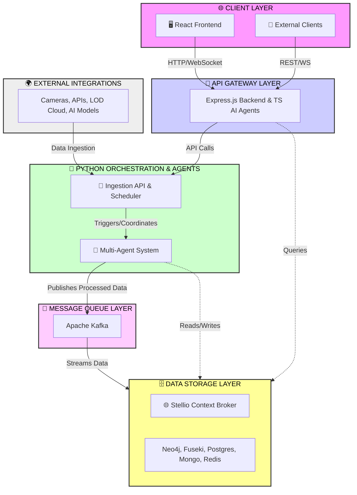
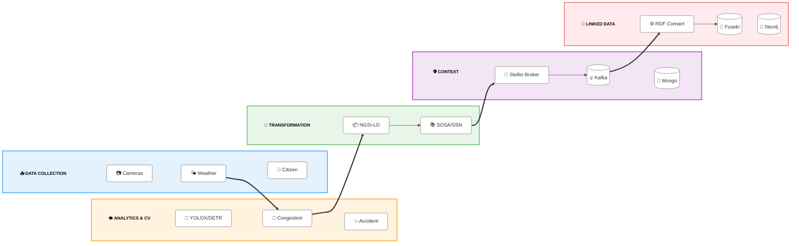

<!--
SPDX-License-Identifier: MIT
Copyright (c) 2025 UIP Team. All rights reserved.

UIP - Urban Intelligence Platform
https://github.com/NguyenNhatquang522004/UIP-Urban_Intelligence_Platform

Module: README.md
Author: UIP Team
Version: 2.0.0
-->

<p align="center">
  
</p>

<h1 align="center">UIP - Urban Intelligence Platform</h1>

<p align="center">
  <strong>Multi-Agent Linked Open Data Pipeline for Smart Traffic Management</strong>
</p>

<p align="center">
  <a href="https://github.com/NguyenNhatquang522004/UIP-Urban_Intelligence_Platform/actions/workflows/test.yml">
    
  </a>
  <a href="https://github.com/NguyenNhatquang522004/UIP-Urban_Intelligence_Platform/actions/workflows/lint.yml">
    
  </a>
  <a href="https://codecov.io/gh/NguyenNhatquang522004/UIP-Urban_Intelligence_Platform">
    
  </a>
  <a href="https://github.com/NguyenNhatquang522004/UIP-Urban_Intelligence_Platform/blob/main/LICENSE">
    
  </a>
</p>

<p align="center">
  <a href="https://www.python.org/downloads/">
    
  </a>
  <a href="https://nodejs.org/">
    
  </a>
  <a href="https://www.typescriptlang.org/">
    
  </a>
  <a href="https://github.com/psf/black">
    
  </a>
</p>

<p align="center">
  <a href="https://github.com/NguyenNhatquang522004/UIP-Urban_Intelligence_Platform/discussions">
    
  </a>
  <a href="https://groups.google.com/g/uip-platform">
    
  </a>
  <a href="https://github.com/NguyenNhatquang522004/UIP-Urban_Intelligence_Platform/wiki">
    
  </a>
</p>

<p align="center">
  <a href="#-features">Features</a> •
  <a href="#-one-command-run">One Command</a> •
  <a href="#-quick-start">Quick Start</a> •
  <a href="#-architecture">Architecture</a> •
  <a href="#-team">Team</a> •
  <a href="#-community">Community</a> •
  <a href="#-contributing">Contributing</a>
</p>

---

## 👥 Team

This project is developed and maintained by:

<table>
  <tr>
    <td align="center">
      <a href="https://github.com/NguyenNhatquang522004">
        <br />
        <sub><b>Nguyễn Nhật Quang</b></sub>
      </a><br />
      <sub>Lead Developer</sub><br />
      <sub>🏗️ Architecture | 🔧 Backend | ⚙️ DevOps</sub>
    </td>
    <td align="center">
      <a href="https://github.com/JamesNguyen106">
        <br />
        <sub><b>Nguyễn Việt Hoàng</b></sub>
      </a><br />
      <sub>Backend Developer</sub><br />
      <sub>🤖 Agents | 📊 Data | 🧪 Testing</sub>
    </td>
    <td align="center">
      <a href="https://github.com/NguyenDinhAnhTuan04">
        <br />
        <sub><b>Nguyễn Đình Anh Tuấn</b></sub>
      </a><br />
      <sub>Full Stack Developer</sub><br />
      <sub>🎨 Frontend | 🔌 API | 📚 Docs</sub>
    </td>
  </tr>
</table>

> 📄 See [AUTHORS.md](AUTHORS.md) for detailed information and [CONTRIBUTORS.md](CONTRIBUTORS.md) for all contributors.

---

## ⚡ One Command Run

```powershell
# Windows PowerShell - Just run everything with ONE command!
.\justrun.ps1 dev
```

```bash
# Linux/macOS
./justrun.sh dev
```

**That's it!** This single command will:
1. ✅ Auto-detect prerequisites (Python, Node.js, Docker)
2. ✅ Auto-install all dependencies if needed
3. ✅ Copy environment files (`.env.example` → `.env`)
4. ✅ Create required directories (`logs/`, `data/`, etc.)
5. ✅ Start Docker infrastructure (12 services)
6. ✅ Wait for databases to be healthy
7. ✅ Launch Python Orchestrator + Citizen API (port 8001)
8. ✅ Start TypeScript Backend API (port 5000)
9. ✅ Start React Frontend (port 5173)

**First time setup?** The script handles everything automatically!

| Command | Description |
|---------|-------------|
| `.\justrun.ps1 dev` | 🚀 Start everything (auto-setup if needed) |
| `.\justrun.ps1 setup` | 📦 Install all dependencies only |
| `.\justrun.ps1 prod` | 🐳 Start with Docker (production) |
| `.\justrun.ps1 stop` | ⏹️ Stop all services |
| `.\justrun.ps1 status` | 📊 Check status of all services |
| `.\justrun.ps1 test` | 🧪 Run all tests |
| `.\justrun.ps1 clean` | 🧹 Clean and reset |

### Access Points (after `.\justrun.ps1 dev`)

| Service | URL | Credentials |
|---------|-----|-------------|
| **Frontend** (React) | http://localhost:5173 | - |
| **Backend** (Express) | http://localhost:5000 | - |
| **Citizen API** (FastAPI) | http://localhost:8001/docs | - |
| Stellio Context Broker | http://localhost:8080 | - |
| Neo4j Browser | http://localhost:7474 | `neo4j` / `test12345` |
| Apache Jena Fuseki | http://localhost:3030 | `admin` / `test_admin` |

---

## 📖 Overview

**UIP - Urban Intelligence Platform** is a production-ready multi-agent system designed to process real-time traffic data in Ho Chi Minh City and publish it as **Linked Open Data (LOD)**. The system integrates computer vision (YOLOX + DETR), semantic web technologies (RDF, NGSI-LD, SOSA/SSN), and a modern microservices architecture.

### Why Choose UIP?

- 🚀 **Production-Ready**: Battle-tested with comprehensive error handling, retry logic, and graceful shutdown mechanisms.
- 🔧 **YAML-Configurable**: 100% configured via YAML — no code changes required for new domains.
- 🌐 **Standards-Compliant**: Full support for ETSI NGSI-LD, W3C SOSA/SSN, and Smart Data Models.
- 📊 **Full Stack Solution**: Python Backend + React/TypeScript Frontend + Docusaurus Documentation.
- 🐳 **Cloud-Native**: Docker Compose orchestration with 12 integrated services.


## ✨ Features

### 🤖 Multi-Agent System (38 Python Agents + 3 TypeScript Agents)

| Category | Count | Agents |
|----------|-------|--------|
| **Data Collection** | 2 | image_refresh, external_data_collector |
| **Ingestion** | 1 | citizen_ingestion |
| **Analytics** | 4 | cv_analysis, congestion_detection, accident_detection, pattern_recognition |
| **Transformation** | 2 | ngsi_ld_transformer, sosa_ssn_mapper |
| **Context Management** | 4 | entity_publisher, state_updater, temporal_data_manager, stellio_state_query |
| **RDF & Linked Data** | 5 | ngsi_ld_to_rdf, triplestore_loader, lod_linkset_enrichment, content_negotiation, smart_data_models_validation |
| **State Management** | 4 | state_manager, accident_state_manager, congestion_state_manager, temporal_state_tracker |
| **Monitoring** | 3 | health_check, data_quality_validator, performance_monitor |
| **Notification** | 5 | alert_dispatcher, incident_report_generator, subscription_manager, email_notification, webhook_notification |
| **Graph Database** | 2 | neo4j_query, neo4j_sync |
| **Cache** | 2 | cache_manager, cache_invalidator |
| **Integration** | 3 | api_gateway, cache_manager, neo4j_sync |
| **Kafka** | 1 | kafka_entity_publisher |
| **TypeScript AI** | 3 | TrafficMaestroAgent, GraphInvestigatorAgent, EcoTwinAgent |

### 🔬 Technology Stack

| Layer | Technologies |
|-------|--------------|
| **Backend** | Python 3.9+, FastAPI, AsyncIO, APScheduler, YOLOX, DETR |
| **Frontend** | React 18, TypeScript, Vite, TailwindCSS, Zustand |
| **Databases** | PostgreSQL/TimescaleDB, Neo4j 5.12, MongoDB 7.0, Redis 7 |
| **Semantic Web** | Apache Jena Fuseki, Stellio Context Broker, RDF/SPARQL |
| **Messaging** | Apache Kafka (KRaft), WebSocket, Socket.IO |
| **DevOps** | Docker Compose (12 services), GitHub Actions, Prometheus, Grafana |
| **Documentation** | Docusaurus 3.0, OpenAPI/Swagger |

### 🌍 Semantic Web Standards

- **NGSI-LD**: ETSI CIM standard for context information management
- **SOSA/SSN**: W3C ontologies for sensor observations
- **Smart Data Models**: TM Forum/FIWARE standardized data models
- **LOD Cloud**: Integration with GeoNames, DBpedia, Wikidata

---

## 🚀 Quick Start

### ⚙️ System Requirements

#### ⚠️ Minimum Requirements (Development Mode)
| Component | Requirement | Note |
|-----------|-------------|------|
| **RAM** | 16 GB | 12 Docker services + AI models require significant memory |
| **CPU** | 4 cores | Recommended: 6+ cores for better performance |
| **Storage** | 20 GB free space | Docker images, databases, and AI models |
| **OS** | Windows 10/11, Ubuntu 20.04+, macOS 11+ | Docker Desktop required for Windows/macOS |

#### 🚀 Recommended Configuration (Production Mode)
| Component | Requirement | Note |
|-----------|-------------|------|
| **RAM** | 32 GB | Optimal for concurrent AI processing |
| **CPU** | 8+ cores | Intel i7/Ryzen 7 or equivalent |
| **GPU** | NVIDIA GPU with 6GB+ VRAM | For YOLOX/DETR acceleration (optional but recommended) |
| **Storage** | 50 GB SSD | Fast I/O for databases (Neo4j, PostgreSQL, MongoDB) |
| **Network** | 100 Mbps+ | For camera feeds and external API calls |

#### 🐳 Docker Resource Allocation

**Windows/macOS Docker Desktop Settings:**
```
Resources → Advanced:
- CPUs: Minimum 4, Recommended 6-8
- Memory: Minimum 12 GB, Recommended 20-24 GB
- Swap: 2 GB
- Disk Image Size: 60 GB
```

**Linux Docker:**
- No memory limits by default, but monitor with `docker stats`
- Ensure sufficient swap space (8-16 GB recommended)

#### ⚠️ Important Notes

> **WARNING**: Running this system on machines with **< 16GB RAM** may cause:
> - System freezes or crashes
> - Out of Memory (OOM) errors
> - Docker container failures
> - Extremely slow performance

**For Low-Spec Machines (8-12 GB RAM):**
- Use `docker-compose` with selective services only
- Disable AI services (YOLOX/DETR) if not needed
- Run backend and frontend separately without full Docker stack
- Consider cloud deployment (AWS, GCP, Azure) instead

### Software Prerequisites

- **Python** 3.9 or higher
- **Node.js** 18 or higher
- **Docker** & Docker Compose (Docker Desktop 4.0+ for Windows/macOS)
- **Git**
- **NVIDIA Docker** (optional, for GPU support)

### Option 1: Docker Compose (Recommended)

```bash
# Clone repository
git clone https://github.com/NguyenNhatquang522004/UIP-Urban_Intelligence_Platform.git
cd UIP-Urban_Intelligence_Platform

# Copy environment configuration
cp .env.example .env

# Start all services
docker-compose up -d

# Check services status
docker-compose ps
```

**Access Points:**

| Service | URL | Credentials |
|---------|-----|-------------|
| Frontend (React) | http://localhost:5173 | - |
| Backend (Express) | http://localhost:5000 | - |
| Citizen API (FastAPI) | http://localhost:8001 | - |
| API Docs (Swagger) | http://localhost:8001/docs | - |
| Stellio Context Broker | http://localhost:8080 | - |
| Neo4j Browser | http://localhost:7474 | neo4j / test12345 |
| Fuseki SPARQL | http://localhost:3030 | admin / test_admin |

### Option 2: Local Development

```bash
# Clone repository
git clone https://github.com/NguyenNhatquang522004/UIP-Urban_Intelligence_Platform.git
cd UIP-Urban_Intelligence_Platform

# Create Python virtual environment
python -m venv .venv
source .venv/bin/activate  # Windows: .venv\Scripts\activate

# Install dependencies
pip install -r requirements/base.txt
pip install -r requirements/dev.txt

# Copy environment configuration
cp .env.example .env

# Run the unified system
python main.py
```

### Option 3: Building From Source (GNU Make)

This project supports standard GNU Make targets for building and installing:

```bash
# Clone repository
git clone https://github.com/NguyenNhatquang522004/UIP-Urban_Intelligence_Platform.git
cd UIP-Urban_Intelligence_Platform

# View all available targets
make help

# Build the Python package
make            # or: make all

# Build and install the package
make install

# Run tests
make check      # or: make test

# Clean build artifacts
make clean

# Clean everything (including venv, node_modules)
make distclean

# Uninstall the package
make uninstall
```

**GNU Make Standard Targets:**

| Target | Description |
|--------|-------------|
| `make` / `make all` | Build the Python package (creates dist/) |
| `make install` | Build and install the package |
| `make uninstall` | Uninstall the package |
| `make check` | Run all tests |
| `make clean` | Remove build artifacts |
| `make distclean` | Remove all generated files |

**Project-Specific Targets:**

| Target | Description |
|--------|-------------|
| `make setup` | Install all dependencies (Python + Node.js) |
| `make dev` | Run all services in development mode |
| `make prod` | Run all services with Docker Compose |
| `make stop` | Stop all running services |

### Running Options

```bash
# Full system (API + Orchestrator every 60 minutes)
python main.py

# Custom orchestrator interval (30 minutes)
python main.py --orchestrator-interval 30

# Run orchestrator immediately on startup
python main.py --run-orchestrator-now

# API only (no orchestrator)
python main.py --no-orchestrator

# Orchestrator only (no API)
python main.py --no-api

# Run specific workflow phase
python orchestrator.py --phase transformation

# Dry run (validate without execution)
python orchestrator.py --dry-run
```

---

## 📁 Project Structure

<details>
<summary><strong>📂 Click to expand full project structure</strong></summary>

```
UIP-Urban_Intelligence_Platform/
│
├── 📂 src/                              # Python source code
│   ├── agents/                          # Multi-agent system (38 agents in 12 categories)
│   │   ├── analytics/                   # CV analysis, congestion, accidents (4)
│   │   ├── cache/                       # Cache management (2)
│   │   ├── context_management/          # Entity publishing, state (4)
│   │   ├── data_collection/             # Image refresh, external data (2)
│   │   ├── graph_database/              # Neo4j query, sync (2)
│   │   ├── ingestion/                   # Citizen report ingestion (1)
│   │   ├── integration/                 # API gateway, Neo4j sync (3)
│   │   ├── monitoring/                  # Health checks, data quality (3)
│   │   ├── notification/                # Alerts, webhooks, email (5)
│   │   ├── rdf_linked_data/             # RDF conversion, triplestore (5)
│   │   ├── state_management/            # State tracking (4)
│   │   ├── transformation/              # NGSI-LD, SOSA/SSN mapping (2)
│   │   └── kafka_entity_publisher_agent.py  # Kafka streaming (1)
│   ├── core/                            # Core utilities
│   │   ├── config_loader.py             # Configuration management
│   │   ├── data_seeder.py               # Data seeding utilities
│   │   ├── logger.py                    # Logging configuration
│   │   └── utils.py                     # Common utilities
│   ├── cli/                             # Command-line interface tools
│   │   ├── cache/                       # Cache CLI commands
│   │   ├── graph/                       # Graph database CLI
│   │   ├── monitoring/                  # Monitoring CLI
│   │   ├── pipeline/                    # Pipeline management CLI
│   │   └── rdf/                         # RDF processing CLI
│   ├── utils/                           # Helper utilities
│   │   └── mongodb_helper.py            # MongoDB helper functions
│   └── orchestrator.py                  # Workflow orchestrator
│
├── 📂 apps/                             # Web applications
│   ├── shared/                          # Shared code between apps
│   │   ├── configs/                     # Shared configurations
│   │   └── types/                       # Shared TypeScript types
│   └── traffic-web-app/                 # Main traffic web application
│       ├── backend/                     # Express.js + TypeScript API
│       │                                # (3 AI agents, 12 routes, 7 services)
│       ├── frontend/                    # React + Vite + TailwindCSS
│       │                                # (2 pages, 30+ components)
│       └── docs/                        # Web app documentation
│
├── 📂 config/                           # YAML configuration files (31 files)
│   ├── workflow.yaml                    # Orchestrator workflow definition
│   ├── agents.yaml                      # Agent-specific configurations
│   ├── ngsi_ld_mappings.yaml            # NGSI-LD entity mappings
│   ├── sosa_mappings.yaml               # SOSA/SSN ontology mappings
│   ├── stellio.yaml                     # Stellio Context Broker config
│   ├── fuseki.yaml                      # Apache Jena Fuseki config
│   ├── neo4j_sync.yaml                  # Neo4j synchronization config
│   ├── mongodb_config.yaml              # MongoDB configuration
│   ├── kafka_config.yaml                # Apache Kafka config
│   └── ...                              # 22 more configuration files
│
├── 📂 tests/                            # Test suite
│   ├── unit/                            # Unit tests
│   ├── integration/                     # Integration tests
│   ├── ingestion/                       # Ingestion tests
│   └── conftest.py                      # Pytest fixtures & configuration
│
├── 📂 scripts/                          # Utility scripts
│   ├── database/                        # Database initialization scripts
│   ├── monitoring/                      # Monitoring setup scripts
│   ├── pipeline/                        # Pipeline utilities
│   ├── python/                          # Python utility scripts
│   ├── node/                            # Node.js utility scripts
│   ├── utilities/                       # General utilities
│   ├── deploy.sh                        # Deployment script
│   ├── rollback.sh                      # Rollback script
│   └── health_check.sh                  # Health check script
│
├── 📂 docs/                             # Documentation (Docusaurus 3.0)
│   ├── api/                             # API documentation
│   ├── architecture/                    # Architecture guides
│   ├── workflows/                       # Workflow documentation
│   ├── data-access/                     # Data access guides
│   ├── web-application/                 # Web app documentation
│   ├── python-orchestrator/             # Orchestrator documentation
│   ├── competition/                     # Competition materials
│   ├── src/                             # Docusaurus source
│   ├── docusaurus.config.ts             # Docusaurus configuration
│   ├── sidebars.ts                      # Documentation sidebar
│   └── package.json                     # Docs dependencies
│
├── 📂 .github/                          # GitHub configurations
│   ├── workflows/                       # CI/CD pipelines (9 workflows)
│   │   ├── test.yml                     # Unit & integration tests
│   │   ├── lint.yml                     # Code linting
│   │   ├── codeql.yml                   # Security analysis
│   │   ├── deploy.yml                   # Deployment pipeline
│   │   ├── release.yml                  # Release automation
│   │   ├── integration-tests.yml        # Integration testing
│   │   ├── dependency-review.yml        # Dependency review
│   │   ├── auto-label.yml               # Auto labeling
│   │   └── stale.yml                    # Stale issue management
│   ├── ISSUE_TEMPLATE/                  # Issue templates
│   ├── CODEOWNERS                       # Code ownership
│   ├── CONTRIBUTING.md                  # Contribution guidelines
│   ├── SECURITY.md                      # Security policy
│   ├── SUPPORT.md                       # Support information
│   ├── FUNDING.yml                      # Funding information
│   ├── dependabot.yml                   # Dependabot configuration
│   ├── labeler.yml                      # Label configuration
│   └── pull_request_template.md         # PR template
│
├── 📂 requirements/                     # Python dependencies
│   ├── base.txt                         # Base dependencies
│   ├── dev.txt                          # Development dependencies
│   ├── prod.txt                         # Production dependencies
│   ├── test.txt                         # Testing dependencies
│   └── citizen_science_deps.txt         # Citizen science features
│
├── 📂 docker/                           # Docker configurations
│   ├── docker-compose.dev.yml           # Development Docker Compose
│   ├── Dockerfile.test                  # Test container
│   ├── Dockerfile.test.optimized        # Optimized test container
│   └── reference/                       # Reference configurations
│
├── 📂 data/                             # Data files & cache
│   ├── cache/                           # Cached data
│   ├── rdf/                             # RDF exports
│   ├── rdf_accidents/                   # Accident RDF data
│   ├── rdf_observations/                # Observation RDF data
│   ├── rdf_patterns/                    # Pattern RDF data
│   ├── rdf_updates/                     # Update RDF data
│   ├── reports/                         # Generated reports
│   └── *.json                           # JSON data files
│
├── 📂 assets/                           # Static assets
│   ├── models/                          # AI/ML models (YOLOX, DETR)
│   └── images/                          # Image assets
│
├── 📂 examples/                         # Example files
│   └── NGSI_LD_STRUCTURE_EXAMPLES.py    # NGSI-LD structure examples
│
├── 📂 guides/                           # User guides
│   ├── QUICKSTART.md                    # Quick start guide
│   ├── DATA_ACCESS_GUIDE.md             # Data access guide
│   ├── SEED_DATA_GUIDE.md               # Seed data guide
│   ├── DOCKER_SCRIPTS_GUIDE.md          # Docker scripts guide
│   └── GUIDE_NEO4J_LOD_USAGE.md         # Neo4j LOD usage guide
│
├── 📂 templates/                        # HTML templates
│   ├── entity.html                      # Entity template
│   ├── incident_report.html             # Incident report template
│   └── incident_web.html                # Web incident template
│
├── 📂 logs/                             # Application logs
├── 📂 reports/                          # Generated reports
├── 📂 runs/                             # Execution runs data
├── 📂 test_data/                        # Test data files
├── 📂 test_output/                      # Test output files
│
├── 📄 main.py                           # Unified entry point
├── 📄 orchestrator.py                   # Orchestrator CLI
├── 📄 justrun.ps1                       # Windows one-command runner
├── 📄 docker-compose.yml                # Docker services (12 containers)
├── 📄 Dockerfile                        # Application container
├── 📄 pyproject.toml                    # Python project configuration (PEP 518)
├── 📄 setup.py                          # Python package setup
├── 📄 pytest.ini                        # Pytest configuration
├── 📄 MANIFEST.in                       # Package manifest
├── 📄 Makefile                          # Build automation
├── 📄 .env.example                      # Environment template
├── 📄 .gitignore                        # Git ignore rules
├── 📄 .gitattributes                    # Git attributes
├── 📄 .dockerignore                     # Docker ignore rules
├── 📄 .pre-commit-config.yaml           # Pre-commit hooks
├── 📄 LICENSE                           # MIT License
├── 📄 JUSTRUN.md                        # One-command documentation
├── 📄 EXECUTION_ORDER.md                # Execution order guide
└── 📄 README.md                         # Project documentation
```

</details>

---

## 🏗️ Architecture

### System Architecture Overview

> **38 Python Agents** | **3 TypeScript AI Agents** | **12 Docker Services** | **7 Backend Services** | **12 API Routes**



### Data Flow Pipeline



---

## ⚙️ Configuration

### Environment Variables

The application uses environment variables for configuration management. Follow these steps to set up:

#### 1. Initial Setup

```bash
# Copy the example environment file
cp .env.example .env

# Edit the file with your preferred editor
nano .env  # or vim, code, notepad++, etc.
```

#### 2. Required Variables

| Variable | Required | Default | Description |
|----------|----------|---------|-------------|
| `ENVIRONMENT` | ✅ | `development` | Application environment: `development`, `staging`, `production` |
| `LOG_LEVEL` | ✅ | `INFO` | Logging level: `DEBUG`, `INFO`, `WARNING`, `ERROR`, `CRITICAL` |

#### 3. Application Settings

<details>
<summary><strong>🔧 Core Application Configuration</strong></summary>

```bash
# ============================================================================
# APPLICATION SETTINGS
# ============================================================================

# Environment mode (affects logging, debugging, and performance optimizations)
ENVIRONMENT=development              # Options: development | staging | production

# Logging configuration
LOG_LEVEL=INFO                       # Options: DEBUG | INFO | WARNING | ERROR | CRITICAL
LOG_FORMAT=json                      # Options: json | text
LOG_FILE=logs/uip.log               # Path to log file (relative to project root)

# Application metadata
APP_NAME="UIP - Urban Intelligence Platform"
APP_VERSION=2.0.0
APP_HOST=0.0.0.0                    # Host to bind the application
APP_PORT=8000                        # Port for the main application

# Debug mode (disable in production)
DEBUG=false                          # Options: true | false
```

</details>

#### 4. Orchestrator Configuration

<details>
<summary><strong>⏱️ Workflow Orchestrator Settings</strong></summary>

```bash
# ============================================================================
# ORCHESTRATOR CONFIGURATION
# ============================================================================

# Orchestration scheduling
ORCHESTRATOR_INTERVAL=60             # Minutes between orchestration runs
ORCHESTRATOR_AUTO_START=true         # Auto-start orchestrator on application launch
ORCHESTRATOR_MAX_RETRIES=3           # Maximum retry attempts for failed agents

# Workflow configuration file
WORKFLOW_CONFIG=config/workflow.yaml # Path to workflow definition

# Execution settings
ORCHESTRATOR_PARALLEL_AGENTS=4       # Number of agents to run in parallel
ORCHESTRATOR_TIMEOUT=3600            # Maximum execution time per phase (seconds)

# Run immediately on startup
RUN_ORCHESTRATOR_NOW=false           # Options: true | false
```

</details>

#### 5. Database Connections

<details>
<summary><strong>🗄️ Data Storage & Databases</strong></summary>

```bash
# ============================================================================
# DATA STORES
# ============================================================================

# Stellio Context Broker (NGSI-LD)
STELLIO_URL=http://localhost:8080
STELLIO_TENANT=urn:ngsi-ld:tenant:default
STELLIO_CONTEXT=https://uri.etsi.org/ngsi-ld/v1/ngsi-ld-core-context.jsonld
STELLIO_TIMEOUT=30                   # Request timeout in seconds
STELLIO_MAX_RETRIES=3               # Maximum retry attempts

# Neo4j Graph Database
NEO4J_URL=bolt://localhost:7687
NEO4J_USER=neo4j
NEO4J_PASSWORD=test12345            # ⚠️ CHANGE IN PRODUCTION
NEO4J_DATABASE=neo4j                # Database name
NEO4J_MAX_CONNECTION_LIFETIME=3600  # Connection lifetime in seconds
NEO4J_MAX_CONNECTION_POOL_SIZE=50   # Maximum connection pool size
NEO4J_CONNECTION_TIMEOUT=30         # Connection timeout in seconds

# Apache Jena Fuseki (RDF Triplestore)
FUSEKI_URL=http://localhost:3030
FUSEKI_DATASET=traffic              # Primary dataset name
FUSEKI_USER=admin
FUSEKI_PASSWORD=test_admin          # ⚠️ CHANGE IN PRODUCTION
FUSEKI_TIMEOUT=60                   # Query timeout in seconds

# MongoDB (Document Store)
MONGODB_URI=mongodb://localhost:27017
MONGODB_DATABASE=uip_traffic        # Database name
MONGODB_USER=                       # Leave empty for no authentication
MONGODB_PASSWORD=                   # Leave empty for no authentication
MONGODB_AUTH_SOURCE=admin           # Authentication database
MONGODB_MAX_POOL_SIZE=10            # Maximum connection pool size
MONGODB_MIN_POOL_SIZE=1             # Minimum connection pool size
MONGODB_SERVER_SELECTION_TIMEOUT=5000  # Server selection timeout (ms)

# PostgreSQL + TimescaleDB (for Stellio backend)
POSTGRES_HOST=localhost
POSTGRES_PORT=5432
POSTGRES_DB=stellio
POSTGRES_USER=stellio
POSTGRES_PASSWORD=stellio_password  # ⚠️ CHANGE IN PRODUCTION
POSTGRES_SCHEMA=public
POSTGRES_MAX_CONNECTIONS=20

# Redis (Cache & Session Store)
REDIS_HOST=localhost
REDIS_PORT=6379
REDIS_PASSWORD=                     # Leave empty if no password
REDIS_DB=0                          # Redis database number
REDIS_MAX_CONNECTIONS=10
REDIS_SOCKET_TIMEOUT=5              # Socket timeout in seconds
REDIS_SOCKET_CONNECT_TIMEOUT=5      # Connection timeout in seconds
```

</details>

#### 6. Message Queue & Streaming

<details>
<summary><strong>📨 Apache Kafka Configuration</strong></summary>

```bash
# ============================================================================
# MESSAGE QUEUE (Apache Kafka)
# ============================================================================

# Kafka broker connection
KAFKA_BOOTSTRAP_SERVERS=localhost:9092
KAFKA_CLIENT_ID=uip-producer
KAFKA_GROUP_ID=uip-consumer-group

# Producer settings
KAFKA_PRODUCER_ACKS=all              # Options: 0 | 1 | all
KAFKA_PRODUCER_RETRIES=3
KAFKA_PRODUCER_MAX_IN_FLIGHT_REQUESTS=5
KAFKA_PRODUCER_COMPRESSION_TYPE=snappy  # Options: none | gzip | snappy | lz4 | zstd

# Consumer settings
KAFKA_CONSUMER_AUTO_OFFSET_RESET=earliest  # Options: earliest | latest
KAFKA_CONSUMER_ENABLE_AUTO_COMMIT=true
KAFKA_CONSUMER_AUTO_COMMIT_INTERVAL_MS=5000
KAFKA_CONSUMER_SESSION_TIMEOUT_MS=30000
KAFKA_CONSUMER_MAX_POLL_RECORDS=500

# Topic configuration
KAFKA_TOPIC_PREFIX=cim.entity        # Prefix for all Kafka topics
KAFKA_TOPIC_PARTITIONS=3             # Number of partitions per topic
KAFKA_TOPIC_REPLICATION_FACTOR=1     # Replication factor (set to 3 in production)

# Security (optional - for production)
KAFKA_SECURITY_PROTOCOL=PLAINTEXT    # Options: PLAINTEXT | SSL | SASL_PLAINTEXT | SASL_SSL
KAFKA_SASL_MECHANISM=                # Options: PLAIN | SCRAM-SHA-256 | SCRAM-SHA-512
KAFKA_SASL_USERNAME=
KAFKA_SASL_PASSWORD=
```

</details>

#### 7. Computer Vision & AI Models

<details>
<summary><strong>🤖 YOLOX & DETR Configuration</strong></summary>

```bash
# ============================================================================
# COMPUTER VISION (YOLOX + DETR)
# ============================================================================

# YOLOX Object Detection (Apache-2.0 License)
YOLOX_MODEL=assets/models/yolox_s.pth     # Model weights file
YOLOX_MODEL_TYPE=yolox-s                  # Options: yolox-nano | yolox-tiny | yolox-s | yolox-m | yolox-l | yolox-x
YOLOX_DEVICE=cpu                          # Options: cpu | cuda | cuda:0 | cuda:1 | mps
YOLOX_CONFIDENCE=0.25                     # Confidence threshold (0.0 - 1.0)
YOLOX_NMS_THRESHOLD=0.45                  # Non-Maximum Suppression threshold
YOLOX_INPUT_SIZE=640                      # Input image size (pixels)
YOLOX_FP16=false                          # Use FP16 half-precision (GPU only)
YOLOX_BATCH_SIZE=1                        # Batch size for inference

# DETR Accident Detection (via HuggingFace Transformers)
DETR_MODEL=hilmantm/detr-traffic-accident-detection  # HuggingFace model ID
DETR_DEVICE=cpu                           # Options: cpu | cuda
DETR_CONFIDENCE=0.7                       # Confidence threshold for accident detection
DETR_CACHE_DIR=assets/models/detr        # Model cache directory
DETR_MAX_SIZE=800                         # Maximum image dimension

# Model download settings
MODEL_DOWNLOAD_TIMEOUT=300                # Timeout for model downloads (seconds)
MODEL_CACHE_ENABLED=true                  # Cache downloaded models locally
HF_HOME=assets/models/huggingface        # HuggingFace cache directory

# GPU Memory Management (if using CUDA)
CUDA_VISIBLE_DEVICES=0                    # GPU device ID(s), comma-separated
CUDA_LAUNCH_BLOCKING=0                    # Set to 1 for debugging
```

</details>

#### 8. External API Integrations

<details>
<summary><strong>🌍 Third-Party API Keys</strong></summary>

```bash
# ============================================================================
# EXTERNAL APIs
# ============================================================================

# OpenWeatherMap API
OPENWEATHERMAP_API_KEY=your_api_key_here              # Get from: https://openweathermap.org/api
OPENWEATHERMAP_UNITS=metric                           # Options: metric | imperial | standard
OPENWEATHERMAP_LANG=en                                # Language code

# GeoNames API
GEONAMES_USERNAME=your_username_here                  # Register at: http://www.geonames.org/login
GEONAMES_MAX_ROWS=10                                  # Maximum results per query

# OpenAQ Air Quality API
OPENAQ_API_URL=https://api.openaq.org/v2
OPENAQ_LIMIT=100                                      # Results per page
OPENAQ_PAGE=1                                         # Page number

# Google Maps API (Optional - for geocoding/routing)
GOOGLE_MAPS_API_KEY=                                  # Optional: Enhanced geocoding
GOOGLE_MAPS_LANGUAGE=en

# GeoServer (Optional - for WMS/WFS services)
GEOSERVER_URL=http://localhost:8080/geoserver
GEOSERVER_WORKSPACE=traffic
GEOSERVER_USER=admin
GEOSERVER_PASSWORD=geoserver

# LOD Cloud Integration
DBPEDIA_SPARQL_ENDPOINT=https://dbpedia.org/sparql
WIKIDATA_SPARQL_ENDPOINT=https://query.wikidata.org/sparql
GEONAMES_RDF_ENDPOINT=http://sws.geonames.org
```

</details>

#### 9. Security & Authentication

<details>
<summary><strong>🔐 Security Configuration</strong></summary>

```bash
# ============================================================================
# SECURITY & AUTHENTICATION
# ============================================================================

# API Security
API_KEY_HEADER=X-API-Key
API_KEYS=key1,key2,key3                              # Comma-separated API keys
JWT_SECRET=your-super-secret-jwt-key-change-this     # ⚠️ CHANGE IN PRODUCTION
JWT_ALGORITHM=HS256
JWT_EXPIRATION=3600                                  # Token expiration (seconds)

# CORS Configuration
CORS_ORIGINS=http://localhost:3000,http://localhost:5173  # Allowed origins
CORS_ALLOW_CREDENTIALS=true
CORS_ALLOW_METHODS=GET,POST,PUT,DELETE,OPTIONS
CORS_ALLOW_HEADERS=*

# Rate Limiting
RATE_LIMIT_ENABLED=true
RATE_LIMIT_PER_MINUTE=60                             # Requests per minute per IP
RATE_LIMIT_STORAGE=redis                             # Options: memory | redis

# SSL/TLS (for production)
SSL_ENABLED=false
SSL_CERT_PATH=/path/to/cert.pem
SSL_KEY_PATH=/path/to/key.pem
```

</details>

#### 10. Monitoring & Observability

<details>
<summary><strong>📊 Monitoring Configuration</strong></summary>

```bash
# ============================================================================
# MONITORING & OBSERVABILITY
# ============================================================================

# Prometheus Metrics
PROMETHEUS_ENABLED=true
PROMETHEUS_PORT=9090
PROMETHEUS_PATH=/metrics

# Health Check
HEALTH_CHECK_ENABLED=true
HEALTH_CHECK_INTERVAL=30                             # Seconds between checks
HEALTH_CHECK_TIMEOUT=10                              # Timeout per check

# Performance Monitoring
PERFORMANCE_MONITORING=true
SLOW_QUERY_THRESHOLD=1000                            # Log queries slower than N milliseconds

# Sentry Error Tracking (Optional)
SENTRY_DSN=                                          # Sentry project DSN
SENTRY_ENVIRONMENT=development
SENTRY_TRACES_SAMPLE_RATE=0.1                       # Sample 10% of transactions

# Grafana Integration
GRAFANA_URL=http://localhost:3001
GRAFANA_API_KEY=
```

</details>

#### 11. Development & Testing

<details>
<summary><strong>🧪 Development Settings</strong></summary>

```bash
# ============================================================================
# DEVELOPMENT & TESTING
# ============================================================================

# Testing
TEST_DATABASE_URL=mongodb://localhost:27017/uip_test
TEST_NEO4J_URL=bolt://localhost:7687
TEST_REDIS_DB=15                                     # Separate Redis DB for testing

# Mock Services
MOCK_EXTERNAL_APIS=false                             # Use mock responses for external APIs
MOCK_CV_MODELS=false                                 # Use mock CV model responses

# Code Quality
ENABLE_PROFILING=false                               # Enable code profiling
PROFILE_OUTPUT_DIR=profiles/

# Hot Reload
AUTO_RELOAD=true                                     # Auto-reload on code changes (dev only)
RELOAD_DIRS=src,config                              # Directories to watch for changes
```

</details>

#### 12. Production Deployment

<details>
<summary><strong>🚀 Production-Specific Settings</strong></summary>

```bash
# ============================================================================
# PRODUCTION DEPLOYMENT
# ============================================================================

# High Availability
HA_ENABLED=false
HA_REDIS_SENTINEL=                                   # Redis Sentinel URLs
HA_KAFKA_BROKERS=kafka1:9092,kafka2:9092,kafka3:9092

# Resource Limits
MAX_WORKERS=4                                        # Number of worker processes
WORKER_CONNECTIONS=1000                              # Max connections per worker
WORKER_TIMEOUT=30                                    # Worker timeout (seconds)

# Database Connection Pooling
DB_POOL_SIZE=20                                      # Connection pool size
DB_MAX_OVERFLOW=10                                   # Maximum overflow connections

# Caching
CACHE_TTL=3600                                       # Cache TTL in seconds
CACHE_PREFIX=uip:                                    # Cache key prefix

# Backup & Recovery
BACKUP_ENABLED=false
BACKUP_SCHEDULE=0 2 * * *                           # Cron expression (2 AM daily)
BACKUP_RETENTION_DAYS=30
BACKUP_S3_BUCKET=                                    # S3 bucket for backups

# Feature Flags
FEATURE_CITIZEN_REPORTS=true
FEATURE_PATTERN_RECOGNITION=true
FEATURE_LOD_LINKSETS=true
```

</details>

---

### 🔍 Environment Variables Reference

#### Quick Reference Table

| Category | Variables | Documentation |
|----------|-----------|---------------|
| **Application** | `ENVIRONMENT`, `LOG_LEVEL`, `DEBUG` | [See Application Settings](#3-application-settings) |
| **Orchestrator** | `ORCHESTRATOR_INTERVAL`, `WORKFLOW_CONFIG` | [See Orchestrator Config](#4-orchestrator-configuration) |
| **Databases** | `STELLIO_URL`, `NEO4J_URL`, `FUSEKI_URL`, `MONGODB_URI` | [See Database Connections](#5-database-connections) |
| **Kafka** | `KAFKA_BOOTSTRAP_SERVERS`, `KAFKA_TOPIC_PREFIX` | [See Message Queue](#6-message-queue--streaming) |
| **AI Models** | `YOLOX_MODEL`, `DETR_MODEL`, `YOLOX_DEVICE` | [See CV Configuration](#7-computer-vision--ai-models) |
| **External APIs** | `OPENWEATHERMAP_API_KEY`, `GEONAMES_USERNAME` | [See External APIs](#8-external-api-integrations) |
| **Security** | `JWT_SECRET`, `API_KEYS`, `CORS_ORIGINS` | [See Security](#9-security--authentication) |

---

### ⚠️ Security Best Practices

> **IMPORTANT**: Never commit `.env` files to version control!

1. **Change Default Passwords**: All default passwords must be changed in production
2. **Use Strong Secrets**: Generate cryptographically secure random strings for `JWT_SECRET`
3. **Restrict CORS**: Only allow trusted origins in production
4. **Enable SSL/TLS**: Always use HTTPS in production environments
5. **Rotate Keys**: Regularly rotate API keys and credentials
6. **Use Environment-Specific Configs**: Separate `.env.development`, `.env.staging`, `.env.production`

#### Generate Secure Secrets

```bash
# Generate a secure JWT secret (Linux/macOS)
openssl rand -base64 32

# Generate a secure API key
openssl rand -hex 32

# Windows PowerShell
[Convert]::ToBase64String([System.Security.Cryptography.RandomNumberGenerator]::GetBytes(32))
```

---

### 📝 Environment File Template

Download the complete `.env.example` template:

```bash
# Download from repository
curl -O https://raw.githubusercontent.com/NguyenNhatquang522004/UIP-Urban_Intelligence_Platform/main/.env.example

# Or copy from the repository root
cp .env.example .env
```

---

### 🔗 Related Documentation

- **Configuration Guide**: [docs/data-access/](docs/data-access/)
- **Deployment Guide**: [docs/deployment/](docs/deployment/)
- **Security Policy**: [.github/SECURITY.md](.github/SECURITY.md)
- **Docker Configuration**: [docker-compose.yml](docker-compose.yml)

---

### Workflow Configuration

Define orchestration phases in `config/workflow.yaml`:

```yaml
workflow:
  name: "UIP - Urban Intelligence Platform"
  version: "2.0.0"

phases:
  - name: data_collection
    parallel: true
    agents:
      - module: src.agents.data_collection.image_refresh_agent
        enabled: true
      - module: src.agents.data_collection.external_data_collector_agent
        enabled: true

  - name: analytics
    parallel: false
    agents:
      - module: src.agents.analytics.cv_analysis_agent
        enabled: true
        config:
          model: yolox_s.pth         # YOLOX model
          confidence: 0.25
          accident_model: hilmantm/detr-traffic-accident-detection  # DETR from HuggingFace

  - name: transformation
    agents:
      - module: src.agents.transformation.ngsi_ld_transformer_agent
      - module: src.agents.transformation.sosa_ssn_mapper_agent
```

---

## 🧪 Testing

### Run Tests

```bash
# Run all tests
pytest

# Run with coverage
pytest --cov=src --cov-report=html --cov-report=term-missing

# Run specific test category
pytest tests/unit/ -v
pytest tests/integration/ -v

# Run tests in parallel
pytest -n auto

# Run with specific markers
pytest -m "not slow"
```

### Test Coverage Goals

| Component | Target | Current |
|-----------|--------|---------|
| Core modules | 90% | ✅ |
| Agents | 80% | ✅ |
| Integration | 70% | ✅ |

---

## 📚 Documentation

### Available Documentation

| Resource | Description | Link |
|----------|-------------|------|
| **API Reference** | OpenAPI/Swagger documentation | [docs/api/](docs/api/) |
| **Architecture Guide** | System design & data flow | [docs/architecture/](docs/architecture/) |
| **Configuration Guide** | YAML configuration reference | [docs/data-access/](docs/data-access/) |
| **Contributing Guide** | Development workflow | [CONTRIBUTING.md](.github/CONTRIBUTING.md) |
| **Security Policy** | Vulnerability reporting | [SECURITY.md](.github/SECURITY.md) |
| **Changelog** | Version history | [docs/CHANGELOG.md](docs/CHANGELOG.md) |

### Build Documentation Site

```bash
cd docs
npm install
npm run start    # Development server
npm run build    # Production build
```

---

## 💬 Community

Join our community to get help, share ideas, and connect with other users:

| Channel | Description | Link |
|---------|-------------|------|
| 💬 **GitHub Discussions** | Q&A, ideas, and general discussion | [Join Discussions](https://github.com/NguyenNhatquang522004/UIP-Urban_Intelligence_Platform/discussions) |
| 📧 **Mailing List** | Announcements & release notifications | [Google Groups](https://groups.google.com/g/uip-platform) |
| 📖 **Wiki** | Comprehensive documentation | [GitHub Wiki](https://github.com/NguyenNhatquang522004/UIP-Urban_Intelligence_Platform/wiki) |
| 🐛 **Issues** | Bug reports & feature requests | [GitHub Issues](https://github.com/NguyenNhatquang522004/UIP-Urban_Intelligence_Platform/issues) |

### Discussion Categories

- **📣 Announcements**: Official project announcements (maintainers only)
- **❓ Q&A**: Ask questions and get help from the community
- **💡 Ideas**: Share and discuss new feature ideas
- **🎉 Show and Tell**: Share your projects built with UIP
- **📋 RFCs**: Request for Comments on major changes

### Mailing List

Subscribe to receive:
- 📢 Release announcements
- 🔔 Important updates
- 📝 Monthly newsletters

**Subscribe**: Send email to [uip-platform+subscribe@googlegroups.com](mailto:uip-platform+subscribe@googlegroups.com)

---

## 🤝 Contributing

We welcome contributions! Please see our [Contributing Guide](.github/CONTRIBUTING.md) for details.

### Development Workflow

1. **Fork** the repository
2. **Create** a feature branch: `git checkout -b feature/amazing-feature`
3. **Install** dev dependencies: `pip install -r requirements/dev.txt`
4. **Install** pre-commit hooks: `pre-commit install`
5. **Make** your changes
6. **Test** your changes: `pytest --cov=src`
7. **Lint** your code: `pre-commit run --all-files`
8. **Commit** your changes: `git commit -m "feat: add amazing feature"`
9. **Push** to the branch: `git push origin feature/amazing-feature`
10. **Open** a Pull Request

### Commit Convention

We follow [Conventional Commits](https://www.conventionalcommits.org/):

```
feat: add new feature
fix: bug fix
docs: documentation changes
style: formatting changes
refactor: code refactoring
test: adding tests
chore: maintenance tasks
```

### Code Style

- **Python**: Black formatter, 100 character line length
- **TypeScript**: ESLint + Prettier
- **Commits**: Conventional Commits
- **Docs**: Google-style docstrings

---

## 🛡️ Security

Please see our [Security Policy](.github/SECURITY.md) for reporting vulnerabilities.

### Security Features

- 🔐 API key authentication
- 🔒 CORS configuration
- 🛡️ Input validation
- 📝 Audit logging
- 🔑 Secret management via environment variables

---

## 📜 License

This project is licensed under the **MIT License**.

### Why MIT License?

This project uses **MIT-compatible** computer vision libraries:
- **YOLOX** (Apache-2.0 by Megvii) — Object detection for vehicles and pedestrians
- **DETR** (Apache-2.0) — Accident detection via HuggingFace Transformers
- **PyTorch** (BSD-style) — Deep learning framework

All dependencies use permissive licenses (MIT, Apache-2.0, BSD) that are compatible with MIT licensing.

| License | File | Description |
|---------|------|-------------|
| **MIT** | [LICENSE](LICENSE) | Main project license with third-party attribution |
| **N/A** | [COPYING](COPYING) | Licensing information and third-party notices |

### License Documentation

| Document | Description |
|----------|-------------|
| [LICENSE](LICENSE) | MIT license with third-party attribution |
| [COPYING](COPYING) | Detailed licensing information |
| [THIRD_PARTY_LICENSES.md](THIRD_PARTY_LICENSES.md) | Complete list of 120+ third-party dependencies and their licenses |

### License Summary

The **MIT License** covers all code in this project. You are free to:
- ✅ Use commercially
- ✅ Modify and distribute
- ✅ Sublicense
- ✅ Use in proprietary software

### Third-Party Licenses

| Component | License | Use Case |
|-----------|---------|----------|
| YOLOX | Apache-2.0 | Vehicle/pedestrian detection |
| DETR (HuggingFace) | Apache-2.0 | Accident detection |
| PyTorch | BSD-style | Deep learning framework |
| FastAPI | MIT | Web framework |
| RDFLib | BSD-3-Clause | RDF/Linked Data processing |

```
MIT License

Copyright (c) 2025 UIP - Urban Intelligence Platform Contributors

Permission is hereby granted, free of charge, to any person obtaining a copy
of this software and associated documentation files (the "Software"), to deal
in the Software without restriction, including without limitation the rights
to use, copy, modify, merge, publish, distribute, sublicense, and/or sell
copies of the Software, and to permit persons to whom the Software is
furnished to do so, subject to the following conditions:

The above copyright notice and this permission notice shall be included in all
copies or substantial portions of the Software.

THE SOFTWARE IS PROVIDED "AS IS", WITHOUT WARRANTY OF ANY KIND, EXPRESS OR
IMPLIED, INCLUDING BUT NOT LIMITED TO THE WARRANTIES OF MERCHANTABILITY,
FITNESS FOR A PARTICULAR PURPOSE AND NONINFRINGEMENT.
```

---

## 🙏 Acknowledgments

### Standards & Specifications

- [ETSI NGSI-LD](https://www.etsi.org/deliver/etsi_gs/CIM/001_099/009/01.04.01_60/gs_cim009v010401p.pdf) — Context Information Management
- [W3C SOSA/SSN](https://www.w3.org/TR/vocab-ssn/) — Sensor Observation Ontologies
- [Smart Data Models](https://smartdatamodels.org/) — TM Forum & FIWARE

### Open Source Projects

- [Stellio Context Broker](https://github.com/stellio-hub/stellio-context-broker) — NGSI-LD implementation
- [Apache Jena](https://jena.apache.org/) — Semantic Web framework
- [YOLOX](https://github.com/Megvii-BaseDetection/YOLOX) — Object Detection (Apache-2.0)
- [HuggingFace Transformers](https://github.com/huggingface/transformers) — DETR Accident Detection
- [FastAPI](https://fastapi.tiangolo.com/) — Modern Python web framework

---

## 📞 Support

### Community Channels

| Channel | Description | Link |
|---------|-------------|------|
| 📧 **Mailing List** | Announcements & discussions | [uip-platform@googlegroups.com](https://groups.google.com/g/uip-platform) |
| 💬 **Discord** | Real-time chat & support | [Join Discord](https://discord.gg/uip-platform) |
| 💬 **Discussions** | Q&A & community | [GitHub Discussions](https://github.com/NguyenNhatquang522004/UIP-Urban_Intelligence_Platform/discussions) |

### Other Resources

- 📖 **Documentation**: [docs/](docs/)
- 🐛 **Bug Reports**: [GitHub Issues](https://github.com/NguyenNhatquang522004/UIP-Urban_Intelligence_Platform/issues)
- 📧 **Email**: nguyennhatquang522004@gmail.com

---

## 🗺️ Roadmap

<details>
<summary><strong>📦 Legacy Roadmap</strong></summary>

### v1.0.0 (Legacy) ✅

- [x] Multi-agent system architecture (37 agents)
- [x] NGSI-LD entity management
- [x] YOLOX computer vision integration (Apache-2.0)
- [x] RDF triple store publishing
- [x] Docker Compose deployment
- [x] CI/CD pipelines (9 workflows)
- [x] Docusaurus documentation site

### v2.0.0 (Current - MIT License) ✅

- [x] Multi-agent system architecture (38 agents)
- [x] **YOLOX** object detection (Apache-2.0 by Megvii)
- [x] **DETR** accident detection via HuggingFace (Apache-2.0)
- [x] Full MIT license compatibility
- [x] All dependencies use permissive licenses
- [x] NGSI-LD entity management
- [x] RDF triple store publishing
- [x] Docker Compose deployment

</details>

### v2.1.0 (Q1 2026)

- [ ] Real-time streaming analytics
- [ ] Advanced traffic prediction (ML)
- [ ] Mobile application
- [ ] Public API with rate limiting

### v2.2.0 (Q2 2026)

- [ ] Federated learning
- [ ] Edge computing support
- [ ] Knowledge graph reasoning
- [ ] Multi-city deployment

---

<p align="center">
  <strong>Built with ❤️ for the Semantic Web and Linked Open Data community</strong>
</p>

<p align="center">
  <a href="#-overview">Back to top</a>
</p>
