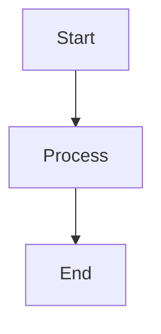

# HCMC Traffic Monitoring System - Documentation

This directory contains the complete Docusaurus documentation for the project.

## 📚 Documentation Structure

```
docs/
├── docs/                 # Main documentation
│   ├── intro.md         # Getting started
│   ├── quick-start.md   # 5-minute quick start
│   ├── installation/    # Installation guides
│   ├── architecture/    # System architecture
│   ├── backend/         # Python backend docs
│   ├── agents/          # 30+ agent documentation
│   ├── frontend/        # React frontend docs
│   ├── data-models/     # NGSI-LD, SOSA/SSN
│   ├── devops/          # Docker, CI/CD
│   ├── testing/         # Test documentation
│   └── guides/          # How-to guides
├── api/                 # API reference
│   ├── overview.md      # REST API docs
│   ├── websocket/       # WebSocket API
│   └── sparql/          # SPARQL queries
├── blog/                # Blog posts
├── src/                 # Custom React components
├── static/              # Static assets
├── docusaurus.config.ts # Docusaurus configuration
├── sidebars.ts          # Sidebar navigation
└── package.json
```

## 🚀 Quick Start

### Install Dependencies

```bash
cd docs
npm install
```

### Development Server

```bash
npm start
```

Opens browser at http://localhost:3000 with hot reload.

### Build for Production

```bash
npm run build
```

Generates static files in `build/` directory.

### Serve Production Build

```bash
npm run serve
```

Test production build locally.

## 📖 Writing Documentation

### Create New Page

```bash
# Create markdown file
touch docs/new-section/new-page.md
```

```markdown
---
sidebar_position: 1
---

# Page Title

Your content here...
```

### Add to Sidebar

Edit `sidebars.ts`:

```typescript
{
  type: 'category',
  label: 'New Section',
  items: ['new-section/new-page'],
}
```

### Markdown Features

#### Code Blocks

```python
# Python example
def hello_world():
    print("Hello, World!")
```

#### Admonitions

:::note
This is a note
:::

:::tip
This is a tip
:::

:::warning
This is a warning
:::

:::danger
This is danger
:::

#### Tabs

import Tabs from '@theme/Tabs';
import TabItem from '@theme/TabItem';

<Tabs>
  <TabItem value="python" label="Python">
    ```python
    print("Hello")
    ```
  </TabItem>
  <TabItem value="typescript" label="TypeScript">
    ```typescript
    console.log("Hello");
    ```
  </TabItem>
</Tabs>

#### Diagrams (Mermaid)



## 🎨 Customization

### Edit Theme

Edit `src/css/custom.css` for custom styling.

### Add Logo

Place logo in `static/img/logo.svg`

Update `docusaurus.config.ts`:

```typescript
navbar: {
  logo: {
    alt: 'Project Logo',
    src: 'img/logo.svg',
  },
}
```

## 🌍 Internationalization (i18n)

### Add Vietnamese Translation

```bash
npm run write-translations -- --locale vi
```

### Translate Docs

```bash
mkdir -p i18n/vi/docusaurus-plugin-content-docs/current
cp -r docs/** i18n/vi/docusaurus-plugin-content-docs/current/
```

### Build with Locale

```bash
npm run build -- --locale vi
```

## 🔍 Search

Algolia DocSearch is configured. Update credentials in `docusaurus.config.ts`:

```typescript
algolia: {
  appId: 'YOUR_APP_ID',
  apiKey: 'YOUR_SEARCH_API_KEY',
  indexName: 'your_index_name',
}
```

## 📊 Analytics

Add Google Analytics:

```typescript
gtag: {
  trackingID: 'G-XXXXXXXXXX',
}
```

## 🚀 Deployment

### GitHub Pages

```bash
npm run deploy
```

### Netlify

1. Connect GitHub repository
2. Build command: `npm run build`
3. Publish directory: `build`

### Vercel

```bash
vercel --prod
```

## 📝 Documentation Guidelines

1. **Clear Titles**: Use descriptive titles
2. **Code Examples**: Provide working examples
3. **Images**: Add screenshots for UI features
4. **Links**: Link to related documentation
5. **Update Regularly**: Keep docs in sync with code

## 🛠️ Scripts

```json
{
  "start": "docusaurus start",
  "build": "docusaurus build",
  "serve": "docusaurus serve",
  "deploy": "docusaurus deploy",
  "clear": "docusaurus clear",
  "write-translations": "docusaurus write-translations"
}
```

## 📖 Learn More

- [Docusaurus Documentation](https://docusaurus.io/)
- [Markdown Guide](https://www.markdownguide.org/)
- [Mermaid Diagrams](https://mermaid-js.github.io/)

---

Built with ❤️ using [Docusaurus](https://docusaurus.io/)
