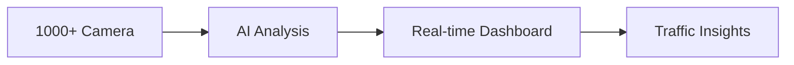

<!--
SPDX-License-Identifier: MIT
Copyright (c) 2025 UIP Team. All rights reserved.

UIP - Urban Intelligence Platform
Blog post: Introducing UIP.

Module: apps/traffic-web-app/frontend/docs/blog/2024-01-15-introducing-uip.md
Author: UIP Team
Version: 1.0.0
-->

# Chào mừng đến với UIP - Urban Intelligence Platform! 🎉

Chúng tôi vô cùng hào hứng giới thiệu **UIP (Urban Intelligence Platform)** - một nền tảng thông minh toàn diện cho việc giám sát và phân tích giao thông đô thị tại TP. Hồ Chí Minh.

<!-- truncate -->

## 🎯 Tại sao chúng tôi xây dựng UIP?

TP. Hồ Chí Minh với hơn **10 triệu dân** đang phải đối mặt với những thách thức lớn về giao thông:

- 🚗 **Ùn tắc giao thông** kéo dài vào giờ cao điểm
- 🚧 **Tai nạn giao thông** xảy ra thường xuyên
- 🌫️ **Ô nhiễm không khí** từ phương tiện giao thông
- 📊 **Thiếu dữ liệu real-time** để ra quyết định

UIP ra đời để giải quyết những vấn đề này bằng công nghệ tiên tiến!

## ✨ Tính năng nổi bật

### 1. Giám sát Real-time 📡



- Tích hợp **1000+ camera giao thông** trên toàn thành phố
- Cập nhật dữ liệu mỗi **5 giây**
- Phát hiện ùn tắc tự động

### 2. Phát hiện Tai nạn thông minh 🚨

Sử dụng **YOLOX AI Model** để:
- Phát hiện tai nạn trong **< 3 giây**
- Độ chính xác lên đến **95%**
- Tự động gửi cảnh báo

### 3. Dữ liệu Linked Open Data 🔗

Tuân thủ các tiêu chuẩn quốc tế:
- **NGSI-LD** - FIWARE Smart Data Models
- **SOSA/SSN** - Sensor Ontology
- **RDF/SPARQL** - Semantic Web

## 🏗️ Kiến trúc hệ thống

```
┌─────────────────────────────────────────────────────────────┐
│                    Frontend Layer                            │
│  React 18 + TypeScript + Leaflet + Recharts                 │
├─────────────────────────────────────────────────────────────┤
│                    API Gateway                               │
│  Node.js Express + Python FastAPI                           │
├─────────────────────────────────────────────────────────────┤
│                    Agent System                              │
│  30+ Specialized Agents (Analytics, RDF, Monitoring...)     │
├─────────────────────────────────────────────────────────────┤
│                    Data Layer                                │
│  MongoDB + Neo4j + Fuseki + Redis + Kafka                   │
└─────────────────────────────────────────────────────────────┘
```

## 👥 Đội ngũ phát triển

UIP được phát triển bởi 3 thành viên:

| Thành viên | Vai trò | Đóng góp chính |
|------------|---------|----------------|
| **Nguyễn Nhật Quang** | Lead Developer | Architecture, Analytics, DevOps |
| **Nguyễn Việt Hoàng** | Full-Stack Developer | RDF/LOD, Data Integration |
| **Nguyễn Đình Anh Tuấn** | Backend Developer | Core System, API, Frontend |

## 🚀 Bắt đầu ngay!

```bash
# Clone repository
git clone https://github.com/NguyenNhatquang522004/UIP-Urban_Intelligence_Platform.git

# Chạy với Docker
docker-compose up -d

# Truy cập dashboard
open http://localhost:5173
```

## 📈 Roadmap

- [x] ~~Phase 1: Core System & Camera Integration~~
- [x] ~~Phase 2: AI Analytics & Accident Detection~~
- [x] ~~Phase 3: LOD/RDF Integration~~
- [ ] Phase 4: Mobile App
- [ ] Phase 5: Predictive Analytics

---

Cảm ơn bạn đã quan tâm đến UIP! 🙏

**Theo dõi chúng tôi trên GitHub:** [@NguyenNhatquang522004](https://github.com/NguyenNhatquang522004)

---

*UIP - Making HCMC Traffic Smarter, One Camera at a Time* 🚦
