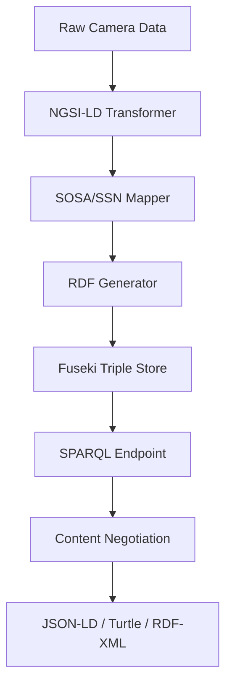

<!--
SPDX-License-Identifier: MIT
Copyright (c) 2025 UIP Team. All rights reserved.

UIP - Urban Intelligence Platform
Blog post: Linked Open Data Integration.

Module: apps/traffic-web-app/frontend/docs/blog/2024-03-10-linked-open-data.md
Author: UIP Team
Version: 1.0.0
-->

# Linked Open Data - Kết nối dữ liệu thông minh 🌐

Một trong những điểm đặc biệt của UIP là việc tích hợp **Linked Open Data (LOD)** - công nghệ cho phép dữ liệu giao thông được liên kết và chia sẻ theo chuẩn quốc tế.

<!-- truncate -->

## 🎯 Tại sao Linked Open Data?

### Vấn đề với dữ liệu truyền thống

```
┌─────────────┐    ┌─────────────┐    ┌─────────────┐
│  Camera DB  │    │ Weather DB  │    │  AQI DB     │
│  (MongoDB)  │    │   (API)     │    │  (External) │
└──────┬──────┘    └──────┬──────┘    └──────┬──────┘
       │                  │                  │
       ▼                  ▼                  ▼
   Isolated          Isolated           Isolated
    Data              Data               Data
```

**Vấn đề:**
- ❌ Dữ liệu phân tán, không liên kết
- ❌ Khó truy vấn cross-domain
- ❌ Không có ngữ nghĩa (semantic)
- ❌ Khó tích hợp với hệ thống khác

### Giải pháp LOD

```
┌─────────────────────────────────────────────────────┐
│                  Linked Data Cloud                   │
│                                                      │
│   TrafficCamera ──→ observes ──→ TrafficFlow        │
│        │                             │               │
│        ▼                             ▼               │
│   locatedIn ──→ District ←── hasWeather ←── Weather │
│        │                                             │
│        ▼                                             │
│   near ──→ AirQualityStation                        │
└─────────────────────────────────────────────────────┘
```

**Lợi ích:**
- ✅ Dữ liệu liên kết semantic
- ✅ Truy vấn SPARQL mạnh mẽ
- ✅ Interoperable với global datasets
- ✅ Machine-readable & discoverable

## 🏗️ Kiến trúc LOD trong UIP

### Technology Stack

| Component | Technology | Purpose |
|-----------|------------|---------|
| Data Model | NGSI-LD | Context Information |
| Ontology | SOSA/SSN | Sensor Semantics |
| Triple Store | Apache Jena Fuseki | RDF Storage |
| Query | SPARQL 1.1 | Data Retrieval |
| Serialization | JSON-LD, Turtle, RDF/XML | Data Exchange |

### Data Flow



## 📊 NGSI-LD Implementation

### Traffic Camera Entity

```json
{
  "@context": [
    "https://uri.etsi.org/ngsi-ld/v1/ngsi-ld-core-context.jsonld",
    {
      "TrafficCamera": "https://uip.hcm.gov.vn/ontology#TrafficCamera",
      "vehicleCount": "https://uip.hcm.gov.vn/ontology#vehicleCount",
      "congestionLevel": "https://uip.hcm.gov.vn/ontology#congestionLevel"
    }
  ],
  "id": "urn:ngsi-ld:TrafficCamera:CAM001",
  "type": "TrafficCamera",
  "name": {
    "type": "Property",
    "value": "Camera Nguyễn Huệ - Lê Lợi"
  },
  "location": {
    "type": "GeoProperty",
    "value": {
      "type": "Point",
      "coordinates": [106.7004, 10.7731]
    }
  },
  "vehicleCount": {
    "type": "Property",
    "value": 156,
    "observedAt": "2024-03-10T08:30:00Z",
    "unitCode": "vehicles"
  },
  "congestionLevel": {
    "type": "Property",
    "value": "high",
    "observedAt": "2024-03-10T08:30:00Z"
  },
  "refDistrict": {
    "type": "Relationship",
    "object": "urn:ngsi-ld:District:D1"
  }
}
```

## 🔬 SOSA/SSN Ontology Mapping

### Sensor Observation Pattern

```turtle
@prefix sosa: <http://www.w3.org/ns/sosa/> .
@prefix ssn: <http://www.w3.org/ns/ssn/> .
@prefix uip: <https://uip.hcm.gov.vn/ontology#> .
@prefix geo: <http://www.w3.org/2003/01/geo/wgs84_pos#> .

# Camera as Sensor
uip:CAM001 a sosa:Sensor ;
    rdfs:label "Camera Nguyễn Huệ - Lê Lợi"@vi ;
    sosa:observes uip:VehicleCountProperty ;
    sosa:isHostedBy uip:TrafficPole001 ;
    geo:lat 10.7731 ;
    geo:long 106.7004 .

# Observation
uip:OBS001 a sosa:Observation ;
    sosa:madeBySensor uip:CAM001 ;
    sosa:observedProperty uip:VehicleCountProperty ;
    sosa:hasSimpleResult 156 ;
    sosa:resultTime "2024-03-10T08:30:00Z"^^xsd:dateTime ;
    sosa:hasFeatureOfInterest uip:RoadSegment001 .

# Observable Property
uip:VehicleCountProperty a sosa:ObservableProperty ;
    rdfs:label "Vehicle Count"@en ;
    rdfs:label "Số lượng phương tiện"@vi .
```

## 🔍 SPARQL Queries

### Query 1: Tìm cameras có ùn tắc cao

```sparql
PREFIX uip: <https://uip.hcm.gov.vn/ontology#>
PREFIX ngsi-ld: <https://uri.etsi.org/ngsi-ld/>

SELECT ?camera ?name ?vehicleCount ?location
WHERE {
  ?camera a uip:TrafficCamera ;
          uip:name ?name ;
          uip:vehicleCount ?vehicleCount ;
          uip:congestionLevel "high" ;
          geo:location ?location .
  
  FILTER (?vehicleCount > 100)
}
ORDER BY DESC(?vehicleCount)
LIMIT 10
```

### Query 2: Correlation thời tiết - giao thông

```sparql
PREFIX uip: <https://uip.hcm.gov.vn/ontology#>
PREFIX sosa: <http://www.w3.org/ns/sosa/>

SELECT ?district ?avgVehicles ?weather ?aqi
WHERE {
  ?camera a uip:TrafficCamera ;
          uip:refDistrict ?district .
  
  ?obs sosa:madeBySensor ?camera ;
       sosa:hasSimpleResult ?vehicles ;
       sosa:resultTime ?time .
  
  ?weather uip:affectsDistrict ?district ;
           uip:condition ?weatherCondition .
  
  ?aqiStation uip:inDistrict ?district ;
              uip:aqiValue ?aqi .
}
GROUP BY ?district
HAVING (AVG(?vehicles) AS ?avgVehicles)
```

## 🔗 External Dataset Linkage

UIP liên kết với các datasets bên ngoài:

```turtle
# Linking to DBpedia
uip:District1 owl:sameAs dbpedia:District_1,_Ho_Chi_Minh_City .

# Linking to GeoNames
uip:HCMC owl:sameAs geonames:1566083 .

# Linking to Wikidata
uip:District1 owl:sameAs wd:Q2477810 .
```

## 📈 Performance Optimization

### Indexing Strategy

```python
# Fuseki configuration
fuseki_config = {
    "tdb2": {
        "location": "/data/fuseki/uip-dataset",
        "unionDefaultGraph": True
    },
    "inference": {
        "reasoner": "OWL_MEM_MICRO_RULE_INF"
    },
    "text_index": {
        "analyzer": "standard",
        "fields": ["rdfs:label", "uip:name"]
    }
}
```

### Query Caching

```python
from functools import lru_cache

@lru_cache(maxsize=1000)
def cached_sparql_query(query_hash: str) -> dict:
    """Cache SPARQL query results"""
    return execute_sparql(query)
```

## 📊 Statistics

| Metric | Value |
|--------|-------|
| Total Triples | 5M+ |
| Named Graphs | 12 |
| SPARQL queries/day | 10K+ |
| Avg query time | 45ms |
| External links | 3 datasets |

## 🎓 Key Takeaways

1. **LOD không khó** - Với NGSI-LD, bạn có thể bắt đầu với JSON
2. **Ontology matters** - SOSA/SSN cung cấp semantics rõ ràng
3. **SPARQL is powerful** - Truy vấn phức tạp dễ dàng
4. **Interoperability** - Liên kết với global knowledge graphs

## 🔜 Next Steps

- [ ] Integrate với DBpedia endpoints
- [ ] Add OWL reasoning
- [ ] GraphQL wrapper cho SPARQL
- [ ] Federated queries

---

**Bạn muốn tìm hiểu thêm về LOD?** Xem [documentation](/docs/data-models/complete-standards) của chúng tôi!

*Nguyễn Việt Hoàng - Full-Stack Developer @ UIP Team*
