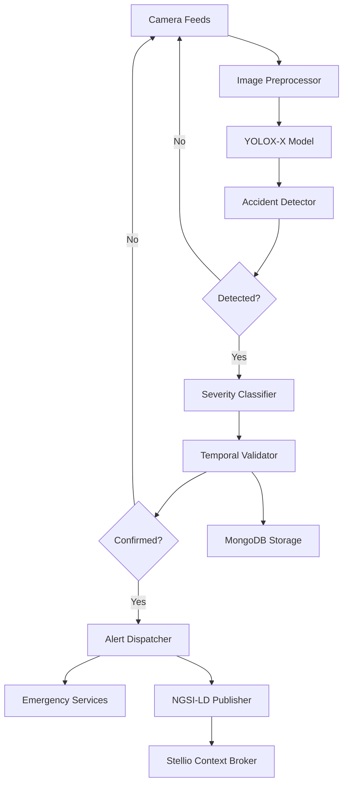

<!--
SPDX-License-Identifier: MIT
Copyright (c) 2025 UIP Team. All rights reserved.

UIP - Urban Intelligence Platform
Accident detection agent documentation.

Module: apps/traffic-web-app/frontend/docs/docs/agents/analytics/accident-detection.md
Author: UIP Team
Version: 1.0.0
-->

# Accident Detection Agent

## Overview

The Accident Detection Agent uses YOLOX-X computer vision model to analyze camera feeds in real-time, detecting traffic accidents, classifying severity levels, and triggering immediate response workflows.

## Features

- **Real-time Detection**: YOLOX-X-based accident detection from camera streams
- **Severity Classification**: 4-level severity system (minor, moderate, severe, critical)
- **Multi-Camera Processing**: Parallel processing of 50+ camera feeds
- **Incident Verification**: False positive reduction through temporal analysis
- **Automated Response**: Immediate alert dispatch and emergency services notification
- **Historical Analysis**: Accident pattern identification and hotspot mapping

## Architecture



## Configuration

**File**: `config/accident_config.yaml`

```yaml
accident_detection:
  model:
    type: "yolox_x"
    weights: "yolox_x.pt"
    confidence_threshold: 0.65
    device: "cuda"  # cuda, mps, cpu
    
  detection_classes:
    - "accident"
    - "collision"
    - "overturned_vehicle"
    - "fire"
    - "debris"
    
  severity_rules:
    minor:
      conditions:
        - vehicle_count: 1-2
        - lane_blockage: "partial"
        - smoke_detected: false
        - fire_detected: false
      response_time: 15  # minutes
      
    moderate:
      conditions:
        - vehicle_count: 2-3
        - lane_blockage: "full"
        - injuries_possible: true
      response_time: 10
      
    severe:
      conditions:
        - vehicle_count: ">3"
        - multiple_lanes: true
        - fire_detected: true
        - heavy_smoke: true
      response_time: 5
      
    critical:
      conditions:
        - fire_detected: true
        - explosion_detected: true
        - highway_closure: true
        - mass_casualty: true
      response_time: 2
      
  temporal_validation:
    enabled: true
    min_consecutive_frames: 3
    time_window: 5  # seconds
    
  alert_dispatch:
    immediate_severity: ["severe", "critical"]
    notification_channels: ["email", "sms", "webhook"]
    emergency_services_api: "https://emergency.hcmc.gov.vn/api"
```

## Usage

### Basic Usage

```python
from src.agents.analytics.accident_detection_agent import AccidentDetectionAgent

# Initialize agent
agent = AccidentDetectionAgent()

# Process camera image
result = agent.detect_accident(
    camera_id="CAM_001",
    image_path="traffic_cam_001.jpg"
)

if result.accident_detected:
    print(f"Accident detected!")
    print(f"Severity: {result.severity}")
    print(f"Confidence: {result.confidence}")
    print(f"Location: {result.location}")
    print(f"Vehicles Involved: {result.vehicle_count}")
```

### Real-time Stream Processing

```python
# Process real-time camera streams
def process_camera_stream(camera_id):
    agent = AccidentDetectionAgent()
    
    for frame in camera_stream(camera_id):
        result = agent.detect_accident(
            camera_id=camera_id,
            image=frame
        )
        
        if result.accident_detected:
            # Trigger immediate response
            agent.trigger_emergency_response(result)
            break
```

### Severity Assessment

```python
# Detailed severity analysis
severity_analysis = agent.assess_severity(
    detection_result=result,
    factors={
        "vehicle_count": 3,
        "lane_blockage": "full",
        "fire_detected": True,
        "time_of_day": "rush_hour",
        "weather_conditions": "heavy_rain"
    }
)

print(f"Severity Score: {severity_analysis.score}/100")
print(f"Classification: {severity_analysis.level}")
print(f"Response Priority: {severity_analysis.priority}")
print(f"Estimated Response Time: {severity_analysis.est_response_time}min")
```

### Multi-Camera Monitoring

```python
# Monitor multiple cameras concurrently
cameras = ["CAM_001", "CAM_002", "CAM_003", "CAM_004"]

agent.monitor_cameras(
    camera_ids=cameras,
    callback=handle_accident_detection,
    parallel=True
)

def handle_accident_detection(result):
    print(f"Accident at {result.camera_id}: {result.severity}")
    # Dispatch emergency services
    dispatch_response(result)
```

## API Reference

### Class: `AccidentDetectionAgent`

#### Methods

##### `detect_accident(camera_id: str, image: np.ndarray) -> DetectionResult`

Detect accident in camera image.

**Parameters:**
- `camera_id` (str): Camera identifier
- `image` (np.ndarray): Image frame (BGR format)

**Returns:**
- DetectionResult: Detection information

**Example:**
```python
result = agent.detect_accident(
    camera_id="CAM_001",
    image=cv2.imread("frame.jpg")
)
```

##### `assess_severity(detection_result: DetectionResult, factors: dict) -> SeverityAssessment`

Calculate accident severity.

**Parameters:**
- `detection_result` (DetectionResult): Detection result object
- `factors` (dict): Additional factors (weather, time, traffic)

**Returns:**
- SeverityAssessment: Severity analysis

##### `trigger_emergency_response(result: DetectionResult) -> ResponseStatus`

Initiate emergency response workflow.

**Parameters:**
- `result` (DetectionResult): Accident detection result

**Returns:**
- ResponseStatus: Response dispatch status

**Example:**
```python
response = agent.trigger_emergency_response(result)
print(f"Emergency services notified: {response.agencies}")
print(f"Estimated arrival: {response.eta} minutes")
```

##### `get_accident_history(time_range: str, location: str = None) -> List[AccidentRecord]`

Retrieve historical accident data.

**Parameters:**
- `time_range` (str): Time range (e.g., "7d", "30d", "1y")
- `location` (str, optional): Filter by location

**Returns:**
- List[AccidentRecord]: Historical accidents

### Data Models

#### `DetectionResult`

```python
@dataclass
class DetectionResult:
    timestamp: datetime
    camera_id: str
    accident_detected: bool
    confidence: float              # 0.0-1.0
    severity: str                  # minor, moderate, severe, critical
    location: dict
    bounding_boxes: List[dict]     # Vehicle/object bounding boxes
    vehicle_count: int
    lane_blockage: str             # none, partial, full
    fire_detected: bool
    smoke_detected: bool
    image_path: str
    metadata: dict
```

#### `SeverityAssessment`

```python
@dataclass
class SeverityAssessment:
    level: str                     # minor, moderate, severe, critical
    score: int                     # 0-100
    priority: int                  # 1-5
    factors: dict
    est_response_time: int         # minutes
    recommended_resources: List[str]
    affected_area: dict
    traffic_impact: str
```

#### `ResponseStatus`

```python
@dataclass
class ResponseStatus:
    response_id: str
    agencies_notified: List[str]   # police, fire, ambulance, etc.
    eta: int                       # minutes
    status: str                    # dispatched, en_route, on_scene
    resources_deployed: List[str]
    updates: List[dict]
```

## Detection Pipeline

### 1. Image Preprocessing

```python
# Preprocessing configuration
agent.configure_preprocessing(
    resize=(640, 640),
    normalize=True,
    augment=False  # Disable for real-time
)
```

### 2. YOLOX Inference

```python
# Model inference settings
agent.configure_model(
    confidence_threshold=0.65,
    iou_threshold=0.45,
    max_detections=100
)
```

### 3. Temporal Validation

```python
# Reduce false positives through temporal analysis
agent.enable_temporal_validation(
    min_consecutive_frames=3,
    time_window_seconds=5
)
```

### 4. Severity Classification

```python
# Multi-factor severity assessment
severity = agent.classify_severity(
    detection=detection_result,
    context={
        "traffic_density": high,
        "weather": "heavy_rain",
        "time": "rush_hour",
        "road_type": "highway"
    }
)
```

## Integration Examples

### Integration with Alert Dispatcher

```python
from src.agents.notification.alert_dispatcher_agent import AlertDispatcherAgent

accident_agent = AccidentDetectionAgent()
alert_agent = AlertDispatcherAgent()

def handle_accident(detection):
    if detection.severity in ["severe", "critical"]:
        # Immediate alert
        alert_agent.dispatch_alert(
            type="ACCIDENT_CRITICAL",
            location=detection.location,
            severity=detection.severity,
            image_url=detection.image_path
        )
```

### Integration with NGSI-LD

```python
# Publish accident as NGSI-LD entity
accident_entity = {
    "id": f"urn:ngsi-ld:Accident:{result.id}",
    "type": "Accident",
    "location": {
        "type": "GeoProperty",
        "value": {
            "type": "Point",
            "coordinates": [result.location.lon, result.location.lat]
        }
    },
    "severity": {
        "type": "Property",
        "value": result.severity
    },
    "detectedAt": {
        "type": "Property",
        "value": result.timestamp.isoformat()
    },
    "cameraId": {
        "type": "Relationship",
        "object": f"urn:ngsi-ld:Camera:{result.camera_id}"
    }
}

agent.publish_to_context_broker(accident_entity)
```

### Integration with Pattern Recognition

```python
from src.agents.analytics.pattern_recognition_agent import PatternRecognitionAgent

pattern_agent = PatternRecognitionAgent()

# Analyze accident patterns
patterns = pattern_agent.analyze_accident_patterns(
    time_range="30d",
    location="District 1"
)

print(f"Accident hotspots: {patterns.hotspots}")
print(f"Peak hours: {patterns.peak_hours}")
print(f"Common factors: {patterns.factors}")
```

## Monitoring & Metrics

### Health Check

```python
health = agent.health_check()
print(f"Status: {health.status}")
print(f"Model Loaded: {health.model_loaded}")
print(f"Cameras Monitored: {health.active_cameras}")
print(f"Detection Rate: {health.detections_per_hour}")
print(f"False Positive Rate: {health.false_positive_rate}%")
```

### Performance Metrics

```python
metrics = agent.get_metrics(time_range="24h")

print(f"Total Detections: {metrics.total_detections}")
print(f"True Positives: {metrics.true_positives}")
print(f"False Positives: {metrics.false_positives}")
print(f"Average Confidence: {metrics.avg_confidence}")
print(f"Average Response Time: {metrics.avg_response_time}s")
```

## Performance Optimization

### GPU Acceleration

```python
# Enable GPU processing
agent.configure_device(
    device="cuda",
    batch_size=8,
    precision="fp16"  # Half-precision for speed
)
```

### Model Optimization

```python
# Use TensorRT for faster inference
agent.export_optimized_model(
    format="tensorrt",
    dynamic_axes=False
)
```

### Multi-threaded Processing

```python
# Process multiple cameras in parallel
agent.configure_parallel_processing(
    num_workers=4,
    queue_size=100
)
```

## Testing

### Unit Tests

```python
import pytest

def test_accident_detection():
    agent = AccidentDetectionAgent()
    
    # Test with known accident image
    image = cv2.imread("test_data/accident_image.jpg")
    result = agent.detect_accident("CAM_TEST", image)
    
    assert result.accident_detected == True
    assert result.confidence > 0.65
    assert result.severity in ["minor", "moderate", "severe", "critical"]

def test_severity_classification():
    agent = AccidentDetectionAgent()
    
    # Test severity rules
    severity = agent.classify_severity(
        vehicle_count=4,
        lane_blockage="full",
        fire_detected=True
    )
    
    assert severity.level == "severe"
    assert severity.priority >= 4
```

### Integration Tests

```python
def test_end_to_end_detection():
    agent = AccidentDetectionAgent()
    
    # Simulate accident detection workflow
    result = agent.detect_accident("CAM_001", test_image)
    
    if result.accident_detected:
        response = agent.trigger_emergency_response(result)
        assert response.agencies_notified is not None
        assert response.eta > 0
```

## Best Practices

### 1. Temporal Validation

Always enable temporal validation to reduce false positives:

```python
agent.enable_temporal_validation(min_frames=3)
```

### 2. Confidence Thresholding

Adjust confidence threshold based on severity:

```python
agent.set_adaptive_threshold(
    minor=0.70,
    moderate=0.65,
    severe=0.60,
    critical=0.55
)
```

### 3. Resource Management

Clean up resources properly:

```python
with AccidentDetectionAgent() as agent:
    result = agent.detect_accident(camera_id, image)
# Automatic cleanup
```

## Troubleshooting

### Issue: High False Positive Rate

**Solution**: Increase confidence threshold and enable temporal validation

```python
agent.configure_model(confidence_threshold=0.75)
agent.enable_temporal_validation(min_consecutive_frames=5)
```

### Issue: Slow Detection Speed

**Solution**: Enable GPU acceleration and reduce image resolution

```python
agent.configure_device(device="cuda", precision="fp16")
agent.configure_preprocessing(resize=(416, 416))
```

### Issue: Missing Detections

**Solution**: Lower confidence threshold and check camera quality

```python
agent.configure_model(confidence_threshold=0.55)
agent.enable_image_quality_check(min_quality=0.6)
```

## Related Documentation

- [Pattern Recognition Agent](./pattern-recognition.md)
- [Alert Dispatcher Agent](../notification/alert-dispatcher.md)
- [Camera Image Fetch Agent](../data-collection/camera-image-fetch.md)

## License

MIT License - Copyright (c) 2025 UIP Contributors (Nguyễn Nhật Quang, Nguyễn Việt Hoàng, Nguyễn Đình Anh Tuấn)

See [LICENSE](../LICENSE) for details.
