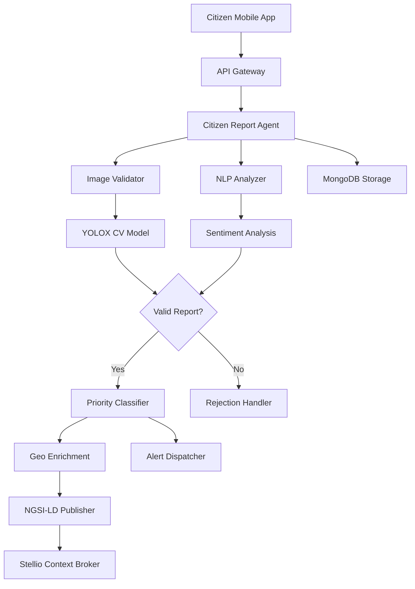

<!--
SPDX-License-Identifier: MIT
Copyright (c) 2025 UIP Team. All rights reserved.

UIP - Urban Intelligence Platform
Citizen report agent documentation.

Module: apps/traffic-web-app/frontend/docs/docs/agents/analytics/citizen-report.md
Author: UIP Team
Version: 1.0.0
-->

# Citizen Report Agent

## Overview

The Citizen Report Agent processes user-submitted traffic reports, validates submissions, enriches data with AI analysis, and integrates citizen intelligence into the traffic management system for improved situational awareness.

## Features

- **Report Submission**: Accept photos, videos, and text descriptions from citizens
- **AI Validation**: Automatic verification using computer vision and NLP
- **Image Analysis**: Extract traffic conditions from citizen photos
- **Geolocation**: Precise location tagging and verification
- **Priority Classification**: Categorize reports by urgency and impact
- **Feedback Loop**: Notify citizens about report status and actions taken

## Architecture



## Configuration

**File**: `config/agents.yaml` (citizen_ingestion section)

```yaml
citizen_ingestion:
  validation:
    require_image: true
    require_location: true
    min_description_length: 10
    max_description_length: 500
    
  image_processing:
    max_file_size: 10485760      # 10MB
    allowed_formats: ["jpg", "jpeg", "png"]
    min_resolution: [640, 480]
    cv_analysis: true
    
  priority_rules:
    critical:
      keywords: ["accident", "fire", "blocked", "emergency"]
      response_time: 5            # minutes
      
    high:
      keywords: ["congestion", "heavy traffic", "jam"]
      response_time: 15
      
    medium:
      keywords: ["slow", "moderate", "construction"]
      response_time: 30
      
    low:
      keywords: ["light traffic", "normal", "clear"]
      response_time: 60
      
  geolocation:
    validation_radius: 100        # meters
    geocoding_service: "nominatim"
    reverse_geocode: true
    
  moderation:
    spam_detection: true
    profanity_filter: true
    duplicate_detection: true
    duplicate_threshold: 0.85
    
  feedback:
    auto_reply: true
    status_updates: true
    notification_methods: ["push", "email"]
```

## Usage

### Basic Report Submission

```python
from src.agents.ingestion.citizen_ingestion_agent import CitizenIngestionAgent

# Initialize agent
agent = CitizenIngestionAgent()

# Submit citizen report
report = agent.submit_report(
    user_id="user_12345",
    description="Heavy traffic jam on Nguyen Hue Boulevard",
    location={"lat": 10.7769, "lon": 106.7009},
    image_path="traffic_photo.jpg",
    category="congestion"
)

print(f"Report ID: {report.id}")
print(f"Status: {report.status}")
print(f"Priority: {report.priority}")
```

### Report Validation

```python
# Validate report before processing
validation = agent.validate_report(
    description="Accident near Ben Thanh Market",
    image=image_data,
    location={"lat": 10.7723, "lon": 106.6980}
)

if validation.is_valid:
    print("Report validated successfully")
    print(f"Confidence: {validation.confidence}")
else:
    print(f"Validation failed: {validation.reason}")
```

### Image Analysis

```python
# Analyze citizen-submitted image
analysis = agent.analyze_citizen_image(
    image_path="citizen_photo.jpg"
)

print(f"Detected Objects: {analysis.objects}")
print(f"Traffic Condition: {analysis.traffic_condition}")
print(f"Vehicle Count: {analysis.vehicle_count}")
print(f"Congestion Level: {analysis.congestion_level}")
print(f"Confidence: {analysis.confidence}")
```

### Query Reports

```python
# Get recent reports in area
reports = agent.get_reports_in_area(
    lat=10.7769,
    lon=106.7009,
    radius_km=2,
    time_window="1h"
)

for report in reports:
    print(f"{report.category}: {report.description}")
    print(f"  Location: {report.location}")
    print(f"  Time: {report.timestamp}")
    print(f"  Verified: {report.verified}")
```

## API Reference

### Class: `CitizenIngestionAgent`

#### Methods

##### `submit_report(user_id: str, description: str, location: dict, image_path: str = None, category: str = None) -> CitizenReport`

Submit a new citizen report.

**Parameters:**
- `user_id` (str): User identifier
- `description` (str): Text description of traffic condition
- `location` (dict): Geographic coordinates `{lat, lon}`
- `image_path` (str, optional): Path to image file
- `category` (str, optional): Report category

**Returns:**
- CitizenReport: Submitted report with ID and status

**Example:**
```python
report = agent.submit_report(
    user_id="user_123",
    description="Heavy congestion",
    location={"lat": 10.7769, "lon": 106.7009},
    image_path="photo.jpg"
)
```

##### `validate_report(description: str, image: bytes, location: dict) -> ValidationResult`

Validate report before acceptance.

**Parameters:**
- `description` (str): Report description
- `image` (bytes): Image data
- `location` (dict): Coordinates

**Returns:**
- ValidationResult: Validation outcome

##### `analyze_citizen_image(image_path: str) -> ImageAnalysis`

Analyze citizen-submitted image using CV.

**Parameters:**
- `image_path` (str): Path to image file

**Returns:**
- ImageAnalysis: CV analysis results

##### `get_reports_in_area(lat: float, lon: float, radius_km: float, time_window: str) -> List[CitizenReport]`

Retrieve reports within geographic area.

**Parameters:**
- `lat` (float): Latitude
- `lon` (float): Longitude
- `radius_km` (float): Search radius
- `time_window` (str): Time filter (e.g., "1h", "24h")

**Returns:**
- List[CitizenReport]: Matching reports

##### `update_report_status(report_id: str, status: str, resolution: str = None)`

Update report status and notify user.

**Parameters:**
- `report_id` (str): Report identifier
- `status` (str): New status (received, verified, resolved, rejected)
- `resolution` (str, optional): Resolution description

**Example:**
```python
agent.update_report_status(
    report_id="CR_001",
    status="resolved",
    resolution="Traffic cleared by police"
)
```

### Data Models

#### `CitizenReport`

```python
@dataclass
class CitizenReport:
    id: str
    user_id: str
    timestamp: datetime
    description: str
    location: dict                 # {lat, lon, address}
    image_url: str
    category: str                  # congestion, accident, hazard, etc.
    priority: str                  # critical, high, medium, low
    status: str                    # received, verified, in_progress, resolved
    verification_score: float      # 0.0-1.0
    votes: int                     # Community votes
    resolved_at: datetime
    resolution: str
```

#### `ValidationResult`

```python
@dataclass
class ValidationResult:
    is_valid: bool
    confidence: float              # 0.0-1.0
    reason: str
    checks: dict                   # Individual check results
    suggested_category: str
    priority: str
```

#### `ImageAnalysis`

```python
@dataclass
class ImageAnalysis:
    timestamp: datetime
    objects: List[str]             # Detected objects
    vehicle_count: int
    traffic_condition: str         # clear, moderate, congested, gridlock
    congestion_level: str
    confidence: float
    weather_condition: str
    time_of_day: str
    quality_score: float
```

## Report Categories

| Category | Description | Example Keywords |
|----------|-------------|------------------|
| Congestion | Traffic jams, slow traffic | jam, congestion, slow, stuck |
| Accident | Vehicle collisions | accident, crash, collision |
| Hazard | Road hazards, debris | debris, pothole, hazard, danger |
| Construction | Road work, construction | construction, roadwork, closed |
| Weather | Weather-related issues | flood, rain, visibility |
| Parking | Illegal parking | parking, blocked |
| Other | Miscellaneous | other, general |

## Priority Classification

### Automatic Priority Assignment

```python
# Priority determined by multiple factors
priority = agent.calculate_priority(
    category="accident",
    severity_keywords=["emergency", "injured"],
    image_analysis=analysis,
    location_impact="high_traffic_area"
)
```

### Priority Levels

| Priority | Response Time | Criteria |
|----------|---------------|----------|
| Critical | 5 minutes | Accidents, emergencies, blockages |
| High | 15 minutes | Heavy congestion, hazards |
| Medium | 30 minutes | Moderate traffic, construction |
| Low | 60 minutes | Light traffic, general info |

## Integration Examples

### Integration with Accident Detection

```python
from src.agents.analytics.accident_detection_agent import AccidentDetectionAgent

citizen_agent = CitizenIngestionAgent()
accident_agent = AccidentDetectionAgent()

# Cross-validate citizen reports with camera detection
def verify_accident_report(report):
    # Find nearby cameras
    nearby_cameras = get_cameras_near(report.location, radius=0.5)
    
    # Check for accident detection
    for camera in nearby_cameras:
        detection = accident_agent.detect_accident(
            camera_id=camera.id,
            frame=camera.get_current_frame()
        )
        
        if detection.accident_detected:
            # Confirm citizen report
            citizen_agent.update_report_status(
                report_id=report.id,
                status="verified",
                verification_score=0.95
            )
            return True
    
    return False
```

### Integration with Alert Dispatcher

```python
from src.agents.notification.alert_dispatcher_agent import AlertDispatcherAgent

alert_agent = AlertDispatcherAgent()

# Dispatch alerts for verified critical reports
def handle_critical_report(report):
    if report.priority == "critical" and report.verification_score > 0.8:
        alert_agent.dispatch_alert(
            type="CITIZEN_REPORT_CRITICAL",
            location=report.location,
            description=report.description,
            image_url=report.image_url,
            priority="high"
        )
```

### Integration with Pattern Recognition

```python
from src.agents.analytics.pattern_recognition_agent import PatternRecognitionAgent

pattern_agent = PatternRecognitionAgent()

# Analyze citizen report patterns
patterns = pattern_agent.analyze_report_patterns(
    time_range="30d",
    category="congestion"
)

print(f"Hotspots from citizen reports: {patterns.hotspots}")
print(f"Peak reporting times: {patterns.peak_hours}")
```

## Monitoring & Metrics

### Health Check

```python
health = agent.health_check()
print(f"Status: {health.status}")
print(f"Reports Processed Today: {health.reports_today}")
print(f"Verification Rate: {health.verification_rate}%")
print(f"Average Processing Time: {health.avg_processing_time}s")
```

### Report Statistics

```python
stats = agent.get_statistics(time_range="7d")

print(f"Total Reports: {stats.total_reports}")
print(f"Verified Reports: {stats.verified_count}")
print(f"Category Breakdown: {stats.category_distribution}")
print(f"Average Response Time: {stats.avg_response_time}min")
```

## Performance Optimization

### Batch Processing

```python
# Process multiple reports concurrently
agent.configure_batch_processing(
    batch_size=10,
    parallel_workers=4
)
```

### Image Compression

```python
# Compress images for faster processing
agent.configure_image_processing(
    compression_quality=85,
    max_dimension=1920
)
```

### Caching

```python
# Cache validation results
agent.enable_caching(
    validation_cache_ttl=3600,
    analysis_cache_ttl=1800
)
```

## Testing

### Unit Tests

```python
import pytest

def test_report_validation():
    agent = CitizenIngestionAgent()
    
    # Valid report
    result = agent.validate_report(
        description="Heavy traffic on main street",
        image=valid_image,
        location={"lat": 10.7769, "lon": 106.7009}
    )
    assert result.is_valid == True
    
    # Invalid report (too short)
    result = agent.validate_report(
        description="bad",
        image=valid_image,
        location={"lat": 10.7769, "lon": 106.7009}
    )
    assert result.is_valid == False

def test_image_analysis():
    agent = CitizenIngestionAgent()
    
    analysis = agent.analyze_citizen_image("test_traffic.jpg")
    assert analysis.vehicle_count >= 0
    assert analysis.traffic_condition in ["clear", "moderate", "congested", "gridlock"]
```

## Best Practices

### 1. Spam Prevention

```python
# Enable comprehensive spam detection
agent.configure_moderation(
    spam_detection=True,
    duplicate_threshold=0.85,
    rate_limiting={"max_reports_per_hour": 5}
)
```

### 2. User Feedback

Always provide feedback to users:

```python
agent.configure_feedback(
    auto_reply=True,
    status_updates=True,
    resolution_notification=True
)
```

### 3. Data Privacy

Anonymize sensitive data:

```python
agent.enable_privacy_protection(
    anonymize_user_data=True,
    blur_faces=True,
    blur_license_plates=True
)
```

## Troubleshooting

### Issue: Low Verification Rate

**Solution**: Adjust validation thresholds

```python
agent.configure_validation(
    min_confidence=0.6,
    require_image=False  # Make image optional
)
```

### Issue: Slow Image Processing

**Solution**: Enable GPU and reduce image size

```python
agent.configure_cv_processing(
    device="cuda",
    image_resize=(640, 480)
)
```

### Issue: Duplicate Reports

**Solution**: Increase duplicate detection sensitivity

```python
agent.configure_moderation(
    duplicate_threshold=0.75,
    time_window=300  # 5 minutes
)
```

## Related Documentation

- [Accident Detection Agent](../analytics/accident-detection.md)
- [Alert Dispatcher Agent](../notification/alert-dispatcher.md)
- [Citizen Report Form Component](../../frontend/components/citizen-report-form.md)

## License

MIT License - Copyright (c) 2025 UIP Contributors (Nguyễn Nhật Quang, Nguyễn Việt Hoàng, Nguyễn Đình Anh Tuấn)

See [LICENSE](../LICENSE) for details.
