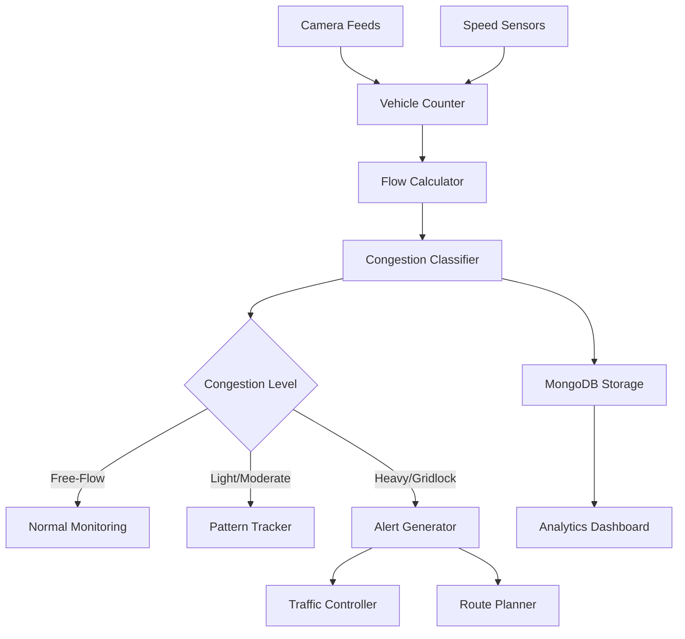

<!--
SPDX-License-Identifier: MIT
Copyright (c) 2025 UIP Team. All rights reserved.

UIP - Urban Intelligence Platform
Congestion detection agent documentation.

Module: apps/traffic-web-app/frontend/docs/docs/agents/analytics/congestion-detection.md
Author: UIP Team
Version: 1.0.0
-->

# Congestion Detection Agent

## Overview

The Congestion Detection Agent monitors traffic flow in real-time, classifies congestion levels across zones, calculates impact metrics, and provides actionable intelligence for traffic management and route optimization.

## Features

- **Real-time Monitoring**: Continuous traffic flow analysis across 50+ zones
- **5-Level Classification**: Free-flow, light, moderate, heavy, gridlock
- **Zone Management**: Geographic zone-based congestion tracking
- **Impact Assessment**: Calculate congestion effects on travel time and emissions
- **Predictive Alerts**: Forecast congestion before it occurs
- **Historical Trends**: Long-term congestion pattern analysis

## Architecture



## Configuration

**File**: `config/congestion_config.yaml`

```yaml
congestion_detection:
  zones:
    - id: "ZONE_D1_CENTRAL"
      name: "District 1 Central"
      polygon: [[10.7769, 106.7009], [10.7800, 106.7050], ...]
      capacity: 500  # vehicles per hour
      speed_limit: 40  # km/h
      
  classification_thresholds:
    free_flow:
      speed_range: [35, 40]      # km/h
      density_max: 15            # vehicles per km
      flow_range: [400, 500]     # vehicles per hour
      
    light:
      speed_range: [25, 35]
      density_max: 30
      flow_range: [300, 400]
      
    moderate:
      speed_range: [15, 25]
      density_max: 50
      flow_range: [200, 300]
      
    heavy:
      speed_range: [5, 15]
      density_max: 80
      flow_range: [100, 200]
      
    gridlock:
      speed_range: [0, 5]
      density_max: 120
      flow_range: [0, 100]
      
  metrics:
    calculation_interval: 60     # seconds
    smoothing_window: 300        # 5 minutes
    
  alerts:
    moderate_threshold: 15       # minutes duration
    heavy_threshold: 5
    gridlock_threshold: 1
    
  prediction:
    enabled: true
    look_ahead: 30               # minutes
    confidence_threshold: 0.75
```

## Usage

### Basic Usage

```python
from src.agents.analytics.congestion_detection_agent import CongestionDetectionAgent

# Initialize agent
agent = CongestionDetectionAgent()

# Get current congestion
congestion = agent.get_congestion_level(
    zone_id="ZONE_D1_CENTRAL"
)

print(f"Zone: {congestion.zone_name}")
print(f"Level: {congestion.level}")
print(f"Average Speed: {congestion.avg_speed} km/h")
print(f"Vehicle Density: {congestion.density} veh/km")
print(f"Flow Rate: {congestion.flow_rate} veh/h")
```

### Multi-Zone Monitoring

```python
# Monitor all zones
all_zones = agent.get_all_zones_status()

for zone_status in all_zones:
    print(f"{zone_status.zone_name}: {zone_status.level}")
    if zone_status.level in ["heavy", "gridlock"]:
        print(f"  ⚠️ Alert: {zone_status.duration}min")
```

### Impact Assessment

```python
# Calculate congestion impact
impact = agent.assess_impact(
    zone_id="ZONE_D1_CENTRAL",
    baseline_speed=40,
    current_speed=12
)

print(f"Travel Time Increase: {impact.time_increase_pct}%")
print(f"Delay per Vehicle: {impact.delay_minutes}min")
print(f"Economic Cost: ${impact.economic_cost}")
print(f"CO2 Emissions Increase: {impact.emissions_increase}kg")
```

### Predictive Congestion

```python
# Predict congestion 30 minutes ahead
prediction = agent.predict_congestion(
    zone_id="ZONE_D1_CENTRAL",
    minutes_ahead=30
)

print(f"Predicted Level: {prediction.level}")
print(f"Confidence: {prediction.confidence}")
print(f"Time to Congestion: {prediction.time_to_congestion}min")
```

## API Reference

### Class: `CongestionDetectionAgent`

#### Methods

##### `get_congestion_level(zone_id: str) -> CongestionStatus`

Get current congestion status for a zone.

**Parameters:**
- `zone_id` (str): Zone identifier

**Returns:**
- CongestionStatus: Current congestion information

**Example:**
```python
status = agent.get_congestion_level("ZONE_D1_CENTRAL")
print(f"Level: {status.level}, Speed: {status.avg_speed} km/h")
```

##### `get_all_zones_status() -> List[CongestionStatus]`

Get congestion status for all monitored zones.

**Returns:**
- List[CongestionStatus]: Status of all zones

##### `assess_impact(zone_id: str, baseline_speed: float, current_speed: float) -> ImpactAssessment`

Calculate congestion impact metrics.

**Parameters:**
- `zone_id` (str): Zone identifier
- `baseline_speed` (float): Normal speed (km/h)
- `current_speed` (float): Current speed (km/h)

**Returns:**
- ImpactAssessment: Impact metrics

##### `predict_congestion(zone_id: str, minutes_ahead: int) -> CongestionPrediction`

Predict future congestion levels.

**Parameters:**
- `zone_id` (str): Zone identifier
- `minutes_ahead` (int): Prediction horizon (5-60 minutes)

**Returns:**
- CongestionPrediction: Predicted congestion

**Example:**
```python
prediction = agent.predict_congestion("ZONE_D1_CENTRAL", 30)
if prediction.level == "heavy":
    print("Heavy congestion expected in 30 minutes")
```

##### `calculate_congestion_index(zone_id: str) -> float`

Calculate composite congestion index (0-100).

**Parameters:**
- `zone_id` (str): Zone identifier

**Returns:**
- float: Congestion index (0=free-flow, 100=gridlock)

**Example:**
```python
index = agent.calculate_congestion_index("ZONE_D1_CENTRAL")
print(f"Congestion Index: {index}/100")
```

### Data Models

#### `CongestionStatus`

```python
@dataclass
class CongestionStatus:
    timestamp: datetime
    zone_id: str
    zone_name: str
    level: str                     # free_flow, light, moderate, heavy, gridlock
    avg_speed: float               # km/h
    density: float                 # vehicles per km
    flow_rate: int                 # vehicles per hour
    vehicle_count: int
    duration: int                  # minutes in current level
    trend: str                     # improving, stable, worsening
    congestion_index: float        # 0-100
```

#### `ImpactAssessment`

```python
@dataclass
class ImpactAssessment:
    zone_id: str
    time_increase_pct: float       # % increase in travel time
    delay_minutes: float           # average delay per vehicle
    affected_vehicles: int
    economic_cost: float           # USD
    emissions_increase: float      # kg CO2
    fuel_waste: float              # liters
    productivity_loss: float       # USD
```

#### `CongestionPrediction`

```python
@dataclass
class CongestionPrediction:
    timestamp: datetime
    zone_id: str
    minutes_ahead: int
    predicted_level: str
    confidence: float              # 0.0-1.0
    time_to_congestion: int        # minutes (if not congested)
    predicted_speed: float         # km/h
    predicted_density: float       # vehicles per km
    contributing_factors: List[str]
```

## Congestion Levels

### Classification Criteria

| Level | Speed (km/h) | Density (veh/km) | Flow (veh/h) | Description |
|-------|--------------|------------------|--------------|-------------|
| Free-Flow | 35-40 | \<15 | 400-500 | Smooth traffic flow |
| Light | 25-35 | 15-30 | 300-400 | Minor delays |
| Moderate | 15-25 | 30-50 | 200-300 | Noticeable congestion |
| Heavy | 5-15 | 50-80 | 100-200 | Significant delays |
| Gridlock | 0-5 | \>80 | \<100 | Severe congestion |

### Congestion Index Calculation

```python
# Composite index formula
index = agent.calculate_congestion_index(zone_id)

# Index components:
# - Speed factor: (speed_limit - current_speed) / speed_limit * 40
# - Density factor: (current_density / max_density) * 30
# - Flow factor: (capacity - current_flow) / capacity * 30
```

## Integration Examples

### Integration with Route Planner

```python
from src.components.RoutePlanner import RoutePlanner

congestion_agent = CongestionDetectionAgent()
route_planner = RoutePlanner()

def get_fastest_route(origin, destination):
    # Get congestion for all zones
    all_zones = congestion_agent.get_all_zones_status()
    
    # Filter congested zones
    avoid_zones = [
        z.zone_id for z in all_zones
        if z.level in ["heavy", "gridlock"]
    ]
    
    # Calculate route avoiding congestion
    route = route_planner.calculate_route(
        origin=origin,
        destination=destination,
        avoid_zones=avoid_zones
    )
    
    return route
```

### Integration with Pattern Recognition

```python
from src.agents.analytics.pattern_recognition_agent import PatternRecognitionAgent

pattern_agent = PatternRecognitionAgent()

# Analyze congestion patterns
patterns = pattern_agent.detect_patterns(
    metric_type="congestion",
    time_range="30d"
)

# Identify peak congestion times
peak_times = [
    p for p in patterns
    if p.type == "daily" and p.characteristics["avg_level"] == "heavy"
]
```

### Integration with Alert Dispatcher

```python
from src.agents.notification.alert_dispatcher_agent import AlertDispatcherAgent

alert_agent = AlertDispatcherAgent()

# Monitor and alert on congestion
def monitor_congestion():
    agent = CongestionDetectionAgent()
    
    while True:
        zones = agent.get_all_zones_status()
        
        for zone in zones:
            if zone.level == "heavy" and zone.duration >= 10:
                alert_agent.dispatch_alert(
                    type="CONGESTION_HEAVY",
                    zone=zone.zone_name,
                    duration=zone.duration,
                    impact=agent.assess_impact(zone.zone_id)
                )
        
        time.sleep(60)
```

## Monitoring & Metrics

### Health Check

```python
health = agent.health_check()
print(f"Status: {health.status}")
print(f"Zones Monitored: {health.active_zones}")
print(f"Data Freshness: {health.data_age_seconds}s")
print(f"Congested Zones: {health.congested_zones_count}")
```

### Performance Metrics

```python
metrics = agent.get_metrics(time_range="24h")

print(f"Average Congestion Index: {metrics.avg_congestion_index}")
print(f"Peak Congestion Time: {metrics.peak_time}")
print(f"Total Vehicle-Hours Lost: {metrics.total_delay_hours}")
print(f"Economic Impact: ${metrics.total_economic_cost}")
```

## Performance Optimization

### Zone Caching

```python
# Cache zone status for fast access
agent.configure_caching(
    zone_status_ttl=30,    # seconds
    metrics_ttl=60
)
```

### Parallel Zone Processing

```python
# Process multiple zones concurrently
agent.configure_parallel_processing(
    num_workers=8,
    batch_size=10
)
```

### Adaptive Update Intervals

```python
# Update more frequently during congestion
agent.configure_adaptive_updates(
    normal_interval=60,      # seconds
    congested_interval=15
)
```

## Testing

### Unit Tests

```python
import pytest

def test_congestion_classification():
    agent = CongestionDetectionAgent()
    
    # Test free-flow classification
    status = agent.classify_congestion(
        speed=38,
        density=12,
        flow=450
    )
    assert status.level == "free_flow"
    
    # Test heavy congestion
    status = agent.classify_congestion(
        speed=8,
        density=65,
        flow=150
    )
    assert status.level == "heavy"

def test_impact_calculation():
    agent = CongestionDetectionAgent()
    
    impact = agent.assess_impact(
        zone_id="TEST_ZONE",
        baseline_speed=40,
        current_speed=10
    )
    
    assert impact.time_increase_pct > 0
    assert impact.delay_minutes > 0
```

## Best Practices

### 1. Dynamic Thresholds

Adjust thresholds based on zone characteristics:

```python
agent.set_zone_thresholds(
    zone_id="HIGHWAY_ZONE",
    thresholds={
        "free_flow": {"speed_range": [80, 100]},
        "heavy": {"speed_range": [20, 40]}
    }
)
```

### 2. Historical Baseline

Use historical data for better classification:

```python
agent.use_historical_baseline(
    time_range="90d",
    percentile=85
)
```

### 3. Weather-Adjusted Classification

Factor in weather conditions:

```python
status = agent.get_congestion_level(
    zone_id="ZONE_D1",
    weather_adjusted=True
)
```

## Troubleshooting

### Issue: Frequent Level Fluctuations

**Solution**: Increase smoothing window

```python
agent.configure_smoothing(window_seconds=600)  # 10 minutes
```

### Issue: Delayed Detection

**Solution**: Reduce calculation interval

```python
agent.configure_monitoring(interval_seconds=30)
```

### Issue: Inaccurate Predictions

**Solution**: Retrain prediction model with more data

```python
agent.retrain_prediction_model(
    training_days=90,
    include_weather=True,
    include_events=True
)
```

## Related Documentation

- [Pattern Recognition Agent](./pattern-recognition.md)
- [Route Planner Component](../../frontend/components/route-planner.md)
- [Alert Dispatcher Agent](../notification/alert-dispatcher.md)

## License

MIT License - Copyright (c) 2025 UIP Contributors (Nguyễn Nhật Quang, Nguyễn Việt Hoàng, Nguyễn Đình Anh Tuấn)

See [LICENSE](../LICENSE) for details.
