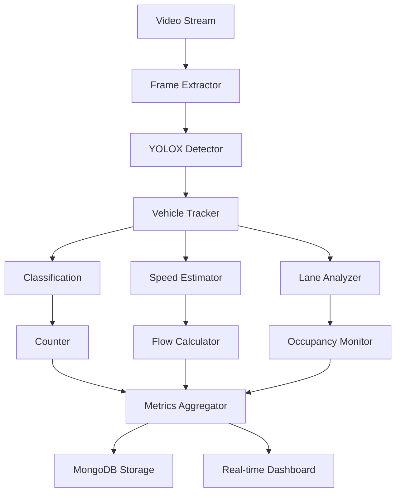

<!--
SPDX-License-Identifier: MIT
Copyright (c) 2025 UIP Team. All rights reserved.

UIP - Urban Intelligence Platform
Computer vision analysis agent documentation.

Module: apps/traffic-web-app/frontend/docs/docs/agents/analytics/cv-analysis.md
Author: UIP Team
Version: 1.0.0
-->

# Computer Vision Analysis Agent

## Overview

The Computer Vision Analysis Agent provides comprehensive video analytics capabilities, including vehicle counting, classification, speed estimation, lane monitoring, and behavior analysis using state-of-the-art deep learning models.

## Features

- **Vehicle Detection & Counting**: Real-time vehicle detection and counting across multiple lanes
- **Vehicle Classification**: 8-class classification (car, truck, bus, motorcycle, bicycle, etc.)
- **Speed Estimation**: Calculate vehicle speeds using optical flow and calibration
- **Lane Occupancy**: Monitor lane-level traffic distribution
- **Traffic Flow Metrics**: Calculate flow rate, density, and occupancy
- **Behavior Analysis**: Detect lane violations, wrong-way driving, illegal parking

## Architecture



## Configuration

**File**: `config/cv_config.yaml`

```yaml
cv_analysis:
  detection:
    model: "yolox_x"
    weights: "yolox_x.pth"
    confidence_threshold: 0.5
    iou_threshold: 0.45
    device: "cuda"
    
  vehicle_classes:
    - id: 0
      name: "car"
      size_category: "small"
      
    - id: 1
      name: "truck"
      size_category: "large"
      
    - id: 2
      name: "bus"
      size_category: "large"
      
    - id: 3
      name: "motorcycle"
      size_category: "small"
      
    - id: 4
      name: "bicycle"
      size_category: "small"
      
  tracking:
    method: "strongsort"
    max_age: 30           # frames
    min_hits: 3
    iou_threshold: 0.3
    
  speed_estimation:
    enabled: true
    calibration_required: true
    units: "km/h"
    smoothing_window: 5   # frames
    
  lane_detection:
    enabled: true
    num_lanes: 4
    lane_width: 3.5       # meters
    
  metrics:
    calculation_interval: 60    # seconds
    aggregation_window: 300     # 5 minutes
    
  performance:
    target_fps: 15
    skip_frames: 2
    batch_size: 1
```

## Usage

### Basic Vehicle Detection

```python
from src.agents.analytics.cv_analysis_agent import CVAnalysisAgent

# Initialize agent
agent = CVAnalysisAgent()

# Analyze single frame
result = agent.analyze_frame(
    camera_id="CAM_001",
    frame=cv2.imread("traffic_frame.jpg")
)

print(f"Vehicles detected: {result.vehicle_count}")
print(f"Cars: {result.class_counts['car']}")
print(f"Trucks: {result.class_counts['truck']}")
print(f"Motorcycles: {result.class_counts['motorcycle']}")
```

### Real-time Video Stream Analysis

```python
# Process video stream
def analyze_stream(camera_id):
    agent = CVAnalysisAgent()
    
    for frame in video_stream(camera_id):
        analysis = agent.analyze_frame(
            camera_id=camera_id,
            frame=frame
        )
        
        # Display results
        print(f"Frame {analysis.frame_number}:")
        print(f"  Vehicles: {analysis.vehicle_count}")
        print(f"  Avg Speed: {analysis.avg_speed} km/h")
        print(f"  Flow Rate: {analysis.flow_rate} veh/h")
```

### Speed Estimation

```python
# Calibrate camera for speed estimation
agent.calibrate_camera(
    camera_id="CAM_001",
    reference_distance=50,  # meters
    pixel_distance=500      # pixels
)

# Get vehicle speeds
speeds = agent.get_vehicle_speeds(
    camera_id="CAM_001",
    time_window=60  # seconds
)

for vehicle in speeds:
    print(f"Vehicle {vehicle.id}: {vehicle.speed} km/h")
    if vehicle.speed > 60:  # Speed limit
        print(f"  ⚠️ Speeding detected!")
```

### Lane Occupancy Analysis

```python
# Analyze lane-level traffic
lane_stats = agent.analyze_lane_occupancy(
    camera_id="CAM_001"
)

for lane in lane_stats:
    print(f"Lane {lane.number}:")
    print(f"  Occupancy: {lane.occupancy_pct}%")
    print(f"  Vehicle Count: {lane.vehicle_count}")
    print(f"  Average Speed: {lane.avg_speed} km/h")
    print(f"  Flow Rate: {lane.flow_rate} veh/h")
```

### Traffic Flow Metrics

```python
# Calculate comprehensive flow metrics
metrics = agent.calculate_flow_metrics(
    camera_id="CAM_001",
    time_window=300  # 5 minutes
)

print(f"Flow Rate: {metrics.flow_rate} vehicles/hour")
print(f"Density: {metrics.density} vehicles/km")
print(f"Average Speed: {metrics.avg_speed} km/h")
print(f"Level of Service: {metrics.los}")  # A, B, C, D, E, F
```

## API Reference

### Class: `CVAnalysisAgent`

#### Methods

##### `analyze_frame(camera_id: str, frame: np.ndarray) -> AnalysisResult`

Analyze a single video frame.

**Parameters:**
- `camera_id` (str): Camera identifier
- `frame` (np.ndarray): Video frame (BGR format)

**Returns:**
- AnalysisResult: Comprehensive analysis results

**Example:**
```python
result = agent.analyze_frame("CAM_001", frame)
print(f"Detected: {result.vehicle_count} vehicles")
```

##### `get_vehicle_speeds(camera_id: str, time_window: int) -> List[VehicleSpeed]`

Get vehicle speeds over time window.

**Parameters:**
- `camera_id` (str): Camera identifier
- `time_window` (int): Time window in seconds

**Returns:**
- List[VehicleSpeed]: Vehicle speed data

##### `analyze_lane_occupancy(camera_id: str) -> List[LaneStats]`

Analyze lane-level traffic statistics.

**Parameters:**
- `camera_id` (str): Camera identifier

**Returns:**
- List[LaneStats]: Lane statistics

##### `calculate_flow_metrics(camera_id: str, time_window: int) -> FlowMetrics`

Calculate traffic flow metrics.

**Parameters:**
- `camera_id` (str): Camera identifier
- `time_window` (int): Calculation window (seconds)

**Returns:**
- FlowMetrics: Flow metrics

**Example:**
```python
metrics = agent.calculate_flow_metrics("CAM_001", 300)
print(f"Flow: {metrics.flow_rate} veh/h")
```

##### `calibrate_camera(camera_id: str, reference_distance: float, pixel_distance: float)`

Calibrate camera for accurate measurements.

**Parameters:**
- `camera_id` (str): Camera identifier
- `reference_distance` (float): Real-world distance (meters)
- `pixel_distance` (float): Corresponding pixel distance

**Example:**
```python
agent.calibrate_camera("CAM_001", 50, 500)
```

### Data Models

#### `AnalysisResult`

```python
@dataclass
class AnalysisResult:
    timestamp: datetime
    camera_id: str
    frame_number: int
    vehicle_count: int
    class_counts: dict             # {class_name: count}
    detections: List[Detection]
    avg_speed: float               # km/h
    flow_rate: int                 # vehicles/hour
    lane_occupancy: List[float]    # per-lane occupancy %
    metadata: dict
```

#### `Detection`

```python
@dataclass
class Detection:
    id: int
    class_name: str
    confidence: float
    bbox: dict                     # {x, y, width, height}
    speed: float                   # km/h (if estimated)
    lane: int
    trajectory: List[dict]         # Historical positions
    first_seen: datetime
    last_seen: datetime
```

#### `VehicleSpeed`

```python
@dataclass
class VehicleSpeed:
    vehicle_id: int
    class_name: str
    speed: float                   # km/h
    timestamp: datetime
    lane: int
    position: dict
    is_speeding: bool
```

#### `LaneStats`

```python
@dataclass
class LaneStats:
    lane_number: int
    occupancy_pct: float           # 0-100
    vehicle_count: int
    avg_speed: float               # km/h
    flow_rate: int                 # vehicles/hour
    density: float                 # vehicles/km
    dominant_class: str
```

#### `FlowMetrics`

```python
@dataclass
class FlowMetrics:
    flow_rate: int                 # vehicles/hour
    density: float                 # vehicles/km
    avg_speed: float               # km/h
    avg_headway: float             # seconds
    avg_spacing: float             # meters
    level_of_service: str          # A, B, C, D, E, F
    capacity_utilization: float    # 0-1
```

## Vehicle Classification

### Supported Classes

| Class ID | Name | Size Category | Typical Count |
|----------|------|---------------|---------------|
| 0 | Car | Small | ~60% |
| 1 | Truck | Large | ~10% |
| 2 | Bus | Large | ~5% |
| 3 | Motorcycle | Small | ~20% |
| 4 | Bicycle | Small | ~3% |
| 5 | Pedestrian | N/A | ~2% |
| 6 | Van | Medium | ~5% |
| 7 | Emergency | Special | \<1% |

## Speed Estimation Methods

### 1. Optical Flow

```python
# Enable optical flow-based speed estimation
agent.configure_speed_estimation(
    method="optical_flow",
    calibration_required=False
)
```

### 2. Calibrated Tracking

```python
# More accurate with calibration
agent.calibrate_camera("CAM_001", reference_distance=50, pixel_distance=500)
agent.configure_speed_estimation(
    method="calibrated_tracking",
    smoothing_window=5
)
```

## Integration Examples

### Integration with Congestion Detection

```python
from src.agents.analytics.congestion_detection_agent import CongestionDetectionAgent

cv_agent = CVAnalysisAgent()
congestion_agent = CongestionDetectionAgent()

# Use CV metrics for congestion detection
def detect_congestion(camera_id):
    # Get flow metrics from CV
    metrics = cv_agent.calculate_flow_metrics(camera_id, 300)
    
    # Update congestion detection
    congestion_agent.update_metrics(
        zone_id=camera_to_zone[camera_id],
        speed=metrics.avg_speed,
        density=metrics.density,
        flow=metrics.flow_rate
    )
```

### Integration with Pattern Recognition

```python
from src.agents.analytics.pattern_recognition_agent import PatternRecognitionAgent

pattern_agent = PatternRecognitionAgent()

# Analyze vehicle composition patterns
composition_patterns = pattern_agent.detect_patterns(
    metric="vehicle_composition",
    data_source=cv_agent.get_historical_composition("30d")
)
```

### Integration with Accident Detection

```python
from src.agents.analytics.accident_detection_agent import AccidentDetectionAgent

accident_agent = AccidentDetectionAgent()

# Use CV tracking for accident context
def analyze_accident_context(camera_id):
    # Get vehicles near accident
    analysis = cv_agent.analyze_frame(camera_id, frame)
    
    # Estimate severity based on vehicle count
    involved_vehicles = len([
        v for v in analysis.detections
        if v.speed < 5  # Stopped vehicles
    ])
    
    return {
        "involved_vehicles": involved_vehicles,
        "traffic_density": analysis.vehicle_count,
        "lane_blockage": cv_agent.calculate_blockage(analysis)
    }
```

## Monitoring & Metrics

### Health Check

```python
health = agent.health_check()
print(f"Status: {health.status}")
print(f"Model Loaded: {health.model_loaded}")
print(f"Active Cameras: {health.active_cameras}")
print(f"Processing FPS: {health.avg_fps}")
print(f"GPU Utilization: {health.gpu_usage}%")
```

### Performance Metrics

```python
metrics = agent.get_performance_metrics()

print(f"Detection Latency: {metrics.avg_latency}ms")
print(f"Tracking Accuracy: {metrics.tracking_accuracy}%")
print(f"Speed Estimation Error: {metrics.speed_error_pct}%")
```

## Performance Optimization

### GPU Acceleration

```python
# Configure GPU settings
agent.configure_device(
    device="cuda",
    precision="fp16",
    batch_size=4
)
```

### Frame Skipping

```python
# Process every Nth frame
agent.configure_processing(
    skip_frames=2,      # Process every 3rd frame
    target_fps=10
)
```

### Region of Interest

```python
# Only process specific region
agent.set_roi(
    camera_id="CAM_001",
    roi=[[100, 100], [500, 400]]  # [x, y] coordinates
)
```

## Testing

### Unit Tests

```python
import pytest

def test_vehicle_detection():
    agent = CVAnalysisAgent()
    
    # Test with known image
    frame = cv2.imread("test_data/traffic_5_vehicles.jpg")
    result = agent.analyze_frame("CAM_TEST", frame)
    
    assert result.vehicle_count >= 4  # Allow ±1 tolerance
    assert len(result.detections) > 0

def test_speed_estimation():
    agent = CVAnalysisAgent()
    agent.calibrate_camera("CAM_TEST", 50, 500)
    
    # Test with moving vehicle sequence
    speeds = []
    for frame in test_frames:
        result = agent.analyze_frame("CAM_TEST", frame)
        if result.detections:
            speeds.append(result.detections[0].speed)
    
    assert len(speeds) > 0
    assert all(s >= 0 for s in speeds)
```

## Best Practices

### 1. Camera Calibration

Always calibrate cameras for accurate measurements:

```python
agent.calibrate_all_cameras(
    calibration_data="config/camera_calibrations.yaml"
)
```

### 2. Adaptive Processing

Adjust processing based on traffic density:

```python
agent.enable_adaptive_processing(
    low_traffic_fps=5,
    high_traffic_fps=15
)
```

### 3. Model Ensemble

Use multiple models for better accuracy:

```python
agent.enable_model_ensemble(
    models=["yolox_x", "yolox_l"],
    voting_method="confidence"
)
```

## Troubleshooting

### Issue: Low Detection Accuracy

**Solution**: Adjust confidence threshold and retrain on local data

```python
agent.configure_model(confidence_threshold=0.4)
agent.fine_tune(training_images="local_traffic_data/")
```

### Issue: Inaccurate Speed Estimation

**Solution**: Recalibrate camera and increase smoothing

```python
agent.calibrate_camera("CAM_001", reference_distance=50, pixel_distance=500)
agent.configure_speed_estimation(smoothing_window=10)
```

### Issue: High GPU Memory Usage

**Solution**: Reduce batch size and use FP16 precision

```python
agent.configure_device(batch_size=1, precision="fp16")
```

## Related Documentation

- [Accident Detection Agent](./accident-detection.md)
- [Congestion Detection Agent](./congestion-detection.md)
- [Camera Image Fetch Agent](../data-collection/camera-image-fetch.md)

## License

MIT License - Copyright (c) 2025 UIP Contributors (Nguyễn Nhật Quang, Nguyễn Việt Hoàng, Nguyễn Đình Anh Tuấn)

See [LICENSE](../LICENSE) for details.
