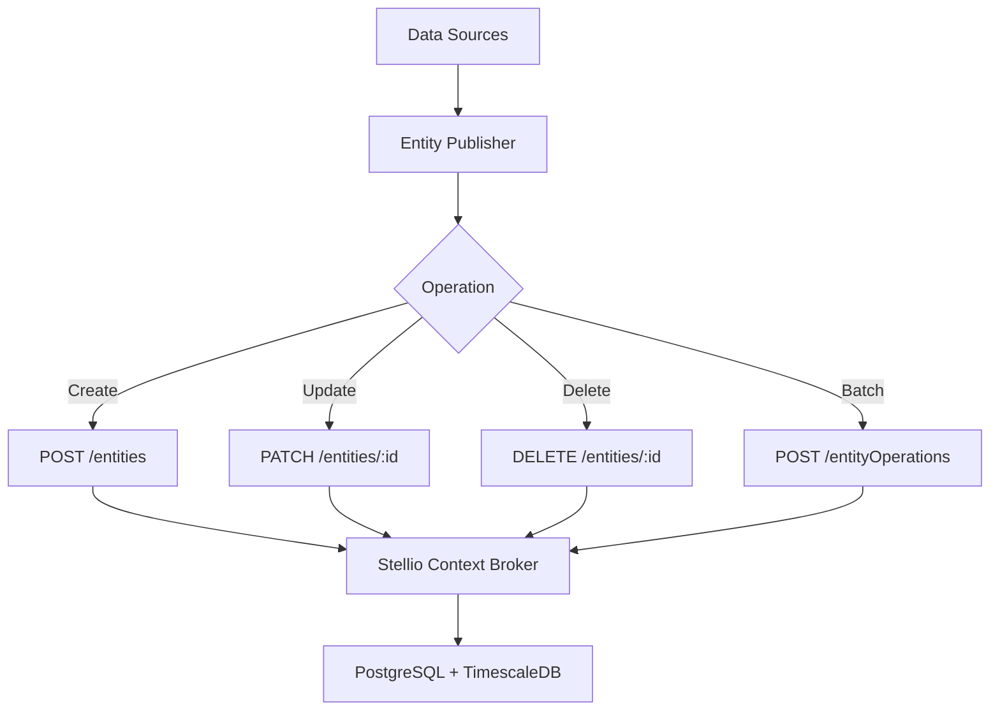

<!--
SPDX-License-Identifier: MIT
Copyright (c) 2025 UIP Team. All rights reserved.

UIP - Urban Intelligence Platform
Entity publisher agent documentation.

Module: apps/traffic-web-app/frontend/docs/docs/agents/context-management/entity-publisher.md
Author: UIP Team
Version: 1.0.0
-->

# Entity Publisher Agent

## Overview

The Entity Publisher Agent manages the lifecycle of NGSI-LD entities in Stellio Context Broker, handling creation, updates, subscriptions, and batch operations for real-time context management.

## Features

- **CRUD Operations**: Create, Read, Update, Delete NGSI-LD entities
- **Batch Processing**: Bulk operations for multiple entities
- **Temporal Entities**: Time-series entity management
- **Subscriptions**: Event-driven notifications
- **Entity Relationships**: Manage semantic relationships
- **Query Support**: Complex entity queries with filters

## Architecture



## Configuration

**File**: `config/stellio.yaml`

```yaml
stellio:
  base_url: "http://localhost:8080"
  context: "https://uri.etsi.org/ngsi-ld/v1/ngsi-ld-core-context.jsonld"
  
  batch:
    max_size: 100
    parallel: true
    
  retry:
    attempts: 3
    delay: 5
    
  timeout: 30
```

## Usage

### Create Entity

```python
from src.agents.context_management.entity_publisher_agent import EntityPublisherAgent

agent = EntityPublisherAgent()

# Create traffic flow entity
entity = {
    "id": "urn:ngsi-ld:TrafficFlowObserved:CAM_001:20240115T103000Z",
    "type": "TrafficFlowObserved",
    "location": {
        "type": "GeoProperty",
        "value": {"type": "Point", "coordinates": [106.7009, 10.7769]}
    },
    "intensity": {"type": "Property", "value": 45},
    "averageVehicleSpeed": {"type": "Property", "value": 35.5, "unitCode": "KMH"}
}

result = agent.create_entity(entity)
print(f"Created: {result.entity_id}")
```

### Update Entity

```python
# Partial update
agent.update_entity(
    entity_id="urn:ngsi-ld:TrafficFlowObserved:CAM_001",
    attributes={
        "intensity": {"type": "Property", "value": 52},
        "averageVehicleSpeed": {"type": "Property", "value": 32.0}
    }
)
```

### Batch Operations

```python
# Create multiple entities
entities = [
    {...},  # Entity 1
    {...},  # Entity 2
    {...}   # Entity 3
]

result = agent.batch_create(entities)
print(f"Created: {result.success_count}/{result.total}")
```

### Query Entities

```python
# Query by type and location
entities = agent.query_entities(
    entity_type="TrafficFlowObserved",
    geo_query={
        "geometry": "Point",
        "coordinates": [106.7009, 10.7769],
        "georel": "near;maxDistance==1000"
    },
    time_query={
        "timerel": "after",
        "time": "2024-01-15T10:00:00Z"
    }
)
```

## API Reference

### Class: `EntityPublisherAgent`

#### Methods

##### `create_entity(entity: dict) -> CreateResult`

Create new NGSI-LD entity.

##### `update_entity(entity_id: str, attributes: dict) -> bool`

Update entity attributes.

##### `delete_entity(entity_id: str) -> bool`

Delete entity.

##### `batch_create(entities: List[dict]) -> BatchResult`

Create multiple entities.

##### `query_entities(entity_type: str, **filters) -> List[dict]`

Query entities with filters.

## Integration Examples

### With NGSI-LD Transformer

```python
from src.agents.transformation.ngsi_ld_transformer_agent import NGSILDTransformerAgent

transformer = NGSILDTransformerAgent()
publisher = EntityPublisherAgent()

# Transform and publish
entity = transformer.transform_to_ngsi_ld(raw_data, "TrafficFlowObserved")
publisher.create_entity(entity)
```

## Related Documentation

- [NGSI-LD Transformer Agent](../transformation/ngsi-ld-transformer.md)
- [Stellio State Query Agent](./stellio-state-query.md)
- [Temporal Data Manager Agent](./temporal-data-manager.md)

## License

MIT License - Copyright (c) 2025 UIP Contributors (Nguyễn Nhật Quang, Nguyễn Việt Hoàng, Nguyễn Đình Anh Tuấn)

See [LICENSE](../LICENSE) for details.
