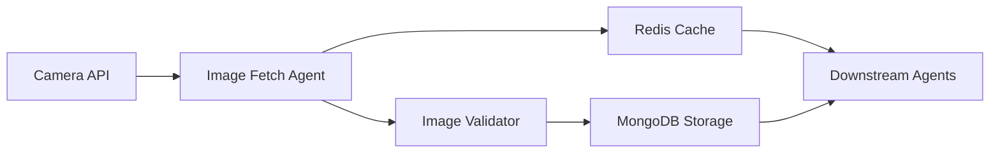

<!--
SPDX-License-Identifier: MIT
Copyright (c) 2025 UIP Team. All rights reserved.

UIP - Urban Intelligence Platform
Camera image fetch agent documentation.

Module: apps/traffic-web-app/frontend/docs/docs/agents/data-collection/camera-image-fetch.md
Author: UIP Team
Version: 1.0.0
-->

# Camera Image Fetch Agent

## Overview

The Camera Image Fetch Agent is responsible for collecting real-time traffic camera images from HCMC's transportation network. It implements intelligent caching with TTL (Time To Live) management to optimize bandwidth usage and ensure data freshness.

## Features

- **Real-time Image Collection**: Fetches images from 100+ traffic cameras across HCMC
- **Intelligent Caching**: Redis-based caching with configurable TTL (default: 60 seconds)
- **Rate Limiting**: Prevents API overload with configurable request intervals
- **Error Handling**: Automatic retry with exponential backoff
- **Image Validation**: Checks image integrity and format before storage
- **Metadata Enrichment**: Adds timestamp, location, and camera status information

## Architecture



## Configuration

**File**: `config/data_sources.yaml`

```yaml
camera_sources:
  hcmc_traffic_cameras:
    base_url: "https://api.hcmc-transport.gov.vn/cameras"
    api_key: "${CAMERA_API_KEY}"
    refresh_interval: 60  # seconds
    cache_ttl: 300        # 5 minutes
    timeout: 10           # seconds
    retry_attempts: 3
    retry_delay: 2        # seconds
    
  camera_filters:
    districts: [1, 3, 5, 7, 10, "Binh Thanh", "Phu Nhuan"]
    active_only: true
    min_resolution: "720p"
```

## Usage

### Basic Usage

```python
from src.agents.data_collection.image_refresh_agent import ImageRefreshAgent

# Initialize agent
agent = ImageRefreshAgent(config_path="config/data_sources.yaml")

# Fetch all camera images
images = agent.fetch_all_cameras()

# Fetch specific camera
image = agent.fetch_camera_image(camera_id="CAM_001")

# Get cached image
cached_image = agent.get_cached_image(camera_id="CAM_001")
```

### Advanced Usage with Caching

```python
from src.agents.data_collection.image_refresh_agent import ImageRefreshAgent
from src.agents.cache.cache_manager_agent import CacheManagerAgent

# Initialize with custom cache
cache_manager = CacheManagerAgent()
agent = ImageRefreshAgent(cache_manager=cache_manager)

# Fetch with cache strategy
image = agent.fetch_with_strategy(
    camera_id="CAM_001",
    strategy="cache_first",  # cache_first, network_first, cache_only
    max_age=120  # seconds
)

# Batch fetch with parallel processing
images = agent.batch_fetch(
    camera_ids=["CAM_001", "CAM_002", "CAM_003"],
    max_workers=5,
    timeout=30
)
```

### Integration with Other Agents

```python
from src.orchestrator import Orchestrator

# Use in orchestration workflow
orchestrator = Orchestrator()

# Register agent
orchestrator.register_agent("image_refresh", ImageRefreshAgent())

# Execute workflow
result = orchestrator.execute_workflow([
    "image_refresh",
    "cv_analysis",
    "accident_detection"
])
```

## API Reference

### Class: `ImageRefreshAgent`

#### Methods

##### `__init__(config_path: str, cache_manager: Optional[CacheManager] = None)`

Initialize the agent with configuration.

**Parameters:**
- `config_path` (str): Path to configuration file
- `cache_manager` (CacheManager, optional): Custom cache manager instance

**Example:**
```python
agent = ImageRefreshAgent(
    config_path="config/data_sources.yaml",
    cache_manager=custom_cache
)
```

##### `fetch_all_cameras() -> List[CameraImage]`

Fetch images from all active cameras.

**Returns:**
- List[CameraImage]: List of camera image objects

**Raises:**
- `CameraAPIError`: If API request fails
- `ValidationError`: If image validation fails

**Example:**
```python
images = agent.fetch_all_cameras()
for img in images:
    print(f"Camera: {img.camera_id}, Size: {img.size_bytes}")
```

##### `fetch_camera_image(camera_id: str, force_refresh: bool = False) -> CameraImage`

Fetch image from specific camera.

**Parameters:**
- `camera_id` (str): Unique camera identifier
- `force_refresh` (bool): Bypass cache and fetch fresh image

**Returns:**
- CameraImage: Camera image object with metadata

**Example:**
```python
image = agent.fetch_camera_image("CAM_001", force_refresh=True)
```

##### `get_cached_image(camera_id: str) -> Optional[CameraImage]`

Retrieve image from cache.

**Parameters:**
- `camera_id` (str): Unique camera identifier

**Returns:**
- Optional[CameraImage]: Cached image or None if not found

**Example:**
```python
cached = agent.get_cached_image("CAM_001")
if cached:
    print(f"Cache hit! Age: {cached.age_seconds}s")
```

### Data Models

#### `CameraImage`

```python
from dataclasses import dataclass
from datetime import datetime

@dataclass
class CameraImage:
    camera_id: str
    image_data: bytes
    timestamp: datetime
    location: dict
    resolution: tuple
    format: str
    size_bytes: int
    metadata: dict
```

#### `CameraStatus`

```python
@dataclass
class CameraStatus:
    camera_id: str
    is_active: bool
    last_update: datetime
    error_count: int
    uptime_percentage: float
```

## Performance Optimization

### Cache Strategy

The agent implements a multi-tier caching strategy:

1. **L1 Cache (Memory)**: In-memory LRU cache for frequently accessed images
2. **L2 Cache (Redis)**: Distributed cache for cross-agent sharing
3. **L3 Cache (MongoDB)**: Persistent storage for historical data

```python
# Configure cache tiers
agent.configure_cache(
    l1_size=100,      # Number of images in memory
    l2_ttl=300,       # Redis TTL in seconds
    l3_retention=7    # MongoDB retention in days
)
```

### Parallel Processing

Optimize batch operations with parallel processing:

```python
# Configure parallel fetching
agent.configure_parallel(
    max_workers=10,
    chunk_size=20,
    timeout_per_camera=5
)

# Execute parallel batch
images = agent.batch_fetch_parallel(
    camera_ids=all_camera_ids,
    progress_callback=lambda done, total: print(f"{done}/{total}")
)
```

## Monitoring & Metrics

### Health Check

```python
# Check agent health
health = agent.health_check()
print(f"Status: {health.status}")
print(f"Active Cameras: {health.active_cameras}")
print(f"Cache Hit Rate: {health.cache_hit_rate}%")
print(f"Average Response Time: {health.avg_response_time}ms")
```

### Metrics Export

```python
# Export metrics for monitoring
metrics = agent.export_metrics()
# {
#   "total_fetches": 1000,
#   "successful_fetches": 980,
#   "failed_fetches": 20,
#   "cache_hits": 750,
#   "cache_misses": 250,
#   "avg_fetch_time_ms": 120
# }
```

## Error Handling

### Common Errors

#### `CameraAPIError`

```python
from src.core.exceptions import CameraAPIError

try:
    image = agent.fetch_camera_image("CAM_001")
except CameraAPIError as e:
    print(f"API Error: {e.message}")
    print(f"Status Code: {e.status_code}")
    print(f"Camera ID: {e.camera_id}")
```

#### `CacheError`

```python
from src.core.exceptions import CacheError

try:
    cached = agent.get_cached_image("CAM_001")
except CacheError as e:
    print(f"Cache Error: {e.message}")
    # Fallback to network fetch
    image = agent.fetch_camera_image("CAM_001", force_refresh=True)
```

### Retry Logic

```python
# Configure retry strategy
agent.configure_retry(
    max_attempts=5,
    backoff_factor=2,
    max_delay=30,
    retry_on=[500, 502, 503, 504]  # HTTP status codes
)
```

## Testing

### Unit Tests

```python
import pytest
from src.agents.data_collection.image_refresh_agent import ImageRefreshAgent

def test_fetch_camera_image(mock_camera_api):
    agent = ImageRefreshAgent()
    image = agent.fetch_camera_image("CAM_TEST_001")
    
    assert image.camera_id == "CAM_TEST_001"
    assert len(image.image_data) > 0
    assert image.format in ["JPEG", "PNG"]

def test_cache_behavior(mock_cache):
    agent = ImageRefreshAgent(cache_manager=mock_cache)
    
    # First fetch - cache miss
    image1 = agent.fetch_camera_image("CAM_001")
    assert mock_cache.get_call_count() == 1
    
    # Second fetch - cache hit
    image2 = agent.get_cached_image("CAM_001")
    assert image2 is not None
    assert image1.camera_id == image2.camera_id
```

### Integration Tests

```python
@pytest.mark.integration
def test_end_to_end_workflow():
    agent = ImageRefreshAgent()
    
    # Fetch all cameras
    images = agent.fetch_all_cameras()
    assert len(images) > 0
    
    # Verify cache population
    for image in images:
        cached = agent.get_cached_image(image.camera_id)
        assert cached is not None
```

## Best Practices

### 1. Cache Management

```python
# Always check cache first
image = agent.get_cached_image(camera_id)
if not image or image.is_stale():
    image = agent.fetch_camera_image(camera_id)
```

### 2. Error Handling

```python
# Implement graceful degradation
try:
    image = agent.fetch_camera_image(camera_id)
except CameraAPIError:
    # Use cached image even if stale
    image = agent.get_cached_image(camera_id)
    if not image:
        # Use placeholder image
        image = agent.get_placeholder_image()
```

### 3. Resource Cleanup

```python
# Always close connections
try:
    agent = ImageRefreshAgent()
    images = agent.fetch_all_cameras()
finally:
    agent.close()  # Close connections and cleanup resources
```

## Troubleshooting

### Issue: High Cache Miss Rate

**Symptoms**: Cache hit rate below 50%

**Solutions**:
1. Increase cache TTL
2. Reduce fetch frequency
3. Check Redis memory limits
4. Verify cache key generation

### Issue: Slow Image Fetching

**Symptoms**: Average fetch time > 1 second

**Solutions**:
1. Enable parallel processing
2. Reduce image quality/resolution
3. Check network latency
4. Optimize API endpoint

### Issue: Memory Leaks

**Symptoms**: Increasing memory usage over time

**Solutions**:
1. Ensure proper resource cleanup
2. Reduce L1 cache size
3. Check for circular references
4. Monitor Python GC metrics

## Related Documentation

- [External Data Collector Agent](./external-data-collector.md)
- [CV Analysis Agent](../analytics/cv-analysis.md)
- [Cache Manager Agent](../cache/cache-manager.md)
- [Data Quality Validator](../monitoring/data-quality-validator.md)

## Contributing

See [Contributing Guide](../../guides/contributing.md) for information on how to contribute to this agent.

## License

MIT License - Copyright (c) 2025 UIP Contributors (Nguyễn Nhật Quang, Nguyễn Việt Hoàng, Nguyễn Đình Anh Tuấn)

See [LICENSE](../LICENSE) for details.
