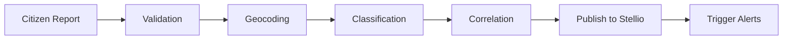

<!--
============================================================================
SPDX-License-Identifier: MIT
Copyright (c) 2025 UIP Team. All rights reserved.
============================================================================

UIP - Urban Intelligence Platform
Citizen Ingestion Agent Documentation.

File: apps/traffic-web-app/frontend/docs/docs/agents/ingestion/citizen-ingestion.md
Module: Ingestion Agents Documentation
Author: Nguyen Nhat Quang (Lead), Nguyen Viet Hoang, Nguyen Dinh Anh Tuan
Created: 2025-11-20
Version: 1.0.0
License: MIT
Description: Documentation for the Citizen Ingestion Agent component.
============================================================================
-->

# Citizen Ingestion Agent

The Citizen Ingestion Agent processes citizen-reported incidents and integrates them into the platform.

## 📋 Overview

| Property | Value |
|----------|-------|
| **Module** | `src.agents.ingestion.citizen_ingestion_agent` |
| **Class** | `CitizenIngestionAgent` |
| **Author** | UIP Team |
| **Version** | 1.0.0 |

## 🎯 Purpose

- **Ingest citizen reports** from mobile apps and web portals
- **Validate and geocode** report locations
- **Classify incident types** automatically
- **Correlate with sensor data** for verification

## 📊 Report Types

| Type | Description | Priority |
|------|-------------|----------|
| `accident` | Traffic accident | High |
| `congestion` | Traffic jam | Medium |
| `hazard` | Road hazard | High |
| `roadwork` | Construction | Low |
| `flooding` | Water on road | High |
| `other` | Miscellaneous | Low |

## 🚀 Usage

### Ingest Report

```python
from src.agents.ingestion.citizen_ingestion_agent import CitizenIngestionAgent

agent = CitizenIngestionAgent()

# Ingest citizen report
report = await agent.ingest({
    "reporter_id": "USER_12345",
    "type": "accident",
    "description": "Two-car collision at intersection",
    "location": {
        "lat": 10.8231,
        "lon": 106.6297,
        "address": "Nguyen Hue Street"
    },
    "photos": ["base64_image_data"],
    "timestamp": "2025-11-29T10:30:00Z"
})
```

### Validate Report

```python
# Validate against sensor data
validation = await agent.validate(report["id"])
# {
#     "valid": True,
#     "confidence": 0.85,
#     "correlated_cameras": ["CAM_001", "CAM_002"],
#     "sensor_confirmation": True
# }
```

### Get Report Status

```python
# Track report processing status
status = await agent.get_status(report["id"])
# {
#     "id": "RPT_001",
#     "status": "verified",
#     "processing_time_ms": 1234,
#     "actions_taken": ["alert_dispatched", "camera_analyzed"]
# }
```

## ⚙️ Configuration

```yaml
# config/citizen_ingestion.yaml
citizen_ingestion:
  enabled: true
  
  # Validation settings
  validation:
    require_location: true
    require_photo: false
    max_age_minutes: 60
    geocoding:
      enabled: true
      provider: "nominatim"
  
  # Classification
  classification:
    model: "text-classification-v1"
    confidence_threshold: 0.7
  
  # Correlation
  correlation:
    camera_radius_km: 1.0
    sensor_timeout_seconds: 30
  
  # Rate limiting (per user)
  rate_limit:
    max_reports_per_hour: 10
    cooldown_seconds: 60
```

## 🔄 Processing Pipeline



## 📖 Related Documentation

- [Accident Detection](../analytics/accident-detection) - Accident verification
- [Alert Dispatcher](../notification/alert-dispatcher) - Alert generation
- [NGSI-LD Transformer](../transformation/ngsi-ld-transformer) - Entity format

---

See the [complete agents reference](../complete-agents-reference) for all available agents.
