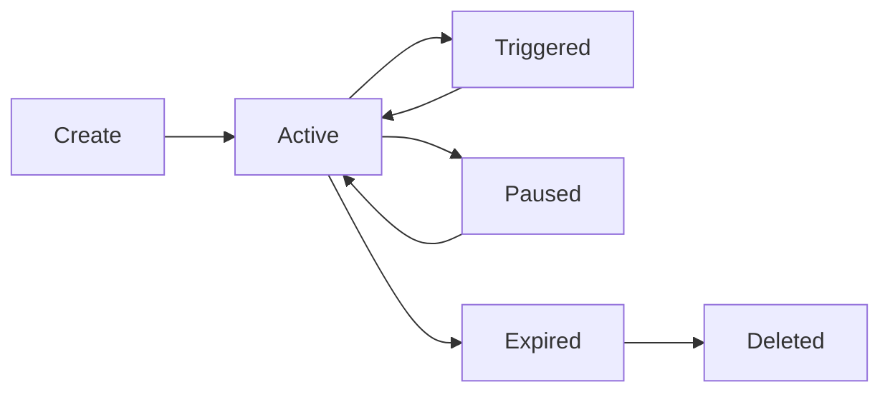

<!--
============================================================================
SPDX-License-Identifier: MIT
Copyright (c) 2025 UIP Team. All rights reserved.
============================================================================

UIP - Urban Intelligence Platform
Subscription Manager Agent Documentation.

File: apps/traffic-web-app/frontend/docs/docs/agents/notification/subscription-manager.md
Module: Notification Agents Documentation
Author: Nguyen Nhat Quang (Lead), Nguyen Viet Hoang, Nguyen Dinh Anh Tuan
Created: 2025-11-20
Version: 1.0.0
License: MIT
Description: Documentation for the Subscription Manager Agent component.
============================================================================
-->

# Subscription Manager Agent

The Subscription Manager Agent handles NGSI-LD subscriptions and user notification preferences.

## 📋 Overview

| Property | Value |
|----------|-------|
| **Module** | `src.agents.notification.subscription_manager_agent` |
| **Class** | `SubscriptionManagerAgent` |
| **Author** | UIP Team |
| **Version** | 1.0.0 |

## 🎯 Purpose

- **Manage NGSI-LD subscriptions** in Stellio
- **Handle user notification preferences** by topic
- **Route notifications** to appropriate handlers
- **Track subscription lifecycle** and health

## 🚀 Usage

### Create Subscription

```python
from src.agents.notification.subscription_manager_agent import SubscriptionManagerAgent

manager = SubscriptionManagerAgent()

# Create NGSI-LD subscription
subscription = await manager.create_subscription({
    "type": "Subscription",
    "entities": [{"type": "TrafficCamera"}],
    "watchedAttributes": ["status", "vehicleCount"],
    "notification": {
        "endpoint": {
            "uri": "http://localhost:8080/notifications"
        }
    },
    "q": "vehicleCount>100"
})
```

### User Subscription

```python
# Subscribe user to alerts
await manager.subscribe_user(
    user_id="USER_001",
    topics=["accidents", "congestion"],
    channels=["email", "push"],
    preferences={
        "severity_threshold": "medium",
        "zones": ["district_1"]
    }
)
```

### List Subscriptions

```python
# Get all active subscriptions
subscriptions = await manager.list_subscriptions()

# Get user's subscriptions
user_subs = await manager.get_user_subscriptions("USER_001")
```

## ⚙️ Configuration

```yaml
# config/subscriptions.yaml
subscription_manager:
  enabled: true
  
  # Stellio settings
  stellio:
    url: "http://localhost:8080"
    subscription_endpoint: "/ngsi-ld/v1/subscriptions"
  
  # Default subscription settings
  defaults:
    throttling: 5  # seconds
    expires_in_days: 30
    notification_format: "normalized"
  
  # Topics
  topics:
    accidents:
      entity_type: "TrafficAccident"
      attributes: ["severity", "location", "status"]
    congestion:
      entity_type: "CongestionZone"
      attributes: ["level", "affectedRoads"]
```

## 📊 Subscription Types

| Type | Description | Notification |
|------|-------------|--------------|
| `entity_changes` | Track entity updates | Real-time |
| `threshold_alerts` | Value exceeds threshold | Immediate |
| `scheduled_reports` | Periodic summaries | Scheduled |
| `geofence_events` | Location-based | Real-time |

## 🔄 Subscription Lifecycle



## 📖 Related Documentation

- [Alert Dispatcher](alert-dispatcher) - Notification routing
- [Email Handler](email-notification-handler) - Email delivery
- [Webhook Handler](webhook-notification-handler) - Webhook delivery

---

See the [complete agents reference](../complete-agents-reference) for all available agents.
