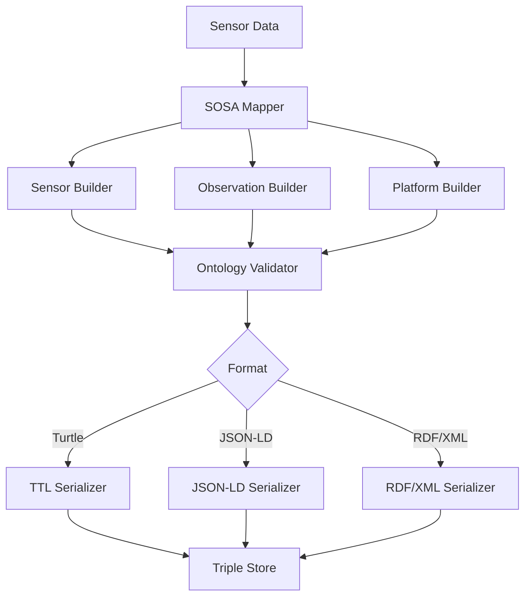

<!--
SPDX-License-Identifier: MIT
Copyright (c) 2025 UIP Team. All rights reserved.

UIP - Urban Intelligence Platform
SOSA/SSN mapper agent documentation.

Module: apps/traffic-web-app/frontend/docs/docs/agents/transformation/sosa-ssn-mapper.md
Author: UIP Team
Version: 1.0.0
-->

# SOSA/SSN Mapper Agent

## Overview

The SOSA/SSN Mapper Agent transforms sensor observations and traffic data into W3C SOSA (Sensor, Observation, Sample, and Actuator) and SSN (Semantic Sensor Network) ontology format, enabling rich semantic descriptions and sensor network interoperability.

## Features

- **W3C Standards Compliance**: Full SOSA/SSN ontology adherence
- **Sensor Modeling**: Comprehensive sensor and platform descriptions
- **Observation Mapping**: Transform measurements to SOSA observations
- **Procedure Definition**: Document sensing procedures and methodologies
- **Feature of Interest**: Link observations to real-world entities
- **RDF Serialization**: Output in Turtle, JSON-LD, RDF/XML formats

## Architecture



## Configuration

**File**: `config/sosa_mappings.yaml`

```yaml
sosa_ssn:
  namespaces:
    sosa: "http://www.w3.org/ns/sosa/"
    ssn: "http://www.w3.org/ns/ssn/"
    geo: "http://www.w3.org/2003/01/geo/wgs84_pos#"
    qudt: "http://qudt.org/schema/qudt/"
    time: "http://www.w3.org/2006/time#"
    ex: "http://hcmc-traffic.example.org/"
    
  sensor_types:
    camera:
      class: "ssn:Sensor"
      observes:
        - "ex:VehicleCount"
        - "ex:VehicleSpeed"
        - "ex:TrafficFlow"
      platform: "ex:TrafficCameraStation"
      
    weather_station:
      class: "ssn:Sensor"
      observes:
        - "ex:Temperature"
        - "ex:Humidity"
        - "ex:Precipitation"
      platform: "ex:WeatherStation"
      
    air_quality_sensor:
      class: "ssn:Sensor"
      observes:
        - "ex:PM25"
        - "ex:PM10"
        - "ex:AQI"
      platform: "ex:AirQualityStation"
      
  observable_properties:
    vehicle_count:
      uri: "ex:VehicleCount"
      unit: "http://qudt.org/vocab/unit/NUM"
      description: "Number of vehicles detected"
      
    vehicle_speed:
      uri: "ex:VehicleSpeed"
      unit: "http://qudt.org/vocab/unit/KiloM-PER-HR"
      description: "Average vehicle speed"
      
    temperature:
      uri: "ex:Temperature"
      unit: "http://qudt.org/vocab/unit/DEG_C"
      description: "Ambient temperature"
      
  platforms:
    camera_station:
      type: "sosa:Platform"
      deployment_location: "geo:Point"
      hosts_sensors: ["Camera", "SpeedSensor"]
```

## Usage

### Basic Observation Mapping

```python
from src.agents.transformation.sosa_ssn_mapper_agent import SOSASSNMapperAgent

# Initialize agent
agent = SOSASSNMapperAgent()

# Transform sensor observation
observation_data = {
    "sensor_id": "CAM_001",
    "timestamp": "2024-01-15T10:30:00Z",
    "property": "vehicle_count",
    "value": 45,
    "location": {"lat": 10.7769, "lon": 106.7009}
}

sosa_observation = agent.map_to_sosa_observation(observation_data)
print(sosa_observation.serialize(format="turtle"))
```

**Output (Turtle):**
```turtle
@prefix sosa: <http://www.w3.org/ns/sosa/> .
@prefix ssn: <http://www.w3.org/ns/ssn/> .
@prefix xsd: <http://www.w3.org/2001/XMLSchema#> .
@prefix qudt: <http://qudt.org/schema/qudt/> .
@prefix ex: <http://hcmc-traffic.example.org/> .

ex:Observation_CAM_001_20240115T103000Z a sosa:Observation ;
    sosa:madeBySensor ex:Sensor_CAM_001 ;
    sosa:hasFeatureOfInterest ex:RoadSegment_D1 ;
    sosa:observedProperty ex:VehicleCount ;
    sosa:hasSimpleResult 45 ;
    sosa:resultTime "2024-01-15T10:30:00Z"^^xsd:dateTime ;
    sosa:phenomenonTime [
        a time:Instant ;
        time:inXSDDateTimeStamp "2024-01-15T10:30:00Z"^^xsd:dateTimeStamp
    ] .

ex:Sensor_CAM_001 a sosa:Sensor ;
    sosa:observes ex:VehicleCount ;
    sosa:isHostedBy ex:Platform_CAM_001 .
```

### Sensor Description

```python
# Create complete sensor description
sensor = agent.create_sensor_description(
    sensor_id="CAM_001",
    sensor_type="camera",
    location={"lat": 10.7769, "lon": 106.7009},
    observes=["vehicle_count", "vehicle_speed", "traffic_flow"],
    accuracy=0.95,
    frequency="1 minute"
)

print(sensor.serialize(format="json-ld"))
```

### Platform Modeling

```python
# Model traffic camera platform
platform = agent.create_platform(
    platform_id="PLATFORM_D1_001",
    name="District 1 Traffic Station",
    location={"lat": 10.7769, "lon": 106.7009},
    hosts_sensors=["CAM_001", "CAM_002", "SPEED_SENSOR_001"],
    deployment_date="2023-01-15"
)
```

### Observation Collection

```python
# Create observation collection (time series)
collection = agent.create_observation_collection(
    sensor_id="CAM_001",
    observations=[
        {"timestamp": "2024-01-15T10:00:00Z", "value": 42},
        {"timestamp": "2024-01-15T10:15:00Z", "value": 48},
        {"timestamp": "2024-01-15T10:30:00Z", "value": 45}
    ],
    property="vehicle_count"
)
```

## API Reference

### Class: `SOSASSNMapperAgent`

#### Methods

##### `map_to_sosa_observation(data: dict) -> SOSAObservation`

Map sensor data to SOSA observation.

**Parameters:**
- `data` (dict): Sensor observation data

**Returns:**
- SOSAObservation: SOSA observation object

**Example:**
```python
obs = agent.map_to_sosa_observation({
    "sensor_id": "CAM_001",
    "timestamp": "2024-01-15T10:30:00Z",
    "property": "vehicle_count",
    "value": 45
})
```

##### `create_sensor_description(sensor_id: str, sensor_type: str, location: dict, observes: List[str], **kwargs) -> SOSASensor`

Create comprehensive sensor description.

**Parameters:**
- `sensor_id` (str): Sensor identifier
- `sensor_type` (str): Type of sensor
- `location` (dict): Geographic location
- `observes` (List[str]): Observable properties
- `**kwargs`: Additional properties (accuracy, frequency, etc.)

**Returns:**
- SOSASensor: Sensor description

##### `create_platform(platform_id: str, name: str, location: dict, hosts_sensors: List[str], **kwargs) -> SOSAPlatform`

Create platform description.

**Parameters:**
- `platform_id` (str): Platform identifier
- `name` (str): Platform name
- `location` (dict): Geographic location
- `hosts_sensors` (List[str]): List of hosted sensor IDs

**Returns:**
- SOSAPlatform: Platform description

##### `create_observation_collection(sensor_id: str, observations: List[dict], property: str) -> SOSAObservationCollection`

Create time-series observation collection.

**Parameters:**
- `sensor_id` (str): Sensor identifier
- `observations` (List[dict]): List of observations
- `property` (str): Observable property

**Returns:**
- SOSAObservationCollection: Observation collection

##### `serialize(entity: Any, format: str = "turtle") -> str`

Serialize SOSA/SSN entity to RDF format.

**Parameters:**
- `entity` (Any): SOSA/SSN entity
- `format` (str): Output format (turtle, json-ld, xml)

**Returns:**
- str: Serialized RDF

**Example:**
```python
ttl = agent.serialize(sensor, format="turtle")
jsonld = agent.serialize(sensor, format="json-ld")
```

### Data Models

#### `SOSAObservation`

```python
@dataclass
class SOSAObservation:
    observation_id: str
    sensor_id: str
    feature_of_interest: str
    observed_property: str
    result: any
    result_time: datetime
    phenomenon_time: datetime
    unit_of_measurement: str
    
    def serialize(self, format: str = "turtle") -> str:
        """Serialize to RDF format"""
        pass
```

#### `SOSASensor`

```python
@dataclass
class SOSASensor:
    sensor_id: str
    sensor_type: str
    observes: List[str]           # Observable properties
    platform_id: str
    location: dict
    accuracy: float
    measurement_range: dict
    response_time: str
    
    def serialize(self, format: str = "turtle") -> str:
        pass
```

#### `SOSAPlatform`

```python
@dataclass
class SOSAPlatform:
    platform_id: str
    name: str
    location: dict
    hosts_sensors: List[str]
    deployment_date: datetime
    operator: str
    
    def serialize(self, format: str = "turtle") -> str:
        pass
```

## SOSA Core Concepts

### 1. Observation

An act of carrying out an observation procedure to estimate or calculate a value.

```python
observation = agent.map_to_sosa_observation({
    "sensor_id": "CAM_001",
    "property": "vehicle_count",
    "value": 45,
    "timestamp": "2024-01-15T10:30:00Z"
})
```

### 2. Sensor

A device that implements a sensing procedure and outputs observations.

```python
sensor = agent.create_sensor_description(
    sensor_id="CAM_001",
    sensor_type="camera",
    observes=["vehicle_count", "vehicle_speed"]
)
```

### 3. Observable Property

An observable quality (property, characteristic) of a feature of interest.

```python
property = agent.define_observable_property(
    name="VehicleCount",
    description="Number of vehicles detected",
    unit="http://qudt.org/vocab/unit/NUM"
)
```

### 4. Feature of Interest

The thing whose property is being estimated or calculated.

```python
feature = agent.define_feature_of_interest(
    feature_id="RoadSegment_D1",
    type="RoadSegment",
    location={"lat": 10.7769, "lon": 106.7009}
)
```

### 5. Platform

A platform hosts sensors and other platforms.

```python
platform = agent.create_platform(
    platform_id="PLATFORM_001",
    hosts_sensors=["CAM_001", "SPEED_001"]
)
```

## SSN Extensions

### System Capabilities

```python
# Define sensor capabilities
capabilities = agent.define_system_capabilities(
    sensor_id="CAM_001",
    accuracy=0.95,
    precision=0.98,
    sensitivity="1 vehicle",
    resolution="640x480",
    response_time="1 second",
    measurement_range={"min": 0, "max": 200}
)
```

### Operating Range

```python
# Define operating conditions
operating_range = agent.define_operating_range(
    sensor_id="CAM_001",
    temperature_range={"min": -10, "max": 50},
    humidity_range={"min": 0, "max": 95},
    visibility_requirement="daylight or infrared"
)
```

## Integration Examples

### Integration with NGSI-LD Transformer

```python
from src.agents.transformation.ngsi_ld_transformer_agent import NGSILDTransformerAgent

sosa_agent = SOSASSNMapperAgent()
ngsi_agent = NGSILDTransformerAgent()

# Create dual representation
raw_data = {"sensor_id": "CAM_001", "value": 45, ...}

# SOSA representation (for semantic queries)
sosa_obs = sosa_agent.map_to_sosa_observation(raw_data)

# NGSI-LD representation (for context management)
ngsi_entity = ngsi_agent.transform_to_ngsi_ld(raw_data, "TrafficFlowObserved")
```

### Integration with Triplestore Loader

```python
from src.agents.rdf_linked_data.triplestore_loader_agent import TriplestoreLoaderAgent

triplestore = TriplestoreLoaderAgent()

# Map and load to triplestore
observation = agent.map_to_sosa_observation(data)
ttl = observation.serialize(format="turtle")
triplestore.load_triples(ttl, graph_name="observations")
```

### Integration with LOD Enrichment

```python
from src.agents.rdf_linked_data.lod_linkset_enrichment_agent import LODLinksetEnrichmentAgent

lod_agent = LODLinksetEnrichmentAgent()

# Enrich sensor location with DBpedia
sensor = agent.create_sensor_description(...)
enriched_sensor = lod_agent.enrich_location(sensor, "dbpedia")
```

## SPARQL Query Examples

### Query All Observations

```sparql
PREFIX sosa: <http://www.w3.org/ns/sosa/>
PREFIX ex: <http://hcmc-traffic.example.org/>

SELECT ?obs ?sensor ?time ?value
WHERE {
    ?obs a sosa:Observation ;
         sosa:madeBySensor ?sensor ;
         sosa:resultTime ?time ;
         sosa:hasSimpleResult ?value ;
         sosa:observedProperty ex:VehicleCount .
}
ORDER BY DESC(?time)
LIMIT 100
```

### Query Sensor Capabilities

```sparql
PREFIX ssn: <http://www.w3.org/ns/ssn/>
PREFIX sosa: <http://www.w3.org/ns/sosa/>

SELECT ?sensor ?property ?accuracy
WHERE {
    ?sensor a sosa:Sensor ;
           sosa:observes ?property ;
           ssn:hasSystemCapability [
               ssn:hasAccuracy ?accuracy
           ] .
}
```

## Monitoring & Metrics

### Health Check

```python
health = agent.health_check()
print(f"Status: {health.status}")
print(f"Mappings Created Today: {health.mappings_created}")
print(f"Serialization Success Rate: {health.serialization_success_rate}%")
```

### Mapping Statistics

```python
stats = agent.get_statistics(time_range="7d")

print(f"Total Observations Mapped: {stats.total_observations}")
print(f"Sensors Described: {stats.sensors_described}")
print(f"Platforms Modeled: {stats.platforms_modeled}")
print(f"Format Distribution: {stats.format_distribution}")
```

## Performance Optimization

### Batch Mapping

```python
# Map multiple observations efficiently
observations = agent.batch_map_observations(
    data_list=[...],
    parallel=True,
    num_workers=4
)
```

### Namespace Caching

```python
# Cache namespace prefixes
agent.enable_namespace_caching(cache_size=100)
```

### Template-Based Generation

```python
# Use templates for faster serialization
agent.use_templates(
    observation_template="templates/observation.ttl",
    sensor_template="templates/sensor.ttl"
)
```

## Testing

### Unit Tests

```python
import pytest

def test_observation_mapping():
    agent = SOSASSNMapperAgent()
    
    data = {
        "sensor_id": "CAM_TEST",
        "timestamp": "2024-01-15T10:30:00Z",
        "property": "vehicle_count",
        "value": 45
    }
    
    obs = agent.map_to_sosa_observation(data)
    
    assert obs.sensor_id == "CAM_TEST"
    assert obs.result == 45
    assert obs.observed_property == "vehicle_count"

def test_serialization():
    agent = SOSASSNMapperAgent()
    
    sensor = agent.create_sensor_description(
        sensor_id="CAM_TEST",
        sensor_type="camera",
        location={"lat": 10.7769, "lon": 106.7009},
        observes=["vehicle_count"]
    )
    
    # Test different formats
    ttl = sensor.serialize(format="turtle")
    assert "@prefix sosa:" in ttl
    
    jsonld = sensor.serialize(format="json-ld")
    assert "@context" in jsonld
```

## Best Practices

### 1. Use Standard Vocabularies

```python
# Use QUDT for units
"unit": "http://qudt.org/vocab/unit/KiloM-PER-HR"

# Use standard namespaces
"sosa:", "ssn:", "geo:", "time:"
```

### 2. Link to Features of Interest

```python
observation = agent.map_to_sosa_observation(
    data=data,
    feature_of_interest="ex:RoadSegment_D1"
)
```

### 3. Document Sensor Capabilities

```python
sensor = agent.create_sensor_description(
    sensor_id="CAM_001",
    accuracy=0.95,
    measurement_range={"min": 0, "max": 200},
    response_time="1 second"
)
```

## Troubleshooting

### Issue: Invalid RDF Output

**Solution**: Validate namespaces and URI format

```python
validation = agent.validate_rdf(observation.serialize())
if not validation.is_valid:
    print(f"Errors: {validation.errors}")
```

### Issue: Slow Serialization

**Solution**: Enable template-based generation

```python
agent.use_templates(observation_template="templates/observation.ttl")
```

### Issue: Namespace Conflicts

**Solution**: Use explicit namespace prefixes

```python
agent.configure_namespaces(
    default_prefix="ex",
    custom_namespaces={"ex": "http://hcmc-traffic.example.org/"}
)
```

## Related Documentation

- [NGSI-LD Transformer Agent](./ngsi-ld-transformer.md)
- [Triplestore Loader Agent](../rdf-linked-data/triplestore-loader.md)
- [NGSI-LD to RDF Agent](../rdf-linked-data/ngsi-ld-to-rdf.md)

## License

MIT License - Copyright (c) 2025 UIP Contributors (Nguyễn Nhật Quang, Nguyễn Việt Hoàng, Nguyễn Đình Anh Tuấn)

See [LICENSE](../LICENSE) for details.
