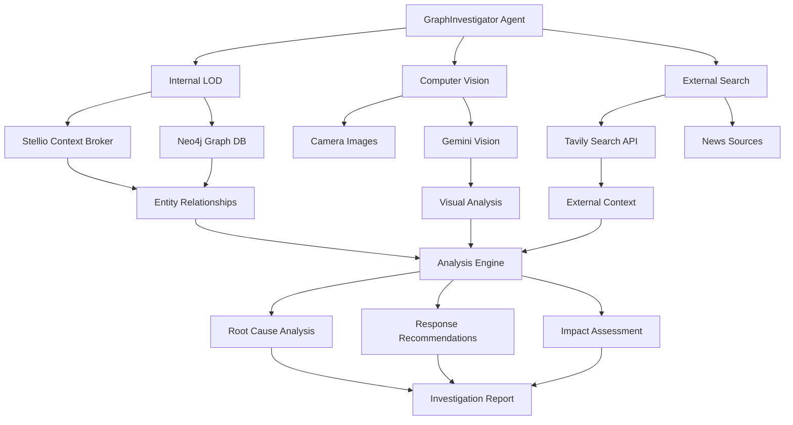

---
sidebar_label: 'GraphInvestigator'
title: 'GraphInvestigator Agent'
sidebar_position: 2
description: Multimodal incident analysis with GraphRAG and computer vision
---

{/*
============================================================================
UIP - Urban Intelligence Platform
Copyright (c) 2025 UIP Team. All rights reserved.
https://github.com/UIP-Urban-Intelligence-Platform/UIP-Urban_Intelligence_Platform

SPDX-License-Identifier: MIT
============================================================================
File: apps/traffic-web-app/frontend/docs/docs/backend/agents/GraphInvestigatorAgent.md
Module: Traffic Web App - GraphInvestigator Agent Documentation
Author: Nguyen Nhat Quang (Lead), Nguyen Viet Hoang, Nguyen Dinh Anh Tuan
Created: 2025-11-20
Version: 1.0.0
License: MIT

Description:
  GraphInvestigator Agent documentation for incident analysis with GraphRAG.
============================================================================
*/}

# GraphInvestigator Agent

Advanced AI agent combining GraphRAG (Graph Retrieval-Augmented Generation) with multimodal analysis for comprehensive traffic incident investigation.

## Overview

The GraphInvestigator integrates three intelligence sources:

1. **Internal LOD Data** (Stellio + Neo4j): Entity relationships and semantic context
2. **Computer Vision** (Gemini Flash 2.0): Visual hazard detection from camera streams
3. **External Intelligence** (Tavily Search API): Real-world news and context



## Core Capabilities

### 1. Internal LOD Data Analysis

- Entity relationships and semantic context from knowledge graph
- Real-time traffic patterns, weather, air quality correlations
- Historical incident database with similarity matching
- Graph traversal for multi-hop relationship discovery

### 2. Computer Vision (Gemini Flash 2.0)

- Visual hazard detection from camera streams
- Vehicle type identification and damage assessment
- Road condition analysis (wet, icy, debris)
- Multimodal reasoning with text + image inputs

### 3. External Intelligence (Tavily Search)

- Real-world news and social media context
- Weather alerts and road closure information
- Similar incident reports from other sources
- Event-related traffic impact

## API

### investigate

Perform comprehensive incident investigation.

```typescript
interface InvestigationRequest {
    accidentId: string;
    cameraIds?: string[];
    includeExternalContext?: boolean;
    analyzeCameraImages?: boolean;
}

interface InvestigationResponse {
    accidentDetails: RoadAccident;
    rootCause: {
        primary: string;
        contributing: string[];
        confidence: number;
    };
    responseTeams: {
        team: string;
        priority: 'high' | 'medium' | 'low';
        reason: string;
    }[];
    impactAssessment: {
        severity: string;
        affectedRoads: string[];
        estimatedDuration: number;  // minutes
        alternativeRoutes: string[];
    };
    correlations: {
        type: string;
        relatedEntities: string[];
        correlation: string;
    }[];
    visualAnalysis?: {
        hazardsDetected: string[];
        vehicleTypes: string[];
        roadCondition: string;
        confidence: number;
    };
    externalContext?: {
        newsArticles: { title: string; url: string }[];
        weatherAlerts: string[];
        relatedEvents: string[];
    };
    aiSummary: string;
}

const analysis = await agent.investigate(request);
```

### getRelatedAccidents

Find similar historical accidents using graph similarity.

```typescript
interface SimilarityRequest {
    accidentId: string;
    maxResults?: number;
    similarityThreshold?: number;
}

const related = await agent.getRelatedAccidents(request);
```

### analyzeCamera

Analyze camera image for hazards and incidents.

```typescript
interface CameraAnalysisRequest {
    cameraId: string;
    imageUrl?: string;
    analysisType: 'hazard' | 'traffic' | 'incident' | 'comprehensive';
}

const analysis = await agent.analyzeCamera(request);
```

## Response Team Recommendations

| Team | Use Case | Priority Criteria |
|------|----------|-------------------|
| Fire Department | Vehicle fire, hazmat spill | Immediate safety threat |
| Medical/EMS | Injuries reported | Casualty count > 0 |
| Police | Traffic control, investigation | All accidents |
| Cleanup Crew | Debris, fluid spill | Road obstruction |
| Tow Services | Disabled vehicles | Vehicle blocking traffic |
| Traffic Engineers | Signal malfunction | Infrastructure issue |

## Graph Queries

The agent uses Cypher queries for relationship discovery:

```cypher
// Find correlated accidents (same road segment, similar conditions)
MATCH (a:Accident)-[:OCCURRED_AT]->(loc:Location)
WHERE a.id = $accidentId
MATCH (similar:Accident)-[:OCCURRED_AT]->(loc2:Location)
WHERE distance(point(loc), point(loc2)) < 1000
  AND similar.timestamp > datetime() - duration('P7D')
RETURN similar, distance(point(loc), point(loc2)) as dist
ORDER BY dist
LIMIT 10
```

## Configuration

Located at `config/agents/graph-investigator.yaml`:

```yaml
agent:
  name: GraphInvestigator
  version: 3.0.0
  description: GraphRAG Incident Investigator

ai:
  visionModel: gemini-2.0-flash-exp
  textModel: gemini-1.5-flash
  temperature: 0.3
  maxTokens: 4000

search:
  provider: tavily
  maxResults: 10
  searchDepth: advanced

graph:
  maxHops: 3
  similarityThreshold: 0.7
```

## Dependencies

- `@google/generative-ai@^0.21.0`: Gemini AI SDK
- `neo4j-driver@^5.14`: Neo4j graph database client
- `axios@^1.6`: HTTP client for APIs

## Usage Example

```typescript
import { GraphInvestigatorAgent } from './agents/GraphInvestigatorAgent';

const agent = new GraphInvestigatorAgent();

const analysis = await agent.investigate({
    accidentId: 'urn:ngsi-ld:RoadAccident:001',
    cameraIds: ['Camera:001', 'Camera:002'],
    includeExternalContext: true,
    analyzeCameraImages: true
});

console.log('Root Cause:', analysis.rootCause.primary);
// "Wet road conditions combined with excessive speed"

console.log('Response Teams:', analysis.responseTeams);
// [{ team: 'Medical/EMS', priority: 'high', reason: '2 casualties reported' },
//  { team: 'Police', priority: 'high', reason: 'Traffic control needed' }]

console.log('Impact:', analysis.impactAssessment);
// { severity: 'severe', affectedRoads: ['Nguyen Hue', 'Le Loi'],
//   estimatedDuration: 45, alternativeRoutes: ['Hai Ba Trung'] }
```

## See Also

- [EcoTwin Agent](./EcoTwinAgent.md)
- [TrafficMaestro Agent](./TrafficMaestroAgent.md)
- [Neo4j Service](../services/neo4jService.md)
- [Accident Routes](../routes/accidentRoutes.md)
