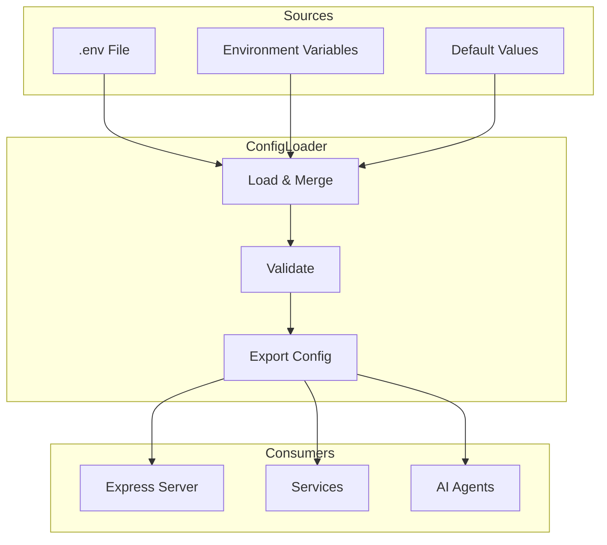

{/*
============================================================================
UIP - Urban Intelligence Platform
Copyright (c) 2025 UIP Team. All rights reserved.
https://github.com/UIP-Urban-Intelligence-Platform/UIP-Urban_Intelligence_Platform

SPDX-License-Identifier: MIT
============================================================================
File: apps/traffic-web-app/frontend/docs/docs/backend/config/configLoader.md
Module: Traffic Web App - Config Loader Documentation
Author: Nguyen Nhat Quang (Lead), Nguyen Viet Hoang, Nguyen Dinh Anh Tuan
Created: 2025-11-20
Version: 1.0.0
License: MIT

Description:
  Configuration loader documentation for environment and service settings.
============================================================================
*/}

# Config Loader

Configuration loader for **environment variables**, database connections, and external service settings with validation and defaults.

## Overview



## Configuration Interface

```typescript
// config/configLoader.ts
export interface Config {
  // Server
  server: {
    port: number;
    host: string;
    corsOrigins: string[];
    env: 'development' | 'production' | 'test';
  };
  
  // Stellio Context Broker
  stellio: {
    url: string;
    context: string;
    timeout: number;
  };
  
  // Neo4j Graph Database
  neo4j: {
    uri: string;
    user: string;
    password: string;
  };
  
  // Apache Jena Fuseki
  fuseki: {
    url: string;
    dataset: string;
  };
  
  // PostgreSQL / TimescaleDB
  postgres: {
    host: string;
    port: number;
    database: string;
    user: string;
    password: string;
    ssl: boolean;
  };
  
  // Google Gemini AI
  gemini: {
    apiKey: string;
    model: string;
    maxTokens: number;
  };
  
  // Tavily Search
  tavily: {
    apiKey: string;
    searchDepth: 'basic' | 'advanced';
  };
  
  // Cache
  cache: {
    enabled: boolean;
    ttl: number;
    maxSize: number;
  };
  
  // Logging
  logging: {
    level: string;
    format: 'json' | 'simple';
    dir: string;
  };
}
```

## Configuration Loading

```typescript
import dotenv from 'dotenv';
import path from 'path';

// Load .env file
dotenv.config({ path: path.resolve(__dirname, '../../.env') });

export function loadConfig(): Config {
  return {
    server: {
      port: parseInt(process.env.PORT || '5000'),
      host: process.env.HOST || '0.0.0.0',
      corsOrigins: (process.env.CORS_ORIGINS || '*').split(','),
      env: (process.env.NODE_ENV as any) || 'development'
    },
    
    stellio: {
      url: process.env.STELLIO_URL || 'http://localhost:8080',
      context: process.env.NGSI_LD_CONTEXT || 
        'https://uri.etsi.org/ngsi-ld/v1/ngsi-ld-core-context.jsonld',
      timeout: parseInt(process.env.STELLIO_TIMEOUT || '30000')
    },
    
    neo4j: {
      uri: process.env.NEO4J_URI || 'bolt://localhost:7687',
      user: process.env.NEO4J_USER || 'neo4j',
      password: process.env.NEO4J_PASSWORD || 'password'
    },
    
    fuseki: {
      url: process.env.FUSEKI_URL || 'http://localhost:3030',
      dataset: process.env.FUSEKI_DATASET || 'uip'
    },
    
    postgres: {
      host: process.env.PG_HOST || 'localhost',
      port: parseInt(process.env.PG_PORT || '5432'),
      database: process.env.PG_DATABASE || 'uip',
      user: process.env.PG_USER || 'postgres',
      password: process.env.PG_PASSWORD || 'password',
      ssl: process.env.PG_SSL === 'true'
    },
    
    gemini: {
      apiKey: process.env.GEMINI_API_KEY || '',
      model: process.env.GEMINI_MODEL || 'gemini-2.0-flash-exp',
      maxTokens: parseInt(process.env.GEMINI_MAX_TOKENS || '8192')
    },
    
    tavily: {
      apiKey: process.env.TAVILY_API_KEY || '',
      searchDepth: (process.env.TAVILY_DEPTH as any) || 'basic'
    },
    
    cache: {
      enabled: process.env.CACHE_ENABLED !== 'false',
      ttl: parseInt(process.env.CACHE_TTL || '300'),  // 5 minutes
      maxSize: parseInt(process.env.CACHE_MAX_SIZE || '1000')
    },
    
    logging: {
      level: process.env.LOG_LEVEL || 'info',
      format: (process.env.LOG_FORMAT as any) || 'json',
      dir: process.env.LOG_DIR || './logs'
    }
  };
}

// Export singleton config
export const config = loadConfig();
```

## Validation

```typescript
export function validateConfig(config: Config): void {
  const errors: string[] = [];
  
  // Required API keys
  if (!config.gemini.apiKey) {
    errors.push('GEMINI_API_KEY is required');
  }
  
  // Validate port range
  if (config.server.port < 1 || config.server.port > 65535) {
    errors.push('PORT must be between 1 and 65535');
  }
  
  // Validate URLs
  try {
    new URL(config.stellio.url);
  } catch {
    errors.push('STELLIO_URL is not a valid URL');
  }
  
  if (errors.length > 0) {
    throw new Error(`Configuration errors:\n${errors.join('\n')}`);
  }
}
```

## Environment File

```bash
# .env.example

# Server
PORT=5000
HOST=0.0.0.0
NODE_ENV=development
CORS_ORIGINS=http://localhost:3000

# Stellio Context Broker
STELLIO_URL=http://localhost:8080
NGSI_LD_CONTEXT=https://uri.etsi.org/ngsi-ld/v1/ngsi-ld-core-context.jsonld
STELLIO_TIMEOUT=30000

# Neo4j
NEO4J_URI=bolt://localhost:7687
NEO4J_USER=neo4j
NEO4J_PASSWORD=your-password

# Fuseki
FUSEKI_URL=http://localhost:3030
FUSEKI_DATASET=uip

# PostgreSQL / TimescaleDB
PG_HOST=localhost
PG_PORT=5432
PG_DATABASE=uip
PG_USER=postgres
PG_PASSWORD=your-password
PG_SSL=false

# Google Gemini AI
GEMINI_API_KEY=your-gemini-key
GEMINI_MODEL=gemini-2.0-flash-exp
GEMINI_MAX_TOKENS=8192

# Tavily Search
TAVILY_API_KEY=your-tavily-key
TAVILY_DEPTH=basic

# Cache
CACHE_ENABLED=true
CACHE_TTL=300
CACHE_MAX_SIZE=1000

# Logging
LOG_LEVEL=info
LOG_FORMAT=json
LOG_DIR=./logs
```

## Usage

```typescript
import { config } from './config/configLoader';

// In server.ts
app.listen(config.server.port, config.server.host, () => {
  logger.info(`Server started on ${config.server.host}:${config.server.port}`);
});

// In services
const driver = neo4j.driver(
  config.neo4j.uri,
  neo4j.auth.basic(config.neo4j.user, config.neo4j.password)
);

// In agents
const genAI = new GoogleGenerativeAI(config.gemini.apiKey);
const model = genAI.getGenerativeModel({ model: config.gemini.model });
```

## Related Documentation

- [Backend Overview](../overview.md) - Server architecture
- [Services](../services/stellioService.md) - Service configuration
- [AI Agents](../agents/EcoTwinAgent.md) - Agent configuration

## References

- [dotenv](https://github.com/motdotla/dotenv)
- [12-Factor App Config](https://12factor.net/config)
