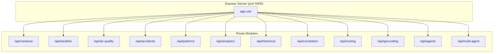
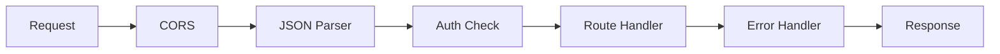

{/*
============================================================================
UIP - Urban Intelligence Platform
Copyright (c) 2025 UIP Team. All rights reserved.
https://github.com/UIP-Urban-Intelligence-Platform/UIP-Urban_Intelligence_Platform

SPDX-License-Identifier: MIT
============================================================================
File: apps/traffic-web-app/frontend/docs/docs/backend/routes/overview.md
Module: Traffic Web App - API Routes Overview Documentation
Author: Nguyen Nhat Quang (Lead), Nguyen Viet Hoang, Nguyen Dinh Anh Tuan
Created: 2025-11-20
Version: 1.0.0
License: MIT

Description:
  API Routes overview documentation for UIP Traffic Backend.
============================================================================
*/}

# API Routes Overview

Complete overview of all **12 API route modules** in the UIP Traffic Backend. All routes are prefixed with `/api` and follow RESTful conventions.

## Route Architecture



## Route Summary

| Route Module | Base Path | Description | Methods |
|--------------|-----------|-------------|---------|
| [Camera](./camera.md) | `/api/cameras` | Traffic cameras & images | GET |
| [Weather](./weather.md) | `/api/weather` | Weather observations | GET |
| [Air Quality](./airQuality.md) | `/api/air-quality` | AQI sensors & readings | GET |
| [Accident](./accident.md) | `/api/accidents` | Traffic accidents | GET |
| [Pattern](./pattern.md) | `/api/patterns` | Traffic congestion patterns | GET |
| [Analytics](./analytics.md) | `/api/analytics` | Statistical analysis | GET |
| [Historical](./historical.md) | `/api/historical` | Time-series data | GET |
| [Correlation](./correlation.md) | `/api/correlation` | Entity correlations | GET |
| [Routing](./routing.md) | `/api/routing` | Navigation & directions | GET |
| [Geocoding](./geocoding.md) | `/api/geocoding` | Address/coordinate lookup | GET |
| [Agent](./agent.md) | `/api/agents` | AI agent interactions | POST |
| [Multi-Agent](./multiAgent.md) | `/api/multi-agent` | Coordinated AI agents | POST |

## Common Query Parameters

### Pagination

| Parameter | Type | Default | Description |
|-----------|------|---------|-------------|
| `limit` | number | 100 | Maximum results |
| `offset` | number | 0 | Skip N results |
| `page` | number | 1 | Page number |
| `pageSize` | number | 20 | Results per page |

### Geo-Spatial

| Parameter | Type | Description |
|-----------|------|-------------|
| `lat` | number | Latitude (WGS84) |
| `lon` | number | Longitude (WGS84) |
| `maxDistance` | number | Search radius in meters |
| `bbox` | string | Bounding box: `minLat,minLon,maxLat,maxLon` |
| `geometry` | object | GeoJSON geometry |
| `georel` | string | NGSI-LD geo-relation |

### Time-Based

| Parameter | Type | Description |
|-----------|------|-------------|
| `from` | string | Start date (ISO 8601) |
| `to` | string | End date (ISO 8601) |
| `timerel` | string | Temporal relation (before/after/between) |
| `interval` | string | Aggregation interval (hour/day/week) |

## Common Response Format

### Success Response

```json
{
  "success": true,
  "data": [...],
  "meta": {
    "total": 150,
    "limit": 100,
    "offset": 0,
    "timestamp": "2025-11-29T10:30:00.000Z"
  }
}
```

### Error Response

```json
{
  "success": false,
  "error": {
    "code": "VALIDATION_ERROR",
    "message": "Invalid latitude value",
    "details": {
      "field": "lat",
      "received": "abc",
      "expected": "number between -90 and 90"
    }
  }
}
```

## Entity Type Mapping

| API Endpoint | NGSI-LD Entity Type | Source |
|--------------|---------------------|--------|
| `/cameras` | Camera, TrafficFlowObserved | Stellio |
| `/weather` | WeatherObserved | Stellio |
| `/air-quality` | AirQualityObserved | Stellio |
| `/accidents` | RoadAccident | Stellio, Neo4j |
| `/patterns` | TrafficFlowObserved | Stellio, Fuseki |

## Route Registration

```typescript
// server.ts
import cameraRoutes from './routes/cameraRoutes';
import weatherRoutes from './routes/weatherRoutes';
import airQualityRoutes from './routes/airQualityRoutes';
import accidentRoutes from './routes/accidentRoutes';
import patternRoutes from './routes/patternRoutes';
import analyticsRoutes from './routes/analyticsRoutes';
import historicalRoutes from './routes/historicalRoutes';
import correlationRoutes from './routes/correlationRoutes';
import routingRoutes from './routes/routingRoutes';
import geocodingRoutes from './routes/geocodingRoutes';
import agentRoutes from './routes/agentRoutes';
import multiAgentRoutes from './routes/multiAgentRoutes';

app.use('/api/cameras', cameraRoutes);
app.use('/api/weather', weatherRoutes);
app.use('/api/air-quality', airQualityRoutes);
app.use('/api/accidents', accidentRoutes);
app.use('/api/patterns', patternRoutes);
app.use('/api/analytics', analyticsRoutes);
app.use('/api/historical', historicalRoutes);
app.use('/api/correlation', correlationRoutes);
app.use('/api/routing', routingRoutes);
app.use('/api/geocoding', geocodingRoutes);
app.use('/api/agents', agentRoutes);
app.use('/api/multi-agent', multiAgentRoutes);
```

## API Categories

### Data Retrieval APIs

Routes that query NGSI-LD entities from Stellio and transform them:

- **Camera Routes**: Traffic camera images, status, metrics
- **Weather Routes**: Temperature, humidity, precipitation
- **Air Quality Routes**: PM2.5, PM10, AQI readings
- **Accident Routes**: Incident locations, severity, status
- **Pattern Routes**: Congestion zones, traffic flow

### Analytics APIs

Routes that perform calculations and aggregations:

- **Analytics Routes**: Statistics, summaries, dashboards
- **Historical Routes**: Time-series queries, trends
- **Correlation Routes**: Entity relationships, causation analysis

### Navigation APIs

Routes for location services:

- **Routing Routes**: Turn-by-turn directions (OSRM)
- **Geocoding Routes**: Address ↔ coordinates (Nominatim)

### AI Agent APIs

Routes for intelligent agent interactions:

- **Agent Routes**: Individual agent endpoints (EcoTwin, etc.)
- **Multi-Agent Routes**: Coordinated multi-agent analysis

## Middleware Stack



Applied middleware in order:

1. **CORS**: Cross-origin resource sharing
2. **JSON Parser**: `express.json()` body parsing
3. **Request Logger**: Winston logging
4. **Route Handler**: Business logic
5. **Error Handler**: Centralized error handling

## Error Codes

| Code | Status | Description |
|------|--------|-------------|
| `VALIDATION_ERROR` | 400 | Invalid request parameters |
| `NOT_FOUND` | 404 | Entity not found |
| `SERVICE_UNAVAILABLE` | 503 | External service down |
| `INTERNAL_ERROR` | 500 | Unexpected server error |
| `RATE_LIMITED` | 429 | Too many requests |

## Testing Endpoints

### Health Check

```bash
curl http://localhost:5000/api/health
```

```json
{
  "status": "ok",
  "timestamp": "2025-11-29T10:30:00.000Z",
  "services": {
    "stellio": "connected",
    "neo4j": "connected",
    "fuseki": "connected"
  }
}
```

### Get All Cameras

```bash
curl http://localhost:5000/api/cameras?limit=10
```

### Get Nearby Cameras

```bash
curl "http://localhost:5000/api/cameras/near?lat=10.77&lon=106.70&maxDistance=5000"
```

### AI Agent Query

```bash
curl -X POST http://localhost:5000/api/agents/eco-twin/advice \
  -H "Content-Type: application/json" \
  -d '{
    "message": "Is it safe to exercise outdoors?",
    "location": { "lat": 10.77, "lng": 106.70 }
  }'
```

## Rate Limiting

| Endpoint Category | Limit | Window |
|-------------------|-------|--------|
| Data APIs | 100 req/min | 1 minute |
| Analytics APIs | 30 req/min | 1 minute |
| AI Agent APIs | 10 req/min | 1 minute |

## Related Documentation

- [Backend Overview](../overview.md) - Server architecture
- [Services](../services/stellioService.md) - Data layer
- [Error Handler](../middlewares/errorHandler.md) - Error handling

## References

- [Express.js Routing](https://expressjs.com/en/guide/routing.html)
- [NGSI-LD Specification](https://www.etsi.org/deliver/etsi_gs/CIM/001_099/009/01.06.01_60/gs_cim009v010601p.pdf)
