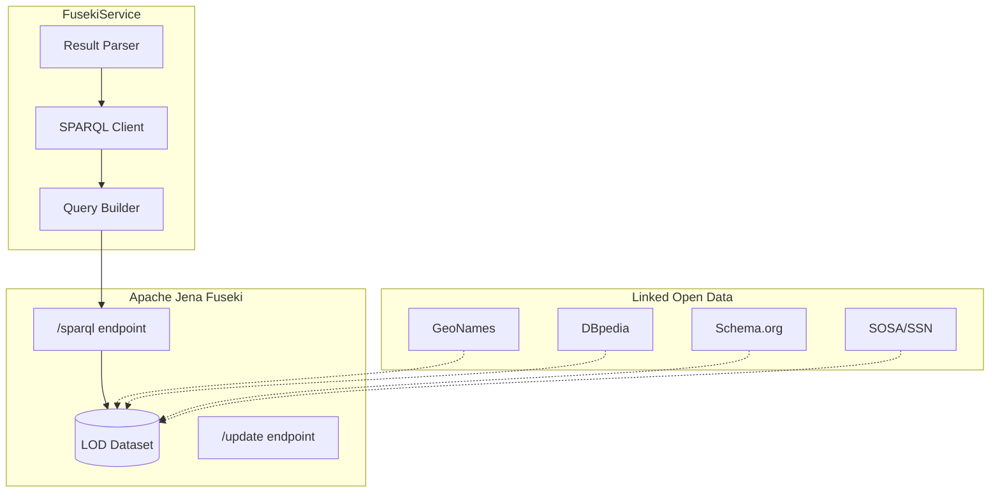
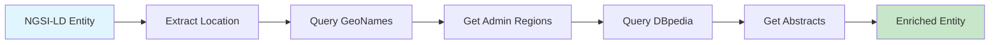

{/*
============================================================================
UIP - Urban Intelligence Platform
Copyright (c) 2025 UIP Team. All rights reserved.
https://github.com/UIP-Urban-Intelligence-Platform/UIP-Urban_Intelligence_Platform

SPDX-License-Identifier: MIT
============================================================================
File: apps/traffic-web-app/frontend/docs/docs/backend/services/fusekiService.md
Module: Traffic Web App - FusekiService Documentation
Author: Nguyen Nhat Quang (Lead), Nguyen Viet Hoang, Nguyen Dinh Anh Tuan
Created: 2025-11-20
Version: 1.0.0
License: MIT

Description:
  FusekiService documentation for SPARQL triplestore client.
============================================================================
*/}

# FusekiService - SPARQL Triplestore Client

TypeScript client for **Apache Jena Fuseki** RDF triplestore providing SPARQL query execution, LOD linkset enrichment, and semantic data integration.

## Overview



## Features

| Feature | Description |
|---------|-------------|
| **SPARQL 1.1** | SELECT, CONSTRUCT, ASK, DESCRIBE queries |
| **GeoNames Integration** | City/district geographic metadata |
| **DBpedia Links** | Entity definitions and multilingual labels |
| **Federated Queries** | Cross-endpoint SPARQL queries |
| **RDF Serialization** | Turtle, JSON-LD, N-Triples |
| **Pagination** | LIMIT/OFFSET for large result sets |

## Class Definition

```typescript
import ParsingClient from 'sparql-http-client/ParsingClient';

export class FusekiService {
  private client: ParsingClient;
  private endpointUrl: string;

  constructor();
  
  // Traffic Queries
  queryTrafficPatterns(): Promise<TrafficPattern[]>;
  queryRoadSegments(): Promise<RoadSegment[]>;
  queryHistoricalData(roadSegment: string, days?: number): Promise<HistoricalData[]>;
  
  // LOD Enrichment
  getEnrichedCameraEntity(id: string): Promise<EnrichedEntity>;
  queryGeoNamesLocation(lat: number, lon: number): Promise<GeoNamesData>;
  queryDBpediaAbstract(entityType: string): Promise<string>;
  
  // Generic SPARQL
  executeSelect(query: string): Promise<any[]>;
  executeConstruct(query: string): Promise<any>;
  executeAsk(query: string): Promise<boolean>;
}
```

## Configuration

```typescript
// Environment Variables
const config = {
  FUSEKI_URL: 'http://localhost:3030',
  FUSEKI_DATASET: 'lod-dataset',
  FUSEKI_USER: 'admin',
  FUSEKI_PASSWORD: 'test_admin'
};

// Endpoint URL construction
const endpointUrl = `${FUSEKI_URL}/${FUSEKI_DATASET}/sparql`;
// Example: http://localhost:3030/lod-dataset/sparql
```

## Usage Examples

### Traffic Pattern Queries

```typescript
import { FusekiService } from './services/fusekiService';

const fuseki = new FusekiService();

// Query current traffic patterns
const patterns = await fuseki.queryTrafficPatterns();
patterns.forEach(pattern => {
  console.log(`${pattern.roadSegment}: ${pattern.congestionLevel}`);
  console.log(`Speed: ${pattern.averageSpeed} km/h`);
  console.log(`Vehicles: ${pattern.vehicleCount}`);
});
```

### Historical Data Analysis

```typescript
// Get 7-day historical data for a road segment
const history = await fuseki.queryHistoricalData(
  'urn:ngsi-ld:RoadSegment:nguyen-hue',
  7
);

history.forEach(record => {
  console.log(`${record.date}: ${record.averageSpeed} km/h`);
});
```

### Road Segment Discovery

```typescript
// Get all road segments
const segments = await fuseki.queryRoadSegments();
segments.forEach(segment => {
  console.log(`${segment.name}: ${segment.id}`);
  console.log(`Start: ${segment.startPoint.latitude}, ${segment.startPoint.longitude}`);
  console.log(`End: ${segment.endPoint.latitude}, ${segment.endPoint.longitude}`);
});
```

## SPARQL Query Examples

### Traffic Patterns Query

```sparql
PREFIX traffic: <http://traffic.hcmc.vn/ontology#>
PREFIX geo: <http://www.w3.org/2003/01/geo/wgs84_pos#>
PREFIX xsd: <http://www.w3.org/2001/XMLSchema#>

SELECT ?pattern ?roadSegment ?avgSpeed ?vehicleCount ?congestion ?lat ?lon ?timestamp
WHERE {
  ?pattern a traffic:TrafficPattern ;
           traffic:roadSegment ?roadSegment ;
           traffic:averageSpeed ?avgSpeed ;
           traffic:vehicleCount ?vehicleCount ;
           traffic:congestionLevel ?congestion ;
           geo:lat ?lat ;
           geo:long ?lon ;
           traffic:timestamp ?timestamp .
}
ORDER BY DESC(?timestamp)
LIMIT 100
```

### Road Segments Query

```sparql
PREFIX traffic: <http://traffic.hcmc.vn/ontology#>
PREFIX geo: <http://www.w3.org/2003/01/geo/wgs84_pos#>

SELECT ?segment ?name ?startLat ?startLon ?endLat ?endLon
WHERE {
  ?segment a traffic:RoadSegment ;
           traffic:name ?name ;
           traffic:startPoint ?start ;
           traffic:endPoint ?end .
  ?start geo:lat ?startLat ;
         geo:long ?startLon .
  ?end geo:lat ?endLat ;
       geo:long ?endLon .
}
```

### Historical Data Query

```sparql
PREFIX traffic: <http://traffic.hcmc.vn/ontology#>
PREFIX xsd: <http://www.w3.org/2001/XMLSchema#>

SELECT ?date ?avgSpeed ?vehicleCount
WHERE {
  ?observation a traffic:TrafficObservation ;
               traffic:roadSegment "urn:ngsi-ld:RoadSegment:001" ;
               traffic:date ?date ;
               traffic:averageSpeed ?avgSpeed ;
               traffic:vehicleCount ?vehicleCount .
  FILTER(?date >= "2025-11-20T00:00:00Z"^^xsd:dateTime)
}
ORDER BY ?date
```

### GeoNames Federation

```sparql
PREFIX gn: <http://www.geonames.org/ontology#>

SELECT ?name ?population ?country
WHERE {
  SERVICE <http://factforge.net/sparql> {
    ?city gn:name ?name ;
          gn:population ?population ;
          gn:countryCode "VN" .
    FILTER(?population > 100000)
  }
}
```

### DBpedia Enrichment

```sparql
PREFIX dbo: <http://dbpedia.org/ontology/>
PREFIX rdfs: <http://www.w3.org/2000/01/rdf-schema#>

SELECT ?abstract ?label
WHERE {
  SERVICE <http://dbpedia.org/sparql> {
    <http://dbpedia.org/resource/Ho_Chi_Minh_City> 
      dbo:abstract ?abstract ;
      rdfs:label ?label .
    FILTER(lang(?abstract) = "en")
    FILTER(lang(?label) = "en")
  }
}
```

## LOD Enrichment Pipeline



### Enriched Entity Example

```json
{
  "id": "urn:ngsi-ld:Camera:001",
  "type": "Camera",
  "name": "Camera Nguyen Hue",
  "location": {
    "latitude": 10.7731,
    "longitude": 106.7030
  },
  "enrichment": {
    "geonames": {
      "adminLevel1": "Ho Chi Minh City",
      "adminLevel2": "District 1",
      "featureClass": "P",
      "population": 8993082
    },
    "dbpedia": {
      "abstract": "Ho Chi Minh City is the largest city in Vietnam...",
      "wikiLink": "https://en.wikipedia.org/wiki/Ho_Chi_Minh_City"
    }
  }
}
```

## Ontology Namespaces

| Prefix | Namespace | Description |
|--------|-----------|-------------|
| `traffic` | `http://traffic.hcmc.vn/ontology#` | UIP Traffic Ontology |
| `geo` | `http://www.w3.org/2003/01/geo/wgs84_pos#` | WGS84 Geo Positioning |
| `sosa` | `http://www.w3.org/ns/sosa/` | Sensor Observation |
| `ssn` | `http://www.w3.org/ns/ssn/` | Semantic Sensor Network |
| `schema` | `http://schema.org/` | Schema.org Vocabulary |
| `gn` | `http://www.geonames.org/ontology#` | GeoNames Ontology |
| `dbo` | `http://dbpedia.org/ontology/` | DBpedia Ontology |

## Error Handling

```typescript
async queryTrafficPatterns(): Promise<TrafficPattern[]> {
  try {
    const stream = await this.client.query.select(query);
    const results: TrafficPattern[] = [];

    for await (const row of stream) {
      results.push(this.mapTrafficPattern(row));
    }

    return results;
  } catch (error) {
    logger.error('SPARQL query failed:', error);
    throw new Error('Failed to query traffic patterns from Fuseki');
  }
}
```

## Performance Considerations

| Aspect | Recommendation |
|--------|----------------|
| **Query Complexity** | Use LIMIT for large result sets |
| **Federated Queries** | Cache external endpoint results |
| **Indexes** | Configure Fuseki TDB2 indexes |
| **Timeouts** | Set query timeout in Fuseki config |

### Fuseki Configuration

```ttl
# fuseki-config.ttl
:service a fuseki:Service ;
    fuseki:name "lod-dataset" ;
    fuseki:endpoint [
        fuseki:operation fuseki:query ;
        fuseki:name "sparql" ;
        ja:context [
            ja:cxtName "arq:queryTimeout" ;
            ja:cxtValue "30000"  # 30s timeout
        ]
    ] .
```

## Related Documentation

- [StellioService](./stellioService.md) - NGSI-LD entity source
- [EcoTwinAgent](../agents/EcoTwinAgent.md) - Uses LOD for environmental context
- [Pattern Routes](../routes/pattern.md) - Traffic pattern API

## References

- [Apache Jena Fuseki](https://jena.apache.org/documentation/fuseki2/)
- [SPARQL 1.1 Query Language](https://www.w3.org/TR/sparql11-query/)
- [GeoNames Ontology](https://www.geonames.org/ontology/documentation.html)
- [DBpedia](https://www.dbpedia.org/)
- [SOSA/SSN Ontology](https://www.w3.org/TR/vocab-ssn/)
