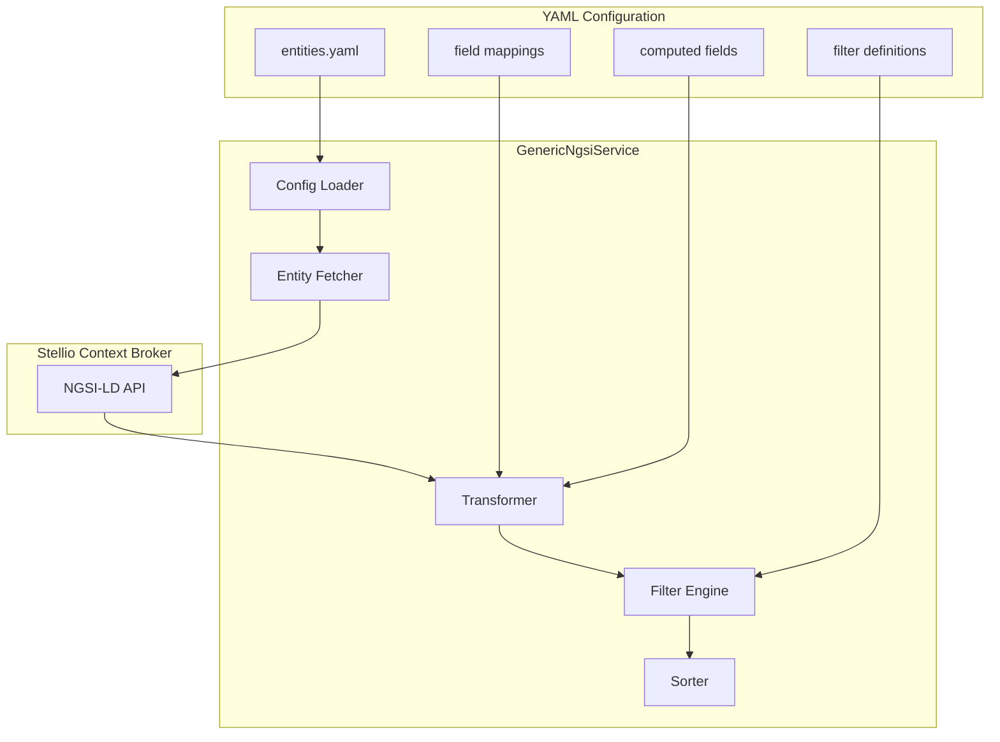
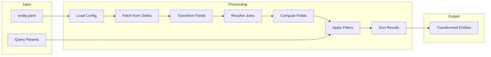
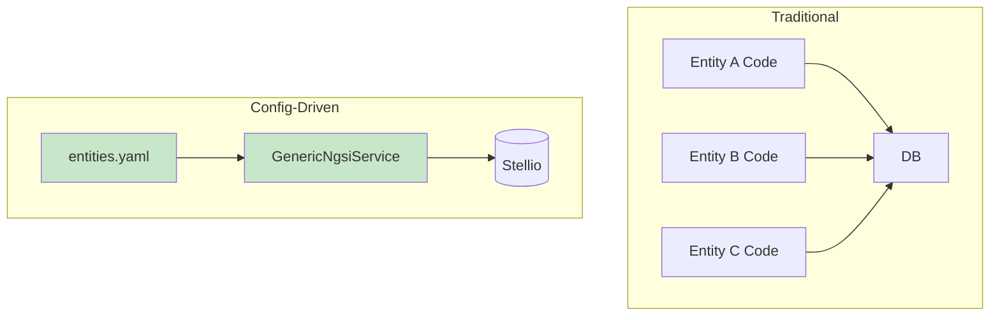

{/*
============================================================================
UIP - Urban Intelligence Platform
Copyright (c) 2025 UIP Team. All rights reserved.
https://github.com/UIP-Urban-Intelligence-Platform/UIP-Urban_Intelligence_Platform

SPDX-License-Identifier: MIT
============================================================================
File: apps/traffic-web-app/frontend/docs/docs/backend/services/genericNgsiService.md
Module: Traffic Web App - GenericNgsiService Documentation
Author: Nguyen Nhat Quang (Lead), Nguyen Viet Hoang, Nguyen Dinh Anh Tuan
Created: 2025-11-20
Version: 1.0.0
License: MIT

Description:
  GenericNgsiService documentation for config-driven NGSI-LD service.
============================================================================
*/}

# GenericNgsiService - Config-Driven Architecture

**100% config-driven** NGSI-LD service that works with **any entity type** defined in YAML configuration files. Zero hardcoded domain logic - all behavior driven by configuration.

## Overview



## Features

| Feature | Description |
|---------|-------------|
| **Config-Driven** | All entity types defined in YAML |
| **Dynamic Mapping** | ngsiPath field extraction |
| **Alternative Paths** | Fallback property resolution |
| **Type Transformations** | GeoJSON, coordinates, dates, numbers |
| **Computed Fields** | Expression evaluation |
| **Entity Joins** | Relationship resolution |
| **Zero Hardcoding** | Add entities without code changes |

## Architecture



## Class Definition

```typescript
import axios, { AxiosInstance } from 'axios';
import { configLoader, EntityConfig, FieldConfig } from '../config/configLoader';

export class GenericNgsiService {
  private stellioBaseUrl: string;
  private cameraCache: Map<string, any>;
  private axiosClient: AxiosInstance;

  constructor();
  
  // Entity Operations
  fetchEntities(entityName: string, queryParams?: Record<string, any>): Promise<any[]>;
  fetchEntityById(entityName: string, id: string): Promise<any | null>;
  
  // Transformation
  private transformEntity(entity: any, config: EntityConfig): Promise<any>;
  private extractValue(entity: any, field: FieldConfig): any;
  private resolveAlternativePaths(entity: any, paths: string[]): any;
  
  // Joins
  private resolveJoins(entity: any, config: EntityConfig): Promise<any>;
  
  // Computed Fields
  private computeFields(entity: any, config: EntityConfig): any;
  
  // Filtering & Sorting
  private applyFilters(entities: any[], config: EntityConfig, params: Record<string, any>): any[];
  private applySorting(entities: any[], config: EntityConfig): any[];
}
```

## YAML Configuration Schema

### Entity Configuration

```yaml
# config/entities.yaml
entities:
  Camera:
    entityType: "Camera"
    description: "Traffic monitoring camera"
    
    fields:
      - name: id
        ngsiPath: "id"
        type: string
        required: true
        
      - name: name
        ngsiPath: "name.value"
        alternativePaths:
          - "https://uri.etsi.org/ngsi-ld/name"
          - "name"
        type: string
        default: "Unknown Camera"
        
      - name: location
        ngsiPath: "location.value"
        type: geojson
        transform: coordinates
        
      - name: imageUrl
        ngsiPath: "image.value"
        alternativePaths:
          - "cameraImage.value"
          - "streamUrl.value"
        type: string
        
      - name: status
        ngsiPath: "status.value"
        type: string
        default: "unknown"
        enum: ["active", "inactive", "maintenance", "unknown"]
        
      - name: dateModified
        ngsiPath: "dateModified"
        alternativePaths:
          - "modifiedAt"
        type: datetime
        
    computed:
      - name: isActive
        expression: "status === 'active'"
        type: boolean
        
      - name: displayName
        expression: "name || `Camera ${id.split(':').pop()}`"
        type: string
        
    joins:
      - name: roadSegment
        relationshipPath: "refRoadSegment.object"
        targetEntity: "RoadSegment"
        
    filters:
      - name: status
        field: status
        operator: eq
        
      - name: active
        field: isActive
        operator: eq
        transform: boolean
        
    sorting:
      - field: dateModified
        order: desc
```

### Multiple Entity Types

```yaml
entities:
  Camera:
    # ... camera config
    
  Weather:
    entityType: "WeatherObserved"
    fields:
      - name: temperature
        ngsiPath: "temperature.value"
        type: number
        unit: "°C"
        
      - name: humidity
        ngsiPath: "relativeHumidity.value"
        type: number
        unit: "%"
        
      - name: observedAt
        ngsiPath: "dateObserved.value"
        type: datetime
        
  AirQuality:
    entityType: "AirQualityObserved"
    fields:
      - name: pm25
        ngsiPath: "PM25.value"
        alternativePaths:
          - "pm2_5.value"
        type: number
        
      - name: aqi
        ngsiPath: "airQualityIndex.value"
        type: number
        
    computed:
      - name: category
        expression: |
          aqi <= 50 ? 'Good' :
          aqi <= 100 ? 'Moderate' :
          aqi <= 150 ? 'Unhealthy for Sensitive' :
          aqi <= 200 ? 'Unhealthy' :
          aqi <= 300 ? 'Very Unhealthy' : 'Hazardous'
        type: string
```

## Usage Examples

### Basic Entity Fetching

```typescript
import { GenericNgsiService } from './services/genericNgsiService';

const service = new GenericNgsiService();

// Fetch cameras (driven by Camera config in YAML)
const cameras = await service.fetchEntities('Camera', { limit: 100 });

// Fetch weather (driven by Weather config in YAML)
const weather = await service.fetchEntities('Weather');

// Fetch air quality
const airQuality = await service.fetchEntities('AirQuality');
```

### Filtered Queries

```typescript
// Filter by status
const activeCameras = await service.fetchEntities('Camera', {
  status: 'active'
});

// Filter by location
const nearbyCameras = await service.fetchEntities('Camera', {
  near: '10.77,106.70',
  radius: 5000
});

// Multiple filters
const filtered = await service.fetchEntities('AirQuality', {
  aqi: { gt: 100 },
  category: 'Unhealthy'
});
```

### Single Entity

```typescript
// Get by ID
const camera = await service.fetchEntityById(
  'Camera',
  'urn:ngsi-ld:Camera:001'
);

if (camera) {
  console.log(camera.name);
  console.log(camera.isActive);  // Computed field
}
```

## Field Transformation

### ngsiPath Extraction

```typescript
private extractValue(entity: any, field: FieldConfig): any {
  // Try primary path
  let value = this.getNestedValue(entity, field.ngsiPath);
  
  // Try alternative paths if primary fails
  if (value === undefined && field.alternativePaths) {
    for (const altPath of field.alternativePaths) {
      value = this.getNestedValue(entity, altPath);
      if (value !== undefined) break;
    }
  }
  
  // Apply default if still undefined
  if (value === undefined && field.default !== undefined) {
    value = field.default;
  }
  
  // Apply type transformation
  return this.transformValue(value, field.type);
}

private getNestedValue(obj: any, path: string): any {
  return path.split('.').reduce((current, key) => 
    current?.[key], obj
  );
}
```

### Type Transformations

| Type | Input | Output |
|------|-------|--------|
| `string` | Any | String value |
| `number` | String/Number | Number |
| `boolean` | String/Boolean | Boolean |
| `datetime` | ISO string | Date object |
| `geojson` | GeoJSON object | `{ latitude, longitude }` |
| `coordinates` | [lon, lat] array | `{ latitude, longitude }` |

```typescript
private transformValue(value: any, type: string): any {
  switch (type) {
    case 'number':
      return parseFloat(value);
      
    case 'boolean':
      return value === true || value === 'true';
      
    case 'datetime':
      return new Date(value);
      
    case 'geojson':
    case 'coordinates':
      if (value?.type === 'Point') {
        return {
          latitude: value.coordinates[1],
          longitude: value.coordinates[0]
        };
      }
      return value;
      
    default:
      return value;
  }
}
```

## Computed Fields

```typescript
private computeFields(entity: any, config: EntityConfig): any {
  if (!config.computed) return entity;
  
  for (const computed of config.computed) {
    try {
      // Create evaluation context with entity fields
      const context = { ...entity };
      
      // Evaluate expression
      const fn = new Function(...Object.keys(context), `return ${computed.expression}`);
      entity[computed.name] = fn(...Object.values(context));
    } catch (error) {
      logger.warn(`Failed to compute ${computed.name}:`, error);
      entity[computed.name] = null;
    }
  }
  
  return entity;
}
```

### Expression Examples

```yaml
computed:
  # Simple boolean
  - name: isActive
    expression: "status === 'active'"
    
  # Conditional
  - name: severity
    expression: "casualties > 5 ? 'critical' : casualties > 0 ? 'serious' : 'minor'"
    
  # String manipulation
  - name: shortId
    expression: "id.split(':').pop()"
    
  # Numeric calculation
  - name: speedPercentile
    expression: "Math.round((avgSpeed / 60) * 100)"
    
  # AQI category
  - name: aqiCategory
    expression: |
      aqi <= 50 ? 'Good' :
      aqi <= 100 ? 'Moderate' :
      aqi <= 150 ? 'USG' : 'Unhealthy'
```

## Entity Joins

```typescript
private async resolveJoins(entity: any, config: EntityConfig): Promise<any> {
  if (!config.joins) return entity;
  
  for (const join of config.joins) {
    const relationshipId = this.getNestedValue(entity, join.relationshipPath);
    
    if (relationshipId) {
      try {
        // Fetch related entity
        const related = await this.fetchEntityById(join.targetEntity, relationshipId);
        entity[join.name] = related;
      } catch (error) {
        logger.warn(`Failed to resolve join ${join.name}:`, error);
        entity[join.name] = null;
      }
    }
  }
  
  return entity;
}
```

## Benefits of Config-Driven Architecture



| Aspect | Traditional | Config-Driven |
|--------|-------------|---------------|
| Add new entity | Write new service | Add YAML config |
| Change field mapping | Modify code | Edit YAML |
| Deployment | Rebuild & redeploy | Restart service |
| Consistency | Varies per entity | Guaranteed |
| Testing | Per-entity tests | Generic tests |

## Configuration Loading

```typescript
// config/configLoader.ts
import yaml from 'js-yaml';
import fs from 'fs';

export interface EntityConfig {
  entityType: string;
  description?: string;
  fields: FieldConfig[];
  computed?: ComputationConfig[];
  joins?: JoinConfig[];
  filters?: FilterConfig[];
  sorting?: SortConfig[];
}

export interface FieldConfig {
  name: string;
  ngsiPath: string;
  alternativePaths?: string[];
  type: string;
  required?: boolean;
  default?: any;
  enum?: string[];
}

export class ConfigLoader {
  private config: any;
  
  load(): any {
    const configPath = process.env.CONFIG_PATH || './config/entities.yaml';
    const content = fs.readFileSync(configPath, 'utf8');
    this.config = yaml.load(content);
    return this.config;
  }
  
  getEntityConfig(entityName: string): EntityConfig | undefined {
    return this.config.entities[entityName];
  }
}

export const configLoader = new ConfigLoader();
```

## Error Handling

```typescript
public async fetchEntities(entityName: string, queryParams?: Record<string, any>): Promise<any[]> {
  const entityConfig = configLoader.getEntityConfig(entityName);

  if (!entityConfig) {
    throw new Error(`Entity configuration not found: ${entityName}`);
  }

  try {
    const response = await this.axiosClient.get(stellioUrl, {
      headers: {
        'Accept': 'application/ld+json',
        'Link': '<https://uri.etsi.org/ngsi-ld/v1/ngsi-ld-core-context.jsonld>; rel="http://www.w3.org/ns/json-ld#context"; type="application/ld+json"'
      }
    });

    // Transform and filter...
  } catch (error) {
    if (axios.isAxiosError(error)) {
      logger.error(`Stellio request failed for ${entityName}: ${error.message}`);
      throw new Error(`Failed to fetch ${entityName} entities`);
    }
    throw error;
  }
}
```

## Related Documentation

- [StellioService](./stellioService.md) - Low-level NGSI-LD client
- [Config Loader](../config/configLoader.md) - YAML configuration loading
- [Backend Overview](../overview.md) - Architecture overview

## References

- [NGSI-LD Specification](https://www.etsi.org/deliver/etsi_gs/CIM/001_099/009/01.06.01_60/gs_cim009v010601p.pdf)
- [YAML Specification](https://yaml.org/spec/1.2.2/)
- [js-yaml Library](https://github.com/nodeca/js-yaml)
