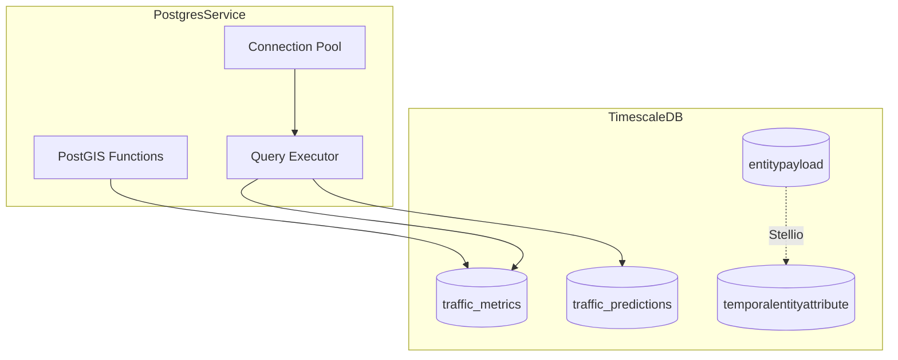
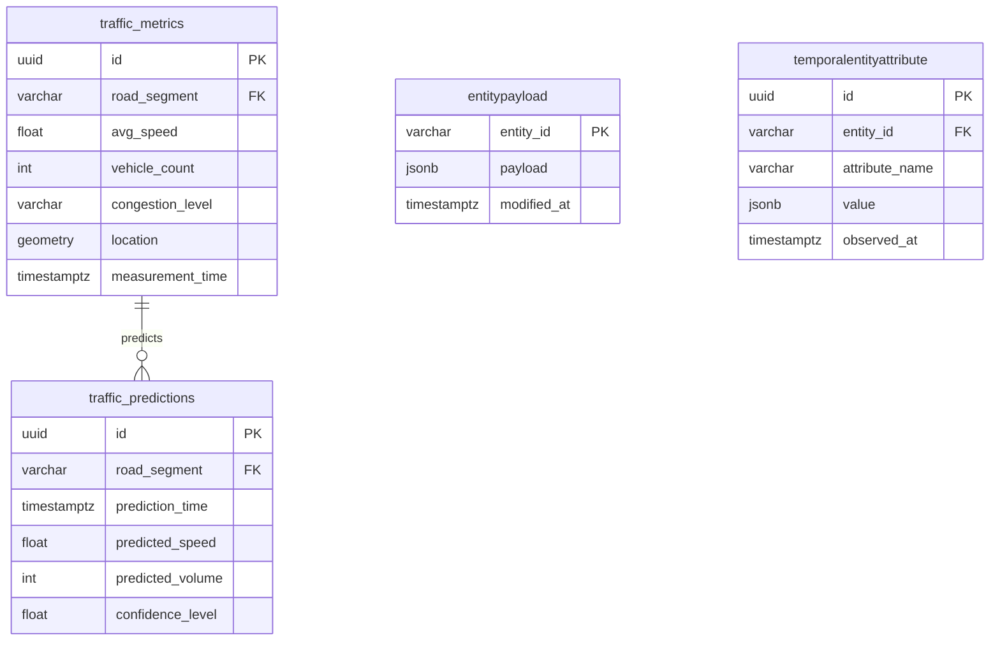
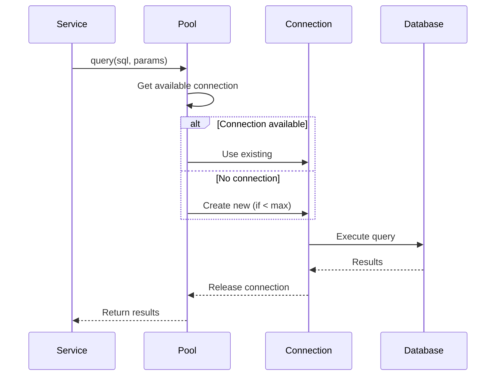

{/*
============================================================================
UIP - Urban Intelligence Platform
Copyright (c) 2025 UIP Team. All rights reserved.
https://github.com/UIP-Urban-Intelligence-Platform/UIP-Urban_Intelligence_Platform

SPDX-License-Identifier: MIT
============================================================================
File: apps/traffic-web-app/frontend/docs/docs/backend/services/postgresService.md
Module: Traffic Web App - PostgresService Documentation
Author: Nguyen Nhat Quang (Lead), Nguyen Viet Hoang, Nguyen Dinh Anh Tuan
Created: 2025-11-20
Version: 1.0.0
License: MIT

Description:
  PostgresService documentation for TimescaleDB client.
============================================================================
*/}

# PostgresService - TimescaleDB Client

PostgreSQL Service for interacting with **TimescaleDB** (Stellio's temporal storage), providing connection pooling and query interface for time-series traffic data access.

## Overview



## Features

| Feature | Description |
|---------|-------------|
| **Connection Pooling** | 20 max connections, 30s idle timeout |
| **Query Parameterization** | SQL injection prevention |
| **PostGIS Support** | Spatial functions (ST_Distance, ST_MakePoint) |
| **Time-Series Queries** | TimescaleDB hypertable optimizations |
| **Transaction Support** | Read/write isolation |
| **Automatic Recovery** | Connection retry on failure |

## Class Definition

```typescript
import { Pool } from 'pg';

export class PostgresService {
  private pool: Pool;

  constructor();
  
  // Traffic Metrics
  getTrafficMetrics(): Promise<TrafficMetric[]>;
  getTrafficMetricsByRoadSegment(roadSegment: string): Promise<TrafficMetric[]>;
  getHistoricalAverages(roadSegment: string, hourOfDay: number, dayOfWeek: number): Promise<HistoricalAverage>;
  insertTrafficMetric(metric: TrafficMetric): Promise<void>;
  
  // Predictions
  getPredictions(roadSegment: string): Promise<Prediction[]>;
  
  // Connection
  close(): Promise<void>;
}

interface TrafficMetric {
  id: string;
  roadSegment: string;
  avgSpeed: number;
  vehicleCount: number;
  congestionLevel: string;
  latitude: number;
  longitude: number;
  timestamp: Date;
}
```

## Configuration

```typescript
// Environment Variables
const config = {
  POSTGRES_HOST: 'localhost',
  POSTGRES_PORT: 5432,
  POSTGRES_USER: 'stellio_user',
  POSTGRES_PASSWORD: 'stellio_test',
  POSTGRES_DB: 'stellio_search'
};

// Pool Configuration
const poolConfig = {
  host: config.POSTGRES_HOST,
  port: config.POSTGRES_PORT,
  user: config.POSTGRES_USER,
  password: config.POSTGRES_PASSWORD,
  database: config.POSTGRES_DB,
  max: 20,                      // Maximum connections
  idleTimeoutMillis: 30000,     // 30s idle timeout
  connectionTimeoutMillis: 5000  // 5s connection timeout
};
```

## Usage Examples

### Get Recent Traffic Metrics

```typescript
import { PostgresService } from './services/postgresService';

const postgres = new PostgresService();

// Get traffic metrics from last hour
const metrics = await postgres.getTrafficMetrics();
metrics.forEach(metric => {
  console.log(`${metric.roadSegment}: ${metric.avgSpeed} km/h`);
  console.log(`Congestion: ${metric.congestionLevel}`);
});
```

### Road Segment Analysis

```typescript
// Get 24-hour metrics for specific road
const metrics = await postgres.getTrafficMetricsByRoadSegment(
  'urn:ngsi-ld:RoadSegment:nguyen-hue'
);

// Calculate average speed
const avgSpeed = metrics.reduce((sum, m) => sum + m.avgSpeed, 0) / metrics.length;
console.log(`24h average speed: ${avgSpeed.toFixed(1)} km/h`);
```

### Historical Pattern Analysis

```typescript
// Get historical averages for Monday 8am
const historical = await postgres.getHistoricalAverages(
  'urn:ngsi-ld:RoadSegment:nguyen-hue',
  8,   // 8:00 AM
  1    // Monday (0=Sunday, 1=Monday, ...)
);

if (historical) {
  console.log(`Average speed: ${historical.avg_speed} km/h`);
  console.log(`Average vehicles: ${historical.avg_vehicle_count}`);
  console.log(`Sample count: ${historical.sample_count}`);
}
```

### Traffic Predictions

```typescript
// Get 3-hour predictions
const predictions = await postgres.getPredictions(
  'urn:ngsi-ld:RoadSegment:nguyen-hue'
);

predictions.forEach(pred => {
  console.log(`${pred.prediction_time}: ${pred.predicted_speed} km/h`);
  console.log(`Confidence: ${pred.confidence_level}%`);
});
```

### Insert Traffic Metric

```typescript
await postgres.insertTrafficMetric({
  roadSegment: 'urn:ngsi-ld:RoadSegment:nguyen-hue',
  avgSpeed: 35.5,
  vehicleCount: 150,
  congestionLevel: 'moderate',
  latitude: 10.7731,
  longitude: 106.7030,
  timestamp: new Date()
});
```

## SQL Query Examples

### Get Recent Traffic Metrics

```sql
SELECT 
  id,
  road_segment,
  avg_speed,
  vehicle_count,
  congestion_level,
  ST_Y(location::geometry) as latitude,
  ST_X(location::geometry) as longitude,
  measurement_time as timestamp
FROM traffic_metrics
WHERE measurement_time >= NOW() - INTERVAL '1 hour'
ORDER BY measurement_time DESC
LIMIT 100
```

### Historical Averages

```sql
SELECT 
  AVG(avg_speed) as avg_speed,
  AVG(vehicle_count) as avg_vehicle_count,
  COUNT(*) as sample_count
FROM traffic_metrics
WHERE road_segment = $1
  AND EXTRACT(HOUR FROM measurement_time) = $2
  AND EXTRACT(DOW FROM measurement_time) = $3
  AND measurement_time >= NOW() - INTERVAL '30 days'
```

### Traffic Predictions

```sql
SELECT 
  prediction_time,
  predicted_speed,
  predicted_volume,
  confidence_level
FROM traffic_predictions
WHERE road_segment = $1
  AND prediction_time >= NOW()
  AND prediction_time <= NOW() + INTERVAL '3 hours'
ORDER BY prediction_time ASC
```

### Insert with PostGIS

```sql
INSERT INTO traffic_metrics (
  road_segment, avg_speed, vehicle_count, congestion_level, 
  location, measurement_time
) VALUES (
  $1, $2, $3, $4, 
  ST_SetSRID(ST_MakePoint($5, $6), 4326), $7
)
```

## Database Schema



## TimescaleDB Features

### Hypertable Creation

```sql
-- Create hypertable for time-series optimization
SELECT create_hypertable('traffic_metrics', 'measurement_time');

-- Add compression policy
ALTER TABLE traffic_metrics SET (
  timescaledb.compress,
  timescaledb.compress_orderby = 'measurement_time DESC'
);

-- Add compression job (compress data older than 7 days)
SELECT add_compression_policy('traffic_metrics', INTERVAL '7 days');

-- Add retention policy (delete data older than 90 days)
SELECT add_retention_policy('traffic_metrics', INTERVAL '90 days');
```

### Continuous Aggregates

```sql
-- Create hourly aggregates
CREATE MATERIALIZED VIEW traffic_hourly
WITH (timescaledb.continuous) AS
SELECT
  road_segment,
  time_bucket('1 hour', measurement_time) AS bucket,
  AVG(avg_speed) AS avg_speed,
  SUM(vehicle_count) AS total_vehicles,
  COUNT(*) AS sample_count
FROM traffic_metrics
GROUP BY road_segment, bucket;

-- Refresh policy
SELECT add_continuous_aggregate_policy('traffic_hourly',
  start_offset => INTERVAL '1 day',
  end_offset => INTERVAL '1 hour',
  schedule_interval => INTERVAL '1 hour'
);
```

## Error Handling

```typescript
async getTrafficMetrics(): Promise<TrafficMetric[]> {
  try {
    const result = await this.pool.query(query);
    return result.rows;
  } catch (error) {
    // Handle table not found (using Stellio backend only)
    if ((error as any).code === '42P01') {
      logger.debug('traffic_metrics table not found (expected)');
      return [];
    }
    logger.error('PostgreSQL query failed:', error);
    throw new Error('Failed to fetch traffic metrics');
  }
}
```

## Connection Pool Management



## Performance Tuning

| Parameter | Default | Description |
|-----------|---------|-------------|
| `max` | 20 | Maximum pool connections |
| `idleTimeoutMillis` | 30000 | Close idle connections after 30s |
| `connectionTimeoutMillis` | 5000 | Connection timeout 5s |

### PostgreSQL Configuration

```ini
# postgresql.conf
max_connections = 100
shared_buffers = 256MB
work_mem = 64MB
maintenance_work_mem = 128MB

# TimescaleDB specific
timescaledb.max_background_workers = 8
```

## Cleanup

```typescript
// Always close pool on shutdown
process.on('SIGTERM', async () => {
  await postgres.close();
  process.exit(0);
});
```

## Related Documentation

- [StellioService](./stellioService.md) - NGSI-LD entity source
- [DataAggregator](./dataAggregator.md) - Uses PostgreSQL for metrics
- [Historical Routes](../routes/historical.md) - Historical data API
- [Analytics Routes](../routes/analytics.md) - Analytics endpoints

## References

- [node-postgres](https://node-postgres.com/)
- [TimescaleDB Documentation](https://docs.timescale.com/)
- [PostGIS Documentation](https://postgis.net/documentation/)
