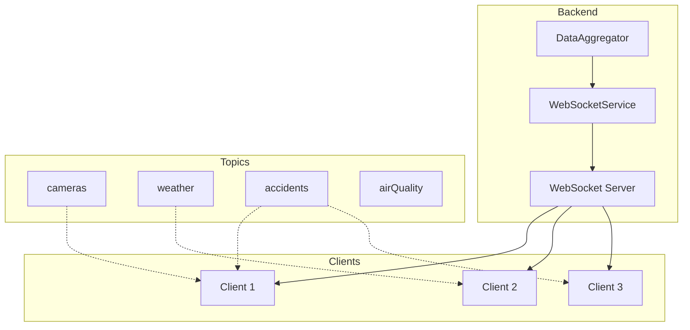
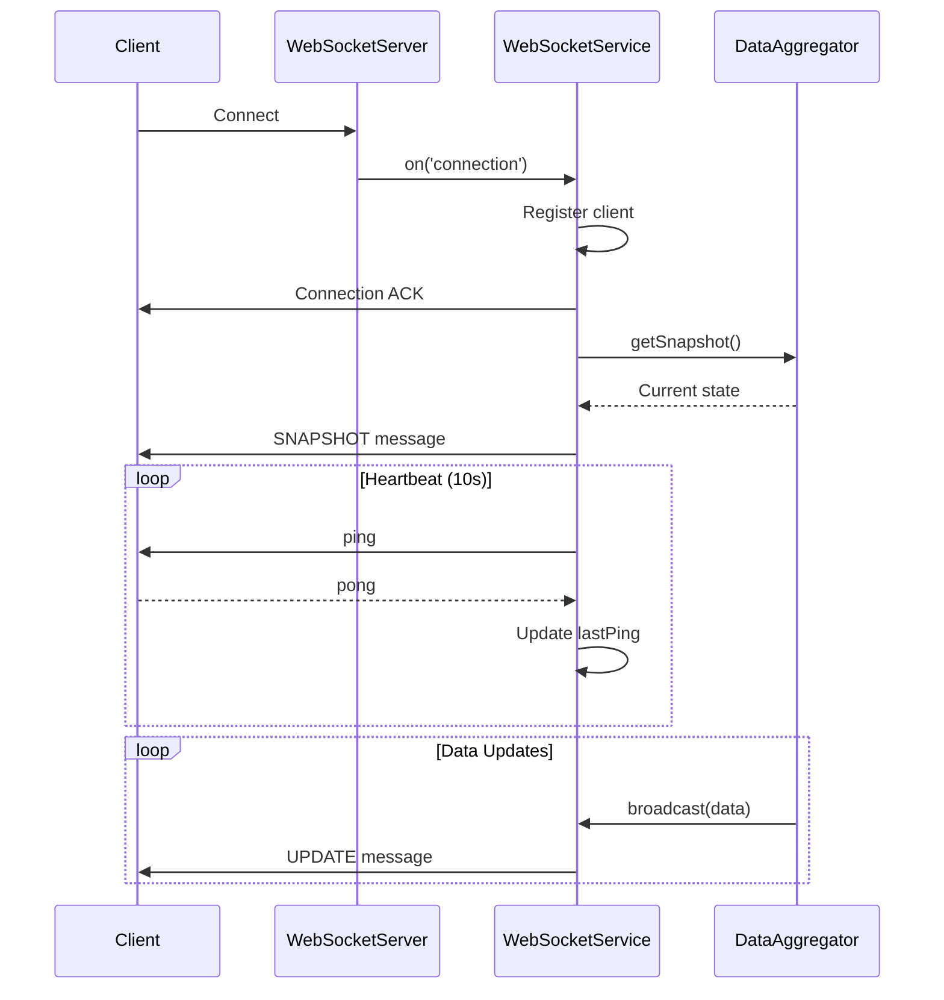
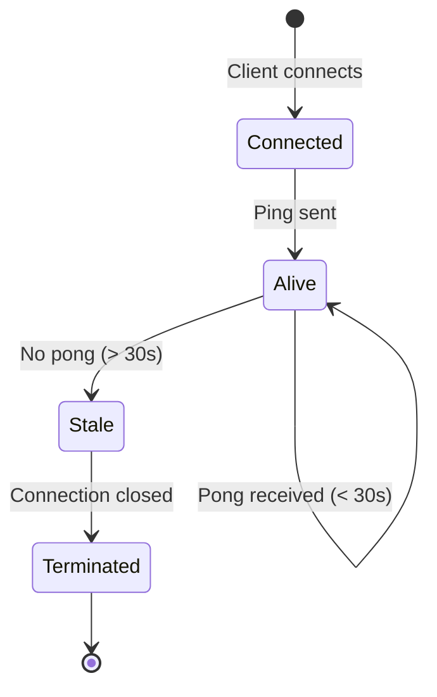

{/*
============================================================================
UIP - Urban Intelligence Platform
Copyright (c) 2025 UIP Team. All rights reserved.
https://github.com/UIP-Urban-Intelligence-Platform/UIP-Urban_Intelligence_Platform

SPDX-License-Identifier: MIT
============================================================================
File: apps/traffic-web-app/frontend/docs/docs/backend/services/websocketService.md
Module: Traffic Web App - WebSocketService Documentation
Author: Nguyen Nhat Quang (Lead), Nguyen Viet Hoang, Nguyen Dinh Anh Tuan
Created: 2025-11-20
Version: 1.0.0
License: MIT

Description:
  WebSocketService documentation for real-time communication.
============================================================================
*/}

# WebSocketService - Real-Time Communication

WebSocket Service for **real-time bidirectional communication** between backend and frontend clients. Manages client connections, subscriptions, and message broadcasting with heartbeat mechanism.

## Overview



## Features

| Feature | Description |
|---------|-------------|
| **Client Management** | Connection tracking with subscription state |
| **Topic Pub/Sub** | Clients subscribe to specific data topics |
| **Heartbeat** | Ping/pong every 10s, 30s timeout for dead connections |
| **Initial Snapshot** | Full data snapshot on new connection |
| **Broadcast** | Send to all clients or specific topic subscribers |
| **Message Types** | UPDATE, ALERT, SNAPSHOT, PONG |

## Architecture



## Class Definition

```typescript
import { WebSocketServer, WebSocket } from 'ws';

interface ClientSubscription {
  ws: WebSocket;
  topics: string[];
  lastPing: number;
}

export class WebSocketService {
  private wss: WebSocketServer;
  private clients: Map<WebSocket, ClientSubscription>;
  private heartbeatInterval: NodeJS.Timeout | null;
  private readonly HEARTBEAT_INTERVAL = 10000;  // 10 seconds
  private readonly HEARTBEAT_TIMEOUT = 30000;   // 30 seconds
  private snapshotProvider: (() => any) | null;

  constructor(wss: WebSocketServer);
  
  // Snapshot
  setSnapshotProvider(provider: () => any): void;
  
  // Broadcasting
  broadcast(message: WebSocketMessage): void;
  broadcastToTopic(topic: string, message: WebSocketMessage): void;
  
  // Client Management
  getClientCount(): number;
  getTopicSubscribers(topic: string): number;
  
  // Lifecycle
  private initialize(): void;
  private startHeartbeat(): void;
  private handleClientMessage(ws: WebSocket, data: any): void;
  private sendInitialSnapshot(ws: WebSocket, snapshot: any): void;
}

interface WebSocketMessage {
  type: 'UPDATE' | 'ALERT' | 'SNAPSHOT' | 'PONG';
  topic?: string;
  data: any;
  timestamp: string;
}
```

## Configuration

```typescript
// Service Constants
const HEARTBEAT_INTERVAL = 10000;  // 10 seconds between pings
const HEARTBEAT_TIMEOUT = 30000;   // 30 seconds before disconnect

// Environment Variables
const WS_PORT = process.env.WS_PORT || 5000;  // Same as HTTP server
```

## Usage Examples

### Server Setup

```typescript
import express from 'express';
import { createServer } from 'http';
import { WebSocketServer } from 'ws';
import { WebSocketService } from './services/websocketService';
import { DataAggregator } from './services/dataAggregator';

const app = express();
const server = createServer(app);
const wss = new WebSocketServer({ server });

// Initialize WebSocket service
const wsService = new WebSocketService(wss);

// Initialize data aggregator (registers snapshot provider)
const aggregator = new DataAggregator(wsService);
aggregator.start();

server.listen(5000);
```

### Broadcasting Updates

```typescript
// Broadcast camera update to all subscribed clients
wsService.broadcast({
  type: 'UPDATE',
  topic: 'cameras',
  data: {
    id: 'urn:ngsi-ld:Camera:001',
    name: 'Camera Nguyen Hue',
    imageUrl: 'http://camera.hcm/001/live.jpg',
    lastUpdated: new Date().toISOString()
  },
  timestamp: new Date().toISOString()
});
```

### Broadcasting Alerts

```typescript
// Broadcast accident alert
wsService.broadcast({
  type: 'ALERT',
  topic: 'accidents',
  data: {
    id: 'urn:ngsi-ld:RoadAccident:new-001',
    severity: 'high',
    location: { latitude: 10.77, longitude: 106.70 },
    description: 'Multi-vehicle collision on Nguyen Hue'
  },
  timestamp: new Date().toISOString()
});
```

## Message Types

### Connection Message

```json
{
  "type": "connection",
  "message": "Connected to HCMC Traffic Monitoring System",
  "timestamp": "2025-11-29T10:30:00.000Z",
  "heartbeatInterval": 10000
}
```

### Snapshot Message

```json
{
  "type": "SNAPSHOT",
  "data": {
    "cameras": [...],
    "weather": [...],
    "airQuality": [...],
    "accidents": [...],
    "patterns": [...]
  },
  "timestamp": "2025-11-29T10:30:00.000Z"
}
```

### Update Message

```json
{
  "type": "UPDATE",
  "topic": "cameras",
  "data": [
    {
      "id": "urn:ngsi-ld:Camera:001",
      "name": "Camera Nguyen Hue",
      "imageUrl": "http://...",
      "status": "active"
    }
  ],
  "timestamp": "2025-11-29T10:30:30.000Z"
}
```

### Alert Message

```json
{
  "type": "ALERT",
  "topic": "accidents",
  "data": {
    "id": "urn:ngsi-ld:RoadAccident:001",
    "severity": "high",
    "location": { "latitude": 10.77, "longitude": 106.70 }
  },
  "timestamp": "2025-11-29T10:31:00.000Z"
}
```

## Client Message Handling

### Subscribe to Topics

```json
// Client -> Server
{
  "action": "subscribe",
  "topics": ["cameras", "accidents"]
}
```

### Unsubscribe

```json
// Client -> Server
{
  "action": "unsubscribe",
  "topics": ["weather"]
}
```

### Ping/Pong

```typescript
// Server sends ping
ws.ping();

// Client automatically responds with pong
ws.on('pong', () => {
  client.lastPing = Date.now();
});
```

## Supported Topics

| Topic | Description | Update Frequency |
|-------|-------------|------------------|
| `cameras` | Traffic camera images and status | 30 seconds |
| `weather` | Weather observations | 30 seconds |
| `airQuality` | AQI sensor readings | 30 seconds |
| `accidents` | Real-time accident alerts | 10 seconds |
| `patterns` | Traffic congestion patterns | 60 seconds |
| `congestion` | Congestion zone updates | 30 seconds |
| `all` | Subscribe to all topics | - |

## Heartbeat Mechanism



### Implementation

```typescript
private startHeartbeat(): void {
  this.heartbeatInterval = setInterval(() => {
    const now = Date.now();
    const staleClients: WebSocket[] = [];

    this.clients.forEach((client, ws) => {
      // Check for stale connections
      if (now - client.lastPing > this.HEARTBEAT_TIMEOUT) {
        staleClients.push(ws);
        ws.terminate();
        return;
      }

      // Send ping to active clients
      if (ws.readyState === WebSocket.OPEN) {
        ws.ping();
      }
    });

    // Remove stale clients
    staleClients.forEach(ws => this.clients.delete(ws));
  }, this.HEARTBEAT_INTERVAL);
}
```

## Snapshot Provider

The DataAggregator registers a snapshot provider that returns current state:

```typescript
// In DataAggregator constructor
this.wsService.setSnapshotProvider(() => this.getCurrentSnapshot());

// Snapshot structure
getCurrentSnapshot(): Snapshot {
  return {
    cameras: Array.from(this.cameraCache.values()).map(e => e.data),
    weather: Array.from(this.weatherCache.values()).map(e => e.data),
    airQuality: Array.from(this.airQualityCache.values()).map(e => e.data),
    accidents: Array.from(this.accidentCache.values()).map(e => e.data),
    patterns: Array.from(this.patternCache.values()).map(e => e.data)
  };
}
```

## Error Handling

```typescript
// Handle client errors
ws.on('error', (error) => {
  logger.error('WebSocket error:', error);
  this.clients.delete(ws);
});

// Handle client disconnect
ws.on('close', () => {
  logger.info('Client disconnected');
  this.clients.delete(ws);
});

// Handle message parsing errors
ws.on('message', (message: string) => {
  try {
    const data = JSON.parse(message.toString());
    this.handleClientMessage(ws, data);
  } catch (error) {
    logger.error('Invalid message format:', error);
  }
});
```

## Frontend Integration

```typescript
// React hook example
const useWebSocket = () => {
  const [data, setData] = useState<Snapshot | null>(null);
  const wsRef = useRef<WebSocket | null>(null);

  useEffect(() => {
    const ws = new WebSocket('ws://localhost:5000');
    wsRef.current = ws;

    ws.onmessage = (event) => {
      const message = JSON.parse(event.data);
      
      switch (message.type) {
        case 'SNAPSHOT':
          setData(message.data);
          break;
        case 'UPDATE':
          setData(prev => ({
            ...prev,
            [message.topic]: message.data
          }));
          break;
        case 'ALERT':
          // Handle alert
          break;
      }
    };

    return () => ws.close();
  }, []);

  return data;
};
```

## Performance Metrics

| Metric | Value |
|--------|-------|
| Max concurrent clients | 1000+ |
| Heartbeat interval | 10 seconds |
| Stale timeout | 30 seconds |
| Average latency | < 50ms |
| Message throughput | 1000+ msg/s |

## Related Documentation

- [DataAggregator](./dataAggregator.md) - Provides data for broadcasting
- [Backend Overview](../overview.md) - Server architecture
- [Real-time Hooks](/docs/frontend/hooks/websocket) - Frontend WebSocket integration

## References

- [ws - WebSocket Library](https://github.com/websockets/ws)
- [WebSocket API](https://developer.mozilla.org/en-US/docs/Web/API/WebSocket)
