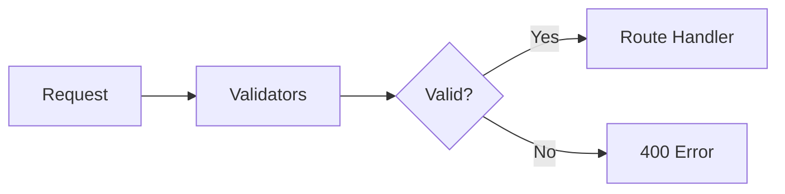

<!--
SPDX-License-Identifier: MIT
Copyright (c) 2025 UIP Team
-->

# Validators - Input Validation

Input validation utilities for **request parameters**, entity data, coordinates, and NGSI-LD compliance.

## Overview



## Validation Functions

### Coordinate Validation

```typescript
export function validateCoordinates(lat: any, lon: any): {
  valid: boolean;
  latitude?: number;
  longitude?: number;
  error?: string;
} {
  const latitude = parseFloat(lat);
  const longitude = parseFloat(lon);
  
  if (isNaN(latitude) || isNaN(longitude)) {
    return { valid: false, error: 'Invalid coordinate format' };
  }
  
  if (latitude < -90 || latitude > 90) {
    return { valid: false, error: 'Latitude must be between -90 and 90' };
  }
  
  if (longitude < -180 || longitude > 180) {
    return { valid: false, error: 'Longitude must be between -180 and 180' };
  }
  
  return { valid: true, latitude, longitude };
}
```

### Entity ID Validation

```typescript
export function validateEntityId(id: string): boolean {
  // NGSI-LD URN format: urn:ngsi-ld:EntityType:id
  const urnPattern = /^urn:ngsi-ld:[A-Za-z][A-Za-z0-9]*:[A-Za-z0-9\-_]+$/;
  return urnPattern.test(id);
}

// Usage
if (!validateEntityId(req.params.id)) {
  return res.status(400).json({
    error: 'Invalid entity ID format. Expected: urn:ngsi-ld:Type:id'
  });
}
```

### Pagination Validation

```typescript
export function validatePagination(query: any): {
  limit: number;
  offset: number;
} {
  const limit = Math.min(
    Math.max(parseInt(query.limit) || 100, 1),
    1000  // Max 1000
  );
  
  const offset = Math.max(parseInt(query.offset) || 0, 0);
  
  return { limit, offset };
}
```

### Date Range Validation

```typescript
export function validateDateRange(from: string, to: string): {
  valid: boolean;
  fromDate?: Date;
  toDate?: Date;
  error?: string;
} {
  const fromDate = new Date(from);
  const toDate = new Date(to);
  
  if (isNaN(fromDate.getTime())) {
    return { valid: false, error: 'Invalid "from" date format' };
  }
  
  if (isNaN(toDate.getTime())) {
    return { valid: false, error: 'Invalid "to" date format' };
  }
  
  if (fromDate > toDate) {
    return { valid: false, error: '"from" date must be before "to" date' };
  }
  
  // Max 90 days
  const maxRange = 90 * 24 * 60 * 60 * 1000;
  if (toDate.getTime() - fromDate.getTime() > maxRange) {
    return { valid: false, error: 'Date range cannot exceed 90 days' };
  }
  
  return { valid: true, fromDate, toDate };
}
```

### Bounding Box Validation

```typescript
export function validateBBox(bbox: string): {
  valid: boolean;
  bounds?: { minLat: number; minLon: number; maxLat: number; maxLon: number };
  error?: string;
} {
  const parts = bbox.split(',').map(Number);
  
  if (parts.length !== 4 || parts.some(isNaN)) {
    return { valid: false, error: 'Invalid bbox format. Expected: minLat,minLon,maxLat,maxLon' };
  }
  
  const [minLat, minLon, maxLat, maxLon] = parts;
  
  if (minLat >= maxLat || minLon >= maxLon) {
    return { valid: false, error: 'Invalid bbox: min values must be less than max values' };
  }
  
  return {
    valid: true,
    bounds: { minLat, minLon, maxLat, maxLon }
  };
}
```

## Validation Middleware

```typescript
// middlewares/validate.ts
import { Request, Response, NextFunction } from 'express';

export function validateQuery(schema: object) {
  return (req: Request, res: Response, next: NextFunction) => {
    const errors: string[] = [];
    
    for (const [key, rules] of Object.entries(schema)) {
      const value = req.query[key];
      
      if (rules.required && !value) {
        errors.push(`Missing required parameter: ${key}`);
        continue;
      }
      
      if (value && rules.type === 'number') {
        const num = Number(value);
        if (isNaN(num)) {
          errors.push(`${key} must be a number`);
        }
        if (rules.min !== undefined && num < rules.min) {
          errors.push(`${key} must be at least ${rules.min}`);
        }
        if (rules.max !== undefined && num > rules.max) {
          errors.push(`${key} must be at most ${rules.max}`);
        }
      }
      
      if (value && rules.enum && !rules.enum.includes(value)) {
        errors.push(`${key} must be one of: ${rules.enum.join(', ')}`);
      }
    }
    
    if (errors.length > 0) {
      return res.status(400).json({ errors });
    }
    
    next();
  };
}

// Usage
router.get('/cameras/near',
  validateQuery({
    lat: { required: true, type: 'number', min: -90, max: 90 },
    lon: { required: true, type: 'number', min: -180, max: 180 },
    maxDistance: { type: 'number', min: 0, max: 100000 }
  }),
  cameraController.getNearby
);
```

## Request Body Validation

```typescript
export function validateAgentRequest(body: any): {
  valid: boolean;
  error?: string;
} {
  if (!body.message || typeof body.message !== 'string') {
    return { valid: false, error: 'message is required and must be a string' };
  }
  
  if (!body.location || typeof body.location !== 'object') {
    return { valid: false, error: 'location object is required' };
  }
  
  const coordResult = validateCoordinates(body.location.lat, body.location.lng);
  if (!coordResult.valid) {
    return { valid: false, error: coordResult.error };
  }
  
  return { valid: true };
}
```

## Related Documentation

- [Error Handler](../middlewares/errorHandler.md) - Error responses
- [Routes Overview](../routes/overview.md) - API endpoints
- [Logger](./logger.md) - Validation logging

## References

- [Express Validation](https://express-validator.github.io/docs/)
- [OWASP Input Validation](https://cheatsheetseries.owasp.org/cheatsheets/Input_Validation_Cheat_Sheet.html)
