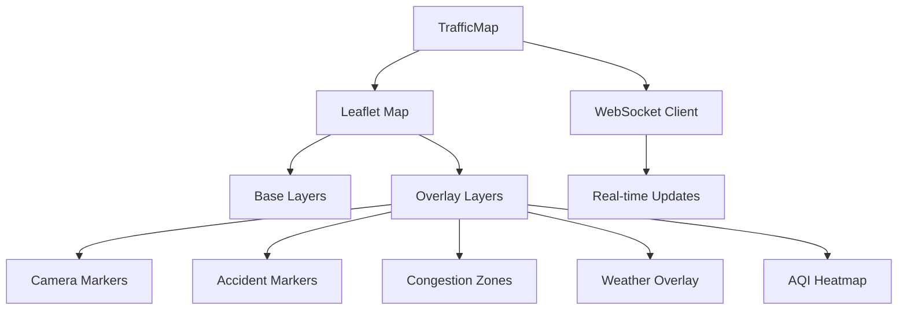

<!--
SPDX-License-Identifier: MIT
Copyright (c) 2025 UIP Team. All rights reserved.

UIP - Urban Intelligence Platform
TrafficMap component documentation.

Module: apps/traffic-web-app/frontend/docs/docs/frontend/components/TrafficMap.md
Author: UIP Team
Version: 1.0.0
-->

# TrafficMap Component

## Overview

The TrafficMap component is the core visualization component displaying real-time traffic conditions, camera feeds, accidents, congestion zones, and weather overlays on an interactive Leaflet map.

## Features

- **Interactive Map**: Leaflet-based map with pan, zoom, and layer controls
- **Real-time Updates**: WebSocket-powered live traffic data
- **Multiple Layers**: Traffic flow, accidents, cameras, weather, air quality
- **Camera Markers**: Clickable camera icons with live image popups
- **Heatmaps**: Traffic density and speed heatmaps
- **Zone Management**: Congestion zones with color coding
- **Responsive**: Mobile-friendly design

## Architecture



## Props

```typescript
interface TrafficMapProps {
  center?: [number, number];        // Map center [lat, lon]
  zoom?: number;                     // Initial zoom level
  height?: string;                   // Map height
  showCameras?: boolean;             // Show camera markers
  showAccidents?: boolean;           // Show accident markers
  showCongestion?: boolean;          // Show congestion zones
  showWeather?: boolean;             // Show weather overlay
  showAQI?: boolean;                 // Show air quality
  enableClustering?: boolean;        // Enable marker clustering
  onCameraClick?: (cameraId: string) => void;
  onAccidentClick?: (accidentId: string) => void;
}
```

## Usage

### Basic Usage

```tsx
import TrafficMap from '@/components/TrafficMap';

export default function HomePage() {
  return (
    <TrafficMap
      center={[10.7769, 106.7009]}
      zoom={13}
      height="600px"
      showCameras={true}
      showAccidents={true}
    />
  );
}
```

### With All Layers

```tsx
<TrafficMap
  center={[10.7769, 106.7009]}
  zoom={13}
  height="100vh"
  showCameras={true}
  showAccidents={true}
  showCongestion={true}
  showWeather={true}
  showAQI={true}
  enableClustering={true}
  onCameraClick={(id) => console.log('Camera:', id)}
  onAccidentClick={(id) => console.log('Accident:', id)}
/>
```

### Custom Styling

```tsx
<TrafficMap
  center={[10.7769, 106.7009]}
  zoom={13}
  height="800px"
  style={{
    borderRadius: '8px',
    boxShadow: '0 2px 8px rgba(0,0,0,0.1)'
  }}
/>
```

## Component Structure

```tsx
const TrafficMap: React.FC<TrafficMapProps> = ({
  center = [10.7769, 106.7009],
  zoom = 13,
  height = '600px',
  showCameras = true,
  showAccidents = true,
  showCongestion = false,
  showWeather = false,
  showAQI = false,
  enableClustering = false,
  onCameraClick,
  onAccidentClick
}) => {
  // WebSocket connection
  const { cameras, accidents, congestionZones } = useWebSocket();
  
  // Map state
  const [map, setMap] = useState<L.Map | null>(null);
  
  return (
    <MapContainer
      center={center}
      zoom={zoom}
      style={{ height }}
    >
      <TileLayer url="https://{s}.tile.openstreetmap.org/{z}/{x}/{y}.png" />
      
      {showCameras && (
        <CameraMarkers cameras={cameras} onClick={onCameraClick} />
      )}
      
      {showAccidents && (
        <AccidentMarkers accidents={accidents} onClick={onAccidentClick} />
      )}
      
      {showCongestion && (
        <CongestionZones zones={congestionZones} />
      )}
      
      {showWeather && <WeatherOverlay />}
      
      {showAQI && <AQIHeatmap />}
      
      <MapLegend />
    </MapContainer>
  );
};
```

## Integration Examples

### With FilterPanel

```tsx
const [filters, setFilters] = useState({
  showCameras: true,
  showAccidents: true,
  showCongestion: false
});

return (
  <div>
    <FilterPanel filters={filters} onChange={setFilters} />
    <TrafficMap {...filters} />
  </div>
);
```

### With TimeMachine

```tsx
const [timestamp, setTimestamp] = useState<Date>(new Date());

return (
  <div>
    <TimeMachine value={timestamp} onChange={setTimestamp} />
    <TrafficMap timestamp={timestamp} />
  </div>
);
```

## Styling

```css
.traffic-map {
  width: 100%;
  height: 600px;
  border-radius: 8px;
  overflow: hidden;
}

.leaflet-container {
  background: #f5f5f5;
}

.camera-marker {
  color: #1976d2;
}

.accident-marker {
  color: #d32f2f;
  animation: pulse 2s infinite;
}

@keyframes pulse {
  0%, 100% { opacity: 1; }
  50% { opacity: 0.5; }
}
```

## Performance

- Marker clustering for 50+ markers
- Virtualized rendering
- Debounced map events
- Optimized re-renders

## Related Components

- [CameraMarkers](./CameraMarkers.md)
- [AccidentMarkers](./AccidentMarkers.md)
- [WeatherOverlay](./WeatherOverlay.md)
- [MapLegend](./MapLegend.md)

## License

MIT License - Copyright (c) 2025 UIP Contributors (Nguyễn Nhật Quang, Nguyễn Việt Hoàng, Nguyễn Đình Anh Tuấn)
