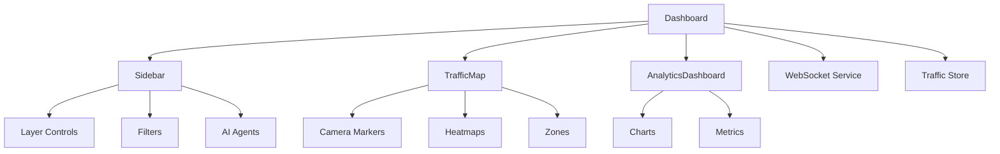

---
sidebar_label: 'Dashboard Page'
title: 'Dashboard Page'
sidebar_position: 1
description: Main traffic monitoring interface integrating map, sidebar, and analytics
---

{/*
============================================================================
UIP - Urban Intelligence Platform
Copyright (c) 2025 UIP Team. All rights reserved.
https://github.com/UIP-Urban-Intelligence-Platform/UIP-Urban_Intelligence_Platform

SPDX-License-Identifier: MIT
============================================================================
File: apps/traffic-web-app/frontend/docs/docs/frontend/pages/Dashboard.md
Module: Traffic Web App - Dashboard Page Documentation
Author: Nguyen Nhat Quang (Lead), Nguyen Viet Hoang, Nguyen Dinh Anh Tuan
Created: 2025-11-20
Version: 1.0.0
License: MIT

Description:
  Main traffic monitoring interface documentation with map, sidebar, analytics.
============================================================================
*/}

# Dashboard Page

Main traffic monitoring interface integrating traffic map, sidebar controls, and analytics panel with real-time WebSocket updates.

## Overview

The Dashboard page is the primary interface for the Urban Intelligence Platform, orchestrating:

- Real-time traffic map with 8+ overlay layers
- Sidebar with filters, layer controls, and AI agent panels  
- Analytics dashboard with charts and metrics
- WebSocket connection for live data updates
- Zustand store integration for state management



## Component Architecture

```typescript
const Dashboard: React.FC = () => {
    const { refreshData, loading, error } = useTrafficStore();
    const [isAnalyticsOpen, setIsAnalyticsOpen] = useState(false);
    const [isInitialized, setIsInitialized] = useState(false);
    const trafficMapRef = useRef<any>(null);

    useEffect(() => {
        const initializeApp = async () => {
            await refreshData();
            setIsInitialized(true);
            wsService.connect();
        };
        initializeApp();
        return () => wsService.disconnect();
    }, [refreshData]);

    return (
        <div className="flex h-screen w-screen overflow-hidden bg-gray-50">
            <Sidebar onCameraSelect={...} onZoomToCamera={...} onZoomToDistrict={...} />
            <div className="flex-1 relative">
                <TrafficMap ref={trafficMapRef} />
                <AnalyticsDashboard isOpen={isAnalyticsOpen} onToggle={...} />
            </div>
        </div>
    );
};
```

## Features

### Loading States

- Animated spinner during initial data load
- Gradient background with pulse animation
- Progress indicators for initialization

### Error Handling

- Error state display with retry button
- Error icon and descriptive message
- Graceful degradation when data load fails

### Child Components

| Component | Purpose | Ref Methods |
|-----------|---------|-------------|
| `Sidebar` | Layer controls, filters, AI agents | - |
| `TrafficMap` | Interactive MapLibre map | `handleCameraClick`, `handleZoomToCamera`, `handleZoomToDistrict` |
| `AnalyticsDashboard` | Collapsible charts panel | - |

## Usage

```tsx
// In App.tsx router
import Dashboard from './pages/Dashboard';

<Route path="/dashboard" element={<Dashboard />} />
```

## Dependencies

- `react@^18.2`: UI library
- `TrafficMap`, `Sidebar`, `AnalyticsDashboard`: Child components
- `wsService`: WebSocket connection management
- `useTrafficStore`: Zustand global state

## See Also

- [TrafficMap Component](../components/TrafficMap.md)
- [Sidebar Component](../components/Sidebar.md)
- [AnalyticsDashboard Component](../components/AnalyticsDashboard.md)
- [Traffic Store](../store/trafficStore.md)
