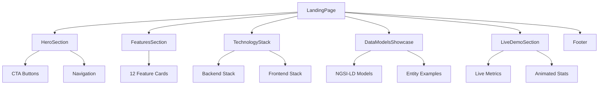

{/*
============================================================================
UIP - Urban Intelligence Platform
Copyright (c) 2025 UIP Team. All rights reserved.
https://github.com/UIP-Urban-Intelligence-Platform/UIP-Urban_Intelligence_Platform

SPDX-License-Identifier: MIT
============================================================================
File: apps/traffic-web-app/frontend/docs/docs/frontend/pages/LandingPage.md
Module: Traffic Web App - LandingPage Component Documentation
Author: Nguyen Nhat Quang (Lead), Nguyen Viet Hoang, Nguyen Dinh Anh Tuan
Created: 2025-11-20
Version: 1.0.0
License: MIT

Description:
  Marketing and onboarding entry point for new users documentation.
============================================================================
*/}

# LandingPage Component

Marketing and onboarding entry point showcasing platform features, technology stack, and live demo before entering the main dashboard.

## Overview

The LandingPage orchestrates 6 major sections:

1. **Hero Section**: Main CTA and navigation
2. **Features Section**: 12 key platform capabilities
3. **Technology Stack**: Backend/Frontend tech showcase
4. **Data Models Showcase**: NGSI-LD demonstration
5. **Live Demo Section**: Real-time metrics simulation
6. **Footer**: Links, newsletter, and social



## Component Structure

```typescript
export default function LandingPage() {
    return (
        <main className="min-h-screen bg-white">
            <HeroSection />
            <FeaturesSection />
            <TechnologyStack />
            <DataModelsShowcase />
            <LiveDemoSection />
            <Footer />
        </main>
    );
}
```

## Sections

### HeroSection

- Animated headline with gradient text
- Primary CTA: "Start Monitoring"
- Secondary CTA: "View Documentation"
- Navigation links to other sections

### FeaturesSection

- Grid of 12 feature cards
- Icons from Lucide React
- Hover animations
- Categories: Monitoring, Analytics, AI, Integration

### TechnologyStack

- Backend: Python, FastAPI, NGSI-LD, Stellio
- Frontend: React, TypeScript, MapLibre GL, Zustand
- Infrastructure: Docker, Kubernetes, Grafana

### DataModelsShowcase

- NGSI-LD entity examples
- Interactive JSON viewers
- Entity relationship diagrams

### LiveDemoSection

- Simulated real-time metrics
- Animated counters
- Mini dashboard preview

### Footer

- Quick links navigation
- Newsletter subscription
- Social media links
- Copyright information

## Usage

```tsx
// In App.tsx router
import LandingPage from './pages/LandingPage';

<Route path="/" element={<LandingPage />} />
```

## Styling

- Tailwind CSS utility classes
- Responsive design (mobile-first)
- Gradient backgrounds
- Smooth scroll between sections
- Intersection Observer animations

## Dependencies

- `HeroSection`: Landing hero component
- `FeaturesSection`: Features grid component
- `TechnologyStack`: Tech stack showcase
- `DataModelsShowcase`: NGSI-LD demo
- `LiveDemoSection`: Live metrics preview
- `Footer`: Site footer component

## Performance

- Code-split sections with lazy loading
- Optimized images with next-gen formats
- Minimal JavaScript for initial load
- Progressive enhancement

## See Also

- [Dashboard Page](./Dashboard.md)
- [Overview](../overview.md)
