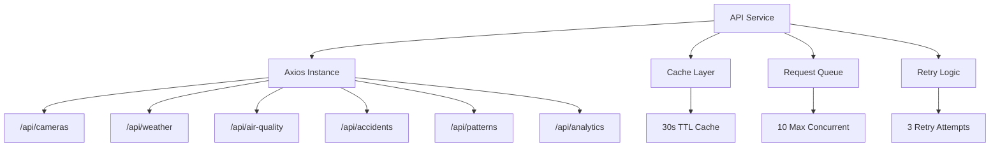

{/*
============================================================================
UIP - Urban Intelligence Platform
Copyright (c) 2025 UIP Team. All rights reserved.
https://github.com/UIP-Urban-Intelligence-Platform/UIP-Urban_Intelligence_Platform

SPDX-License-Identifier: MIT
============================================================================
File: apps/traffic-web-app/frontend/docs/docs/frontend/services/api.md
Module: Traffic Web App - API Service Documentation
Author: Nguyen Nhat Quang (Lead), Nguyen Viet Hoang, Nguyen Dinh Anh Tuan
Created: 2025-11-20
Version: 1.0.0
License: MIT

Description:
  Axios-based HTTP client documentation for backend REST endpoints.
============================================================================
*/}

# API Service

Axios-based HTTP client providing typed API methods for all backend endpoints with caching, retry logic, and error handling.

## Overview

The API service provides a comprehensive REST client for the traffic backend:

- 12 endpoint groups covering all data types
- In-memory caching with configurable TTL
- Automatic retry on server errors
- Request queue to limit concurrent requests
- TypeScript type safety throughout



## Configuration

```typescript
const API_BASE_URL = import.meta.env.VITE_API_URL || 'http://localhost:5000';
const CACHE_DURATION = 30000;  // 30 seconds
const MAX_RETRY_ATTEMPTS = 3;
const RETRY_DELAY = 1000;      // 1 second base
const MAX_CONCURRENT_REQUESTS = 10;
```

## Endpoint Groups

### 1. Cameras `/api/cameras`

```typescript
interface CameraFilters {
  district?: string;
  status?: 'online' | 'offline' | 'maintenance';
  search?: string;
  minLatitude?: number;
  maxLatitude?: number;
  minLongitude?: number;
  maxLongitude?: number;
}

// Get all cameras with optional filters
await apiService.getCameras(filters?: CameraFilters): Promise<Camera[]>

// Get camera by ID
await apiService.getCamera(id: string): Promise<Camera>
```

### 2. Weather `/api/weather`

```typescript
await apiService.getWeather(params?: { limit?: number }): Promise<Weather[]>
await apiService.getWeatherByCamera(cameraId: string): Promise<Weather>
```

### 3. Air Quality `/api/air-quality`

```typescript
interface AirQualityFilters {
  district?: string;
  level?: string;
  minAQI?: number;
  maxAQI?: number;
  startDate?: string;
  endDate?: string;
}

await apiService.getAirQuality(filters?: AirQualityFilters): Promise<AirQuality[]>
await apiService.getAirQualityByCamera(cameraId: string): Promise<AirQuality>
```

### 4. Accidents `/api/accidents`

```typescript
interface AccidentFilters {
  district?: string;
  type?: string;
  severity?: 'minor' | 'moderate' | 'severe' | 'fatal';
  resolved?: boolean;
  startDate?: string;
  endDate?: string;
  lat?: number;
  lon?: number;
  radius?: number;
}

await apiService.getAccidents(filters?: AccidentFilters): Promise<Accident[]>
await apiService.getAccident(id: string): Promise<Accident>
```

### 5. Patterns `/api/patterns`

```typescript
interface PatternFilters {
  district?: string;
  patternType?: string;
  congestionLevel?: 'low' | 'moderate' | 'high' | 'severe';
  timeRange?: string;
  roadSegment?: string;
}

await apiService.getPatterns(filters?: PatternFilters): Promise<TrafficPattern[]>
```

### 6-12. Additional Endpoints

| Endpoint | Methods |
|----------|---------|
| `/api/analytics` | `getAnalytics()`, `getCongestionStats()`, `getAQITrends()` |
| `/api/historical` | `getHistoricalAQI(params)`, `getHistoricalTraffic(params)` |
| `/api/correlation` | `getCorrelations()`, `getCameraCorrelations(id)` |
| `/api/routing` | `getRoute(origin, destination)`, `getAlternativeRoutes()` |
| `/api/geocoding` | `geocode(address)`, `reverseGeocode(lat, lng)` |
| `/api/agents` | `queryAgent(agentId, query)`, `getAgentStatus()` |
| `/api/multi-agent` | `multiAgentQuery(query)` |

## Caching

```typescript
class APICache {
  private cache = new Map<string, CacheEntry<any>>();

  set<T>(key: string, data: T): void;
  get<T>(key: string): T | null;  // Returns null if expired
  clear(): void;
  invalidate(pattern?: RegExp): void;  // Invalidate by pattern
}
```

## Request Queue

Limits concurrent requests to prevent backend overload:

```typescript
class RequestQueue {
  private queue: Array<() => Promise<any>> = [];
  private running = 0;
  private maxConcurrent = MAX_CONCURRENT_REQUESTS;

  async add<T>(fn: () => Promise<T>): Promise<T>;
}
```

## Usage

```typescript
import { apiService } from './services/api';

// Fetch cameras with filters
const cameras = await apiService.getCameras({
    district: 'District 1',
    status: 'online'
});

// Fetch air quality with AQI range
const airQuality = await apiService.getAirQuality({
    minAQI: 50,
    maxAQI: 150
});

// Get route between two points
const route = await apiService.getRoute(
    { lat: 10.762622, lng: 106.660172 },
    { lat: 10.773831, lng: 106.704895 }
);
```

## Error Handling

- Automatic retry on 5xx server errors
- Request timeout (30 seconds default)
- Error normalization for consistent handling
- TypeScript error types

## See Also

- [WebSocket Service](./websocket.md)
- [Traffic Store](../store/trafficStore.md)
- [Types Index](../types/index.md)
