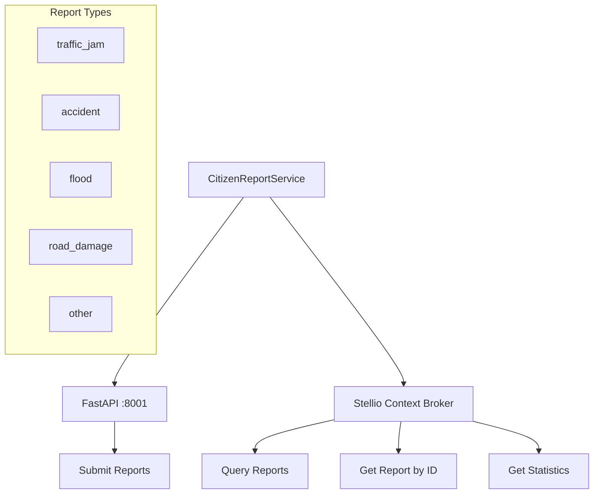

{/*
============================================================================
UIP - Urban Intelligence Platform
Copyright (c) 2025 UIP Team. All rights reserved.
https://github.com/UIP-Urban-Intelligence-Platform/UIP-Urban_Intelligence_Platform

SPDX-License-Identifier: MIT
============================================================================
File: apps/traffic-web-app/frontend/docs/docs/frontend/services/citizenReportService.md
Module: Traffic Web App - Citizen Report Service Documentation
Author: Nguyen Nhat Quang (Lead), Nguyen Viet Hoang, Nguyen Dinh Anh Tuan
Created: 2025-11-20
Version: 1.0.0
License: MIT

Description:
  API client documentation for crowdsourced citizen report submissions.
============================================================================
*/}

# Citizen Report Service

Service class for communicating with the external Citizen Ingestion API (FastAPI :8001) for crowdsourced traffic reports.

## Overview

The CitizenReportService handles all citizen-contributed data:

- Report submissions with photo uploads
- Report retrieval with advanced filtering
- Status updates (pending → verified/rejected)
- Aggregated statistics
- Direct integration with Stellio Context Broker



## Configuration

```typescript
// External Citizen Ingestion API (FastAPI :8001)
const CITIZEN_API_URL = import.meta.env.VITE_CITIZEN_API_URL || 'http://localhost:8001';
const STELLIO_URL = import.meta.env.VITE_STELLIO_URL || 'http://localhost:8080';
```

> **Note**: This service targets the separate FastAPI ingestion service, NOT the main Express backend (:5001).

## API Methods

### submitReport

Submit a new citizen report to the external API.

```typescript
interface CitizenReportSubmission {
    userId: string;
    reportType: ReportType;
    description?: string;
    latitude: number;
    longitude: number;
    imageUrl: string;
    timestamp?: string;
}

async submitReport(submission: CitizenReportSubmission): Promise<{
    status: 'accepted' | 'rejected';
    message: string;
    reportId: string;
    processingStatus: string;
}>
```

### queryReports

Query citizen reports from Stellio Context Broker with optional filters.

```typescript
interface CitizenReportFilters {
    reportType?: ReportType;
    status?: ReportStatus;
    aiVerified?: boolean;
    minConfidence?: number;
    hours?: number;
    userId?: string;
}

async queryReports(filters?: CitizenReportFilters): Promise<CitizenReport[]>
```

### getReportById

Get a specific report by its ID from Stellio.

```typescript
async getReportById(reportId: string): Promise<CitizenReport | null>
```

### getStats

Get aggregated statistics about citizen reports.

```typescript
interface CitizenReportStats {
    total: number;
    byType: Record<ReportType, number>;
    byStatus: Record<ReportStatus, number>;
    verified: number;
    unverified: number;
    avgConfidence: number;
    last24Hours: number;
}

async getStats(): Promise<CitizenReportStats>
```

## Usage

```typescript
import { CitizenReportService } from './services/citizenReportService';

// Submit a new report
const result = await CitizenReportService.submitReport({
    userId: 'user123',
    reportType: 'accident',
    description: 'Minor collision at intersection',
    latitude: 10.762622,
    longitude: 106.660172,
    imageUrl: 'https://example.com/photo.jpg'
});

// Query verified accident reports
const accidents = await CitizenReportService.queryReports({
    reportType: 'accident',
    aiVerified: true,
    minConfidence: 0.8
});

// Get statistics
const stats = await CitizenReportService.getStats();
console.log(`${stats.total} total reports, ${stats.verified} verified`);
```

## Report Types

| Type | Description |
|------|-------------|
| `traffic_jam` | Traffic congestion report |
| `accident` | Road accident or collision |
| `flood` | Flooding on road |
| `road_damage` | Pothole or road damage |
| `other` | Other traffic-related issue |

## Report Statuses

| Status | Description |
|--------|-------------|
| `pending_verification` | Awaiting AI verification |
| `verified` | Confirmed by AI system |
| `rejected` | Rejected as invalid |

## NGSI-LD Integration

Reports are stored as `CitizenObservation` entities in Stellio:

```json
{
    "id": "urn:ngsi-ld:CitizenObservation:abc123",
    "type": "CitizenObservation",
    "category": { "value": "accident" },
    "description": { "value": "Minor collision" },
    "location": {
        "value": {
            "type": "Point",
            "coordinates": [106.660172, 10.762622]
        }
    },
    "aiVerified": { "value": true },
    "aiConfidence": { "value": 0.92 },
    "reportedBy": { "object": "urn:ngsi-ld:User:user123" }
}
```

## Dependencies

- `axios@^1.4`: HTTP client with multipart support
- `citizenReport` types: TypeScript interfaces

## See Also

- [Citizen Report Types](../types/citizenReport.md)
- [CitizenReportForm Component](../components/CitizenReportForm.md)
- [CitizenReportMarkers Component](../components/CitizenReportMarkers.md)
