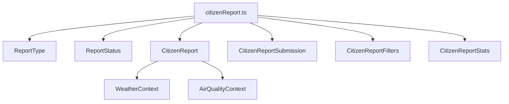

{/*
============================================================================
UIP - Urban Intelligence Platform
Copyright (c) 2025 UIP Team. All rights reserved.
https://github.com/UIP-Urban-Intelligence-Platform/UIP-Urban_Intelligence_Platform

SPDX-License-Identifier: MIT
============================================================================
File: citizenReport.md
Module: apps.traffic-web-app.frontend.docs.docs.frontend.types
Author: Nguyen Nhat Quang (Lead), Nguyen Viet Hoang, Nguyen Dinh Anh Tuan
Created: 2025-11-20
Version: 1.0.0
License: MIT

Description:
  TypeScript interfaces for crowdsourced citizen reports.
============================================================================
*/}

# Citizen Report Types

TypeScript type definitions and interfaces for citizen science crowdsourced reports.

## Overview

This module defines all data structures for:

- Report types (5 categories)
- Report statuses (3 states)
- Full report interface with metadata
- Submission DTOs
- Filter parameters
- Aggregated statistics



## Core Types

### ReportType

Five categories of citizen reports:

```typescript
export type ReportType = 
    | 'traffic_jam' 
    | 'accident' 
    | 'flood' 
    | 'road_damage' 
    | 'other';
```

| Type | Description |
|------|-------------|
| `traffic_jam` | Traffic congestion report |
| `accident` | Road accident or collision |
| `flood` | Flooding on road |
| `road_damage` | Pothole or road damage |
| `other` | Other traffic-related issue |

### ReportStatus

Three processing states:

```typescript
export type ReportStatus = 
    | 'pending_verification' 
    | 'verified' 
    | 'rejected';
```

| Status | Description |
|--------|-------------|
| `pending_verification` | Awaiting AI verification |
| `verified` | Confirmed by AI system |
| `rejected` | Rejected as invalid |

## Interfaces

### CitizenReport

Full report with all metadata:

```typescript
export interface CitizenReport {
    id: string;
    reportId: string;
    userId: string;
    reportType: ReportType;
    description?: string;
    latitude: number;
    longitude: number;
    imageUrl: string;
    status: ReportStatus;
    aiVerified: boolean;
    aiConfidence: number;
    weatherContext?: WeatherContext;
    airQualityContext?: AirQualityContext;
    dateObserved: string;
    createdAt: string;
}
```

### CitizenReportSubmission

Data transfer object for new submissions:

```typescript
export interface CitizenReportSubmission {
    userId: string;
    reportType: ReportType;
    description?: string;
    latitude: number;
    longitude: number;
    imageUrl: string;
    timestamp?: string;
}
```

### CitizenReportFilters

Query parameters for filtering reports:

```typescript
export interface CitizenReportFilters {
    reportType?: ReportType;
    status?: ReportStatus;
    aiVerified?: boolean;
    minConfidence?: number;
    hours?: number;
    userId?: string;
}
```

### CitizenReportStats

Aggregated statistics:

```typescript
export interface CitizenReportStats {
    total: number;
    byType: Record<ReportType, number>;
    byStatus: Record<ReportStatus, number>;
    verified: number;
    unverified: number;
    avgConfidence: number;
    last24Hours: number;
}
```

## Context Interfaces

### WeatherContext

Weather conditions at report time:

```typescript
export interface WeatherContext {
    temperature: number;
    condition: string;
    humidity: number;
    pressure: number;
    windSpeed: number;
    windDirection?: string;
}
```

### AirQualityContext

Air quality at report location:

```typescript
export interface AirQualityContext {
    aqi: number;
    pm25: number;
    pm10: number;
    no2?: number;
    o3?: number;
    dominantPollutant: string;
}
```

## Usage

```typescript
import { 
    CitizenReport, 
    CitizenReportSubmission, 
    ReportType 
} from '../types/citizenReport';

// Create a submission
const submission: CitizenReportSubmission = {
    userId: 'user123',
    reportType: 'accident',
    description: 'Minor collision at intersection',
    latitude: 10.762622,
    longitude: 106.660172,
    imageUrl: 'https://example.com/photo.jpg'
};

// Type-safe report handling
function handleReport(report: CitizenReport) {
    if (report.aiVerified && report.aiConfidence > 0.8) {
        console.log('High confidence verified report');
    }
}
```

## See Also

- [Citizen Report Service](../services/citizenReportService.md)
- [CitizenReportForm Component](../components/CitizenReportForm.md)
- [Types Index](./index.md)
