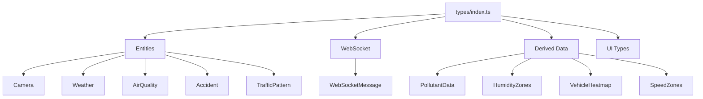

{/*
============================================================================
UIP - Urban Intelligence Platform
Copyright (c) 2025 UIP Team. All rights reserved.
https://github.com/UIP-Urban-Intelligence-Platform/UIP-Urban_Intelligence_Platform

SPDX-License-Identifier: MIT
============================================================================
File: apps/traffic-web-app/frontend/docs/docs/frontend/types/index.md
Module: Traffic Web App - Frontend Types Documentation
Author: Nguyen Nhat Quang (Lead), Nguyen Viet Hoang, Nguyen Dinh Anh Tuan
Created: 2025-11-20
Version: 1.0.0
License: MIT

Description:
  Centralized TypeScript type definitions and interfaces documentation.
============================================================================
*/}

# Types Index

Centralized TypeScript type definitions and interfaces for the entire frontend application.

## Overview

The types index defines data structures for:

- Core entities (Camera, Weather, AirQuality, Accident, TrafficPattern)
- Geospatial data (Location, Coordinates)
- WebSocket messages
- API responses
- Derived data types



## Core Entity Interfaces

### Camera

Traffic camera entity:

```typescript
export interface Camera {
    id: string;
    name: string;
    cameraName?: string;
    type?: 'PTZ' | 'Static' | 'Dome';
    cameraType?: string;
    location: {
        latitude: number;
        longitude: number;
        address: string;
        lat?: number;
        lng?: number;
    };
    status: 'active' | 'inactive' | 'maintenance' | 'online' | 'offline';
    streamUrl?: string;
    lastUpdate: string;
    dateModified?: string;
    district?: string;
}
```

### Weather

Weather observation:

```typescript
export interface Weather {
    id: string;
    cameraId?: string;
    location: {
        latitude: number;
        longitude: number;
        district: string;
        lat?: number;
        lng?: number;
    };
    temperature: number;
    humidity: number;
    rainfall: number;
    precipitation?: number;
    windSpeed: number;
    windDirection: string;
    condition: string;
    weatherType?: string;
    timestamp: string;
    dateObserved?: string;
    dateModified?: string;
}
```

### AirQuality

Air quality observation:

```typescript
export interface AirQuality {
    id: string;
    cameraId?: string;
    location: {
        latitude: number;
        longitude: number;
        station: string;
        lat?: number;
        lng?: number;
    };
    aqi: number;
    pm25: number;
    pm10: number;
    co: number;
    no2: number;
    so2: number;
    o3: number;
    level: 'good' | 'moderate' | 'unhealthy' | 'very_unhealthy' | 'hazardous';
    colorCode?: string;
    timestamp: string;
    dateObserved?: string;
    dateModified?: string;
}
```

### Accident

Road accident event:

```typescript
export interface Accident {
    id: string;
    affectedCamera?: string;
    location: {
        latitude: number;
        longitude: number;
        address: string;
        lat?: number;
        lng?: number;
    };
    type: 'collision' | 'pedestrian' | 'motorcycle' | 'vehicle' | 'other' | 'Multi-Vehicle' | 'Single-Vehicle';
    severity: 'minor' | 'moderate' | 'severe' | 'fatal';
    description: string;
    timestamp: string;
    dateDetected?: string;
    dateModified?: string;
    resolved: boolean;
    casualties?: number;
    vehicles?: number;
    confidence?: number;
}
```

### TrafficPattern

Traffic congestion pattern:

```typescript
export interface TrafficPattern {
    id: string;
    patternType: string;
    congestionLevel: 'free_flow' | 'light' | 'moderate' | 'heavy' | 'severe' | 'high' | 'medium' | 'low';
    timeRange: string;
    daysOfWeek: string[];
    affectedCameras: string[];
    avgVehicleCount?: number;
    roadSegment?: string;
    location?: {
        startPoint: { latitude: number; longitude: number; };
        endPoint: { latitude: number; longitude: number; };
    };
    averageSpeed?: number;
    vehicleCount?: number;
    timeOfDay?: string;
    dayOfWeek?: string;
    historicalData?: { date: string; averageSpeed: number; vehicleCount: number; }[];
    predictions?: { nextHour: number; confidence: number; };
    timestamp: string;
    dateModified?: string;
}
```

## WebSocket Types

```typescript
export interface WebSocketMessage {
    type:
        | 'initial'
        | 'camera_update'
        | 'cameras'
        | 'weather_update'
        | 'weathers'
        | 'aqi_update'
        | 'air_qualities'
        | 'new_accident'
        | 'accidents'
        | 'pattern_change'
        | 'patterns'
        | 'accident_alert'
        | 'aqi_warning'
        | 'ping'
        | 'pong'
        | 'update'
        | 'connection'
        | 'subscribed';
    priority?: 'high' | 'medium' | 'low';
    data?: any;
}
```

## Derived Data Types

### PollutantData

Aggregated pollutant data by location:

```typescript
export interface PollutantData {
    location: { lat: number; lng: number; };
    pm25: number;
    pm10: number;
    no2: number;
    o3: number;
    co: number;
    so2: number;
}
```

### HumidityZonesCollection

GeoJSON feature collection for humidity zones:

```typescript
export interface HumidityZonesCollection {
    type: 'FeatureCollection';
    features: HumidityZoneFeature[];
}
```

### VehicleHeatmapData

Traffic density heatmap data:

```typescript
export interface VehicleHeatmapData {
    points: Array<{ lat: number; lng: number; intensity: number; }>;
    maxIntensity: number;
}
```

### SpeedZonesCollection

GeoJSON feature collection for speed zones:

```typescript
export interface SpeedZonesCollection {
    type: 'FeatureCollection';
    features: SpeedZoneFeature[];
}
```

## Usage

```typescript
import { Camera, Weather, WebSocketMessage } from './types';

const camera: Camera = {
    id: 'urn:ngsi-ld:Camera:001',
    name: 'District 1 Main Street',
    location: { latitude: 10.762622, longitude: 106.660172, address: '123 Main St' },
    status: 'active',
    lastUpdate: new Date().toISOString()
};

function handleMessage(message: WebSocketMessage) {
    switch (message.type) {
        case 'camera_update':
            // Handle camera update
            break;
        case 'accident_alert':
            // Handle high-priority accident
            break;
    }
}
```

## Backend Compatibility

Many interfaces include optional properties for backend compatibility:

- `lat`/`lng` as alternatives to `latitude`/`longitude`
- `cameraName` as alternative to `name`
- `dateObserved`/`dateModified` for NGSI-LD timestamps

## See Also

- [Citizen Report Types](./citizenReport.md)
- [Traffic Store](../store/trafficStore.md)
- [API Service](../services/api.md)
