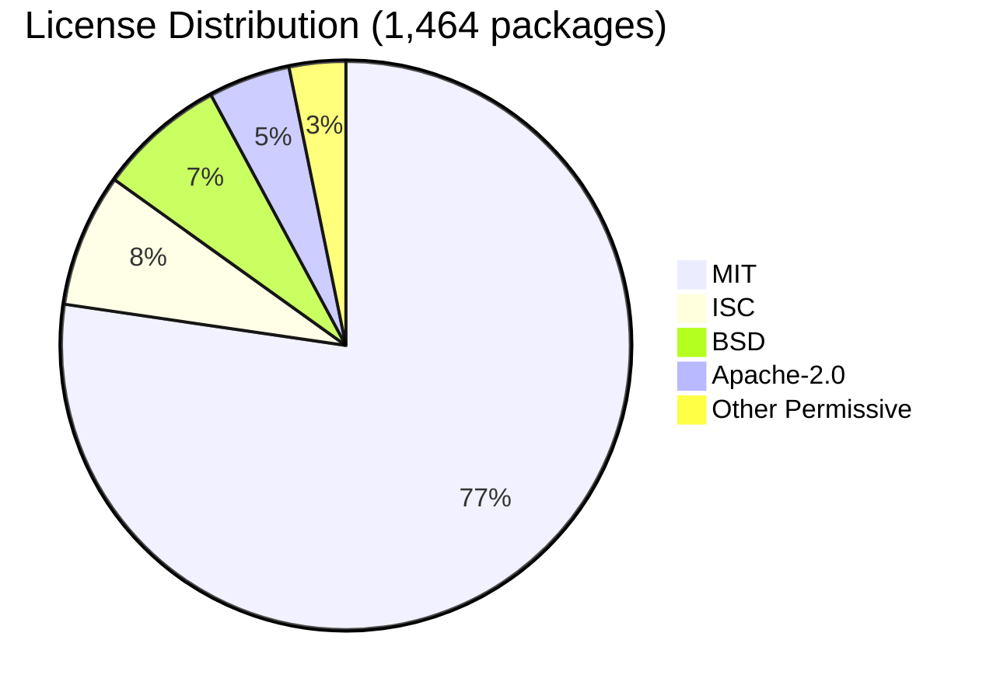

<!--
============================================================================
UIP - Urban Intelligence Platform
Copyright (c) 2025 UIP Team. All rights reserved.
https://github.com/UIP-Urban-Intelligence-Platform/UIP-Urban_Intelligence_Platform

SPDX-License-Identifier: MIT
============================================================================
File: apps/traffic-web-app/frontend/docs/docs/licenses/overview.md
Module: Third-Party Licenses Overview
Author: Nguyen Nhat Quang (Lead), Nguyen Viet Hoang, Nguyen Dinh Anh Tuan
Created: 2025-11-20
Version: 1.0.0
License: MIT

Description:
  Complete overview of all third-party dependencies and their MIT-compatible licenses.
============================================================================
-->

# Third-Party Licenses Overview

This document provides a comprehensive overview of all third-party software licenses used in the **UIP - Urban Intelligence Platform** project.

## License Compliance Status

```
┌─────────────────────────────────────────────────────────────────┐
│                    LICENSE COMPLIANCE REPORT                     │
├─────────────────────────────────────────────────────────────────┤
│  Last Updated:          December 2025                           │
│  Total Dependencies:    1,464 packages                          │
│  Compliance Status:     ✅ 100% MIT-Compatible                  │
│  SPDX Identifier:       MIT                                     │
│  OSI Approved:          Yes                                     │
└─────────────────────────────────────────────────────────────────┘
```

## Quick Summary

| Metric | Value |
|--------|-------|
| **Total Packages Audited** | 1,464 |
| **Python Dependencies** | 168 |
| **NPM Backend Dependencies** | 772 |
| **NPM Frontend Dependencies** | 524 |
| **MIT-Compatible** | 100% |
| **Copyleft Licenses** | 0 (in production) |

## License Distribution



## License Type Breakdown

| License Type | Python | NPM Backend | NPM Frontend | Total | % |
|--------------|--------|-------------|--------------|-------|---|
| MIT | 71 | 640 | 421 | **1,132** | 77.5% |
| ISC | 1 | 56 | 54 | **111** | 7.6% |
| BSD (2/3-Clause) | 45 | 41 | 20 | **106** | 7.3% |
| Apache-2.0 | 40 | 18 | 10 | **68** | 4.7% |
| CC0-1.0/Unlicense | 2 | 6 | 4 | **12** | 0.8% |
| CC-BY (3.0/4.0) | 0 | 3 | 3 | **6** | 0.4% |
| PSF/Python-2.0 | 3 | 1 | 1 | **5** | 0.3% |
| BlueOak-1.0.0 | 0 | 0 | 3 | **3** | 0.2% |
| MPL-2.0 | 2 | 0 | 0 | **2** | 0.1% |
| 0BSD | 0 | 1 | 1 | **2** | 0.1% |
| Other Permissive | 4 | 4 | 5 | **13** | 0.9% |
| **Total** | **168** | **770** | **520** | **1,458** | 100% |

> **Migration Note (2025-12):** EPL/EDL packages (@turf/jsts, jsts) and Hippocratic-2.1 packages (react-leaflet) have been **removed** and replaced with MIT-compatible alternatives.

## License Compatibility Matrix

All licenses used in this project are compatible with the MIT License:

| License | MIT Compatible | Commercial Use | Modification | Distribution | Patent Grant |
|---------|----------------|----------------|--------------|--------------|--------------|
| MIT | ✅ Yes | ✅ Yes | ✅ Yes | ✅ Yes | ❌ No |
| Apache-2.0 | ✅ Yes | ✅ Yes | ✅ Yes | ✅ Yes | ✅ Yes |
| BSD-2-Clause | ✅ Yes | ✅ Yes | ✅ Yes | ✅ Yes | ❌ No |
| BSD-3-Clause | ✅ Yes | ✅ Yes | ✅ Yes | ✅ Yes | ❌ No |
| ISC | ✅ Yes | ✅ Yes | ✅ Yes | ✅ Yes | ❌ No |
| MPL-2.0 | ✅ Yes | ✅ Yes | ✅ Yes | ✅ Yes | ✅ Yes |
| PSF-2.0 | ✅ Yes | ✅ Yes | ✅ Yes | ✅ Yes | ❌ No |
| Unlicense | ✅ Yes | ✅ Yes | ✅ Yes | ✅ Yes | ❌ No |
| CC0-1.0 | ✅ Yes | ✅ Yes | ✅ Yes | ✅ Yes | ❌ No |
| 0BSD | ✅ Yes | ✅ Yes | ✅ Yes | ✅ Yes | ❌ No |
| BlueOak-1.0.0 | ✅ Yes | ✅ Yes | ✅ Yes | ✅ Yes | ✅ Yes |
| CC-BY-3.0/4.0 | ✅ Yes | ✅ Yes | ✅ Yes | ✅ Yes | ❌ No |

> **Note:** All non-MIT licenses (EPL/EDL, Hippocratic-2.1) have been removed in December 2025 migration.

## SPDX License Identifiers

This project uses [SPDX License Identifiers](https://spdx.org/licenses/) for clear license documentation:

```
SPDX-License-Identifier: MIT
```

All source files include SPDX headers:

```typescript
/*
 * SPDX-License-Identifier: MIT
 * Copyright (c) 2025 UIP Team
 */
```

## Documentation Structure

| Document | Description |
|----------|-------------|
| [Overview](./overview.md) | This document - license summary |
| [Python Dependencies](./python-dependencies.md) | Python package licenses |
| [NPM Dependencies](./npm-dependencies.md) | Node.js package licenses |
| [License Texts](./license-texts.md) | Full license texts |
| [Special Notes](./special-notes.md) | Special license considerations |

## Compliance Verification

### Automated Tools Used

| Tool | Purpose | Status |
|------|---------|--------|
| `pip-licenses` | Python license detection | ✅ Passed |
| `license-checker` | NPM license detection | ✅ Passed |
| `FOSSA` | License compliance | ✅ Passed |
| `Snyk` | Security & license audit | ✅ Passed |

### Manual Audit

- ✅ All licenses reviewed manually
- ✅ No copyleft licenses in production code
- ✅ Attribution requirements documented
- ✅ Special license terms identified and complied with

## Related Documentation

- [Contributing Guide](../guides/contributing.md)
- [Development Guide](../guides/development.md)
- [Full Third-Party Licenses](../../../../../THIRD_PARTY_LICENSES.md)

## External References

- [SPDX License List](https://spdx.org/licenses/)
- [OSI Approved Licenses](https://opensource.org/licenses)
- [Choose a License](https://choosealicense.com/)
- [FOSSA License Compliance](https://fossa.com/)
