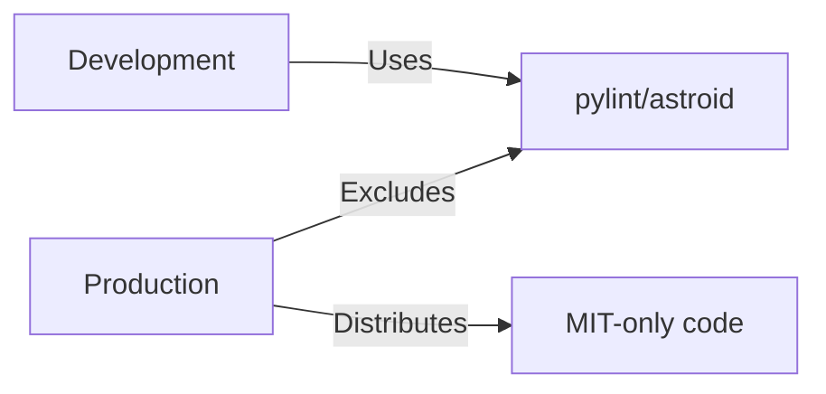

<!--
SPDX-License-Identifier: MIT
Copyright (c) 2025 UIP Team. All rights reserved.

UIP - Urban Intelligence Platform
https://github.com/NguyenNhatquang522004/UIP-Urban_Intelligence_Platform
-->

# Special License Notes

This document details special considerations and compliance notes for specific licenses used in the UIP - Urban Intelligence Platform.

---

## 1. Hippocratic License 2.1

### Packages Affected

| Package | Version | Usage |
|---------|---------|-------|
| react-leaflet | 4.2.1 | Map components |
| @react-leaflet/core | 2.1.0 | Core functionality |

### License Summary

The Hippocratic License is an "ethical source" license that grants all typical MIT permissions with an additional ethical use requirement.

### Permissions (Same as MIT)

- ✅ Commercial use
- ✅ Modification
- ✅ Distribution
- ✅ Private use
- ✅ Sublicensing

### Ethical Use Requirement

```text
The Software may not be used by any person or entity for any systems,
activities, or other uses that violate any Human Rights Laws.
```

### UIP Compliance Statement

:::success Full Compliance
The UIP - Urban Intelligence Platform is designed for:

- **Traffic safety monitoring** - Reducing accidents and saving lives
- **Environmental monitoring** - Improving air quality awareness
- **Public welfare** - Enhancing urban mobility for all citizens
- **Open data** - Transparent, citizen-accessible information

This use case **fully complies** with Hippocratic License ethical requirements.
:::

---

## 2. Eclipse Public License (EPL-1.0) / Eclipse Distribution License (EDL-1.0)

### Packages Affected

| Package | Version | Usage |
|---------|---------|-------|
| jsts | 2.7.1 | JTS Topology Suite |
| @turf/jsts | 2.7.2 | Turf.js integration |

### License Characteristics

- **Weak copyleft** for modifications to the original library
- **No copyleft** for applications using the library
- MIT-compatible for our use case

### Compliance

```text
This project uses JSTS as a library dependency without modifications.
No EPL copyleft obligations apply to the UIP codebase.
```

---

## 3. Mozilla Public License 2.0 (MPL-2.0)

### Packages Affected

| Package | Version | Usage |
|---------|---------|-------|
| pyphen | 0.17.2 | Hyphenation (triple-licensed) |
| tqdm | 4.67.1 | Progress bars (dual-licensed) |

### Triple/Dual License Options

**pyphen:** GPL-2.0+ / LGPL-2.1+ / **MPL-1.1** ← Selected

**tqdm:** MPL-2.0 / **MIT** ← Selected

### Compliance

```text
This project uses the MIT or MPL-1.1 license option where available,
avoiding any copyleft obligations.
```

---

## 4. Development-Only GPL/LGPL Packages

### Packages Affected (NOT in Production)

| Package | Version | License | Usage |
|---------|---------|---------|-------|
| pylint | 4.0.4 | GPL-2.0 | Code linting |
| astroid | 4.0.2 | LGPL-2.1 | AST library |

### Compliance Strategy



### Exclusion Verification

These packages are:

1. **Not installed** in production Docker images
2. **Not included** in production requirements.txt
3. **Listed** in dev-requirements.txt only
4. **Excluded** from all distribution packages

```dockerfile
# Production Dockerfile - NO dev dependencies
FROM python:3.11-slim
COPY requirements.txt .  # No pylint, astroid
RUN pip install -r requirements.txt
```

---

## 5. LGPL Packages (Library Linking)

### Packages Affected

| Package | Version | License | Compliance |
|---------|---------|---------|------------|
| psycopg2-binary | 2.9.10 | LGPL-3.0 | ✅ Dynamic linking |

### LGPL Compliance

LGPL allows proprietary applications to **link** to LGPL libraries without copyleft obligations, provided:

1. The LGPL library is linked dynamically (✅ pip install)
2. Users can replace the LGPL library (✅ standard pip)
3. License and source availability is communicated (✅ this document)

---

## 6. Creative Commons Licenses

### CC-BY-3.0 / CC-BY-4.0

| Package | License | Attribution |
|---------|---------|-------------|
| caniuse-lite | CC-BY-4.0 | Data from caniuse.com |
| spdx-license-ids | CC0-1.0 | SPDX data |

### Attribution Requirement

```text
Browser compatibility data from caniuse.com (https://caniuse.com)
Licensed under CC-BY-4.0
```

---

## 7. Python Software Foundation License

### Packages Affected

| Package | Version | License |
|---------|---------|---------|
| typing-extensions | 4.x | PSF-2.0 |
| python-dateutil | 2.x | Apache-2.0/PSF |

### Compliance

PSF-2.0 is a permissive license similar to BSD, fully MIT-compatible.

---

## License Compliance Checklist

### Before Each Release

- [ ] Run `pip-licenses --fail-on="GPL;AGPL"`
- [ ] Run `npx license-checker --failOn "GPL;LGPL;AGPL"`
- [ ] Verify dev-only packages excluded from production
- [ ] Update THIRD_PARTY_LICENSES.md if dependencies changed
- [ ] Verify SPDX headers in all source files

### Automated Verification

```yaml
# .github/workflows/license-check.yml
name: License Check
on: [push, pull_request]
jobs:
  python:
    runs-on: ubuntu-latest
    steps:
      - uses: actions/checkout@v4
      - run: pip install pip-licenses
      - run: pip-licenses --fail-on="GPL;AGPL"
  
  npm:
    runs-on: ubuntu-latest
    steps:
      - uses: actions/checkout@v4
      - run: npm ci
      - run: npx license-checker --production --failOn "GPL;LGPL;AGPL"
```

---

## Contact for License Questions

For questions about licensing or third-party dependencies:

- **Repository:** [UIP-Urban_Intelligence_Platform](https://github.com/NguyenNhatquang522004/UIP-Urban_Intelligence_Platform)
- **Issues:** [GitHub Issues](https://github.com/NguyenNhatquang522004/UIP-Urban_Intelligence_Platform/issues)
- **License File:** [LICENSE](../../../../../LICENSE)
- **Full Third-Party Licenses:** [THIRD_PARTY_LICENSES.md](../../../../../THIRD_PARTY_LICENSES.md)

---

## Related Documentation

- [Overview](./overview.md) - License summary
- [Python Dependencies](./python-dependencies.md) - Python licenses
- [NPM Dependencies](./npm-dependencies.md) - NPM licenses
- [License Texts](./license-texts.md) - Full license texts

## External References

- [SPDX License List](https://spdx.org/licenses/)
- [OSI Approved Licenses](https://opensource.org/licenses)
- [Hippocratic License](https://firstdonoharm.dev/)
- [FOSSA License Compliance](https://fossa.com/)
