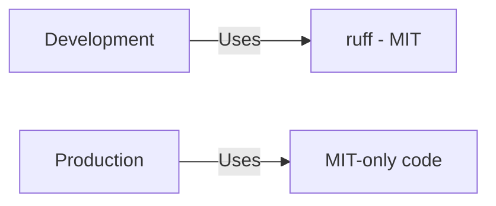

<!--
============================================================================
UIP - Urban Intelligence Platform
Copyright (c) 2025 UIP Team. All rights reserved.
https://github.com/UIP-Urban-Intelligence-Platform/UIP-Urban_Intelligence_Platform

SPDX-License-Identifier: MIT
============================================================================
File: apps/traffic-web-app/frontend/docs/docs/licenses/special-notes.md
Module: Special License Notes Documentation
Author: Nguyen Nhat Quang (Lead), Nguyen Viet Hoang, Nguyen Dinh Anh Tuan
Created: 2025-11-20
Version: 1.0.0
License: MIT

Description:
  Special considerations and compliance notes for specific licenses.
============================================================================
-->

# Special License Notes

This document details special considerations and compliance notes for specific licenses used in the UIP - Urban Intelligence Platform.

---

## 1. ~~Hippocratic License 2.1~~ (REMOVED - December 2025)

:::warning Migration Complete
The react-leaflet packages (Hippocratic-2.1) have been **replaced** with MIT-compatible alternatives:

| Old Package | New Package | License |
|-------------|-------------|---------|
| react-leaflet | react-map-gl | MIT |
| @react-leaflet/core | maplibre-gl | BSD-3-Clause |
| leaflet.heat | Native MapLibre heatmap | BSD-3-Clause |
| react-leaflet-cluster | Native MapLibre clustering | BSD-3-Clause |

**Result:** 100% MIT-compatible frontend licensing achieved.
:::

---

## ~~2. Eclipse Public License (EPL-1.0) / Eclipse Distribution License (EDL-1.0)~~ (REMOVED - December 2025)

### ~~Packages Affected~~ **REMOVED**

| Package | Version | Status |
|---------|---------|--------|
| ~~jsts~~ | ~~2.7.1~~ | **REMOVED** |
| ~~@turf/jsts~~ | ~~2.7.2~~ | **REMOVED** |

:::warning Migration Complete
These packages have been **removed** from the project to achieve 100% MIT-compatible licensing.

**Replacement:** Native MapLibre GL JS features and MIT-licensed @turf/turf functions.

**Result:** No EPL/EDL dependencies remain in the project.
:::

---

## 3. Mozilla Public License 2.0 (MPL-2.0)

### Packages Affected

| Package | Version | Usage |
|---------|---------|-------|
| tqdm | 4.67.1 | Progress bars (dual-licensed) |
| certifi | 2025.11.12 | CA certificates |
| pathspec | 0.12.1 | Path matching |

### License Selection

**tqdm:** MPL-2.0 / **MIT** ← Selected

> **Note (2025-12):** pyphen has been **removed** from the project (was GPL/LGPL dependency of weasyprint).

### Compliance

```text
This project uses the MIT or MPL-1.1 license option where available,
avoiding any copyleft obligations.
```

---

## 4. Development-Only Tools (All MIT)

### Current Development Stack

| Package | Version | License | Usage |
|---------|---------|---------|-------|
| ruff | 0.1+ | MIT | Linting & import sorting |
| black | 23.11+ | MIT | Code formatting |
| mypy | 1.7+ | MIT | Type checking |
| pytest | 7.4+ | MIT | Testing framework |

> **Note (2025-12):** Previously used GPL tools (pylint, astroid) have been replaced with MIT-licensed ruff.

### Compliance Status



---

## 5. LGPL Packages (Library Linking)

### Packages Affected

| Package | Version | License | Compliance |
|---------|---------|---------|------------|
| psycopg2-binary | 2.9.10 | LGPL-3.0 | ✅ Dynamic linking |

### LGPL Compliance

LGPL allows proprietary applications to **link** to LGPL libraries without copyleft obligations, provided:

1. The LGPL library is linked dynamically (✅ pip install)
2. Users can replace the LGPL library (✅ standard pip)
3. License and source availability is communicated (✅ this document)

---

## 6. Creative Commons Licenses

### CC-BY-3.0 / CC-BY-4.0

| Package | License | Attribution |
|---------|---------|-------------|
| caniuse-lite | CC-BY-4.0 | Data from caniuse.com |
| spdx-license-ids | CC0-1.0 | SPDX data |

### Attribution Requirement

```text
Browser compatibility data from caniuse.com (https://caniuse.com)
Licensed under CC-BY-4.0
```

---

## 7. Python Software Foundation License

### Packages Affected

| Package | Version | License |
|---------|---------|---------|
| typing-extensions | 4.x | PSF-2.0 |
| python-dateutil | 2.x | Apache-2.0/PSF |

### Compliance

PSF-2.0 is a permissive license similar to BSD, fully MIT-compatible.

---

## License Compliance Checklist

### Before Each Release

- [ ] Run `pip-licenses --fail-on="GPL;AGPL"`
- [ ] Run `npx license-checker --failOn "GPL;LGPL;AGPL"`
- [ ] Verify dev-only packages excluded from production
- [ ] Update THIRD_PARTY_LICENSES.md if dependencies changed
- [ ] Verify SPDX headers in all source files

### Automated Verification

```yaml
# .github/workflows/license-check.yml
name: License Check
on: [push, pull_request]
jobs:
  python:
    runs-on: ubuntu-latest
    steps:
      - uses: actions/checkout@v4
      - run: pip install pip-licenses
      - run: pip-licenses --fail-on="GPL;AGPL"
  
  npm:
    runs-on: ubuntu-latest
    steps:
      - uses: actions/checkout@v4
      - run: npm ci
      - run: npx license-checker --production --failOn "GPL;LGPL;AGPL"
```

---

## Contact for License Questions

For questions about licensing or third-party dependencies:

- **Repository:** [UIP-Urban_Intelligence_Platform](https://github.com/UIP-Urban-Intelligence-Platform/UIP-Urban_Intelligence_Platform)
- **Issues:** [GitHub Issues](https://github.com/UIP-Urban-Intelligence-Platform/UIP-Urban_Intelligence_Platform/issues)
- **License File:** [LICENSE](../../../../../LICENSE)
- **Full Third-Party Licenses:** [THIRD_PARTY_LICENSES.md](../../../../../THIRD_PARTY_LICENSES.md)

---

## Related Documentation

- [Overview](./overview.md) - License summary
- [Python Dependencies](./python-dependencies.md) - Python licenses
- [NPM Dependencies](./npm-dependencies.md) - NPM licenses
- [License Texts](./license-texts.md) - Full license texts

## External References

- [SPDX License List](https://spdx.org/licenses/)
- [OSI Approved Licenses](https://opensource.org/licenses)
- [Hippocratic License](https://firstdonoharm.dev/)
- [FOSSA License Compliance](https://fossa.com/)
