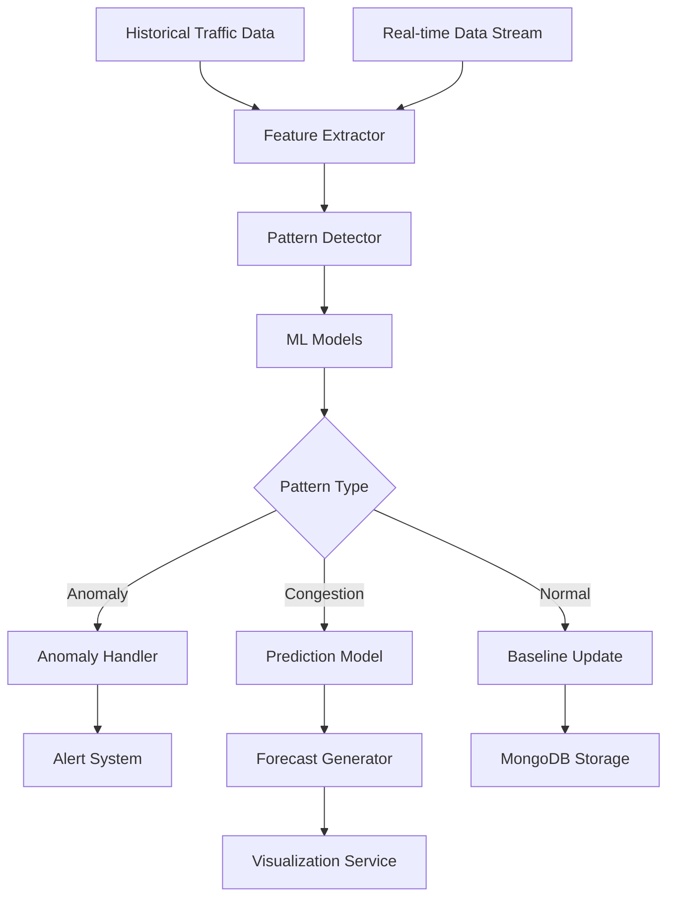

<!--
SPDX-License-Identifier: MIT
Copyright (c) 2025 UIP Team. All rights reserved.

UIP - Urban Intelligence Platform
Pattern recognition agent documentation.

Module: apps/traffic-web-app/frontend/docs/docs/agents/analytics/pattern-recognition.md
Author: UIP Team
Version: 1.0.0
-->

# Pattern Recognition Agent

## Overview

The Pattern Recognition Agent employs machine learning algorithms to identify recurring traffic patterns, predict congestion, detect anomalies, and provide actionable insights for traffic management optimization.

## Features

- **Traffic Pattern Detection**: Identify daily, weekly, and seasonal patterns
- **Anomaly Detection**: Real-time detection of unusual traffic behavior
- **Predictive Analytics**: Forecast traffic conditions up to 24 hours ahead
- **Hotspot Identification**: Locate recurring congestion points
- **Correlation Analysis**: Link patterns with events, weather, accidents
- **Adaptive Learning**: Continuous model improvement from new data

## Architecture



## Configuration

**File**: `config/pattern_recognition.yaml`

```yaml
pattern_recognition:
  models:
    time_series:
      type: "prophet"
      seasonality_mode: "multiplicative"
      changepoint_prior_scale: 0.05
      
    anomaly_detection:
      type: "isolation_forest"
      contamination: 0.1
      n_estimators: 100
      
    clustering:
      type: "dbscan"
      eps: 0.5
      min_samples: 5
      
  feature_extraction:
    temporal_features:
      - "hour_of_day"
      - "day_of_week"
      - "month"
      - "is_holiday"
      - "is_weekend"
      
    traffic_features:
      - "vehicle_count"
      - "average_speed"
      - "congestion_level"
      - "flow_rate"
      
    environmental_features:
      - "weather_condition"
      - "temperature"
      - "precipitation"
      - "visibility"
      
  pattern_types:
    daily_patterns:
      time_window: "24h"
      min_occurrences: 5
      
    weekly_patterns:
      time_window: "7d"
      min_occurrences: 3
      
    event_patterns:
      look_back: "30d"
      correlation_threshold: 0.7
      
  thresholds:
    anomaly_score: 0.75
    prediction_confidence: 0.80
    pattern_strength: 0.65
```

## Usage

### Basic Pattern Detection

```python
from src.agents.analytics.pattern_recognition_agent import PatternRecognitionAgent

# Initialize agent
agent = PatternRecognitionAgent()

# Detect patterns in historical data
patterns = agent.detect_patterns(
    location="District 1",
    time_range="30d"
)

print(f"Patterns found: {len(patterns)}")
for pattern in patterns:
    print(f"Type: {pattern.type}")
    print(f"Strength: {pattern.strength}")
    print(f"Occurrences: {pattern.occurrences}")
```

### Anomaly Detection

```python
# Real-time anomaly detection
anomaly = agent.detect_anomaly(
    camera_id="CAM_001",
    current_metrics={
        "vehicle_count": 150,
        "average_speed": 15,
        "congestion_level": "high"
    }
)

if anomaly.is_anomalous:
    print(f"Anomaly detected!")
    print(f"Severity: {anomaly.severity}")
    print(f"Confidence: {anomaly.confidence}")
    print(f"Expected: {anomaly.expected_values}")
    print(f"Actual: {anomaly.actual_values}")
```

### Traffic Prediction

```python
# Predict traffic for next 24 hours
predictions = agent.predict_traffic(
    location="District 1",
    forecast_hours=24
)

for hour in predictions:
    print(f"{hour.timestamp}: {hour.vehicle_count} vehicles")
    print(f"  Congestion Level: {hour.congestion_level}")
    print(f"  Confidence: {hour.confidence}")
```

### Hotspot Analysis

```python
# Identify congestion hotspots
hotspots = agent.identify_hotspots(
    time_range="30d",
    min_occurrences=10
)

for hotspot in hotspots:
    print(f"Location: {hotspot.location}")
    print(f"Frequency: {hotspot.frequency}")
    print(f"Peak Hours: {hotspot.peak_hours}")
    print(f"Average Duration: {hotspot.avg_duration}min")
```

## API Reference

### Class: `PatternRecognitionAgent`

#### Methods

##### `detect_patterns(location: str, time_range: str) -> List[Pattern]`

Detect recurring traffic patterns.

**Parameters:**
- `location` (str): Geographic location
- `time_range` (str): Analysis period (e.g., "7d", "30d")

**Returns:**
- List[Pattern]: Detected patterns

**Example:**
```python
patterns = agent.detect_patterns(
    location="District 1",
    time_range="30d"
)
```

##### `detect_anomaly(camera_id: str, current_metrics: dict) -> AnomalyResult`

Detect traffic anomalies in real-time.

**Parameters:**
- `camera_id` (str): Camera identifier
- `current_metrics` (dict): Current traffic metrics

**Returns:**
- AnomalyResult: Anomaly detection result

##### `predict_traffic(location: str, forecast_hours: int) -> List[Prediction]`

Predict future traffic conditions.

**Parameters:**
- `location` (str): Location to predict
- `forecast_hours` (int): Forecast horizon (1-24 hours)

**Returns:**
- List[Prediction]: Hourly predictions

**Example:**
```python
forecast = agent.predict_traffic(
    location="District 1",
    forecast_hours=12
)
```

##### `identify_hotspots(time_range: str, min_occurrences: int = 5) -> List[Hotspot]`

Identify recurring congestion hotspots.

**Parameters:**
- `time_range` (str): Analysis period
- `min_occurrences` (int): Minimum occurrence threshold

**Returns:**
- List[Hotspot]: Identified hotspots

##### `analyze_correlation(event_type: str, time_range: str) -> CorrelationAnalysis`

Analyze correlation between events and traffic patterns.

**Parameters:**
- `event_type` (str): Event type (weather, accidents, holidays)
- `time_range` (str): Analysis period

**Returns:**
- CorrelationAnalysis: Correlation results

**Example:**
```python
correlation = agent.analyze_correlation(
    event_type="heavy_rain",
    time_range="90d"
)
print(f"Correlation coefficient: {correlation.coefficient}")
```

### Data Models

#### `Pattern`

```python
@dataclass
class Pattern:
    id: str
    type: str                      # daily, weekly, seasonal, event-based
    location: dict
    strength: float                # 0.0-1.0
    occurrences: int
    time_windows: List[dict]       # When pattern occurs
    characteristics: dict
    confidence: float
    first_detected: datetime
    last_updated: datetime
```

#### `AnomalyResult`

```python
@dataclass
class AnomalyResult:
    timestamp: datetime
    is_anomalous: bool
    severity: str                  # low, medium, high, critical
    confidence: float
    anomaly_score: float           # 0.0-1.0
    expected_values: dict
    actual_values: dict
    deviation_percentage: float
    possible_causes: List[str]
```

#### `Prediction`

```python
@dataclass
class Prediction:
    timestamp: datetime
    location: dict
    vehicle_count: int
    average_speed: float
    congestion_level: str
    confidence: float
    prediction_interval: dict      # upper/lower bounds
    factors: List[str]
```

#### `Hotspot`

```python
@dataclass
class Hotspot:
    location: dict
    frequency: int                 # Occurrences in time_range
    peak_hours: List[int]
    avg_duration: int              # minutes
    severity_distribution: dict
    contributing_factors: List[str]
    historical_trend: str          # increasing, stable, decreasing
```

## Pattern Types

### 1. Daily Patterns

```python
# Rush hour patterns
daily_patterns = agent.detect_patterns(
    location="District 1",
    time_range="30d",
    pattern_type="daily"
)

for pattern in daily_patterns:
    if pattern.type == "morning_rush":
        print(f"Morning rush: {pattern.time_windows}")
    elif pattern.type == "evening_rush":
        print(f"Evening rush: {pattern.time_windows}")
```

### 2. Weekly Patterns

```python
# Weekend vs weekday patterns
weekly_patterns = agent.detect_patterns(
    time_range="90d",
    pattern_type="weekly"
)

# Compare weekend and weekday traffic
comparison = agent.compare_patterns(
    pattern1=weekly_patterns["weekend"],
    pattern2=weekly_patterns["weekday"]
)
```

### 3. Event-Based Patterns

```python
# Patterns related to specific events
event_patterns = agent.detect_event_patterns(
    event_types=["concerts", "sports", "holidays"],
    time_range="1y"
)
```

### 4. Seasonal Patterns

```python
# Monsoon season traffic patterns
seasonal = agent.detect_patterns(
    pattern_type="seasonal",
    season="monsoon",
    time_range="3y"
)
```

## Machine Learning Models

### Time Series Forecasting (Prophet)

```python
# Configure Prophet model
agent.configure_prophet_model(
    seasonality_mode="multiplicative",
    yearly_seasonality=True,
    weekly_seasonality=True,
    daily_seasonality=True
)
```

### Anomaly Detection (Isolation Forest)

```python
# Train anomaly detection model
agent.train_anomaly_detector(
    training_data=historical_data,
    contamination=0.1,
    n_estimators=100
)
```

### Clustering (DBSCAN)

```python
# Cluster similar traffic patterns
clusters = agent.cluster_patterns(
    eps=0.5,
    min_samples=5,
    metric="euclidean"
)
```

## Integration Examples

### Integration with Accident Detection

```python
from src.agents.analytics.accident_detection_agent import AccidentDetectionAgent

pattern_agent = PatternRecognitionAgent()
accident_agent = AccidentDetectionAgent()

# Analyze accident patterns
accident_patterns = pattern_agent.analyze_accident_patterns(
    time_range="90d"
)

print(f"High-risk locations: {accident_patterns.hotspots}")
print(f"Peak accident hours: {accident_patterns.peak_hours}")

# Predict high-risk periods
risk_forecast = pattern_agent.predict_accident_risk(
    location="Highway 1",
    forecast_hours=24
)
```

### Integration with Weather Data

```python
from src.agents.data_collection.weather_agent import WeatherAgent

weather_agent = WeatherAgent()

# Analyze weather-traffic correlation
correlation = pattern_agent.analyze_weather_correlation(
    weather_data=weather_agent.get_historical_weather("30d"),
    traffic_data=pattern_agent.get_traffic_history("30d")
)

print(f"Rain impact on traffic: {correlation.rain_impact}%")
print(f"Temperature correlation: {correlation.temp_coefficient}")
```

### Integration with Route Planning

```python
# Use patterns for intelligent route planning
def get_optimal_route(origin, destination, departure_time):
    # Get predicted traffic for departure time
    prediction = pattern_agent.predict_traffic(
        location=origin,
        timestamp=departure_time
    )
    
    # Factor in predicted congestion
    route = route_planner.calculate_route(
        origin=origin,
        destination=destination,
        avoid_congestion=prediction.congestion_hotspots
    )
    
    return route
```

## Monitoring & Metrics

### Model Performance

```python
metrics = agent.get_model_metrics()

print(f"Prediction Accuracy: {metrics.accuracy}%")
print(f"Mean Absolute Error: {metrics.mae}")
print(f"Anomaly Detection Precision: {metrics.precision}")
print(f"Anomaly Detection Recall: {metrics.recall}")
```

### Pattern Statistics

```python
stats = agent.get_pattern_statistics(time_range="30d")

print(f"Total Patterns Detected: {stats.total_patterns}")
print(f"Active Patterns: {stats.active_patterns}")
print(f"Pattern Types Distribution: {stats.type_distribution}")
```

## Performance Optimization

### Feature Caching

```python
# Cache computed features
agent.enable_feature_caching(
    cache_ttl=3600,  # 1 hour
    cache_size=1000
)
```

### Parallel Processing

```python
# Process multiple locations in parallel
agent.configure_parallel_processing(
    num_workers=4,
    batch_size=50
)
```

### Model Optimization

```python
# Use lightweight models for real-time detection
agent.configure_realtime_mode(
    model_complexity="low",
    max_latency_ms=100
)
```

## Testing

### Unit Tests

```python
import pytest

def test_pattern_detection():
    agent = PatternRecognitionAgent()
    
    # Test with known pattern data
    patterns = agent.detect_patterns(
        location="Test Location",
        time_range="7d"
    )
    
    assert len(patterns) > 0
    assert all(p.strength >= 0 and p.strength <= 1 for p in patterns)

def test_anomaly_detection():
    agent = PatternRecognitionAgent()
    
    # Test with normal and anomalous data
    normal_result = agent.detect_anomaly("CAM_001", normal_metrics)
    anomalous_result = agent.detect_anomaly("CAM_001", anomalous_metrics)
    
    assert normal_result.is_anomalous == False
    assert anomalous_result.is_anomalous == True
```

## Best Practices

### 1. Regular Model Retraining

```python
# Retrain models with new data monthly
agent.schedule_retraining(
    frequency="monthly",
    min_new_samples=1000
)
```

### 2. Adaptive Thresholds

```python
# Adjust thresholds based on location characteristics
agent.set_adaptive_thresholds(
    location_type="urban_center",
    traffic_density="high"
)
```

### 3. Multi-Model Ensemble

```python
# Combine multiple models for better accuracy
agent.enable_ensemble(
    models=["prophet", "lstm", "arima"],
    voting_strategy="weighted"
)
```

## Troubleshooting

### Issue: Poor Prediction Accuracy

**Solution**: Increase training data and add more features

```python
agent.add_features([
    "holiday_indicator",
    "special_events",
    "construction_activity"
])
agent.retrain(min_training_days=90)
```

### Issue: Too Many False Anomalies

**Solution**: Adjust contamination parameter

```python
agent.configure_anomaly_detector(contamination=0.05)
```

## Related Documentation

- [Accident Detection Agent](./accident-detection.md)
- [Congestion Detection Agent](./congestion-detection.md)
- [Weather Integration Agent](../data-collection/weather-integration.md)

## License

MIT License - Copyright (c) 2025 UIP Contributors (Nguyễn Nhật Quang, Nguyễn Việt Hoàng, Nguyễn Đình Anh Tuấn)

See [LICENSE](../LICENSE) for details.
