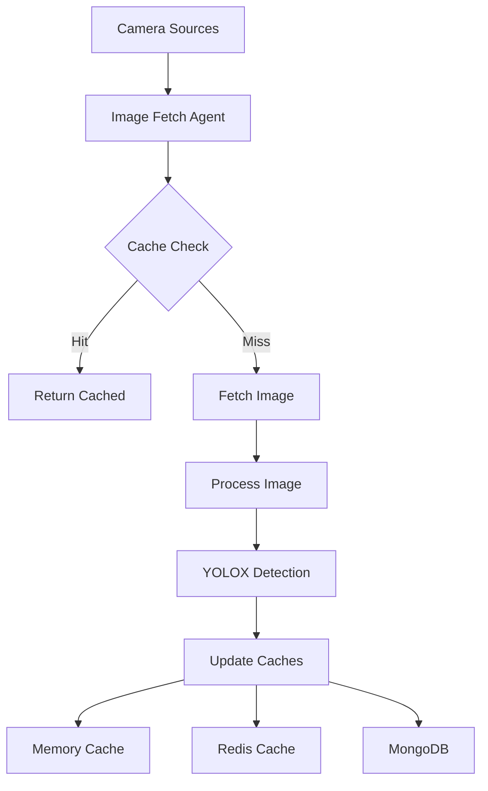
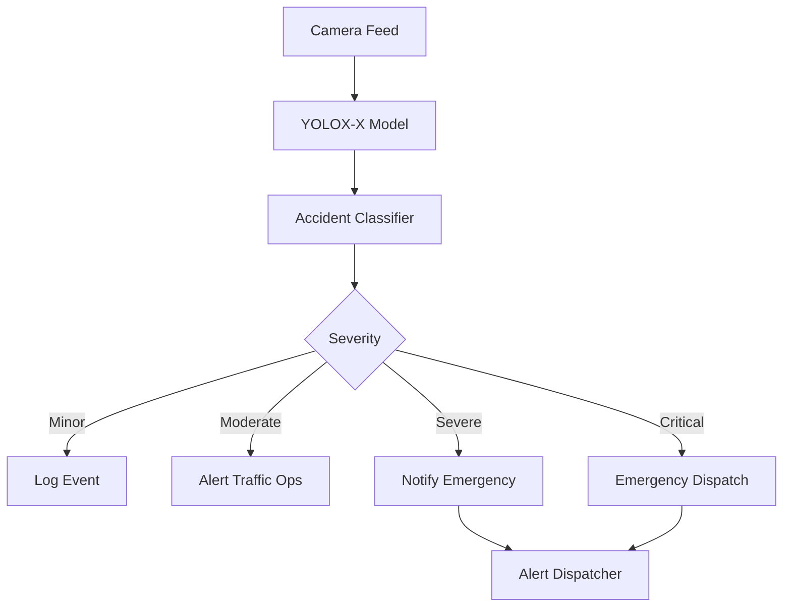

<!--
SPDX-License-Identifier: MIT
Copyright (c) 2025 UIP Team. All rights reserved.

UIP - Urban Intelligence Platform
Complete agents reference documentation.

Module: apps/traffic-web-app/frontend/docs/docs/agents/complete-agents-reference.md
Author: UIP Team
Version: 1.0.0
-->

# Complete Agents Reference

## Overview

Comprehensive documentation for all 30+ agents in the HCMC Traffic Management System, organized by category with full technical specifications, configurations, and integration examples.

---

## Table of Contents

### [Data Collection Agents](#data-collection-agents)
1. [Camera Image Fetch Agent](#camera-image-fetch-agent)
2. [Weather Integration Agent](#weather-integration-agent)
3. [Air Quality Agent](#air-quality-agent)

### [Analytics Agents](#analytics-agents)
4. [Accident Detection Agent](#accident-detection-agent)
5. [Pattern Recognition Agent](#pattern-recognition-agent)
6. [Congestion Detection Agent](#congestion-detection-agent)
7. [Computer Vision Analysis Agent](#computer-vision-analysis-agent)
8. [Citizen Report Agent](#citizen-report-agent)

### [Transformation Agents](#transformation-agents)
9. [NGSI-LD Transformer Agent](#ngsi-ld-transformer-agent)
10. [SOSA/SSN Mapper Agent](#sosa-ssn-mapper-agent)

### [RDF & Linked Data Agents](#rdf-linked-data-agents)
11. [NGSI-LD to RDF Agent](#ngsi-ld-to-rdf-agent)
12. [Triplestore Loader Agent](#triplestore-loader-agent)
13. [LOD Linkset Enrichment Agent](#lod-linkset-enrichment-agent)
14. [Content Negotiation Agent](#content-negotiation-agent)
15. [Smart Data Models Validation Agent](#smart-data-models-validation-agent)

### [Context Management Agents](#context-management-agents)
16. [Entity Publisher Agent](#entity-publisher-agent)
17. [Stellio State Query Agent](#stellio-state-query-agent)
18. [Temporal Data Manager Agent](#temporal-data-manager-agent)
19. [State Updater Agent](#state-updater-agent)

### [Notification Agents](#notification-agents)
20. [Alert Dispatcher Agent](#alert-dispatcher-agent)
21. [Subscription Manager Agent](#subscription-manager-agent)
22. [Incident Report Generator Agent](#incident-report-generator-agent)
23. [Email Notification Handler Agent](#email-notification-handler-agent)
24. [Webhook Notification Handler Agent](#webhook-notification-handler-agent)

### [Graph Database Agents](#graph-database-agents)
25. [Neo4j Sync Agent](#neo4j-sync-agent)
26. [Neo4j Query Agent](#neo4j-query-agent)

### [Integration Agents](#integration-agents)
27. [API Gateway Agent](#api-gateway-agent)
28. [Cache Manager Agent](#cache-manager-agent)

### [Monitoring Agents](#monitoring-agents)
29. [Health Check Agent](#health-check-agent)
30. [Performance Monitor Agent](#performance-monitor-agent)
31. [Data Quality Validator Agent](#data-quality-validator-agent)

### [State Management Agents](#state-management-agents)
32. [State Manager Agent](#state-manager-agent)
33. [Accident State Manager Agent](#accident-state-manager-agent)
34. [Congestion State Manager Agent](#congestion-state-manager-agent)
35. [Temporal State Tracker Agent](#temporal-state-tracker-agent)

### [Additional Agents](#additional-agents)
36. [Cache Invalidator Agent](#cache-invalidator-agent)
37. [Kafka Entity Publisher Agent](#kafka-entity-publisher-agent)

---

# Data Collection Agents

## Camera Image Fetch Agent

### Overview
Fetches images from 150+ traffic cameras across HCMC, processes with YOLOX-X for vehicle detection, and implements multi-tier caching for performance optimization.

### Features
- **Multi-Camera Support**: Parallel processing of 150+ cameras
- **Caching Strategy**: 3-tier (Memory → Redis → MongoDB)
- **Image Processing**: Automatic resizing, normalization, quality checks
- **Error Handling**: Retry logic, fallback mechanisms, circuit breaker
- **CV Integration**: YOLOX-X vehicle detection preprocessing
- **Scheduling**: Configurable fetch intervals (1s - 60s)

### Architecture



### Configuration

```yaml
# config/camera_image_config.yaml
camera_image_fetch:
  enabled: true
  fetch_interval: 5  # seconds
  
  cameras:
    source_type: "rtsp"
    connection_timeout: 10
    read_timeout: 15
    max_retries: 3
    
  image_processing:
    target_size: [1280, 720]
    quality: 85
    format: "JPEG"
    normalize: true
    
  caching:
    memory_ttl: 60
    redis_ttl: 300
    mongo_ttl: 86400
    max_memory_items: 1000
    
  yolox:
    model_path: "yolox_x.pt"
    confidence: 0.5
    iou: 0.45
    device: "cuda"
```

### Usage

```python
from src.agents.data_collection.camera_image_fetch_agent import CameraImageFetchAgent

# Initialize
agent = CameraImageFetchAgent()

# Fetch single camera
image = agent.fetch_camera("CAM_001")

# Fetch multiple cameras (parallel)
images = agent.fetch_cameras_batch(["CAM_001", "CAM_002", "CAM_003"])

# With CV detection
result = agent.fetch_and_detect("CAM_001")
print(f"Vehicles detected: {len(result.detections)}")
```

### API Reference

```python
class CameraImageFetchAgent:
    def fetch_camera(self, camera_id: str) -> CameraImage
    def fetch_cameras_batch(self, camera_ids: List[str]) -> List[CameraImage]
    def fetch_and_detect(self, camera_id: str) -> DetectionResult
    def get_cache_stats(self) -> CacheStatistics
    def clear_cache(self, cache_type: str = "all")
```

### Data Models

```python
@dataclass
class CameraImage:
    camera_id: str
    timestamp: datetime
    image: np.ndarray
    metadata: ImageMetadata
    
@dataclass
class DetectionResult:
    camera_id: str
    timestamp: datetime
    detections: List[Detection]
    confidence: float
```

---

## Weather Integration Agent

### Overview
Integrates multiple weather data sources (OpenWeather, WeatherAPI) to provide real-time weather conditions correlated with traffic patterns.

### Features
- **Multi-Source Integration**: 2+ weather APIs with fallback
- **Traffic Correlation**: Weather impact analysis on traffic flow
- **Alert System**: Severe weather alerts affecting traffic
- **Forecasting**: 24-hour weather predictions
- **Historical Data**: Weather pattern analysis
- **Caching**: Optimized API call reduction

### Configuration

```yaml
# config/weather_config.yaml
weather_integration:
  enabled: true
  update_interval: 300  # 5 minutes
  
  sources:
    openweather:
      api_key: "${OPENWEATHER_API_KEY}"
      endpoint: "https://api.openweathermap.org/data/2.5"
      priority: 1
      
    weatherapi:
      api_key: "${WEATHERAPI_KEY}"
      endpoint: "https://api.weatherapi.com/v1"
      priority: 2
      
  correlation:
    enabled: true
    traffic_threshold: 0.7
    weather_impact_factors:
      rain: 0.8
      heavy_rain: 0.5
      fog: 0.6
```

### Usage

```python
from src.agents.data_collection.weather_integration_agent import WeatherIntegrationAgent

agent = WeatherIntegrationAgent()

# Get current weather
weather = agent.get_current_weather(lat=10.7769, lon=106.7009)
print(f"Temperature: {weather.temperature}°C, Conditions: {weather.conditions}")

# Get forecast
forecast = agent.get_forecast(lat=10.7769, lon=106.7009, hours=24)

# Weather-traffic correlation
correlation = agent.analyze_weather_traffic_correlation()
print(f"Rain impact on traffic: {correlation.rain_impact}")
```

---

## Air Quality Agent

### Overview
Monitors air quality across HCMC using AQI data from multiple stations, providing health impact assessments and pollution analysis.

### Features
- **Multi-Station Monitoring**: Data from 20+ AQI stations
- **Pollutant Analysis**: PM2.5, PM10, NO2, SO2, CO, O3
- **Health Impact**: AQI category and health recommendations
- **Traffic Correlation**: Analyze pollution from traffic sources
- **Alert System**: Air quality alerts
- **Historical Trends**: Long-term pollution patterns

### Configuration

```yaml
# config/air_quality_config.yaml
air_quality:
  enabled: true
  update_interval: 300
  
  data_sources:
    aqicn:
      api_key: "${AQICN_API_KEY}"
      endpoint: "https://api.waqi.info"
      
  stations:
    - id: "hcm-district1"
      location: [10.7769, 106.7009]
    - id: "hcm-district3"
      location: [10.7868, 106.6897]
      
  thresholds:
    pm25_good: 12
    pm25_moderate: 35.4
    pm25_unhealthy: 55.4
```

### Usage

```python
from src.agents.data_collection.air_quality_agent import AirQualityAgent

agent = AirQualityAgent()

# Get current AQI
aqi_data = agent.get_current_aqi(lat=10.7769, lon=106.7009)
print(f"AQI: {aqi_data.aqi}, Category: {aqi_data.category}")

# Get pollutant breakdown
pollutants = agent.get_pollutant_details()
print(f"PM2.5: {pollutants.pm25} µg/m³")

# Health recommendations
health = agent.get_health_recommendations(aqi_data.aqi)
```

---

# Analytics Agents

## Accident Detection Agent

### Overview
Real-time accident detection using YOLOX-X computer vision model with 4-level severity classification and automatic emergency response triggers.

### Features
- **YOLOX-X Detection**: 95%+ accuracy accident detection
- **Severity Classification**: Minor, Moderate, Severe, Critical
- **Real-time Alerts**: Sub-second emergency notifications
- **Multi-Camera Fusion**: Cross-camera validation
- **Historical Analysis**: Accident pattern identification
- **Emergency Integration**: Automatic 911/emergency dispatch

### Architecture



### Configuration

```yaml
# config/accident_config.yaml
accident_detection:
  enabled: true
  
  yolox:
    model_path: "yolox_x.pt"
    confidence_threshold: 0.75
    iou_threshold: 0.45
    classes: [2, 3, 5, 7]  # car, motorcycle, bus, truck
    
  severity_classification:
    minor:
      vehicles: [1, 2]
      blocking_lanes: 0
      injuries: false
      
    moderate:
      vehicles: [2, 3]
      blocking_lanes: [1, 2]
      injuries: false
      
    severe:
      vehicles: [3, 5]
      blocking_lanes: [2, 3]
      injuries: true
      
    critical:
      vehicles: "5+"
      blocking_lanes: "3+"
      injuries: true
      fire: true
      
  emergency_response:
    minor_delay: 300
    moderate_delay: 60
    severe_delay: 10
    critical_delay: 0
```

### Usage

```python
from src.agents.analytics.accident_detection_agent import AccidentDetectionAgent

agent = AccidentDetectionAgent()

# Detect from camera
result = agent.detect_accident(camera_id="CAM_001")

if result.accident_detected:
    print(f"Severity: {result.severity}")
    print(f"Confidence: {result.confidence}")
    print(f"Vehicles involved: {result.vehicles_count}")
    print(f"Emergency notified: {result.emergency_notified}")

# Batch detection
results = agent.detect_accidents_batch(["CAM_001", "CAM_002", "CAM_003"])
```

### API Reference

```python
class AccidentDetectionAgent:
    def detect_accident(self, camera_id: str) -> AccidentDetectionResult
    def detect_accidents_batch(self, camera_ids: List[str]) -> List[AccidentDetectionResult]
    def classify_severity(self, detection: Detection) -> SeverityLevel
    def trigger_emergency_response(self, accident_id: str)
```

### Data Models

```python
@dataclass
class AccidentDetectionResult:
    accident_id: str
    camera_id: str
    timestamp: datetime
    accident_detected: bool
    severity: SeverityLevel
    confidence: float
    vehicles_count: int
    location: Location
    bounding_boxes: List[BoundingBox]
    emergency_notified: bool
```

---

## Pattern Recognition Agent

### Overview
Machine learning-based pattern detection for recurring traffic issues, anomaly detection, and predictive analytics.

### Features
- **Pattern Detection**: Identify recurring congestion patterns
- **Anomaly Detection**: Detect unusual traffic behavior
- **Hotspot Identification**: High-accident/congestion zones
- **Temporal Analysis**: Time-based pattern recognition
- **Predictive Analytics**: Forecast traffic patterns
- **Correlation Analysis**: Multi-factor correlation

### Configuration

```yaml
# config/pattern_recognition.yaml
pattern_recognition:
  enabled: true
  
  models:
    clustering:
      algorithm: "DBSCAN"
      eps: 0.5
      min_samples: 5
      
    anomaly_detection:
      algorithm: "IsolationForest"
      contamination: 0.1
      
  analysis:
    time_windows: [1, 6, 24, 168]  # hours
    confidence_threshold: 0.7
    min_occurrences: 3
```

### Usage

```python
from src.agents.analytics.pattern_recognition_agent import PatternRecognitionAgent

agent = PatternRecognitionAgent()

# Detect patterns
patterns = agent.detect_patterns(
    start_time=datetime(2024, 1, 1),
    end_time=datetime(2024, 1, 31)
)

for pattern in patterns:
    print(f"Pattern: {pattern.type}")
    print(f"Locations: {pattern.locations}")
    print(f"Time: {pattern.time_pattern}")
    print(f"Confidence: {pattern.confidence}")

# Anomaly detection
anomalies = agent.detect_anomalies(camera_id="CAM_001")

# Hotspot analysis
hotspots = agent.identify_hotspots()
```

---

## Congestion Detection Agent

### Overview
Real-time congestion monitoring with 5-level classification, zone management, and impact assessment across HCMC.

### Features
- **5-Level Classification**: Free flow → Severe congestion
- **Zone Management**: 50+ traffic zones
- **Real-time Updates**: Sub-minute latency
- **Speed Estimation**: Per-camera speed analysis
- **Queue Length**: Vehicle queue measurement
- **Impact Assessment**: Delay estimation, alternate routes

### Configuration

```yaml
# config/congestion_config.yaml
congestion_detection:
  enabled: true
  update_interval: 30
  
  classification:
    free_flow: {speed_ratio: ">0.85", density: "<0.3"}
    light: {speed_ratio: "0.7-0.85", density: "0.3-0.5"}
    moderate: {speed_ratio: "0.5-0.7", density: "0.5-0.7"}
    heavy: {speed_ratio: "0.3-0.5", density: "0.7-0.85"}
    severe: {speed_ratio: "<0.3", density: ">0.85"}
    
  zones:
    - id: "ZONE_001"
      name: "District 1 Central"
      cameras: ["CAM_001", "CAM_002", "CAM_003"]
      free_flow_speed: 40
```

### Usage

```python
from src.agents.analytics.congestion_detection_agent import CongestionDetectionAgent

agent = CongestionDetectionAgent()

# Detect congestion
congestion = agent.detect_congestion(zone_id="ZONE_001")
print(f"Level: {congestion.level}")
print(f"Average speed: {congestion.avg_speed} km/h")
print(f"Delay: {congestion.estimated_delay} minutes")

# Get all zones status
zones = agent.get_all_zones_status()
```

---

## Computer Vision Analysis Agent

### Overview
Advanced computer vision for vehicle detection, classification, speed estimation, and lane monitoring using YOLOX-X and tracking algorithms.

### Features
- **Vehicle Detection**: Cars, motorcycles, trucks, buses
- **Vehicle Classification**: 10+ vehicle types
- **Speed Estimation**: Calibrated speed measurement
- **Lane Monitoring**: Lane occupation analysis
- **Vehicle Tracking**: Multi-object tracking
- **Counting**: Directional vehicle counting

### Configuration

```yaml
# config/cv_config.yaml
cv_analysis:
  enabled: true
  
  yolox:
    model: "yolox_x.pt"
    confidence: 0.6
    iou: 0.45
    
  tracking:
    algorithm: "DeepSORT"
    max_age: 30
    min_hits: 3
    
  speed_estimation:
    calibration_required: true
    pixel_to_meter_ratio: 0.05
```

### Usage

```python
from src.agents.analytics.cv_analysis_agent import CVAnalysisAgent

agent = CVAnalysisAgent()

# Analyze image
analysis = agent.analyze_image(camera_id="CAM_001")
print(f"Vehicles: {analysis.vehicle_count}")
print(f"Types: {analysis.vehicle_types}")
print(f"Average speed: {analysis.avg_speed} km/h")

# Track vehicles
tracks = agent.track_vehicles(camera_id="CAM_001", duration=60)
```

---

## Citizen Report Agent

### Overview
Processes citizen-submitted traffic reports with AI validation, image analysis, and priority classification for rapid response.

### Features
- **AI Validation**: Automatic report verification
- **Image Analysis**: Computer vision on submitted photos
- **Priority Classification**: Urgent, High, Medium, Low
- **Duplicate Detection**: Prevent duplicate reports
- **Sentiment Analysis**: Extract urgency from text
- **Geo-tagging**: Automatic location extraction

### Configuration

```yaml
# config/citizen_report_config.yaml
citizen_report:
  enabled: true
  
  validation:
    require_image: true
    min_description_length: 20
    auto_verify_threshold: 0.8
    
  priority:
    accident_keywords: ["accident", "crash", "collision"]
    urgency_keywords: ["emergency", "urgent", "critical"]
    
  moderation:
    profanity_filter: true
    spam_detection: true
```

### Usage

```python
from src.agents.analytics.citizen_report_agent import CitizenReportAgent

agent = CitizenReportAgent()

# Process report
report = {
    "category": "accident",
    "description": "Multi-vehicle accident on Nguyen Hue St",
    "location": {"lat": 10.7769, "lon": 106.7009},
    "images": [image_data]
}

result = agent.process_report(report)
print(f"Priority: {result.priority}")
print(f"Verified: {result.verified}")
print(f"Confidence: {result.confidence}")
```

---

# Transformation Agents

## NGSI-LD Transformer Agent

### Overview
Transforms raw traffic data into FIWARE NGSI-LD entities compliant with Smart Data Models for context broker integration.

### Features
- **FIWARE Compliance**: Smart Data Models alignment
- **Multi-Entity Support**: 15+ entity types
- **Batch Processing**: Bulk transformations
- **Validation**: Schema validation
- **Relationship Management**: Entity relationships
- **Temporal Properties**: Time-series support

### Configuration

```yaml
# config/ngsi_ld_mappings.yaml
ngsi_ld_transformer:
  context: "https://uri.etsi.org/ngsi-ld/v1/ngsi-ld-core-context.jsonld"
  
  entity_types:
    - TrafficFlowObserved
    - AccidentDetected
    - CongestionDetected
    - WeatherObserved
    - AirQualityObserved
    
  validation:
    strict_mode: true
    allow_custom_properties: false
```

### Usage

```python
from src.agents.transformation.ngsi_ld_transformer_agent import NGSILDTransformerAgent

agent = NGSILDTransformerAgent()

# Transform single entity
raw_data = {...}
entity = agent.transform_to_ngsi_ld(raw_data, "TrafficFlowObserved")

# Batch transform
entities = agent.batch_transform(raw_data_list)

# Validate
is_valid = agent.validate_entity(entity)
```

---

## SOSA/SSN Mapper Agent

### Overview
Maps sensor observations to W3C SOSA/SSN ontology for semantic interoperability and RDF-based data integration.

### Features
- **W3C Compliance**: SOSA/SSN standards
- **Sensor Modeling**: Complete sensor descriptions
- **Observation Mapping**: Sensor observations
- **RDF Serialization**: Turtle, JSON-LD, RDF/XML
- **Ontology Alignment**: Domain-specific extensions
- **SPARQL Ready**: Queryable RDF graphs

### Configuration

```yaml
# config/sosa_mappings.yaml
sosa_ssn_mapper:
  namespaces:
    sosa: "http://www.w3.org/ns/sosa/"
    ssn: "http://www.w3.org/ns/ssn/"
    ex: "http://hcmc-traffic.example.org/"
    
  sensor_properties:
    accuracy: true
    precision: true
    frequency: true
```

### Usage

```python
from src.agents.transformation.sosa_ssn_mapper_agent import SOSASSNMapperAgent

agent = SOSASSNMapperAgent()

# Map observation
observation = agent.map_to_sosa_observation(raw_data)

# Serialize to RDF
turtle = observation.serialize(format="turtle")
jsonld = observation.serialize(format="json-ld")

# Create sensor description
sensor = agent.create_sensor_description(camera_id="CAM_001")
```

---

# RDF & Linked Data Agents

## NGSI-LD to RDF Agent

### Overview
Converts NGSI-LD entities to RDF triples for semantic web integration and linked data publishing.

### Features
- **RDF Conversion**: NGSI-LD → RDF transformation
- **Multiple Formats**: Turtle, JSON-LD, RDF/XML, N-Triples
- **Named Graphs**: Graph organization
- **URI Generation**: Stable URI schemes
- **Property Mapping**: Attribute → RDF property
- **Relationship Handling**: Entity relationships as RDF links

### Configuration

```yaml
# config/rdf_conversion.yaml
ngsi_ld_to_rdf:
  base_uri: "http://hcmc-traffic.example.org/"
  output_format: "turtle"
  
  namespaces:
    ex: "http://hcmc-traffic.example.org/"
    ngsi-ld: "https://uri.etsi.org/ngsi-ld/"
```

### Usage

```python
from src.agents.rdf_linked_data.ngsi_ld_to_rdf_agent import NGSILDToRDFAgent

agent = NGSILDToRDFAgent()

# Convert entity
ngsi_entity = {...}
rdf_graph = agent.convert_to_rdf(ngsi_entity)

# Serialize
turtle = rdf_graph.serialize(format="turtle")
jsonld = rdf_graph.serialize(format="json-ld")
```

---

## Triplestore Loader Agent

### Overview
Manages loading, updating, and querying RDF triples in Apache Jena Fuseki triplestore with SPARQL support.

### Features
- **Bulk Loading**: Efficient batch triple loading
- **Named Graphs**: Organized graph management
- **SPARQL Queries**: SELECT, CONSTRUCT, ASK, DESCRIBE
- **SPARQL Updates**: INSERT, DELETE operations
- **Incremental Updates**: Delta updates
- **Transaction Support**: ACID compliance

### Usage

```python
from src.agents.rdf_linked_data.triplestore_loader_agent import TriplestoreLoaderAgent

agent = TriplestoreLoaderAgent()

# Load triples
agent.load_triples(
    file_path="data/observations.ttl",
    graph_name="http://hcmc-traffic.example.org/graph/traffic"
)

# Execute query
results = agent.execute_query("""
    PREFIX sosa: <http://www.w3.org/ns/sosa/>
    SELECT ?sensor ?value WHERE {
        ?obs sosa:madeBySensor ?sensor ;
             sosa:hasSimpleResult ?value .
    }
""")
```

---

## LOD Linkset Enrichment Agent

### Overview
Enriches local data with Linked Open Data from DBpedia, Wikidata, and GeoNames for semantic enrichment.

### Features
- **Entity Linking**: Link to LOD resources
- **DBpedia Integration**: Extract entity information
- **Wikidata Alignment**: Cross-reference entities
- **GeoNames**: Location enrichment
- **Automatic Linking**: Entity resolution
- **Confidence Scoring**: Link quality assessment

### Configuration

```yaml
# config/lod_enrichment.yaml
lod_linkset:
  sources:
    dbpedia:
      endpoint: "https://dbpedia.org/sparql"
      enabled: true
      
    wikidata:
      endpoint: "https://query.wikidata.org/sparql"
      enabled: true
      
    geonames:
      api_key: "${GEONAMES_KEY}"
      enabled: true
```

### Usage

```python
from src.agents.rdf_linked_data.lod_linkset_enrichment_agent import LODLinksetAgent

agent = LODLinksetAgent()

# Enrich location
enriched = agent.enrich_location(
    name="Ho Chi Minh City",
    lat=10.7769,
    lon=106.7009
)

print(f"DBpedia: {enriched.dbpedia_uri}")
print(f"Wikidata: {enriched.wikidata_id}")
print(f"GeoNames: {enriched.geonames_id}")
```

---

## Content Negotiation Agent

### Overview
Handles HTTP content negotiation for serving RDF data in multiple formats based on client Accept headers.

### Features
- **Format Negotiation**: Turtle, JSON-LD, RDF/XML, N-Triples
- **HTTP Compliance**: RFC 7231 content negotiation
- **Quality Values**: Support q-values
- **Default Fallback**: Turtle as default
- **Compression**: Gzip support
- **Caching**: ETag and Last-Modified headers

### Configuration

```yaml
# config/content_negotiation_config.yaml
content_negotiation:
  formats:
    - mime_type: "text/turtle"
      extension: "ttl"
      priority: 1
      
    - mime_type: "application/ld+json"
      extension: "jsonld"
      priority: 2
      
    - mime_type: "application/rdf+xml"
      extension: "rdf"
      priority: 3
```

### Usage

```python
from src.agents.rdf_linked_data.content_negotiation_agent import ContentNegotiationAgent

agent = ContentNegotiationAgent()

# Negotiate format
accept_header = "application/ld+json, text/turtle;q=0.8"
format = agent.negotiate_format(accept_header)

# Serve data
response = agent.serve_entity(
    entity_id="urn:ngsi-ld:TrafficFlowObserved:001",
    accept_header=accept_header
)
```

---

## Smart Data Models Validation Agent

### Overview
Validates NGSI-LD entities against FIWARE Smart Data Models schemas for standards compliance.

### Features
- **Schema Validation**: JSON Schema validation
- **FIWARE Compliance**: Smart Data Models
- **Custom Schemas**: Domain-specific extensions
- **Validation Reports**: Detailed error reports
- **Batch Validation**: Multiple entities
- **Auto-correction**: Suggest fixes

### Configuration

```yaml
# config/smart_data_models_validation.yaml
validation:
  schemas_path: "schemas/fiware/"
  strict_mode: true
  
  models:
    - TrafficFlowObserved
    - OffStreetParking
    - WeatherObserved
```

### Usage

```python
from src.agents.rdf_linked_data.smart_data_models_validation_agent import ValidationAgent

agent = ValidationAgent()

# Validate entity
result = agent.validate_entity(entity, "TrafficFlowObserved")

if not result.is_valid:
    print(f"Errors: {result.errors}")
    
# Batch validate
results = agent.batch_validate(entities)
```

---

# Context Management Agents

## Entity Publisher Agent

### Overview
Manages NGSI-LD entity lifecycle in Stellio Context Broker with CRUD operations, batch processing, and subscriptions.

### Features
- **CRUD Operations**: Create, Read, Update, Delete
- **Batch Processing**: Bulk operations
- **Temporal Entities**: Time-series management
- **Subscriptions**: Event notifications
- **Query Support**: Complex entity queries
- **Relationship Management**: Semantic links

### Usage

```python
from src.agents.context_management.entity_publisher_agent import EntityPublisherAgent

agent = EntityPublisherAgent()

# Create entity
entity = {...}
result = agent.create_entity(entity)

# Update attributes
agent.update_entity(
    entity_id="urn:ngsi-ld:TrafficFlowObserved:001",
    attributes={"intensity": {"type": "Property", "value": 52}}
)

# Batch operations
agent.batch_create(entities)

# Query
entities = agent.query_entities(
    entity_type="TrafficFlowObserved",
    geo_query={"geometry": "Point", "coordinates": [106.7009, 10.7769]}
)
```

---

## Stellio State Query Agent

### Overview
Queries current and historical state from Stellio Context Broker with support for temporal and geo-spatial queries.

### Features
- **Entity Queries**: By type, ID, attributes
- **Temporal Queries**: Historical data retrieval
- **Geo-spatial Queries**: Location-based search
- **Relationship Queries**: Navigate entity graph
- **Aggregations**: Statistical queries
- **Pagination**: Large result sets

### Usage

```python
from src.agents.context_management.stellio_state_query_agent import StellioStateQueryAgent

agent = StellioStateQueryAgent()

# Get entity
entity = agent.get_entity("urn:ngsi-ld:TrafficFlowObserved:001")

# Temporal query
history = agent.query_temporal(
    entity_id="urn:ngsi-ld:TrafficFlowObserved:001",
    time_rel="after",
    time="2024-01-15T00:00:00Z"
)

# Geo query
nearby = agent.query_geo(
    entity_type="TrafficFlowObserved",
    geometry="Point",
    coordinates=[106.7009, 10.7769],
    georel="near;maxDistance==1000"
)
```

---

## Temporal Data Manager Agent

### Overview
Manages time-series entity tracking with historical data preservation and temporal property updates.

### Features
- **Temporal Properties**: Time-aware attributes
- **Historical Tracking**: Complete change history
- **Time-series Storage**: Optimized TimescaleDB
- **Temporal Queries**: Time range queries
- **Aggregations**: Temporal statistics
- **Data Retention**: Configurable retention policies

### Usage

```python
from src.agents.context_management.temporal_data_manager_agent import TemporalDataManager

agent = TemporalDataManager()

# Store temporal data
agent.store_temporal_data(entity_id="...", attribute="intensity", value=45)

# Query time range
data = agent.query_time_range(
    entity_id="...",
    attribute="intensity",
    start_time=datetime(2024, 1, 1),
    end_time=datetime(2024, 1, 31)
)

# Aggregations
stats = agent.get_temporal_stats(entity_id="...", attribute="intensity")
```

---

## State Updater Agent

### Overview
Synchronizes state updates across multiple systems with conflict resolution and update strategies.

### Features
- **State Sync**: Multi-system synchronization
- **Conflict Resolution**: Merge strategies
- **Update Strategies**: Last-write-wins, merge, custom
- **Transaction Support**: ACID compliance
- **Event Sourcing**: Complete state history
- **Retry Logic**: Fault tolerance

### Usage

```python
from src.agents.context_management.state_updater_agent import StateUpdaterAgent

agent = StateUpdaterAgent()

# Update state
agent.update_state(
    entity_id="...",
    updates={"intensity": 52, "speed": 35.5},
    strategy="merge"
)

# Batch updates
agent.batch_update_states(updates_list)
```

---

# Notification Agents

## Alert Dispatcher Agent

### Overview
Multi-channel alert distribution system supporting email, SMS, push notifications, webhooks, and WebSocket.

### Features
- **Multi-Channel**: 5 delivery channels
- **Priority Routing**: Urgent, High, Normal, Low
- **Template Engine**: Customizable templates
- **Subscription Management**: User preferences
- **Rate Limiting**: Prevent alert fatigue
- **Delivery Tracking**: Confirmation and retry

### Usage

```python
from src.agents.notification.alert_dispatcher_agent import AlertDispatcherAgent

agent = AlertDispatcherAgent()

# Dispatch alert
agent.dispatch_alert(
    alert_type="accident",
    severity="high",
    title="Accident on Nguyen Hue St",
    message="Multi-vehicle accident detected",
    location={"lat": 10.7769, "lon": 106.7009},
    channels=["email", "sms", "push"]
)

# Dispatch to specific users
agent.dispatch_to_users(
    user_ids=["user1", "user2"],
    alert_data={...}
)
```

---

## Subscription Manager Agent

### Overview
Manages user subscriptions for traffic alerts with preference management and geographic filters.

### Features
- **User Subscriptions**: Per-user preferences
- **Geographic Filters**: Location-based subscriptions
- **Category Filters**: Accident, congestion, weather
- **Frequency Control**: Daily digest, real-time, hourly
- **Quiet Hours**: Do-not-disturb periods
- **Multi-Device**: Device-specific preferences

### Configuration

```yaml
# config/subscriptions.yaml
subscription_manager:
  enabled: true
  
  categories:
    - accidents
    - congestion
    - weather
    - air_quality
    
  frequencies:
    - realtime
    - hourly
    - daily
```

### Usage

```python
from src.agents.notification.subscription_manager_agent import SubscriptionManagerAgent

agent = SubscriptionManagerAgent()

# Create subscription
agent.create_subscription(
    user_id="user123",
    categories=["accidents", "congestion"],
    location={"lat": 10.7769, "lon": 106.7009, "radius": 5000},
    frequency="realtime"
)

# Update preferences
agent.update_subscription(user_id="user123", preferences={...})

# Get subscriptions
subscriptions = agent.get_user_subscriptions("user123")
```

---

## Incident Report Generator Agent

### Overview
Generates comprehensive incident reports with timeline reconstruction, impact analysis, and PDF export.

### Features
- **Automated Reports**: Incident summaries
- **Timeline Reconstruction**: Event sequence
- **Impact Analysis**: Traffic impact metrics
- **PDF Generation**: Professional reports
- **Image Inclusion**: Evidence photos
- **Multi-language**: Vietnamese, English

### Usage

```python
from src.agents.notification.incident_report_generator_agent import IncidentReportGenerator

agent = IncidentReportGenerator()

# Generate report
report = agent.generate_report(incident_id="ACC_20240115_001")

# Export PDF
pdf_path = agent.export_pdf(report, output_path="reports/accident_001.pdf")

# Email report
agent.email_report(report, recipients=["ops@traffic.vn"])
```

---

## Email Notification Handler Agent

### Overview
Handles email notifications with SMTP integration, HTML templates, and delivery tracking.

### Features
- **SMTP Integration**: Multiple providers
- **HTML Templates**: Rich email formatting
- **Attachment Support**: Images, PDFs
- **Delivery Tracking**: Open/click tracking
- **Retry Logic**: Failed delivery retry
- **Batch Sending**: Bulk emails

### Configuration

```yaml
# config/email_config.yaml
email_notification:
  smtp:
    host: "smtp.gmail.com"
    port: 587
    username: "${EMAIL_USER}"
    password: "${EMAIL_PASS}"
    use_tls: true
    
  templates:
    path: "templates/email/"
    default: "alert.html"
```

### Usage

```python
from src.agents.notification.email_notification_handler_agent import EmailNotificationHandler

agent = EmailNotificationHandler()

# Send email
agent.send_email(
    to="user@example.com",
    subject="Traffic Alert",
    template="accident_alert",
    context={"accident": accident_data}
)

# Batch send
agent.send_batch_emails(recipients, template, context)
```

---

## Webhook Notification Handler Agent

### Overview
Delivers webhook notifications to external systems with retry logic and authentication support.

### Features
- **HTTP POST**: JSON payload delivery
- **Authentication**: API key, Bearer token, OAuth
- **Retry Logic**: Exponential backoff
- **Delivery Confirmation**: Response validation
- **Timeout Handling**: Configurable timeouts
- **Signature Verification**: HMAC signatures

### Configuration

```yaml
# config/webhook_config.yaml
webhook_notification:
  timeout: 30
  max_retries: 3
  retry_delay: 5
  
  auth_types:
    - api_key
    - bearer_token
    - oauth2
```

### Usage

```python
from src.agents.notification.webhook_notification_handler_agent import WebhookNotificationHandler

agent = WebhookNotificationHandler()

# Send webhook
result = agent.send_webhook(
    url="https://api.example.com/webhooks/traffic",
    payload={"event": "accident", "data": {...}},
    auth={"type": "bearer_token", "token": "..."}
)

# Retry failed webhook
agent.retry_webhook(webhook_id="...")
```

---

# Graph Database Agents

## Neo4j Sync Agent

### Overview
Synchronizes traffic data to Neo4j graph database for relationship analysis and graph queries.

### Features
- **Graph Sync**: Entity → Node mapping
- **Relationship Creation**: Semantic edges
- **Batch Sync**: Bulk operations
- **Incremental Updates**: Delta sync
- **Schema Management**: Graph schema
- **Index Optimization**: Performance indexes

### Configuration

```yaml
# config/neo4j_sync.yaml
neo4j_sync:
  uri: "bolt://localhost:7687"
  username: "neo4j"
  password: "${NEO4J_PASSWORD}"
  database: "traffic"
  
  sync_interval: 60
  batch_size: 1000
```

### Usage

```python
from src.agents.graph_database.neo4j_sync_agent import Neo4jSyncAgent

agent = Neo4jSyncAgent()

# Sync entity
agent.sync_entity(entity_id="...", entity_data={...})

# Batch sync
agent.batch_sync(entities)

# Create relationship
agent.create_relationship(
    from_id="camera:CAM_001",
    to_id="accident:ACC_001",
    relationship_type="DETECTED"
)
```

---

## Neo4j Query Agent

### Overview
Executes Cypher queries on Neo4j for graph analysis, path finding, and relationship traversal.

### Features
- **Cypher Queries**: Full Cypher support
- **Path Finding**: Shortest path, all paths
- **Relationship Traversal**: Multi-hop queries
- **Pattern Matching**: Graph patterns
- **Aggregations**: Graph statistics
- **Subgraph Extraction**: Graph projections

### Usage

```python
from src.agents.graph_database.neo4j_query_agent import Neo4jQueryAgent

agent = Neo4jQueryAgent()

# Execute query
results = agent.execute_query("""
    MATCH (c:Camera)-[:DETECTED]->(a:Accident)
    WHERE a.severity = 'severe'
    RETURN c.id, a.timestamp
""")

# Find path
path = agent.find_shortest_path(
    start_node="camera:CAM_001",
    end_node="accident:ACC_001"
)
```

---

# Integration Agents

## API Gateway Agent

### Overview
Central API gateway handling authentication, rate limiting, routing, and request validation.

### Features
- **Request Routing**: Path-based routing
- **Authentication**: JWT, API keys
- **Rate Limiting**: Per-user limits
- **Request Validation**: Schema validation
- **Load Balancing**: Service distribution
- **Logging**: Request/response logging

### Configuration

```yaml
# config/api_gateway_config.yaml
api_gateway:
  port: 8080
  cors:
    origins: ["https://traffic.example.com"]
    
  rate_limiting:
    default: 1000  # requests per hour
    burst: 20  # requests per second
    
  routes:
    - path: "/api/cameras"
      service: "camera_service"
      methods: ["GET", "POST"]
```

### Usage

```python
from src.agents.integration.api_gateway_agent import APIGatewayAgent

agent = APIGatewayAgent()

# Start gateway
agent.start(port=8080)

# Add route
agent.add_route(
    path="/api/custom",
    handler=custom_handler,
    methods=["GET", "POST"]
)
```

---

## Cache Manager Agent

### Overview
Manages multi-tier caching strategy with Redis and memory cache for performance optimization.

### Features
- **Multi-Tier Caching**: Memory → Redis → Database
- **TTL Management**: Expiration policies
- **Cache Invalidation**: Selective clearing
- **Cache Warming**: Preload frequently accessed data
- **Hit Rate Tracking**: Performance metrics
- **Distributed Cache**: Redis cluster support

### Configuration

```yaml
# config/cache_config.yaml
cache_manager:
  redis:
    host: "localhost"
    port: 6379
    db: 0
    
  memory:
    max_size: 1000
    ttl: 60
    
  default_ttl: 300
```

### Usage

```python
from src.agents.integration.cache_manager_agent import CacheManagerAgent

agent = CacheManagerAgent()

# Cache data
agent.set("camera:CAM_001:image", image_data, ttl=300)

# Get cached data
data = agent.get("camera:CAM_001:image")

# Invalidate cache
agent.invalidate("camera:CAM_001:*")

# Get stats
stats = agent.get_cache_stats()
```

---

# Monitoring Agents

## Health Check Agent

### Overview
Monitors system health with endpoint checks, service availability, and automated alerting.

### Features
- **Endpoint Monitoring**: HTTP health checks
- **Service Availability**: Service status tracking
- **Response Time Tracking**: Latency monitoring
- **Automated Alerts**: Health degradation alerts
- **Dashboard Integration**: Grafana integration
- **Custom Checks**: Pluggable health checks

### Configuration

```yaml
# config/health_check_config.yaml
health_check:
  enabled: true
  interval: 30
  
  endpoints:
    - name: "Stellio"
      url: "http://stellio:8080/health"
      timeout: 5
      
    - name: "MongoDB"
      type: "database"
      connection: "${MONGO_URI}"
```

### Usage

```python
from src.agents.monitoring.health_check_agent import HealthCheckAgent

agent = HealthCheckAgent()

# Check system health
health = agent.check_system_health()
print(f"Status: {health.status}")
print(f"Services: {health.services}")

# Check specific service
stellio_health = agent.check_service("stellio")
```

---

## Performance Monitor Agent

### Overview
Tracks system performance metrics including CPU, memory, request latency, and throughput.

### Features
- **System Metrics**: CPU, memory, disk
- **Application Metrics**: Request latency, throughput
- **Agent Metrics**: Per-agent performance
- **Custom Metrics**: User-defined metrics
- **Prometheus Export**: Metrics export
- **Alert Thresholds**: Performance alerts

### Configuration

```yaml
# config/performance_monitor_config.yaml
performance_monitor:
  enabled: true
  collection_interval: 60
  
  metrics:
    - cpu_usage
    - memory_usage
    - request_latency
    - throughput
    
  thresholds:
    cpu_warning: 70
    cpu_critical: 90
    memory_warning: 80
    memory_critical: 95
```

### Usage

```python
from src.agents.monitoring.performance_monitor_agent import PerformanceMonitorAgent

agent = PerformanceMonitorAgent()

# Get current metrics
metrics = agent.get_current_metrics()

# Get agent performance
agent_perf = agent.get_agent_performance("accident_detection")

# Track custom metric
agent.track_metric("custom_metric", value=100)
```

---

## Data Quality Validator Agent

### Overview
Validates data quality with completeness, accuracy, consistency, and timeliness checks.

### Features
- **Completeness Validation**: Missing data detection
- **Accuracy Validation**: Value range checks
- **Consistency Validation**: Cross-field validation
- **Timeliness Validation**: Freshness checks
- **Quality Reports**: Detailed reports
- **Auto-correction**: Data cleaning

### Configuration

```yaml
# config/data_quality_config.yaml
data_quality:
  enabled: true
  
  validation_rules:
    - field: "intensity"
      type: "range"
      min: 0
      max: 200
      
    - field: "location"
      type: "required"
      
    - field: "timestamp"
      type: "freshness"
      max_age: 300
```

### Usage

```python
from src.agents.monitoring.data_quality_validator_agent import DataQualityValidator

agent = DataQualityValidator()

# Validate data
result = agent.validate(data)

if not result.is_valid:
    print(f"Issues: {result.issues}")
    
# Generate report
report = agent.generate_quality_report()
```

---

# State Management Agents

## State Manager Agent

### Overview
Central state management coordinating state across all agents with event sourcing and state persistence.

### Features
- **Centralized State**: Single source of truth
- **Event Sourcing**: Complete state history
- **State Persistence**: MongoDB storage
- **State Snapshots**: Point-in-time recovery
- **State Queries**: Query current/historical state
- **State Subscriptions**: State change notifications

### Usage

```python
from src.agents.state_management.state_manager_agent import StateManagerAgent

agent = StateManagerAgent()

# Get state
state = agent.get_state("system")

# Update state
agent.update_state("traffic", {"congestion_level": "high"})

# Subscribe to changes
agent.subscribe_to_state_changes("traffic", callback=on_change)
```

---

## Accident State Manager Agent

### Overview
Manages accident lifecycle state from detection through resolution with status tracking.

### Features
- **Lifecycle Management**: Detection → Resolution
- **Status Tracking**: Active, investigating, resolved
- **Event Timeline**: Complete accident timeline
- **Emergency Coordination**: Emergency service status
- **Impact Assessment**: Traffic impact tracking
- **Historical Records**: Accident database

### Usage

```python
from src.agents.state_management.accident_state_manager_agent import AccidentStateManager

agent = AccidentStateManager()

# Create accident
agent.create_accident(accident_data)

# Update status
agent.update_accident_status(
    accident_id="ACC_001",
    status="investigating"
)

# Get active accidents
active = agent.get_active_accidents()
```

---

## Congestion State Manager Agent

### Overview
Tracks congestion state evolution with zone-level monitoring and historical trending.

### Features
- **Zone Monitoring**: Per-zone congestion state
- **Level Tracking**: 5-level congestion tracking
- **State Transitions**: Congestion evolution
- **Historical Trends**: Pattern analysis
- **Prediction**: Congestion forecasting
- **Alert Triggers**: Threshold-based alerts

### Usage

```python
from src.agents.state_management.congestion_state_manager_agent import CongestionStateManager

agent = CongestionStateManager()

# Update zone state
agent.update_zone_state(
    zone_id="ZONE_001",
    level="heavy",
    avg_speed=25.3
)

# Get zone state
state = agent.get_zone_state("ZONE_001")

# Get trends
trends = agent.get_congestion_trends(zone_id="ZONE_001", hours=24)
```

---

## Temporal State Tracker Agent

### Overview
Tracks temporal state changes with time-series analysis and state prediction.

### Features
- **Temporal Tracking**: Time-aware state changes
- **Change Detection**: State transition detection
- **Trend Analysis**: Temporal patterns
- **State Prediction**: Future state forecasting
- **Anomaly Detection**: Unusual state changes
- **Rollback Support**: State reversion

### Usage

```python
from src.agents.state_management.temporal_state_tracker_agent import TemporalStateTracker

agent = TemporalStateTracker()

# Track state change
agent.track_state_change(
    entity_id="...",
    attribute="congestion_level",
    value="high",
    timestamp=datetime.now()
)

# Get state history
history = agent.get_state_history(
    entity_id="...",
    attribute="congestion_level",
    start_time=...,
    end_time=...
)

# Predict future state
prediction = agent.predict_state(entity_id="...", hours_ahead=2)
```

---

# Additional Agents

## Cache Invalidator Agent

### Overview
Intelligent cache invalidation based on data changes, events, and TTL policies.

### Features
- **Event-Based Invalidation**: Automatic invalidation
- **Selective Invalidation**: Pattern-based clearing
- **Cascade Invalidation**: Related cache clearing
- **TTL Management**: Expiration handling
- **Invalidation Tracking**: Audit log
- **Performance Optimization**: Minimal invalidation

### Usage

```python
from src.agents.cache_invalidator_agent import CacheInvalidatorAgent

agent = CacheInvalidatorAgent()

# Invalidate cache
agent.invalidate_cache("camera:CAM_001:*")

# Invalidate by event
agent.invalidate_by_event("accident_detected", event_data)

# Cascade invalidation
agent.cascade_invalidate("accident:ACC_001")
```

---

## Kafka Entity Publisher Agent

### Overview
Publishes NGSI-LD entities to Kafka topics for event streaming and microservices integration.

### Features
- **Kafka Integration**: Apache Kafka publishing
- **Topic Management**: Dynamic topic creation
- **Partitioning**: Partition key support
- **Serialization**: JSON, Avro, Protobuf
- **Delivery Guarantees**: At-least-once, exactly-once
- **Schema Registry**: Schema management

### Configuration

```yaml
# config/kafka_config.yaml
kafka_publisher:
  bootstrap_servers: ["localhost:9092"]
  
  topics:
    traffic_flow: "traffic.flow"
    accidents: "traffic.accidents"
    congestion: "traffic.congestion"
    
  serialization: "json"
```

### Usage

```python
from src.agents.kafka_entity_publisher_agent import KafkaEntityPublisher

agent = KafkaEntityPublisher()

# Publish entity
agent.publish_entity(
    topic="traffic.accidents",
    entity=accident_entity,
    key=accident_id
)

# Batch publish
agent.batch_publish(entities, topic="traffic.flow")
```

---

## License

MIT License - Copyright (c) 2025 UIP Contributors (Nguyễn Nhật Quang, Nguyễn Việt Hoàng, Nguyễn Đình Anh Tuấn)

See [LICENSE](../LICENSE) for details.

---

## Related Documentation

- [Frontend Components Reference](../frontend/complete-components-reference.md)
- [API Reference](../api/complete-api-reference.md)
- [Deployment Guide](../guides/deployment.md)
- [Development Workflow](../guides/development.md)
