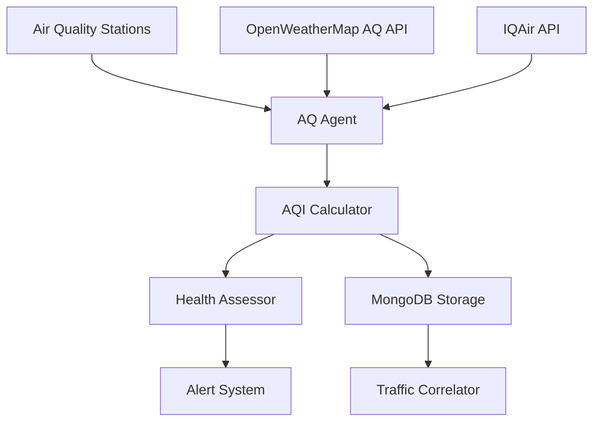

<!--
SPDX-License-Identifier: MIT
Copyright (c) 2025 UIP Team. All rights reserved.

UIP - Urban Intelligence Platform
Air quality agent documentation.

Module: apps/traffic-web-app/frontend/docs/docs/agents/data-collection/air-quality.md
Author: UIP Team
Version: 1.0.0
-->

# Air Quality Agent

## Overview

The Air Quality Agent monitors environmental conditions across HCMC, collecting data on pollutants (PM2.5, PM10, NO2, SO2, CO, O3) and correlating air quality with traffic density and patterns.

## Features

- **Real-time AQI Monitoring**: Track Air Quality Index across multiple stations
- **Pollutant Analysis**: Monitor PM2.5, PM10, NO2, SO2, CO, O3 levels
- **Health Impact Assessment**: Calculate health risks based on AQI levels
- **Traffic-AQI Correlation**: Link traffic congestion to pollution levels
- **Predictive Modeling**: Forecast air quality based on traffic patterns
- **Historical Analysis**: Long-term air quality trend analysis

## Architecture



## Configuration

**File**: `config/data_sources.yaml`

```yaml
air_quality_sources:
  openweathermap:
    api_key: "${OPENWEATHER_API_KEY}"
    endpoint: "/air_pollution"
    
  iqair:
    api_key: "${IQAIR_API_KEY}"
    base_url: "https://api.airvisual.com/v2"
    
  monitoring_stations:
    - id: "AQ_DIST1"
      name: "District 1 Station"
      lat: 10.7769
      lon: 106.7009
      pollutants: ["PM2.5", "PM10", "NO2", "SO2", "CO", "O3"]
      
    - id: "AQ_DIST3"
      name: "District 3 Station"
      lat: 10.7819
      lon: 106.6893
      pollutants: ["PM2.5", "PM10", "NO2"]
      
  update_intervals:
    realtime: 300        # 5 minutes
    historical: 3600     # 1 hour
    
  thresholds:
    pm25:
      good: 12
      moderate: 35
      unhealthy_sensitive: 55
      unhealthy: 150
      very_unhealthy: 250
      hazardous: 500
      
    pm10:
      good: 54
      moderate: 154
      unhealthy_sensitive: 254
      unhealthy: 354
      very_unhealthy: 424
      hazardous: 604
```

## Usage

### Basic Usage

```python
from src.agents.data_collection.air_quality_agent import AirQualityAgent

# Initialize agent
agent = AirQualityAgent()

# Get current AQI
aqi_data = agent.get_current_aqi(
    lat=10.7769,
    lon=106.7009
)

print(f"AQI: {aqi_data.aqi}")
print(f"Level: {aqi_data.level}")
print(f"Main Pollutant: {aqi_data.main_pollutant}")
print(f"Health Message: {aqi_data.health_message}")
```

### Detailed Pollutant Analysis

```python
# Get all pollutant levels
pollutants = agent.get_pollutant_levels(
    lat=10.7769,
    lon=106.7009
)

print(f"PM2.5: {pollutants.pm25} µg/m³")
print(f"PM10: {pollutants.pm10} µg/m³")
print(f"NO2: {pollutants.no2} µg/m³")
print(f"SO2: {pollutants.so2} µg/m³")
print(f"CO: {pollutants.co} µg/m³")
print(f"O3: {pollutants.o3} µg/m³")
```

### Health Impact Assessment

```python
# Assess health risks
health_assessment = agent.assess_health_impact(aqi=aqi_data)

print(f"Risk Level: {health_assessment.risk_level}")
print(f"Affected Groups: {', '.join(health_assessment.affected_groups)}")
print(f"Recommendations: {health_assessment.recommendations}")
print(f"Outdoor Activity Safety: {health_assessment.outdoor_safety}")
```

### Traffic-AQI Correlation

```python
# Analyze traffic impact on air quality
correlation = agent.analyze_traffic_aqi_correlation(
    time_range="30d",
    location="District 1"
)

print(f"Traffic-AQI Correlation: {correlation.coefficient}")
print(f"Peak Pollution Hours: {correlation.peak_hours}")
print(f"Traffic Contribution: {correlation.traffic_contribution_pct}%")
```

## API Reference

### Class: `AirQualityAgent`

#### Methods

##### `get_current_aqi(lat: float, lon: float) -> AQIData`

Get current Air Quality Index for location.

**Parameters:**

- `lat` (float): Latitude
- `lon` (float): Longitude

**Returns:**

- AQIData: Current AQI information

**Example:**

```python
aqi = agent.get_current_aqi(lat=10.7769, lon=106.7009)
print(f"AQI: {aqi.aqi} - {aqi.level}")
```

##### `get_pollutant_levels(lat: float, lon: float) -> PollutantData`

Get detailed pollutant measurements.

**Parameters:**

- `lat` (float): Latitude
- `lon` (float): Longitude

**Returns:**

- PollutantData: Pollutant concentrations

##### `assess_health_impact(aqi: AQIData) -> HealthAssessment`

Calculate health risks based on AQI.

**Parameters:**

- `aqi` (AQIData): AQI data object

**Returns:**

- HealthAssessment: Health impact information

##### `get_aqi_forecast(lat: float, lon: float, hours: int = 24) -> List[AQIForecast]`

Get predicted AQI for upcoming hours.

**Parameters:**

- `lat` (float): Latitude
- `lon` (float): Longitude
- `hours` (int): Forecast hours (default: 24)

**Returns:**

- List[AQIForecast]: Hourly AQI predictions

**Example:**

```python
forecast = agent.get_aqi_forecast(lat=10.7769, lon=106.7009, hours=24)
for hour in forecast:
    print(f"{hour.timestamp}: AQI {hour.aqi} ({hour.level})")
```

### Data Models

#### `AQIData`

```python
@dataclass
class AQIData:
    timestamp: datetime
    location: dict
    aqi: int                    # 0-500 scale
    level: str                  # good, moderate, unhealthy, etc.
    main_pollutant: str         # PM2.5, PM10, NO2, etc.
    health_message: str
    color_code: str             # Hex color for visualization
    recommendations: List[str]
```

#### `PollutantData`

```python
@dataclass
class PollutantData:
    timestamp: datetime
    location: dict
    pm25: float          # µg/m³
    pm10: float          # µg/m³
    no2: float           # µg/m³
    so2: float           # µg/m³
    co: float            # µg/m³
    o3: float            # µg/m³
    aqi_by_pollutant: dict
```

#### `HealthAssessment`

```python
@dataclass
class HealthAssessment:
    risk_level: str                        # low, moderate, high, very_high
    affected_groups: List[str]             # children, elderly, asthmatics, etc.
    recommendations: List[str]
    outdoor_safety: str                    # safe, caution, unsafe
    suggested_actions: List[str]
    protective_measures: List[str]
```

## AQI Categories

### AQI Scale & Health Implications

| AQI Range | Level | Color | Health Impact | Actions |
|-----------|-------|-------|---------------|---------|
| 0-50 | Good | 🟢 Green | Minimal | Normal activities |
| 51-100 | Moderate | 🟡 Yellow | Low risk | Sensitive groups be cautious |
| 101-150 | Unhealthy for Sensitive | 🟠 Orange | Moderate | Sensitive groups reduce outdoor activity |
| 151-200 | Unhealthy | 🔴 Red | High | Everyone reduce outdoor activity |
| 201-300 | Very Unhealthy | 🟣 Purple | Very High | Avoid outdoor activities |
| 301-500 | Hazardous | 🟤 Maroon | Extremely High | Stay indoors, use air purifiers |

### Pollutant-Specific Thresholds

```python
# Get pollutant-specific health guidance
guidance = agent.get_pollutant_guidance(
    pollutant="PM2.5",
    concentration=65
)

print(f"Level: {guidance.level}")
print(f"Health Effects: {guidance.health_effects}")
print(f"Recommendations: {guidance.recommendations}")
```

## Integration Examples

### Integration with Traffic Analysis

```python
from src.agents.analytics.congestion_detection_agent import CongestionDetectionAgent

aqi_agent = AirQualityAgent()
congestion_agent = CongestionDetectionAgent()

# Correlate congestion with air quality
def analyze_congestion_pollution(location):
    aqi = aqi_agent.get_current_aqi(
        lat=location["lat"],
        lon=location["lon"]
    )
    
    congestion = congestion_agent.get_congestion_level(
        location=location
    )
    
    return {
        "aqi": aqi.aqi,
        "congestion_level": congestion.level,
        "correlation": aqi_agent.calculate_correlation(aqi, congestion)
    }
```

### Integration with Route Planning

```python
# Recommend healthier routes based on AQI
def get_healthiest_route(origin, destination):
    routes = route_planner.get_all_routes(origin, destination)
    
    for route in routes:
        # Calculate average AQI along route
        route_aqi = agent.calculate_route_aqi(
            waypoints=route.waypoints
        )
        route.aqi_score = route_aqi.average
        route.health_impact = route_aqi.health_level
    
    # Sort by health impact
    return sorted(routes, key=lambda r: r.aqi_score)[0]
```

### Real-time Monitoring Dashboard

```python
# Setup real-time AQI monitoring
def monitor_air_quality():
    agent = AirQualityAgent()
    
    # Monitor multiple locations
    locations = [
        {"name": "District 1", "lat": 10.7769, "lon": 106.7009},
        {"name": "District 3", "lat": 10.7819, "lon": 106.6893},
        {"name": "Airport", "lat": 10.8184, "lon": 106.6520}
    ]
    
    while True:
        for loc in locations:
            aqi = agent.get_current_aqi(lat=loc["lat"], lon=loc["lon"])
            
            if aqi.aqi > 150:  # Unhealthy level
                send_alert(f"High AQI in {loc['name']}: {aqi.aqi}")
                
        time.sleep(300)  # Check every 5 minutes
```

## Monitoring & Alerts

### Health Check

```python
health = agent.health_check()
print(f"Status: {health.status}")
print(f"Active Stations: {health.active_stations}")
print(f"Data Freshness: {health.data_age_seconds}s")
print(f"API Response Time: {health.api_response_time}ms")
```

### Alert Configuration

```python
# Configure AQI alerts
agent.configure_alerts(
    threshold_aqi=100,
    affected_areas=["District 1", "District 3"],
    alert_methods=["email", "sms", "webhook"],
    callback=handle_alert
)

def handle_alert(alert):
    print(f"AQI Alert: {alert.location} - AQI {alert.aqi}")
    # Send notification
```

## Performance Optimization

### Caching Strategy

```python
# Configure multi-tier caching
agent.configure_cache(
    realtime_ttl=300,      # 5 minutes
    historical_ttl=3600,   # 1 hour
    forecast_ttl=1800      # 30 minutes
)
```

### Batch Processing

```python
# Fetch AQI for multiple locations efficiently
locations = [
    {"lat": 10.7769, "lon": 106.7009},
    {"lat": 10.7819, "lon": 106.6893},
    {"lat": 10.8184, "lon": 106.6520}
]

aqi_data = agent.batch_get_aqi(
    locations=locations,
    parallel=True
)
```

## Testing

### Unit Tests

```python
import pytest

def test_aqi_calculation():
    agent = AirQualityAgent()
    
    pollutants = PollutantData(
        pm25=35.5,
        pm10=80,
        no2=40,
        so2=20,
        co=500,
        o3=60
    )
    
    aqi = agent.calculate_aqi(pollutants)
    assert 0 <= aqi <= 500
    assert aqi.main_pollutant in ["PM2.5", "PM10", "NO2", "SO2", "CO", "O3"]

def test_health_assessment():
    agent = AirQualityAgent()
    
    aqi_data = AQIData(aqi=175, level="unhealthy")
    assessment = agent.assess_health_impact(aqi_data)
    
    assert assessment.risk_level == "high"
    assert len(assessment.recommendations) > 0
```

## Best Practices

### 1. Multi-Source Validation

```python
# Use multiple data sources for accuracy
agent.enable_multi_source(
    sources=["openweathermap", "iqair"],
    validation_method="average"
)
```

### 2. Historical Data Analysis

```python
# Analyze long-term trends
trends = agent.analyze_historical_trends(
    start_date="2024-01-01",
    end_date="2024-12-31",
    location="District 1"
)
```

### 3. Predictive Modeling

```python
# Forecast AQI based on traffic predictions
forecast = agent.forecast_aqi_with_traffic(
    traffic_prediction=traffic_forecast,
    hours=24
)
```

## Troubleshooting

### Issue: Inconsistent AQI Values

**Solution**: Enable multi-source validation

```python
agent.enable_data_validation(min_sources=2, max_deviation=10)
```

### Issue: Missing Pollutant Data

**Solution**: Configure fallback sources

```python
agent.configure_fallback(
    primary="openweathermap",
    fallback=["iqair", "local_stations"]
)
```

## Related Documentation

- [Weather Integration Agent](./weather-integration.md)
- [Pattern Recognition Agent](../analytics/pattern-recognition.md)
- [Health Check Agent](../monitoring/health-check.md)

## License

MIT License - Copyright (c) 2025 UIP Contributors (Nguyễn Nhật Quang, Nguyễn Việt Hoàng, Nguyễn Đình Anh Tuấn)

See [LICENSE](../LICENSE) for details.
