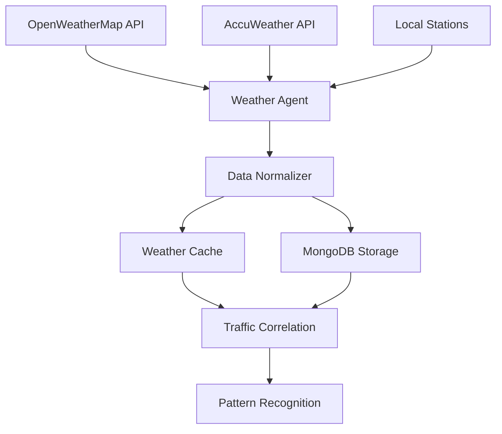

<!--
SPDX-License-Identifier: MIT
Copyright (c) 2025 UIP Team. All rights reserved.

UIP - Urban Intelligence Platform
Weather integration agent documentation.

Module: apps/traffic-web-app/frontend/docs/docs/agents/data-collection/weather-integration.md
Author: UIP Team
Version: 1.0.0
-->

# Weather Integration Agent

## Overview

The Weather Integration Agent integrates real-time weather data from multiple sources to enhance traffic predictions and provide context for traffic conditions. It correlates weather patterns with traffic incidents and congestion.

## Features

- **Multi-Source Integration**: OpenWeatherMap, AccuWeather, local weather stations
- **Real-time Updates**: Weather data refresh every 5 minutes
- **Historical Data**: Weather pattern analysis for predictive modeling
- **Severe Weather Alerts**: Automatic notification system for extreme conditions
- **Weather-Traffic Correlation**: Link weather conditions to traffic patterns
- **Air Quality Integration**: Combined weather and air quality metrics

## Architecture



## Configuration

**File**: `config/data_sources.yaml`

```yaml
weather_sources:
  openweathermap:
    api_key: "${OPENWEATHER_API_KEY}"
    base_url: "https://api.openweathermap.org/data/2.5"
    endpoints:
      current: "/weather"
      forecast: "/forecast"
      onecall: "/onecall"
    units: "metric"
    language: "vi"
    
  update_intervals:
    current_weather: 300      # 5 minutes
    hourly_forecast: 3600     # 1 hour
    daily_forecast: 21600     # 6 hours
    severe_alerts: 60         # 1 minute
    
  locations:
    - name: "District 1"
      lat: 10.7769
      lon: 106.7009
    - name: "Tan Son Nhat Airport"
      lat: 10.8184
      lon: 106.6520
      
  thresholds:
    heavy_rain_mm: 50
    strong_wind_kmh: 40
    high_temperature_c: 35
    low_visibility_m: 1000
```

## Usage

### Basic Usage

```python
from src.agents.data_collection.weather_integration_agent import WeatherIntegrationAgent

# Initialize agent
agent = WeatherIntegrationAgent()

# Get current weather for HCMC
weather = agent.get_current_weather(
    lat=10.8231,
    lon=106.6297
)

print(f"Temperature: {weather.temperature}°C")
print(f"Humidity: {weather.humidity}%")
print(f"Conditions: {weather.description}")
```

### Weather Forecasting

```python
# Get hourly forecast
hourly_forecast = agent.get_hourly_forecast(
    lat=10.8231,
    lon=106.6297,
    hours=24
)

for hour in hourly_forecast:
    print(f"{hour.timestamp}: {hour.temperature}°C, {hour.rain_probability}%")

# Get daily forecast
daily_forecast = agent.get_daily_forecast(
    lat=10.8231,
    lon=106.6297,
    days=7
)
```

### Severe Weather Monitoring

```python
# Check for severe weather alerts
alerts = agent.get_severe_weather_alerts(location="HCMC")

for alert in alerts:
    print(f"Alert: {alert.type}")
    print(f"Severity: {alert.severity}")
    print(f"Start: {alert.start_time}")
    print(f"End: {alert.end_time}")
    print(f"Description: {alert.description}")
```

### Weather-Traffic Correlation

```python
# Analyze weather impact on traffic
correlation = agent.analyze_weather_traffic_impact(
    date_range=("2024-01-01", "2024-01-31"),
    location="District 1"
)

print(f"Rain Impact: {correlation.rain_congestion_correlation}")
print(f"Temperature Impact: {correlation.temperature_speed_correlation}")
print(f"Peak Impact Hours: {correlation.peak_impact_hours}")
```

## API Reference

### Class: `WeatherIntegrationAgent`

#### Methods

##### `get_current_weather(lat: float, lon: float) -> WeatherData`

Get current weather conditions for specific coordinates.

**Parameters:**
- `lat` (float): Latitude
- `lon` (float): Longitude

**Returns:**
- WeatherData: Current weather information

**Example:**
```python
weather = agent.get_current_weather(lat=10.8231, lon=106.6297)
```

##### `get_hourly_forecast(lat: float, lon: float, hours: int = 24) -> List[HourlyWeather]`

Get hourly weather forecast.

**Parameters:**
- `lat` (float): Latitude
- `lon` (float): Longitude
- `hours` (int): Number of hours to forecast (default: 24)

**Returns:**
- List[HourlyWeather]: List of hourly weather predictions

##### `get_severe_weather_alerts(location: str) -> List[WeatherAlert]`

Get active severe weather alerts.

**Parameters:**
- `location` (str): Location name or code

**Returns:**
- List[WeatherAlert]: List of active weather alerts

##### `analyze_weather_traffic_impact(date_range: Tuple[str, str], location: str) -> CorrelationAnalysis`

Analyze correlation between weather and traffic patterns.

**Parameters:**
- `date_range` (Tuple[str, str]): Date range in format "YYYY-MM-DD"
- `location` (str): Location identifier

**Returns:**
- CorrelationAnalysis: Statistical correlation data

### Data Models

#### `WeatherData`

```python
@dataclass
class WeatherData:
    timestamp: datetime
    location: dict
    temperature: float      # Celsius
    feels_like: float      # Celsius
    humidity: int          # Percentage
    pressure: int          # hPa
    wind_speed: float      # km/h
    wind_direction: int    # Degrees
    clouds: int            # Percentage
    visibility: int        # Meters
    rain_1h: float        # mm
    rain_3h: float        # mm
    description: str
    icon: str
```

#### `WeatherAlert`

```python
@dataclass
class WeatherAlert:
    alert_id: str
    type: str              # storm, rain, heat, wind
    severity: str          # minor, moderate, severe, extreme
    start_time: datetime
    end_time: datetime
    location: str
    description: str
    instructions: str
    affected_areas: List[str]
```

#### `CorrelationAnalysis`

```python
@dataclass
class CorrelationAnalysis:
    rain_congestion_correlation: float
    temperature_speed_correlation: float
    visibility_accident_correlation: float
    peak_impact_hours: List[int]
    weather_patterns: dict
    recommendations: List[str]
```

## Weather-Traffic Rules

### Impact Matrix

| Weather Condition | Traffic Impact | Speed Reduction | Accident Risk |
|------------------|----------------|-----------------|---------------|
| Heavy Rain (\>50mm) | High | 30-40% | +150% |
| Moderate Rain (20-50mm) | Medium | 15-25% | +75% |
| Light Rain (\<20mm) | Low | 5-10% | +25% |
| Strong Wind (\>40km/h) | Medium | 10-20% | +50% |
| High Temp (\>35°C) | Low | 5-10% | +15% |
| Low Visibility (\<1000m) | High | 25-35% | +100% |
| Thunderstorm | Very High | 40-50% | +200% |

### Traffic Recommendations

```python
# Get traffic recommendations based on weather
recommendations = agent.get_traffic_recommendations(
    current_weather=weather_data
)

# Example output:
# [
#   "Heavy rain detected: Expect 30% speed reduction",
#   "Visibility below 1km: High accident risk on highways",
#   "Recommend alternate routes avoiding flood-prone areas",
#   "Suggest delayed departure by 2 hours for safer travel"
# ]
```

## Integration Examples

### Integration with Accident Detection

```python
from src.agents.analytics.accident_detection_agent import AccidentDetectionAgent

# Enhance accident detection with weather context
weather_agent = WeatherIntegrationAgent()
accident_agent = AccidentDetectionAgent()

# Get current weather
weather = weather_agent.get_current_weather(lat=10.8231, lon=106.6297)

# Adjust accident detection sensitivity based on weather
if weather.rain_1h > 50:  # Heavy rain
    accident_agent.set_sensitivity(level="high")
elif weather.visibility < 1000:  # Low visibility
    accident_agent.set_sensitivity(level="high")
else:
    accident_agent.set_sensitivity(level="normal")
```

### Integration with Pattern Recognition

```python
from src.agents.analytics.pattern_recognition_agent import PatternRecognitionAgent

pattern_agent = PatternRecognitionAgent()
weather_agent = WeatherIntegrationAgent()

# Analyze patterns with weather context
patterns = pattern_agent.detect_patterns(
    time_range="7d",
    include_weather=True,
    weather_source=weather_agent
)

for pattern in patterns:
    print(f"Pattern: {pattern.type}")
    print(f"Weather Conditions: {pattern.weather_context}")
    print(f"Confidence: {pattern.confidence}")
```

## Monitoring & Alerts

### Health Check

```python
health = agent.health_check()
print(f"Status: {health.status}")
print(f"API Response Time: {health.api_response_time}ms")
print(f"Data Freshness: {health.data_age_seconds}s")
print(f"Cache Hit Rate: {health.cache_hit_rate}%")
```

### Alert System

```python
# Configure alert thresholds
agent.configure_alerts(
    temperature_threshold=38,
    rain_threshold=60,
    wind_threshold=50,
    alert_callback=send_notification
)

# Alert callback function
def send_notification(alert: WeatherAlert):
    print(f"ALERT: {alert.type} - {alert.severity}")
    # Send to notification system
```

## Performance Optimization

### Caching Strategy

```python
# Configure multi-level caching
agent.configure_cache(
    current_weather_ttl=300,    # 5 minutes
    forecast_ttl=3600,          # 1 hour
    historical_ttl=86400,       # 24 hours
    max_cache_size_mb=100
)
```

### Batch Processing

```python
# Fetch weather for multiple locations efficiently
locations = [
    {"lat": 10.7769, "lon": 106.7009},
    {"lat": 10.8231, "lon": 106.6297},
    {"lat": 10.8184, "lon": 106.6520}
]

weather_data = agent.batch_fetch_weather(
    locations=locations,
    parallel=True,
    max_workers=5
)
```

## Testing

### Unit Tests

```python
import pytest
from unittest.mock import Mock, patch

def test_get_current_weather(mock_openweather_api):
    agent = WeatherIntegrationAgent()
    weather = agent.get_current_weather(lat=10.8231, lon=106.6297)
    
    assert weather.temperature > 0
    assert 0 <= weather.humidity <= 100
    assert weather.location is not None

def test_severe_weather_detection():
    agent = WeatherIntegrationAgent()
    
    # Simulate heavy rain
    weather_data = Mock(rain_1h=60)
    is_severe = agent.is_severe_weather(weather_data)
    
    assert is_severe is True
```

### Integration Tests

```python
@pytest.mark.integration
def test_weather_traffic_correlation():
    weather_agent = WeatherIntegrationAgent()
    
    # Analyze past month
    correlation = weather_agent.analyze_weather_traffic_impact(
        date_range=("2024-01-01", "2024-01-31"),
        location="District 1"
    )
    
    assert -1 <= correlation.rain_congestion_correlation <= 1
    assert len(correlation.peak_impact_hours) > 0
```

## Best Practices

### 1. API Key Management

```python
# Use environment variables
import os

api_key = os.getenv("OPENWEATHER_API_KEY")
agent = WeatherIntegrationAgent(api_key=api_key)
```

### 2. Rate Limiting

```python
# Respect API rate limits
agent.configure_rate_limit(
    requests_per_minute=60,
    burst_size=10
)
```

### 3. Error Handling

```python
from src.core.exceptions import WeatherAPIError

try:
    weather = agent.get_current_weather(lat=10.8231, lon=106.6297)
except WeatherAPIError as e:
    # Use cached data
    weather = agent.get_cached_weather(lat=10.8231, lon=106.6297)
```

## Troubleshooting

### Issue: API Rate Limit Exceeded

**Solution**: Increase cache TTL and reduce update frequency

```python
agent.configure_cache(current_weather_ttl=600)  # 10 minutes
```

### Issue: Inaccurate Weather Data

**Solution**: Use multiple sources and data validation

```python
agent.enable_multi_source_validation(min_sources=2)
```

## Related Documentation

- [Air Quality Agent](./air-quality.md)
- [Pattern Recognition Agent](../analytics/pattern-recognition.md)
- [Accident Detection Agent](../analytics/accident-detection.md)

## License

MIT License - Copyright (c) 2025 UIP Contributors (Nguyễn Nhật Quang, Nguyễn Việt Hoàng, Nguyễn Đình Anh Tuấn)

See [LICENSE](../LICENSE) for details.
