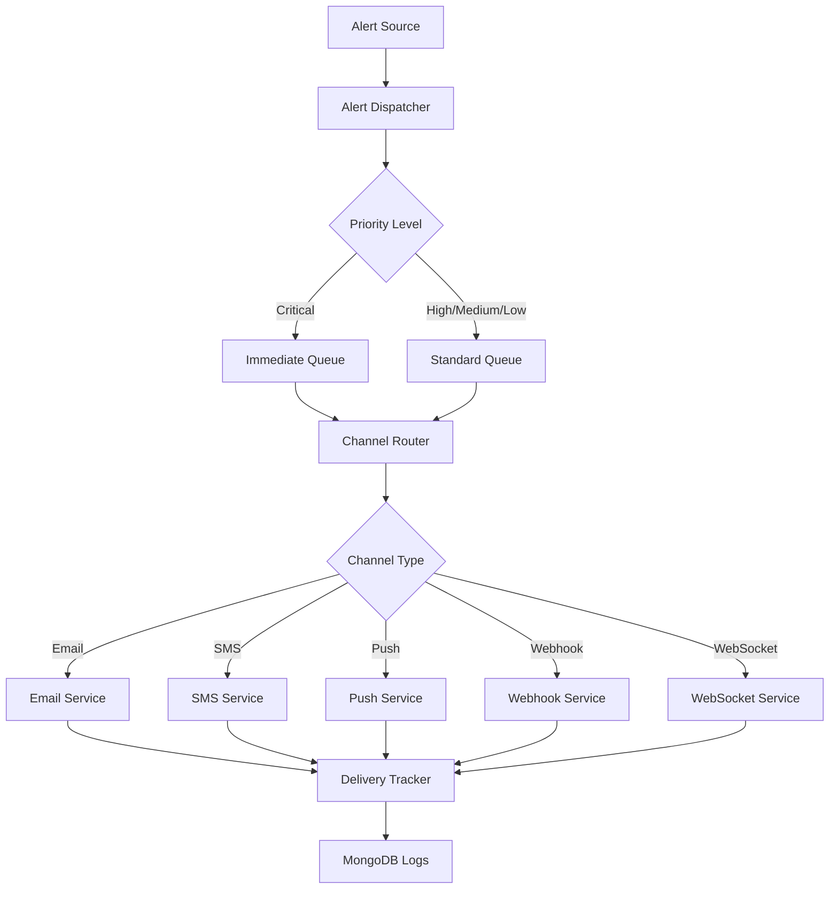

<!--
SPDX-License-Identifier: MIT
Copyright (c) 2025 UIP Team. All rights reserved.

UIP - Urban Intelligence Platform
Alert dispatcher agent documentation.

Module: apps/traffic-web-app/frontend/docs/docs/agents/notification/alert-dispatcher.md
Author: UIP Team
Version: 1.0.0
-->

# Alert Dispatcher Agent

## Overview

The Alert Dispatcher Agent is a critical component of the traffic management system, responsible for real-time distribution of traffic alerts, accidents, congestion warnings, and citizen reports to multiple channels including email, SMS, push notifications, and webhooks.

## Features

- **Multi-Channel Dispatch**: Email, SMS, push notifications, webhooks, WebSocket
- **Priority Routing**: Critical alerts bypass queuing for immediate delivery
- **Template Engine**: Customizable alert templates with dynamic content
- **Subscription Management**: User preferences and channel subscriptions
- **Rate Limiting**: Prevent alert fatigue with intelligent throttling
- **Delivery Tracking**: Monitor alert delivery status and failures
- **Retry Mechanism**: Automatic retry for failed deliveries

## Architecture



## Configuration

**File**: `config/alert_dispatcher_config.yaml`

```yaml
alert_dispatcher:
  channels:
    email:
      enabled: true
      provider: "smtp"
      smtp_host: "${SMTP_HOST}"
      smtp_port: 587
      from_address: "alerts@hcmc-traffic.vn"
      
    sms:
      enabled: true
      provider: "twilio"
      account_sid: "${TWILIO_ACCOUNT_SID}"
      auth_token: "${TWILIO_AUTH_TOKEN}"
      from_number: "+84123456789"
      
    push:
      enabled: true
      provider: "firebase"
      project_id: "${FIREBASE_PROJECT_ID}"
      
    webhook:
      enabled: true
      timeout: 10
      retry_attempts: 3
      
    websocket:
      enabled: true
      server_url: "ws://localhost:8765"
      
  priority_levels:
    critical:
      max_queue_time: 0          # Immediate dispatch
      retry_attempts: 5
      retry_delay: 10             # seconds
      
    high:
      max_queue_time: 30          # seconds
      retry_attempts: 3
      retry_delay: 30
      
    medium:
      max_queue_time: 120
      retry_attempts: 2
      retry_delay: 60
      
    low:
      max_queue_time: 300
      retry_attempts: 1
      retry_delay: 120
      
  rate_limiting:
    enabled: true
    max_alerts_per_user_hour: 10
    max_alerts_per_user_day: 50
    cooldown_period: 300          # 5 minutes for same alert type
    
  templates:
    accident_critical:
      subject: "🚨 Critical Accident Alert: {location}"
      body: "accident_critical.html"
      
    congestion_heavy:
      subject: "⚠️ Heavy Traffic Alert: {location}"
      body: "congestion_heavy.html"
      
    citizen_report_verified:
      subject: "✅ Your Report Has Been Verified"
      body: "citizen_verified.html"
```

## Usage

### Basic Alert Dispatch

```python
from src.agents.notification.alert_dispatcher_agent import AlertDispatcherAgent

# Initialize agent
agent = AlertDispatcherAgent()

# Dispatch critical accident alert
alert_id = agent.dispatch_alert(
    alert_type="accident_critical",
    priority="critical",
    location={"lat": 10.7769, "lon": 106.7009, "address": "Nguyen Hue Blvd"},
    severity="high",
    description="Multi-vehicle collision blocking 3 lanes",
    image_url="https://cdn.example.com/accident_001.jpg",
    channels=["email", "sms", "push", "webhook"]
)

print(f"Alert dispatched: {alert_id}")
```

### Targeted User Alerts

```python
# Send alert to specific users
agent.dispatch_to_users(
    user_ids=["user_123", "user_456", "user_789"],
    alert_type="congestion_heavy",
    priority="high",
    location={"address": "District 1 Center"},
    message="Heavy congestion detected in your area"
)
```

### Webhook Dispatch

```python
# Send alert to external webhook
agent.dispatch_webhook(
    webhook_url="https://external-system.com/api/alerts",
    payload={
        "event": "accident_detected",
        "severity": "high",
        "location": {"lat": 10.7769, "lon": 106.7009},
        "timestamp": "2024-01-15T10:30:00Z"
    },
    headers={"X-API-Key": "your-api-key"}
)
```

### Broadcast Alert

```python
# Broadcast to all subscribed users in area
agent.broadcast_alert(
    alert_type="weather_warning",
    priority="high",
    radius_km=5,
    center_location={"lat": 10.7769, "lon": 106.7009},
    message="Heavy rain expected in next 30 minutes",
    channels=["push", "websocket"]
)
```

## API Reference

### Class: `AlertDispatcherAgent`

#### Methods

##### `dispatch_alert(alert_type: str, priority: str, location: dict, channels: List[str], **kwargs) -> str`

Dispatch alert to multiple channels.

**Parameters:**

- `alert_type` (str): Type of alert (accident, congestion, weather, etc.)
- `priority` (str): Priority level (critical, high, medium, low)
- `location` (dict): Location information
- `channels` (List[str]): Target channels
- `**kwargs`: Additional alert data

**Returns:**

- str: Alert ID

**Example:**

```python
alert_id = agent.dispatch_alert(
    alert_type="accident_critical",
    priority="critical",
    location={"lat": 10.7769, "lon": 106.7009},
    channels=["email", "sms", "push"]
)
```

##### `dispatch_to_users(user_ids: List[str], alert_type: str, priority: str, **kwargs)`

Send alert to specific users.

**Parameters:**

- `user_ids` (List[str]): List of user IDs
- `alert_type` (str): Alert type
- `priority` (str): Priority level
- `**kwargs`: Alert content

##### `dispatch_webhook(webhook_url: str, payload: dict, headers: dict = None) -> WebhookResult`

Send alert to external webhook.

**Parameters:**

- `webhook_url` (str): Webhook endpoint URL
- `payload` (dict): Alert payload
- `headers` (dict, optional): HTTP headers

**Returns:**

- WebhookResult: Delivery result

##### `broadcast_alert(alert_type: str, priority: str, radius_km: float, center_location: dict, message: str, channels: List[str])`

Broadcast alert to users in geographic area.

**Parameters:**

- `alert_type` (str): Alert type
- `priority` (str): Priority level
- `radius_km` (float): Broadcast radius
- `center_location` (dict): Center coordinates
- `message` (str): Alert message
- `channels` (List[str]): Delivery channels

##### `get_alert_status(alert_id: str) -> AlertStatus`

Get delivery status of alert.

**Parameters:**

- `alert_id` (str): Alert identifier

**Returns:**

- AlertStatus: Delivery status and statistics

**Example:**

```python
status = agent.get_alert_status(alert_id)
print(f"Delivered: {status.delivered_count}/{status.total_recipients}")
print(f"Failed: {status.failed_count}")
```

### Data Models

#### `AlertStatus`

```python
@dataclass
class AlertStatus:
    alert_id: str
    alert_type: str
    priority: str
    dispatched_at: datetime
    total_recipients: int
    delivered_count: int
    failed_count: int
    pending_count: int
    delivery_channels: dict        # {channel: count}
    retry_attempts: int
    final_status: str              # delivered, partial, failed
```

#### `WebhookResult`

```python
@dataclass
class WebhookResult:
    success: bool
    status_code: int
    response_body: str
    delivery_time_ms: int
    error_message: str
```

## Alert Types

### 1. Accident Alerts

```python
agent.dispatch_alert(
    alert_type="accident_critical",
    priority="critical",
    location={"lat": 10.7769, "lon": 106.7009},
    severity="high",
    vehicles_involved=3,
    lane_blockage="full",
    estimated_clearance="30 minutes"
)
```

### 2. Congestion Alerts

```python
agent.dispatch_alert(
    alert_type="congestion_heavy",
    priority="high",
    location={"address": "District 1"},
    congestion_level="heavy",
    delay_minutes=20,
    alternate_routes=["Route A", "Route B"]
)
```

### 3. Weather Alerts

```python
agent.dispatch_alert(
    alert_type="weather_warning",
    priority="high",
    location={"address": "HCMC"},
    condition="heavy_rain",
    duration="2 hours",
    safety_recommendations=["Drive slowly", "Turn on lights"]
)
```

### 4. Citizen Report Alerts

```python
agent.dispatch_alert(
    alert_type="citizen_report_verified",
    priority="medium",
    user_id="user_123",
    report_id="CR_001",
    status="verified",
    action_taken="Traffic police dispatched"
)
```

## Template System

### Email Template Example

**File**: `templates/accident_critical.html`

```html
<!DOCTYPE html>
<html>
<head>
    <title>Critical Accident Alert</title>
</head>
<body>
    <h1>🚨 Critical Accident Alert</h1>
    <p><strong>Location:</strong> {{ location.address }}</p>
    <p><strong>Severity:</strong> {{ severity }}</p>
    <p><strong>Description:</strong> {{ description }}</p>
    <p><strong>Time:</strong> {{ timestamp }}</p>
    
    
    
    
    
    <p><strong>Recommended Actions:</strong></p>
    <ul>
        
        <li>{{ action }}</li>
        
    </ul>
</body>
</html>
```

### SMS Template Example

```python
# SMS template (160 characters max)
"{alert_type}: {location.address}. {severity} severity. Avoid area. ETA clearance: {clearance_time}."
```

## Integration Examples

### Integration with Accident Detection

```python
from src.agents.analytics.accident_detection_agent import AccidentDetectionAgent

accident_agent = AccidentDetectionAgent()
alert_agent = AlertDispatcherAgent()

def handle_accident_detection(detection_result):
    if detection_result.severity in ["severe", "critical"]:
        # Dispatch immediate alert
        alert_agent.dispatch_alert(
            alert_type="accident_critical",
            priority="critical",
            location=detection_result.location,
            severity=detection_result.severity,
            image_url=detection_result.image_path,
            channels=["email", "sms", "push", "webhook"]
        )
```

### Integration with Subscription Manager

```python
from src.agents.notification.subscription_manager_agent import SubscriptionManagerAgent

subscription_agent = SubscriptionManagerAgent()

# Get subscribed users for alert type
subscribed_users = subscription_agent.get_subscribed_users(
    alert_type="congestion_heavy",
    location={"lat": 10.7769, "lon": 106.7009},
    radius_km=2
)

# Dispatch to subscribed users only
alert_agent.dispatch_to_users(
    user_ids=[u.user_id for u in subscribed_users],
    alert_type="congestion_heavy",
    priority="high",
    location={"address": "District 1"}
)
```

### Integration with Incident Report Generator

```python
from src.agents.notification.incident_report_generator_agent import IncidentReportGeneratorAgent

report_agent = IncidentReportGeneratorAgent()

# Generate incident report
incident_report = report_agent.generate_report(
    incident_id="INC_001",
    include_images=True,
    include_timeline=True
)

# Dispatch report to authorities
alert_agent.dispatch_alert(
    alert_type="incident_report",
    priority="high",
    recipients=["traffic.police@hcmc.gov.vn"],
    channels=["email"],
    report_pdf=incident_report.pdf_url
)
```

## Monitoring & Metrics

### Health Check

```python
health = agent.health_check()
print(f"Status: {health.status}")
print(f"Alerts Dispatched Today: {health.alerts_today}")
print(f"Delivery Success Rate: {health.delivery_success_rate}%")
print(f"Active Channels: {health.active_channels}")
print(f"Queue Size: {health.queue_size}")
```

### Channel Performance

```python
metrics = agent.get_channel_metrics(time_range="24h")

for channel, stats in metrics.items():
    print(f"{channel}:")
    print(f"  Success Rate: {stats.success_rate}%")
    print(f"  Avg Delivery Time: {stats.avg_delivery_time}ms")
    print(f"  Failed: {stats.failed_count}")
```

## Performance Optimization

### Async Dispatch

```python
# Dispatch alerts asynchronously
await agent.dispatch_alert_async(
    alert_type="congestion_heavy",
    priority="high",
    location={"address": "District 1"},
    channels=["email", "sms", "push"]
)
```

### Batch Dispatch

```python
# Dispatch multiple alerts in batch
alerts = [
    {"alert_type": "congestion_heavy", "location": {...}},
    {"alert_type": "accident_minor", "location": {...}},
]

agent.batch_dispatch(alerts, parallel=True)
```

### Queue Optimization

```python
# Configure queue settings
agent.configure_queue(
    max_queue_size=1000,
    worker_threads=10,
    batch_size=50
)
```

## Testing

### Unit Tests

```python
import pytest

def test_alert_dispatch():
    agent = AlertDispatcherAgent()
    
    alert_id = agent.dispatch_alert(
        alert_type="test_alert",
        priority="low",
        location={"lat": 10.7769, "lon": 106.7009},
        channels=["email"]
    )
    
    assert alert_id is not None
    
    status = agent.get_alert_status(alert_id)
    assert status.final_status in ["delivered", "pending"]

def test_rate_limiting():
    agent = AlertDispatcherAgent()
    
    # Send multiple alerts
    for i in range(15):
        agent.dispatch_alert(
            alert_type="test_alert",
            priority="low",
            location={},
            channels=["email"],
            user_id="test_user"
        )
    
    # Should trigger rate limit
    stats = agent.get_user_stats("test_user")
    assert stats.rate_limited == True
```

## Best Practices

### 1. Priority-Based Routing

```python
# Critical alerts bypass queue
if severity == "critical":
    priority = "critical"
else:
    priority = "high" if urgency > 0.7 else "medium"
```

### 2. Prevent Alert Fatigue

```python
agent.configure_rate_limiting(
    max_alerts_per_user_hour=10,
    cooldown_period=300  # 5 minutes
)
```

### 3. Delivery Confirmation

```python
status = agent.get_alert_status(alert_id)
if status.failed_count > 0:
    agent.retry_failed_deliveries(alert_id)
```

## Troubleshooting

### Issue: High Failure Rate

**Solution**: Check channel configurations and retry settings

```python
agent.test_channels()  # Test all channel connections
agent.configure_retry(attempts=5, delay=30)
```

### Issue: Slow Delivery

**Solution**: Increase worker threads and enable async

```python
agent.configure_queue(worker_threads=20)
agent.enable_async_dispatch()
```

### Issue: Duplicate Alerts

**Solution**: Enable deduplication

```python
agent.enable_deduplication(
    time_window=300,  # 5 minutes
    key_fields=["alert_type", "location", "user_id"]
)
```

## Related Documentation

- [Subscription Manager Agent](./subscription-manager.md)
- [Email Notification Handler](./email-notification-handler.md)
- [Webhook Notification Handler](./webhook-notification-handler.md)
- [Incident Report Generator](./incident-report-generator.md)

## License

MIT License - Copyright (c) 2025 UIP Contributors (Nguyễn Nhật Quang, Nguyễn Việt Hoàng, Nguyễn Đình Anh Tuấn)

See [LICENSE](../LICENSE) for details.
