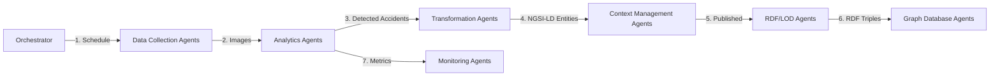

<!--
SPDX-License-Identifier: MIT
Copyright (c) 2025 UIP Team. All rights reserved.

UIP - Urban Intelligence Platform
Agent system overview documentation.

Module: apps/traffic-web-app/frontend/docs/docs/agents/overview.md
Author: UIP Team
Version: 1.0.0
-->

# Agent System Overview

The HCMC Traffic Monitoring System is powered by **30+ specialized agents** that work together to collect, process, analyze, and publish traffic data.

## 🤖 What is an Agent?

An **agent** is a self-contained Python module that performs a specific task in the data pipeline. Each agent:

- ✅ Has a **single responsibility** (e.g., fetch camera images, detect accidents, publish to Kafka)
- ✅ Can run **independently** or as part of an orchestrated workflow
- ✅ Implements the **BaseAgent** interface
- ✅ Returns structured **AgentResult** objects
- ✅ Handles **errors gracefully** with retry logic

## 🏗️ Agent Architecture

```python
from abc import ABC, abstractmethod
from dataclasses import dataclass
from enum import Enum

class AgentStatus(Enum):
    SUCCESS = "success"
    FAILURE = "failure"
    PARTIAL = "partial"
    SKIPPED = "skipped"

@dataclass
class AgentResult:
    status: AgentStatus
    data: dict
    errors: list
    execution_time: float

class BaseAgent(ABC):
    @abstractmethod
    async def execute(self, context: dict) -> AgentResult:
        """Execute agent logic"""
        pass
```

## 📊 Agent Categories

### 1. Data Collection Agents (3 agents)

Fetch external data from APIs and sensors.

| Agent | Purpose | Frequency | Output | Status |
|-------|---------|-----------|--------|---------|
| **CameraImageFetchAgent** | Fetch images from 1,000+ cameras | Every 30s | Raw images + metadata | 🟢 Active |
| **WeatherIntegrationAgent** | Fetch weather data from OpenWeather API | Every 5min | Temperature, humidity, wind, precipitation | 🟢 Active |
| **AirQualityAgent** | Fetch AQI data from AQICN API | Every 10min | PM2.5, PM10, NO2, O3, AQI index | 🟢 Active |

### 2. Analytics Agents (5 agents)

Process and analyze data for insights.

| Agent | Purpose | Frequency | Technology |
|-------|---------|-----------|------------|
| **AccidentDetectionAgent** | Detect accidents using YOLOX-X | Real-time | Computer Vision (YOLOX-X) |
| **CongestionAnalysisAgent** | Analyze traffic congestion patterns | Every 2min | Statistical analysis |
| **PatternRecognitionAgent** | Identify recurring traffic patterns | Hourly | Machine Learning |
| **CVAnalysisAgent** | Advanced computer vision analysis | Real-time | OpenCV + PyTorch |
| **CitizenReportAgent** | Process citizen-submitted reports | On-demand | NLP + Geo-analysis |

### 3. Transformation Agents (2 agents)

Convert data between formats.

| Agent | Input Format | Output Format | Standard |
|-------|--------------|---------------|----------|
| **NGSILDTransformerAgent** | Python objects | NGSI-LD JSON-LD | ETSI CIM 009 |
| **SOSASSNMapperAgent** | Traffic data | RDF/Turtle | W3C SOSA/SSN |

### 4. RDF & Linked Data Agents (5 agents)

Manage semantic web and linked data.

| Agent | Purpose | Technology | Endpoint |
|-------|---------|------------|----------|
| **NGSILDToRDFAgent** | Convert NGSI-LD to RDF | RDFLib | - |
| **TriplestoreLoaderAgent** | Load RDF to Fuseki | SPARQL UPDATE | http://fuseki:3030 |
| **LODLinksetEnrichmentAgent** | Enrich with LOD links | DBpedia, Wikidata | - |
| **ContentNegotiationAgent** | Serve multiple RDF formats | HTTP Content-Type | application/ld+json, text/turtle |
| **SmartDataModelsValidationAgent** | Validate FIWARE models | JSON Schema | FIWARE Smart Data Models |

### 5. Context Management Agents (4 agents)

Manage NGSI-LD Context Broker.

| Agent | Operation | Broker | Protocol |
|-------|-----------|--------|----------|
| **EntityPublisherAgent** | Create/Update entities | Stellio | NGSI-LD API |
| **StellioStateQueryAgent** | Query current state | Stellio | NGSI-LD Query |
| **TemporalDataManagerAgent** | Manage temporal data | Stellio | NGSI-LD Temporal |
| **StateUpdaterAgent** | Update entity state | Stellio | NGSI-LD PATCH |

### 6. Notification Agents (5 agents)

Handle alerts and notifications.

| Agent | Channel | Priority | Latency |
|-------|---------|----------|----------|
| **AlertDispatcherAgent** | Email, SMS, Webhook | High | \<1s |
| **EmailNotificationAgent** | SMTP | Medium | \<5s |
| **SMSNotificationAgent** | Twilio API | High | \<2s |
| **WebhookNotificationAgent** | HTTP POST | Medium | \<3s |
| **PushNotificationAgent** | Firebase | High | \<1s |

### 7. Graph Database Agents (2 agents)

Manage Neo4j graph relationships.

| Agent | Purpose | Query Language | Database |
|-------|---------|----------------|----------|
| **Neo4jSyncAgent** | Sync relationships | Cypher | Neo4j 5.11 |
| **Neo4jQueryAgent** | Query graph patterns | Cypher | Neo4j 5.11 |

### 8. Integration Agents (2 agents)

API gateway and caching.

| Agent | Purpose | Technology | Port |
|-------|---------|------------|------|
| **APIGatewayAgent** | REST API gateway | FastAPI | 8000 |
| **CacheManagerAgent** | Multi-tier caching | Redis | 6379 |

### 9. Monitoring Agents (3 agents)

System health and performance.

| Agent | Metrics | Frequency | Alerts |
|-------|---------|-----------|--------|
| **HealthCheckAgent** | Service status | Every 30s | ✅ |
| **PerformanceMonitorAgent** | CPU, Memory, Latency | Every 10s | ✅ |
| **DataQualityValidatorAgent** | Data completeness, accuracy | Every 5min | ✅ |

### 10. State Management Agents (4 agents)

Manage application state.

| Agent | Scope | Storage | Persistence |
|-------|-------|---------|-------------|
| **StateManagerAgent** | Global state | Redis | In-memory |
| **AccidentStateManagerAgent** | Accident lifecycle | MongoDB | Persistent |
| **CongestionStateManagerAgent** | Congestion zones | MongoDB | Persistent |
| **TemporalStateTrackerAgent** | Historical states | TimescaleDB | Time-series |
| **CameraImageFetchAgent** | Fetch images from 1,000+ cameras | Every 30s | Raw images + metadata |
| **WeatherIntegrationAgent** | Get weather data (OpenWeatherMap) | Every 5 min | Temperature, humidity, conditions |
| **AirQualityAgent** | Fetch AQI data from sensors | Every 10 min | PM2.5, PM10, AQI index |

**Example: CameraImageFetchAgent**
```python
class CameraImageFetchAgent(BaseAgent):
    async def execute(self, context):
        cameras = await self.get_camera_list()
        results = []
        
        for camera in cameras:
            try:
                image = await self.fetch_image(camera.url)
                results.append({
                    'camera_id': camera.id,
                    'image': image,
                    'timestamp': datetime.now()
                })
            except Exception as e:
                self.logger.error(f"Failed to fetch {camera.id}: {e}")
        
        return AgentResult(
            status=AgentStatus.SUCCESS,
            data={'images': results},
            errors=[],
            execution_time=time.time() - start_time
        )
```

### 2. Ingestion Agents (2 agents)

Accept data from external sources.

| Agent | Purpose | Protocol | Endpoint |
|-------|---------|----------|----------|
| **CitizenIngestionAgent** | Accept citizen-submitted reports | FastAPI REST | POST /citizen-reports |
| **RealTimeStreamAgent** | Ingest streaming data | Kafka Consumer | traffic-events topic |

**Example: CitizenIngestionAgent**
```python
@app.post("/citizen-reports")
async def submit_report(report: CitizenReport):
    # Validate report
    if not report.location or not report.type:
        raise HTTPException(400, "Missing required fields")
    
    # Store in MongoDB
    result = await db.citizen_reports.insert_one(report.dict())
    
    # Verify with YOLOX if image provided
    if report.image:
        verification = await verify_with_yolo(report.image)
        await db.citizen_reports.update_one(
            {'_id': result.inserted_id},
            {'$set': {'verification': verification}}
        )
    
    return {'id': str(result.inserted_id), 'status': 'pending'}
```

### 3. Analytics Agents (4 agents)

Analyze data for insights.

| Agent | Purpose | Input | Output |
|-------|---------|-------|--------|
| **AccidentDetectionAgent** | Detect accidents from images | Camera images | Accident events with severity |
| **PatternRecognitionAgent** | Identify traffic patterns | Historical data | Pattern types, locations |
| **CongestionAnalysisAgent** | Analyze traffic congestion | Vehicle counts | Congestion level (0-100) |
| **PredictiveAnalyticsAgent** | Forecast future traffic | Time-series data | Predictions with confidence |

**Example: AccidentDetectionAgent (YOLOX)**
```python
from yolox.exp import get_exp
from yolox.utils import get_model_info

class AccidentDetectionAgent(BaseAgent):
    def __init__(self):
        self.exp = get_exp(None, "yolox-x")
        self.model = self.exp.get_model()
    
    async def execute(self, context):
        images = context.get('images', [])
        accidents = []
        
        for img_data in images:
            results = self.model(img_data['image'])
            
            # Detect crashes, fires, damaged vehicles
            for detection in results:
                if detection.cls in [0, 1, 2]:  # Accident classes
                    accidents.append({
                        'camera_id': img_data['camera_id'],
                        'type': detection.cls,
                        'confidence': detection.conf,
                        'bbox': detection.bbox,
                        'timestamp': img_data['timestamp']
                    })
        
        return AgentResult(
            status=AgentStatus.SUCCESS,
            data={'accidents': accidents},
            errors=[],
            execution_time=...
        )
```

### 4. Transformation Agents (2 agents)

Transform data between formats.

| Agent | Purpose | Input Format | Output Format |
|-------|---------|--------------|---------------|
| **NGSILDTransformerAgent** | Convert to NGSI-LD | Raw JSON | NGSI-LD entities |
| **SOSASSNMapperAgent** | Map to SOSA/SSN ontology | NGSI-LD entities | RDF triples |

**Example: NGSILDTransformerAgent**
```python
class NGSILDTransformerAgent(BaseAgent):
    async def execute(self, context):
        raw_data = context.get('data')
        entities = []
        
        for item in raw_data:
            entity = {
                'id': f"urn:ngsi-ld:Accident:{item['id']}",
                'type': 'Accident',
                '@context': [
                    'https://uri.etsi.org/ngsi-ld/v1/ngsi-ld-core-context.jsonld',
                    'https://raw.githubusercontent.com/smart-data-models/dataModel.Transportation/master/context.jsonld'
                ],
                'location': {
                    'type': 'GeoProperty',
                    'value': {
                        'type': 'Point',
                        'coordinates': [item['lon'], item['lat']]
                    }
                },
                'severity': {
                    'type': 'Property',
                    'value': item['severity']
                },
                'observedAt': {
                    'type': 'Property',
                    'value': item['timestamp']
                }
            }
            entities.append(entity)
        
        return AgentResult(
            status=AgentStatus.SUCCESS,
            data={'entities': entities},
            errors=[],
            execution_time=...
        )
```

### 5. Context Management Agents (4 agents)

Manage NGSI-LD context information.

| Agent | Purpose | Technology | Endpoint |
|-------|---------|------------|----------|
| **EntityPublisherAgent** | Publish entities to Stellio | Stellio | POST /ngsi-ld/v1/entities |
| **StellioStateQueryAgent** | Query current state | Stellio | GET /ngsi-ld/v1/entities |
| **TemporalDataManagerAgent** | Manage temporal attributes | TimescaleDB | INSERT INTO temporal_data |
| **StateUpdaterAgent** | Update entity states | Stellio | PATCH /ngsi-ld/v1/entities/\{id\} |

### 6. RDF & Linked Data Agents (5 agents)

Publish data as Linked Open Data.

| Agent | Purpose | Technology | Output |
|-------|---------|------------|--------|
| **NGSILDToRDFAgent** | Convert NGSI-LD to RDF | RDFLib | RDF/XML, Turtle |
| **TriplestoreLoaderAgent** | Load triples to Fuseki | SPARQL Update | HTTP 200 |
| **LODLinksetEnrichmentAgent** | Enrich with external LOD | DBpedia, GeoNames | owl:sameAs links |
| **ContentNegotiationAgent** | Serve data in multiple formats | Flask | JSON-LD, RDF/XML, Turtle |
| **SmartDataModelsValidationAgent** | Validate against schemas | JSON Schema | Validation errors |

**Example: LODLinksetEnrichmentAgent**
```python
class LODLinksetEnrichmentAgent(BaseAgent):
    async def execute(self, context):
        entities = context.get('entities')
        enriched = []
        
        for entity in entities:
            # Link to GeoNames
            if 'location' in entity:
                geonames_uri = await self.find_geonames_match(
                    entity['location']['value']['coordinates']
                )
                if geonames_uri:
                    entity['sameAs'] = {
                        'type': 'Relationship',
                        'object': geonames_uri
                    }
            
            # Link to DBpedia
            if 'name' in entity:
                dbpedia_uri = await self.find_dbpedia_match(
                    entity['name']['value']
                )
                if dbpedia_uri:
                    entity['seeAlso'] = {
                        'type': 'Relationship',
                        'object': dbpedia_uri
                    }
            
            enriched.append(entity)
        
        return AgentResult(
            status=AgentStatus.SUCCESS,
            data={'enriched_entities': enriched},
            errors=[],
            execution_time=...
        )
```

### 7. Graph Database Agents (2 agents)

Manage Neo4j graph database.

| Agent | Purpose | Query Type | Example |
|-------|---------|------------|---------|
| **Neo4jSyncAgent** | Sync entities to Neo4j | CREATE/MERGE | `MERGE (c:Camera {id: $id})` |
| **Neo4jQueryAgent** | Execute Cypher queries | MATCH | `MATCH (c:Camera)-[:DETECTED]->(a:Accident)` |

### 8. Integration Agents (2 agents)

Infrastructure integration.

| Agent | Purpose | Technology | Features |
|-------|---------|------------|----------|
| **APIGatewayAgent** | API gateway with rate limiting | FastAPI | Rate limit, circuit breaker |
| **CacheManagerAgent** | Multi-level caching | Redis | L1 (memory), L2 (Redis), L3 (disk) |

**Example: CacheManagerAgent (3-Level Cache)**
```python
class CacheManagerAgent(BaseAgent):
    def __init__(self):
        self.l1_cache = {}  # In-memory
        self.l2_cache = redis.Redis()  # Redis
        self.l3_cache = DiskCache()  # Disk
    
    async def get(self, key):
        # Try L1 (fastest)
        if key in self.l1_cache:
            return self.l1_cache[key]
        
        # Try L2 (fast)
        value = await self.l2_cache.get(key)
        if value:
            self.l1_cache[key] = value
            return value
        
        # Try L3 (slow but persistent)
        value = await self.l3_cache.get(key)
        if value:
            self.l2_cache.set(key, value, ex=3600)
            self.l1_cache[key] = value
            return value
        
        return None
```

### 9. Monitoring Agents (3 agents)

System health and performance.

| Agent | Purpose | Metrics | Alerts |
|-------|---------|---------|--------|
| **HealthCheckAgent** | Service health checks | Up/down status, latency | Email, Slack |
| **PerformanceMonitorAgent** | Performance metrics | CPU, memory, throughput | Grafana dashboard |
| **DataQualityValidatorAgent** | Data quality checks | Completeness, accuracy | Data quality reports |

### 10. State Management Agents (4 agents)

Track and manage state.

| Agent | Purpose | State Type | Storage |
|-------|---------|-----------|---------|
| **StateManagerAgent** | General state management | Global state | Redis |
| **AccidentStateManagerAgent** | Track accident lifecycle | active/resolved/false_alarm | MongoDB |
| **CongestionStateManagerAgent** | Track congestion events | low/medium/high/critical | TimescaleDB |
| **TemporalStateTrackerAgent** | Historical state tracking | Time-series state | TimescaleDB |

## 🔄 Agent Orchestration

### Execution Flow



### Scheduling Strategies

1. **Time-based**: Run every N seconds/minutes
2. **Event-driven**: Trigger on Kafka messages
3. **Dependency-based**: Run after another agent completes
4. **Manual**: Triggered by API call

### Example: Orchestrator Configuration

```yaml
# config/workflow.yaml
agents:
  - name: CameraImageFetchAgent
    schedule: "*/30 * * * * *"  # Every 30 seconds
    timeout: 60
    retry: 3
    dependencies: []
  
  - name: AccidentDetectionAgent
    schedule: null  # Event-driven
    trigger: CameraImageFetchAgent.SUCCESS
    dependencies: [CameraImageFetchAgent]
  
  - name: NGSILDTransformerAgent
    schedule: null
    trigger: AccidentDetectionAgent.SUCCESS
    dependencies: [AccidentDetectionAgent]
```

## 📖 Agent Documentation

Each agent has detailed documentation:

- **[Data Collection Agents](data-collection/camera-image-fetch)** - Fetching external data
- **[Analytics Agents](analytics/accident-detection)** - AI/ML analysis
- **[Transformation Agents](transformation/ngsi-ld-transformer)** - Format conversion
- **[RDF/LOD Agents](rdf/lod-linkset-enrichment)** - Linked open data
- **[Monitoring Agents](monitoring/health-check)** - System health

## 🛠️ Creating Your Own Agent

See the guide: [Adding a New Agent](../guides/adding-new-agent)

---

Next: Explore individual agents in the [Data Collection](data-collection/camera-image-fetch) section.
