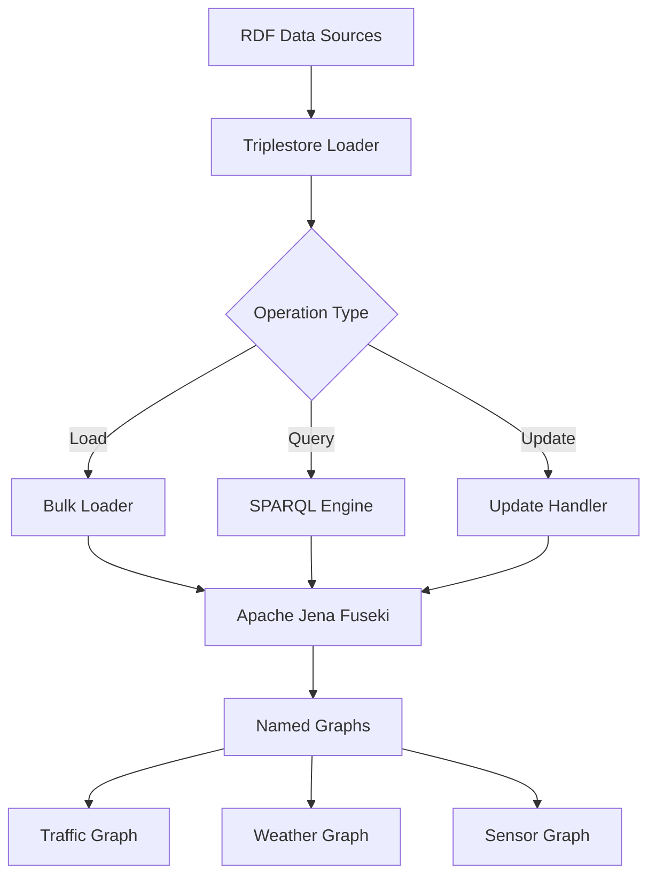

<!--
SPDX-License-Identifier: MIT
Copyright (c) 2025 UIP Team. All rights reserved.

UIP - Urban Intelligence Platform
Triplestore loader agent documentation.

Module: apps/traffic-web-app/frontend/docs/docs/agents/rdf-linked-data/triplestore-loader.md
Author: UIP Team
Version: 1.0.0
-->

# Triplestore Loader Agent

## Overview

The Triplestore Loader Agent manages loading, updating, and querying RDF triples in Apache Jena Fuseki triplestore, providing SPARQL endpoint access for semantic queries across traffic, weather, and sensor data.

## Features

- **Bulk Loading**: Efficient batch loading of RDF triples (Turtle, JSON-LD, RDF/XML)
- **Named Graphs**: Organize data into separate named graphs
- **SPARQL Queries**: Execute SELECT, CONSTRUCT, ASK, DESCRIBE queries
- **SPARQL Updates**: INSERT, DELETE, MODIFY operations
- **Incremental Updates**: Delta updates without full reload
- **Transaction Management**: ACID-compliant operations
- **Graph Versioning**: Track graph changes over time

## Architecture



## Configuration

**File**: `config/fuseki.yaml`

```yaml
fuseki:
  endpoint: "http://localhost:3030"
  dataset: "hcmc-traffic"
  
  graphs:
    traffic:
      name: "http://hcmc-traffic.example.org/graph/traffic"
      description: "Traffic flow observations"
      
    sensors:
      name: "http://hcmc-traffic.example.org/graph/sensors"
      description: "Sensor descriptions (SOSA/SSN)"
      
    weather:
      name: "http://hcmc-traffic.example.org/graph/weather"
      description: "Weather observations"
      
    air_quality:
      name: "http://hcmc-traffic.example.org/graph/air-quality"
      description: "Air quality measurements"
      
  loading:
    batch_size: 10000
    timeout: 300
    format: "turtle"
    
  query:
    timeout: 60
    result_limit: 10000
```

## Usage

### Load RDF Data

```python
from src.agents.rdf_linked_data.triplestore_loader_agent import TriplestoreLoaderAgent

# Initialize agent
agent = TriplestoreLoaderAgent()

# Load Turtle file
agent.load_triples(
    file_path="data/observations.ttl",
    graph_name="http://hcmc-traffic.example.org/graph/traffic",
    format="turtle"
)

# Load JSON-LD
agent.load_triples(
    file_path="data/sensors.jsonld",
    graph_name="http://hcmc-traffic.example.org/graph/sensors",
    format="json-ld"
)
```

### Execute SPARQL Query

```python
# SELECT query
query = """
PREFIX sosa: <http://www.w3.org/ns/sosa/>
PREFIX ex: <http://hcmc-traffic.example.org/>

SELECT ?sensor ?time ?value
WHERE {
    GRAPH <http://hcmc-traffic.example.org/graph/traffic> {
        ?obs a sosa:Observation ;
             sosa:madeBySensor ?sensor ;
             sosa:resultTime ?time ;
             sosa:hasSimpleResult ?value ;
             sosa:observedProperty ex:VehicleCount .
    }
}
ORDER BY DESC(?time)
LIMIT 100
"""

results = agent.execute_query(query)

for row in results:
    print(f"Sensor: {row['sensor']}, Time: {row['time']}, Value: {row['value']}")
```

### SPARQL Update

```python
# INSERT new triples
update = """
PREFIX sosa: <http://www.w3.org/ns/sosa/>
PREFIX ex: <http://hcmc-traffic.example.org/>

INSERT DATA {
    GRAPH <http://hcmc-traffic.example.org/graph/traffic> {
        ex:Observation_001 a sosa:Observation ;
            sosa:madeBySensor ex:Sensor_CAM_001 ;
            sosa:resultTime "2024-01-15T10:30:00Z"^^xsd:dateTime ;
            sosa:hasSimpleResult 45 .
    }
}
"""

agent.execute_update(update)
```

### Batch Loading

```python
# Load multiple files
files = [
    {"path": "data/traffic_2024_01.ttl", "graph": "traffic"},
    {"path": "data/weather_2024_01.ttl", "graph": "weather"},
    {"path": "data/sensors.ttl", "graph": "sensors"}
]

agent.batch_load(files, parallel=True)
```

## API Reference

### Class: `TriplestoreLoaderAgent`

#### Methods

##### `load_triples(file_path: str, graph_name: str, format: str = "turtle") -> LoadResult`

Load RDF file into named graph.

**Parameters:**
- `file_path` (str): Path to RDF file
- `graph_name` (str): Target named graph URI
- `format` (str): RDF format (turtle, json-ld, rdf-xml)

**Returns:**
- LoadResult: Loading statistics

##### `execute_query(query: str, timeout: int = 60) -> List[dict]`

Execute SPARQL SELECT query.

**Parameters:**
- `query` (str): SPARQL query
- `timeout` (int): Query timeout (seconds)

**Returns:**
- List[dict]: Query results

##### `execute_update(update: str) -> bool`

Execute SPARQL UPDATE operation.

**Parameters:**
- `update` (str): SPARQL UPDATE statement

**Returns:**
- bool: Success status

##### `clear_graph(graph_name: str)`

Clear all triples from named graph.

##### `export_graph(graph_name: str, output_path: str, format: str = "turtle")`

Export named graph to file.

## SPARQL Query Examples

### Traffic Flow Analysis

```sparql
PREFIX sosa: <http://www.w3.org/ns/sosa/>
PREFIX ex: <http://hcmc-traffic.example.org/>

SELECT ?location (AVG(?value) AS ?avgFlow)
WHERE {
    ?obs a sosa:Observation ;
         sosa:observedProperty ex:VehicleCount ;
         sosa:hasSimpleResult ?value ;
         sosa:hasFeatureOfInterest ?location ;
         sosa:resultTime ?time .
    FILTER(?time >= "2024-01-15T00:00:00Z"^^xsd:dateTime)
}
GROUP BY ?location
ORDER BY DESC(?avgFlow)
```

### Sensor Capabilities

```sparql
PREFIX sosa: <http://www.w3.org/ns/sosa/>
PREFIX ssn: <http://www.w3.org/ns/ssn/>

SELECT ?sensor ?property ?accuracy
WHERE {
    ?sensor a sosa:Sensor ;
           sosa:observes ?property ;
           ssn:hasSystemCapability [
               ssn:hasAccuracy ?accuracy
           ] .
}
```

### Weather-Traffic Correlation

```sparql
PREFIX sosa: <http://www.w3.org/ns/sosa/>
PREFIX ex: <http://hcmc-traffic.example.org/>

SELECT ?time ?traffic ?weather
WHERE {
    GRAPH <http://hcmc-traffic.example.org/graph/traffic> {
        ?trafficObs sosa:resultTime ?time ;
                   sosa:hasSimpleResult ?traffic .
    }
    GRAPH <http://hcmc-traffic.example.org/graph/weather> {
        ?weatherObs sosa:resultTime ?time ;
                   sosa:observedProperty ex:Temperature ;
                   sosa:hasSimpleResult ?weather .
    }
}
```

## Integration Examples

### With SOSA/SSN Mapper

```python
from src.agents.transformation.sosa_ssn_mapper_agent import SOSASSNMapperAgent

sosa_agent = SOSASSNMapperAgent()
loader = TriplestoreLoaderAgent()

# Map to SOSA and load
observation = sosa_agent.map_to_sosa_observation(raw_data)
ttl = observation.serialize(format="turtle")
loader.load_triples_from_string(ttl, graph_name="traffic")
```

### With NGSI-LD to RDF

```python
from src.agents.rdf_linked_data.ngsi_ld_to_rdf_agent import NGSILDToRDFAgent

rdf_agent = NGSILDToRDFAgent()

# Convert NGSI-LD to RDF and load
ngsi_entity = {...}
rdf_graph = rdf_agent.convert_to_rdf(ngsi_entity)
loader.load_graph(rdf_graph, graph_name="traffic")
```

## Performance Optimization

### Bulk Loading

```python
agent.configure_bulk_loading(
    batch_size=10000,
    parallel_workers=4,
    compression=True
)
```

### Query Caching

```python
agent.enable_query_caching(
    cache_ttl=300,
    cache_size=100
)
```

### Connection Pooling

```python
agent.configure_connection_pool(
    max_connections=10,
    timeout=30
)
```

## Monitoring

```python
health = agent.health_check()
print(f"Status: {health.status}")
print(f"Triple Count: {health.triple_count}")
print(f"Graphs: {health.graph_count}")

stats = agent.get_graph_statistics("traffic")
print(f"Triples: {stats.triple_count}")
print(f"Last Update: {stats.last_update}")
```

## Related Documentation

- [SOSA/SSN Mapper Agent](../transformation/sosa-ssn-mapper.md)
- [NGSI-LD to RDF Agent](./ngsi-ld-to-rdf.md)
- [Content Negotiation Agent](./content-negotiation.md)

## License

MIT License - Copyright (c) 2025 UIP Contributors (Nguyễn Nhật Quang, Nguyễn Việt Hoàng, Nguyễn Đình Anh Tuấn)

See [LICENSE](../LICENSE) for details.
