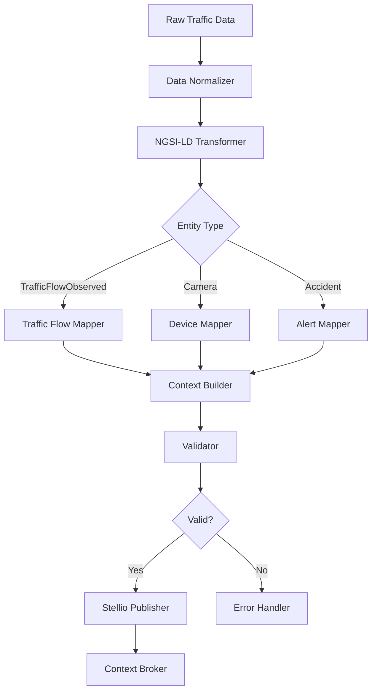

<!--
SPDX-License-Identifier: MIT
Copyright (c) 2025 UIP Team. All rights reserved.

UIP - Urban Intelligence Platform
NGSI-LD transformer agent documentation.

Module: apps/traffic-web-app/frontend/docs/docs/agents/transformation/ngsi-ld-transformer.md
Author: UIP Team
Version: 1.0.0
-->

# NGSI-LD Transformer Agent

## Overview

The NGSI-LD Transformer Agent converts raw traffic data into NGSI-LD compliant entities following FIWARE Smart Data Models standards, enabling semantic interoperability and context-aware data integration across the smart city platform.

## Features

- **Smart Data Models Compliance**: Full adherence to FIWARE Smart Data Models
- **Multi-Entity Support**: Transform 15+ entity types (TrafficFlowObserved, RoadSegment, Vehicle, etc.)
- **Context Management**: Handle @context and vocabulary mappings
- **Relationship Building**: Establish semantic relationships between entities
- **Batch Processing**: Transform thousands of entities efficiently
- **Validation**: Schema validation and constraint checking

## Architecture



## Configuration

**File**: `config/ngsi_ld_mappings.yaml`

```yaml
ngsi_ld:
  context:
    default: "https://uri.etsi.org/ngsi-ld/v1/ngsi-ld-core-context.jsonld"
    traffic: "https://raw.githubusercontent.com/smart-data-models/dataModel.Transportation/master/context.jsonld"
    
  entity_types:
    traffic_flow:
      type: "TrafficFlowObserved"
      id_prefix: "urn:ngsi-ld:TrafficFlowObserved:"
      required_properties:
        - "location"
        - "dateObserved"
        - "intensity"
        
    camera:
      type: "Device"
      id_prefix: "urn:ngsi-ld:Device:Camera:"
      required_properties:
        - "location"
        - "deviceState"
        
    accident:
      type: "Alert"
      id_prefix: "urn:ngsi-ld:Alert:Accident:"
      required_properties:
        - "location"
        - "alertSource"
        - "severity"
        
  property_mappings:
    timestamp: "dateObserved"
    vehicle_count: "intensity"
    avg_speed: "averageVehicleSpeed"
    occupancy: "occupancy"
    
  relationship_mappings:
    camera_id: "refDevice"
    zone_id: "refRoadSegment"
    
  validation:
    strict_mode: true
    allow_additional_properties: false
    validate_context: true
```

## Usage

### Basic Entity Transformation

```python
from src.agents.transformation.ngsi_ld_transformer_agent import NGSILDTransformerAgent

# Initialize agent
agent = NGSILDTransformerAgent()

# Transform traffic flow data
raw_data = {
    "camera_id": "CAM_001",
    "timestamp": "2024-01-15T10:30:00Z",
    "vehicle_count": 45,
    "avg_speed": 35.5,
    "location": {"lat": 10.7769, "lon": 106.7009}
}

entity = agent.transform_to_ngsi_ld(
    data=raw_data,
    entity_type="TrafficFlowObserved"
)

print(json.dumps(entity, indent=2))
```

**Output:**
```json
{
  "id": "urn:ngsi-ld:TrafficFlowObserved:CAM_001:20240115T103000Z",
  "type": "TrafficFlowObserved",
  "@context": [
    "https://uri.etsi.org/ngsi-ld/v1/ngsi-ld-core-context.jsonld",
    "https://raw.githubusercontent.com/smart-data-models/dataModel.Transportation/master/context.jsonld"
  ],
  "location": {
    "type": "GeoProperty",
    "value": {
      "type": "Point",
      "coordinates": [106.7009, 10.7769]
    }
  },
  "dateObserved": {
    "type": "Property",
    "value": "2024-01-15T10:30:00Z"
  },
  "intensity": {
    "type": "Property",
    "value": 45
  },
  "averageVehicleSpeed": {
    "type": "Property",
    "value": 35.5,
    "unitCode": "KMH"
  },
  "refDevice": {
    "type": "Relationship",
    "object": "urn:ngsi-ld:Device:Camera:CAM_001"
  }
}
```

### Batch Transformation

```python
# Transform multiple entities
raw_records = [
    {"camera_id": "CAM_001", "vehicle_count": 45, ...},
    {"camera_id": "CAM_002", "vehicle_count": 62, ...},
    {"camera_id": "CAM_003", "vehicle_count": 38, ...}
]

entities = agent.batch_transform(
    data_list=raw_records,
    entity_type="TrafficFlowObserved",
    parallel=True
)

print(f"Transformed {len(entities)} entities")
```

### Custom Property Mapping

```python
# Define custom mappings
custom_mappings = {
    "congestion_level": "laneOccupancy",
    "flow_rate": "intensity",
    "density": "vehicleDensity"
}

entity = agent.transform_to_ngsi_ld(
    data=raw_data,
    entity_type="TrafficFlowObserved",
    custom_mappings=custom_mappings
)
```

### Relationship Establishment

```python
# Create entity with relationships
accident_entity = agent.transform_to_ngsi_ld(
    data={
        "accident_id": "ACC_001",
        "severity": "high",
        "location": {"lat": 10.7769, "lon": 106.7009},
        "camera_id": "CAM_001",
        "zone_id": "ZONE_D1"
    },
    entity_type="Alert",
    relationships={
        "refDevice": "urn:ngsi-ld:Device:Camera:CAM_001",
        "refRoadSegment": "urn:ngsi-ld:RoadSegment:ZONE_D1"
    }
)
```

## API Reference

### Class: `NGSILDTransformerAgent`

#### Methods

##### `transform_to_ngsi_ld(data: dict, entity_type: str, custom_mappings: dict = None) -> dict`

Transform raw data to NGSI-LD entity.

**Parameters:**
- `data` (dict): Raw input data
- `entity_type` (str): Target NGSI-LD entity type
- `custom_mappings` (dict, optional): Custom property mappings

**Returns:**
- dict: NGSI-LD compliant entity

**Example:**
```python
entity = agent.transform_to_ngsi_ld(
    data=raw_data,
    entity_type="TrafficFlowObserved"
)
```

##### `batch_transform(data_list: List[dict], entity_type: str, parallel: bool = False) -> List[dict]`

Transform multiple entities in batch.

**Parameters:**
- `data_list` (List[dict]): List of raw data records
- `entity_type` (str): Target entity type
- `parallel` (bool): Enable parallel processing

**Returns:**
- List[dict]: List of NGSI-LD entities

##### `validate_entity(entity: dict) -> ValidationResult`

Validate NGSI-LD entity against schema.

**Parameters:**
- `entity` (dict): NGSI-LD entity to validate

**Returns:**
- ValidationResult: Validation outcome

**Example:**
```python
validation = agent.validate_entity(entity)
if not validation.is_valid:
    print(f"Validation errors: {validation.errors}")
```

##### `add_temporal_property(entity: dict, property_name: str, value: any, observed_at: str) -> dict`

Add temporal property to entity.

**Parameters:**
- `entity` (dict): NGSI-LD entity
- `property_name` (str): Property name
- `value` (any): Property value
- `observed_at` (str): Observation timestamp (ISO 8601)

**Returns:**
- dict: Updated entity

**Example:**
```python
entity = agent.add_temporal_property(
    entity=entity,
    property_name="temperature",
    value=28.5,
    observed_at="2024-01-15T10:30:00Z"
)
```

##### `build_relationship(source_entity: dict, target_entity_id: str, relationship_name: str) -> dict`

Build relationship between entities.

**Parameters:**
- `source_entity` (dict): Source entity
- `target_entity_id` (str): Target entity URN
- `relationship_name` (str): Relationship type

**Returns:**
- dict: Updated entity with relationship

### Data Models

#### `ValidationResult`

```python
@dataclass
class ValidationResult:
    is_valid: bool
    errors: List[str]
    warnings: List[str]
    entity_type: str
    schema_version: str
```

## Supported Entity Types

### 1. TrafficFlowObserved

```python
traffic_flow = agent.transform_to_ngsi_ld(
    data={
        "camera_id": "CAM_001",
        "timestamp": "2024-01-15T10:30:00Z",
        "vehicle_count": 45,
        "avg_speed": 35.5,
        "occupancy": 0.65,
        "location": {"lat": 10.7769, "lon": 106.7009}
    },
    entity_type="TrafficFlowObserved"
)
```

### 2. Device (Camera)

```python
camera = agent.transform_to_ngsi_ld(
    data={
        "camera_id": "CAM_001",
        "name": "District 1 Camera",
        "status": "active",
        "location": {"lat": 10.7769, "lon": 106.7009}
    },
    entity_type="Device"
)
```

### 3. Alert (Accident)

```python
alert = agent.transform_to_ngsi_ld(
    data={
        "accident_id": "ACC_001",
        "severity": "high",
        "description": "Multi-vehicle collision",
        "location": {"lat": 10.7769, "lon": 106.7009}
    },
    entity_type="Alert"
)
```

### 4. WeatherObserved

```python
weather = agent.transform_to_ngsi_ld(
    data={
        "temperature": 28.5,
        "humidity": 75,
        "precipitation": 0,
        "wind_speed": 15,
        "location": {"lat": 10.7769, "lon": 106.7009}
    },
    entity_type="WeatherObserved"
)
```

### 5. AirQualityObserved

```python
air_quality = agent.transform_to_ngsi_ld(
    data={
        "aqi": 85,
        "pm25": 35.5,
        "pm10": 60,
        "location": {"lat": 10.7769, "lon": 106.7009}
    },
    entity_type="AirQualityObserved"
)
```

## NGSI-LD Property Types

### GeoProperty

```python
# Location property
"location": {
    "type": "GeoProperty",
    "value": {
        "type": "Point",
        "coordinates": [106.7009, 10.7769]  # [lon, lat]
    }
}
```

### Property

```python
# Simple property
"intensity": {
    "type": "Property",
    "value": 45
}

# Property with unit
"averageVehicleSpeed": {
    "type": "Property",
    "value": 35.5,
    "unitCode": "KMH"
}

# Property with metadata
"temperature": {
    "type": "Property",
    "value": 28.5,
    "unitCode": "CEL",
    "observedAt": "2024-01-15T10:30:00Z"
}
```

### Relationship

```python
# Entity relationship
"refDevice": {
    "type": "Relationship",
    "object": "urn:ngsi-ld:Device:Camera:CAM_001"
}
```

## Integration Examples

### Integration with Stellio Context Broker

```python
from src.agents.context_management.entity_publisher_agent import EntityPublisherAgent

transformer = NGSILDTransformerAgent()
publisher = EntityPublisherAgent()

# Transform and publish
entity = transformer.transform_to_ngsi_ld(raw_data, "TrafficFlowObserved")
publisher.publish_entity(entity)
```

### Integration with Data Quality Validator

```python
from src.agents.monitoring.data_quality_validator_agent import DataQualityValidatorAgent

validator = DataQualityValidatorAgent()

# Validate before transformation
quality_check = validator.validate_data(raw_data)

if quality_check.is_valid:
    entity = agent.transform_to_ngsi_ld(raw_data, "TrafficFlowObserved")
```

### Integration with Temporal Data Manager

```python
from src.agents.context_management.temporal_data_manager_agent import TemporalDataManagerAgent

temporal_manager = TemporalDataManagerAgent()

# Transform with temporal properties
entity = agent.transform_to_ngsi_ld(raw_data, "TrafficFlowObserved")
temporal_manager.store_temporal_entity(entity)
```

## Monitoring & Metrics

### Health Check

```python
health = agent.health_check()
print(f"Status: {health.status}")
print(f"Entities Transformed Today: {health.entities_transformed}")
print(f"Validation Success Rate: {health.validation_success_rate}%")
print(f"Average Transformation Time: {health.avg_transform_time}ms")
```

### Transformation Metrics

```python
metrics = agent.get_metrics(time_range="24h")

print(f"Total Transformations: {metrics.total}")
print(f"Success Rate: {metrics.success_rate}%")
print(f"Entity Type Distribution: {metrics.entity_type_dist}")
print(f"Validation Errors: {metrics.validation_errors}")
```

## Performance Optimization

### Parallel Processing

```python
# Enable parallel batch transformation
agent.configure_parallel_processing(
    num_workers=8,
    batch_size=100
)
```

### Schema Caching

```python
# Cache schemas for faster validation
agent.enable_schema_caching(
    cache_ttl=3600,
    cache_size=100
)
```

### Context Preloading

```python
# Preload JSON-LD contexts
agent.preload_contexts([
    "https://uri.etsi.org/ngsi-ld/v1/ngsi-ld-core-context.jsonld",
    "https://raw.githubusercontent.com/smart-data-models/dataModel.Transportation/master/context.jsonld"
])
```

## Testing

### Unit Tests

```python
import pytest

def test_traffic_flow_transformation():
    agent = NGSILDTransformerAgent()
    
    raw_data = {
        "camera_id": "CAM_TEST",
        "timestamp": "2024-01-15T10:30:00Z",
        "vehicle_count": 45,
        "avg_speed": 35.5
    }
    
    entity = agent.transform_to_ngsi_ld(raw_data, "TrafficFlowObserved")
    
    assert entity["type"] == "TrafficFlowObserved"
    assert "location" in entity
    assert entity["intensity"]["value"] == 45

def test_validation():
    agent = NGSILDTransformerAgent()
    
    # Valid entity
    valid_entity = {...}
    result = agent.validate_entity(valid_entity)
    assert result.is_valid == True
    
    # Invalid entity (missing required property)
    invalid_entity = {"type": "TrafficFlowObserved"}
    result = agent.validate_entity(invalid_entity)
    assert result.is_valid == False
    assert len(result.errors) > 0
```

## Best Practices

### 1. Always Validate Entities

```python
entity = agent.transform_to_ngsi_ld(raw_data, "TrafficFlowObserved")
validation = agent.validate_entity(entity)

if not validation.is_valid:
    logger.error(f"Validation failed: {validation.errors}")
    return None
```

### 2. Use Proper URN Format

```python
# Correct URN format
"id": "urn:ngsi-ld:TrafficFlowObserved:CAM_001:20240115T103000Z"

# Include entity type, identifier, and timestamp
```

### 3. Include @context

```python
# Always include context for semantic interoperability
"@context": [
    "https://uri.etsi.org/ngsi-ld/v1/ngsi-ld-core-context.jsonld",
    "https://raw.githubusercontent.com/smart-data-models/dataModel.Transportation/master/context.jsonld"
]
```

## Troubleshooting

### Issue: Validation Failures

**Solution**: Check schema compliance and required properties

```python
validation = agent.validate_entity(entity)
for error in validation.errors:
    print(f"Error: {error}")
```

### Issue: Slow Transformation

**Solution**: Enable parallel processing and caching

```python
agent.configure_parallel_processing(num_workers=8)
agent.enable_schema_caching(cache_ttl=3600)
```

### Issue: Context Loading Errors

**Solution**: Use local context files as fallback

```python
agent.configure_context_loading(
    use_local_fallback=True,
    local_context_path="config/contexts/"
)
```

## Related Documentation

- [Entity Publisher Agent](../context-management/entity-publisher.md)
- [SOSA/SSN Mapper Agent](./sosa-ssn-mapper.md)
- [Smart Data Models Validation](../rdf-linked-data/smart-data-models-validation.md)

## License

MIT License - Copyright (c) 2025 UIP Contributors (Nguyễn Nhật Quang, Nguyễn Việt Hoàng, Nguyễn Đình Anh Tuấn)

See [LICENSE](../LICENSE) for details.
