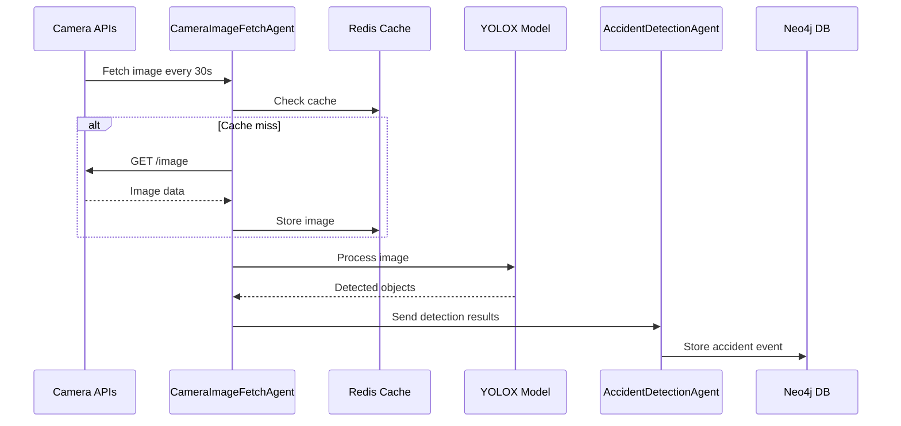
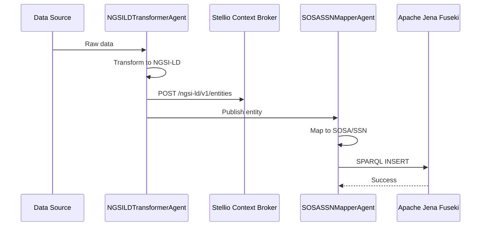
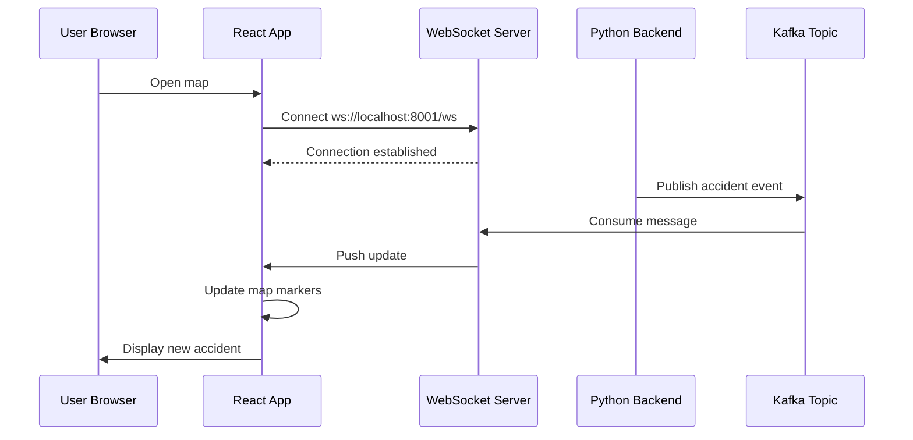
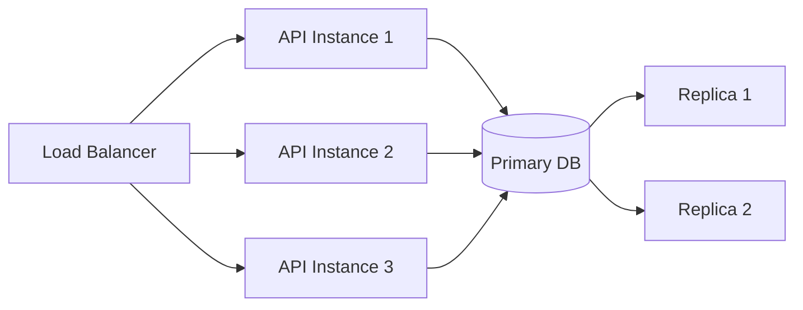

<!--
SPDX-License-Identifier: MIT
Copyright (c) 2025 UIP Team. All rights reserved.

UIP - Urban Intelligence Platform
System architecture overview documentation.

Module: apps/traffic-web-app/frontend/docs/docs/architecture/overview.md
Author: UIP Team
Version: 1.0.0
-->

# System Architecture Overview

This page provides a comprehensive view of the HCMC Traffic Monitoring System architecture.

## 🏗️ High-Level Architecture

```mermaid
graph TB
    subgraph "Frontend Layer"
        A[React App<br/>Port 5173]
        A1[TrafficMap]
        A2[Analytics Dashboard]
        A3[Citizen Reports]
        A --> A1
        A --> A2
        A --> A3
    end
    
    subgraph "API Layer"
        B[Node.js Backend<br/>Express]
        C[Python FastAPI<br/>Port 8001]
        B <--> C
    end
    
    subgraph "Orchestration Layer"
        D[Python Orchestrator<br/>main.py]
        D1[Agent Executor]
        D2[Scheduler]
        D --> D1
        D --> D2
    end
    
    subgraph "Agent Layer"
        E1[Data Collection<br/>Agents]
        E2[Analytics<br/>Agents]
        E3[Transformation<br/>Agents]
        E4[RDF/LOD<br/>Agents]
        E5[Monitoring<br/>Agents]
    end
    
    subgraph "Data Layer"
        F1[(Neo4j<br/>Graph DB)]
        F2[(Fuseki<br/>RDF Store)]
        F3[(MongoDB<br/>NGSI-LD)]
        F4[(TimescaleDB<br/>Time Series)]
        F5[(Redis<br/>Cache)]
        F6[Kafka<br/>Streaming]
    end
    
    A -->|REST/WebSocket| B

---

## 📚 Technology Stack

### Frontend Stack

| Technology | Version | Purpose |
|------------|---------|----------|
| **React** | 18.2 | UI framework |
| **TypeScript** | 5.2 | Type safety |
| **Vite** | 5.0 | Build tool |
| **Leaflet** | 1.9 | Interactive maps |
| **Recharts** | 2.10 | Data visualization |
| **Tailwind CSS** | 3.4 | Styling |
| **Framer Motion** | 10.16 | Animations |
| **React Query** | 5.0 | Data fetching |

### Backend Stack

| Technology | Version | Purpose |
|------------|---------|----------|
| **Python** | 3.9+ | Core language |
| **FastAPI** | 0.104 | REST API |
| **Pydantic** | 2.5 | Data validation |
| **Uvicorn** | 0.24 | ASGI server |
| **AsyncIO** | - | Async processing |
| **Celery** | 5.3 | Task queue |

### Computer Vision

| Technology | Version | Purpose |
|------------|---------|----------|
| **YOLOX-X** | 0.3+ | Object detection |
| **OpenCV** | 4.8 | Image processing |
| **PyTorch** | 2.1 | Deep learning |
| **YOLOX** | 0.3+ | Vehicle detection framework |

### Data Infrastructure

| Technology | Version | Purpose | Port |
|------------|---------|---------|------|
| **MongoDB** | 6.0 | Document store | 27017 |
| **Redis** | 7.2 | Cache + Queue | 6379 |
| **Neo4j** | 5.11 | Graph database | 7474, 7687 |
| **PostgreSQL** | 15 | Relational DB | 5432 |
| **TimescaleDB** | 2.12 | Time-series | 5432 |
| **Apache Jena Fuseki** | 4.9 | RDF triplestore | 3030 |
| **Stellio Context Broker** | 2.0 | NGSI-LD broker | 8080 |
| **Apache Kafka** | 3.5 | Event streaming | 9092 |

### DevOps & Monitoring

| Technology | Version | Purpose |
|------------|---------|----------|
| **Docker** | 24.0 | Containerization |
| **Kubernetes** | 1.28 | Orchestration |
| **Prometheus** | 2.47 | Metrics |
| **Grafana** | 10.2 | Dashboards |
| **ELK Stack** | 8.11 | Logging |
| **GitHub Actions** | - | CI/CD |

### Standards Compliance

| Standard | Version | Purpose |
|----------|---------|----------|
| **NGSI-LD** | 1.6.1 | Context information |
| **SOSA/SSN** | W3C Rec | Sensor ontology |
| **FIWARE Smart Data Models** | Latest | Traffic data models |
| **RDF** | 1.1 | Linked data |
| **OWL** | 2 | Ontologies |
| **SPARQL** | 1.1 | RDF queries |
| **GeoJSON** | RFC 7946 | Geospatial data |
| **Dublin Core** | Latest | Metadata |
    B -->|API| C
    C -->|Trigger| D
    D -->|Execute| E1
    D -->|Execute| E2
    D -->|Execute| E3
    D -->|Execute| E4
    D -->|Execute| E5
    
    E1 --> F1
    E2 --> F1
    E3 --> F3
    E4 --> F2
    E5 --> F4
    E1 --> F5
    E2 --> F6
```

## 🎯 Design Principles

### 1. **Microservices Architecture**

- Each agent is an independent, loosely-coupled component
- Services communicate via REST APIs, Kafka, or direct database access
- Docker containers ensure isolation and portability

### 2. **Multi-Agent Orchestration**

- **30+ specialized agents** work in parallel
- Orchestrator manages execution order and dependencies
- Agents can be added/removed without affecting others

### 3. **Semantic Web Standards**

- **NGSI-LD** for context information management
- **SOSA/SSN** for sensor observations
- **RDF** for linked open data
- **SPARQL** for semantic queries

### 4. **Real-time Processing**

- **WebSocket** connections for live updates
- **Kafka** streaming for high-throughput data
- **Redis** caching for fast access
- **Async/await** patterns throughout

### 5. **Scalability & Resilience**

- Horizontal scaling of agents
- Database replication and sharding
- Circuit breakers and retry logic
- Health checks and monitoring

## 📊 Data Flow

### 1. Data Collection Flow



### 2. Transformation Flow



### 3. Frontend Update Flow



## 🔧 Component Details

### Frontend Layer

| Component | Technology | Purpose |
|-----------|-----------|---------|
| **TrafficMap** | Leaflet | Interactive map with 1,000+ markers |
| **Analytics Dashboard** | Recharts | 7 chart types for data visualization |
| **Citizen Reports** | React Forms | User-submitted traffic reports |
| **State Management** | Zustand | Global state (cameras, accidents, filters) |
| **API Client** | Axios | REST API communication |
| **WebSocket Client** | Socket.io | Real-time updates |

### Backend Layer

| Component | Technology | Purpose |
|-----------|-----------|---------|
| **Node.js Server** | Express | API gateway and routing |
| **Python FastAPI** | FastAPI | RESTful API endpoints |
| **Orchestrator** | Python | Agent execution and scheduling |
| **Agent Executor** | AsyncIO | Parallel agent execution |

### Agent Layer (30+ Agents)

| Category | Agents | Purpose |
|----------|--------|---------|
| **Data Collection** | CameraImageFetchAgent, WeatherIntegrationAgent, AirQualityAgent | Fetch external data |
| **Ingestion** | CitizenIngestionAgent, RealTimeStreamAgent | Accept user input |
| **Analytics** | AccidentDetectionAgent, PatternRecognitionAgent, CongestionAnalysisAgent | Data analysis |
| **Transformation** | NGSILDTransformerAgent, SOSASSNMapperAgent | Format conversion |
| **Context Management** | EntityPublisherAgent, StellioStateQueryAgent, TemporalDataManagerAgent | NGSI-LD entities |
| **RDF/LOD** | NGSILDToRDFAgent, TriplestoreLoaderAgent, LODLinksetEnrichmentAgent | Linked data |
| **Graph Database** | Neo4jSyncAgent, Neo4jQueryAgent | Graph operations |
| **Integration** | APIGatewayAgent, CacheManagerAgent | Infrastructure |
| **Monitoring** | HealthCheckAgent, PerformanceMonitorAgent, DataQualityValidatorAgent | System health |
| **State Management** | StateManagerAgent, AccidentStateManagerAgent, CongestionStateManagerAgent | State tracking |

### Data Layer

| Database | Type | Purpose | Port |
|----------|------|---------|------|
| **Neo4j 5.12** | Graph | Relationships (Camera↔Accident↔Location) | 7474 |
| **Apache Jena Fuseki** | RDF Triplestore | Linked open data, SPARQL queries | 3030 |
| **Stellio** | NGSI-LD Broker | Context information management | 8080 |
| **MongoDB 7** | Document | NGSI-LD entity storage | 27017 |
| **TimescaleDB** | Time-series | Temporal data (traffic flow over time) | 5432 |
| **Redis 7** | Cache | L1/L2/L3 caching strategy | 6379 |
| **Kafka** | Streaming | Real-time event streaming | 9092 |

## 🔐 Security Architecture

### 1. Authentication & Authorization

- JWT tokens for API authentication
- Role-based access control (RBAC)
- API key management for external integrations

### 2. Data Protection

- HTTPS/TLS encryption in transit
- Database encryption at rest
- Sensitive data masking in logs

### 3. Network Security

- Docker network isolation
- Firewall rules for service access
- Rate limiting on public endpoints

## 📈 Scalability Strategy

### Horizontal Scaling



### Vertical Scaling

- Increase container resources (CPU, RAM)
- Optimize database queries with indexes
- Implement caching at multiple levels

## 🔍 Monitoring & Observability

### Metrics Collection

- **Prometheus** for metrics scraping
- **Grafana** for visualization
- **Custom dashboards** for agent performance

### Logging

- Centralized logging with **ELK stack** (Elasticsearch, Logstash, Kibana)
- Structured JSON logging
- Log levels: DEBUG, INFO, WARNING, ERROR, CRITICAL

### Tracing

- Distributed tracing with **Jaeger**
- Request tracking across services
- Performance bottleneck identification

## 🚀 Deployment Architectures

### Development

```text
Single machine
Docker Compose
All services on localhost
```

### Staging

```text
Single VM or EC2 instance
Docker Compose
External access via reverse proxy
```

### Production

```text
Kubernetes cluster (EKS/GKE/AKS)
Multi-node setup
Auto-scaling
High availability
```

## 📖 Related Documentation

- [System Design Details](system-design) - Deep dive into design decisions
- [Data Flow Diagrams](data-flow) - Detailed data flow analysis
- [Technology Stack](tech-stack) - Complete technology breakdown
- [Deployment Guide](deployment) - Production deployment strategies

---

Next: Explore the [System Design](system-design) for technical implementation details.
