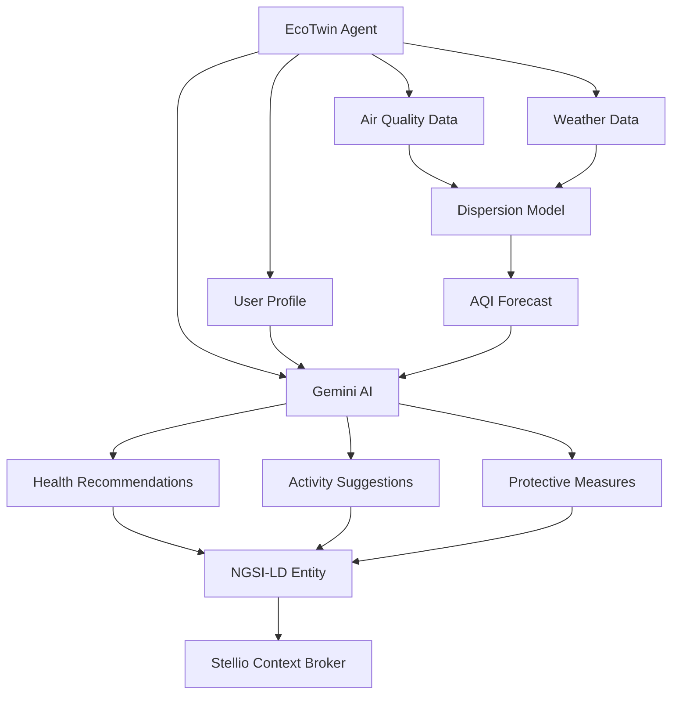

<!--
============================================================================
UIP - Urban Intelligence Platform
Copyright (c) 2025 UIP Team. All rights reserved.
https://github.com/UIP-Urban-Intelligence-Platform/UIP-Urban_Intelligence_Platform

SPDX-License-Identifier: MIT
============================================================================
File: backend/agents/EcoTwinAgent.md
Module: Backend Agents - EcoTwin Agent
Author: Nguyen Nhat Quang (Lead), Nguyen Viet Hoang, Nguyen Dinh Anh Tuan
Created: 2025-11-20
Version: 1.0.0
License: MIT

Description:
  EcoTwin Agent documentation for AI-powered environmental health advisor
  with AQI dispersion modeling and personalized recommendations.
============================================================================
-->

# EcoTwin Agent

AI-powered environmental health advisor providing personalized recommendations based on real-time air quality, weather forecasts, and predictive dispersion modeling.

## Overview

The EcoTwin Agent acts as a digital twin for urban environmental health monitoring, combining:

- Gaussian plume dispersion modeling for pollutant spread prediction
- Google Gemini AI for personalized health advice
- NGSI-LD entity generation for real-time visualization
- Citizen report integration for crowdsourced validation



## Core Capabilities

### 1. Air Quality Dispersion Simulation

- Gaussian plume model for pollutant dispersion
- Wind direction and speed integration
- Temperature inversion layer detection
- Multi-pollutant tracking (PM2.5, PM10, NO2, O3, CO, SO2)

### 2. Personalized Health Advice (Gemini Pro AI)

- Vulnerable population profiling (elderly, children, asthmatics)
- Activity recommendations (outdoor exercise, window opening)
- Protective measure suggestions (masks, air purifiers)
- Natural language explanations in Vietnamese and English

### 3. Environmental Forecast Publishing

- Future AQI predictions (1-6 hours ahead)
- NGSI-LD entity generation for visualization
- Historical trend analysis
- Confidence scoring

### 4. Citizen Report Integration

- User-submitted health symptoms correlation
- Crowdsourced air quality validation
- Community health alerts

## API

### generateHealthAdvice

Generate personalized health recommendations based on location and user profile.

```typescript
interface HealthAdviceRequest {
    location: { lat: number; lon: number };
    userProfile: {
        age: number;
        conditions: string[];  // e.g., ['asthma', 'heart_disease']
        activities: string[];  // e.g., ['outdoor_exercise', 'commute']
    };
    timeHorizon: number;  // hours (1-6)
}

interface HealthAdviceResponse {
    recommendations: string[];
    aqiForecast: {
        current: number;
        predicted: number[];
        confidence: number;
    };
    riskLevel: 'low' | 'moderate' | 'high' | 'very_high';
    protectiveMeasures: string[];
    aiExplanation: string;
}

const advice = await ecoTwin.generateHealthAdvice(request);
```

### getDispersionForecast

Calculate pollutant dispersion based on current conditions.

```typescript
interface DispersionRequest {
    sourceLocation: { lat: number; lon: number };
    pollutant: 'pm25' | 'pm10' | 'no2' | 'o3' | 'co' | 'so2';
    windSpeed: number;
    windDirection: number;  // degrees
    atmosphericStability: 'A' | 'B' | 'C' | 'D' | 'E' | 'F';
}

const forecast = await ecoTwin.getDispersionForecast(request);
```

## AQI Categories

| AQI Range | Category | Health Implications | Color |
|-----------|----------|---------------------|-------|
| 0-50 | Good | Satisfactory air quality | Green |
| 51-100 | Moderate | Acceptable for most | Yellow |
| 101-150 | Unhealthy for Sensitive | Risk for sensitive groups | Orange |
| 151-200 | Unhealthy | Health effects for everyone | Red |
| 201-300 | Very Unhealthy | Health warnings | Purple |
| 301-500 | Hazardous | Emergency conditions | Maroon |

## Configuration

Located at `config/agents/eco-twin.yaml`:

```yaml
agent:
  name: EcoTwin
  version: 3.0.0
  description: Environmental Health Digital Twin

dispersion:
  model: gaussian_plume
  gridSize: 100  # meters
  predictionHorizon: 6  # hours

ai:
  model: gemini-1.5-flash
  temperature: 0.7
  maxTokens: 2000
  languages: [vi, en]

caching:
  enabled: true
  ttl: 300  # 5 minutes
```

## Dependencies

- `@google/generative-ai@^0.21.0`: Gemini Pro AI SDK
- `axios@^1.6`: HTTP client for Stellio API
- `js-yaml@^4.1`: Configuration file parsing

## Usage Example

```typescript
import { EcoTwinAgent } from './agents/EcoTwinAgent';

const ecoTwin = new EcoTwinAgent();

// Generate health advice for elderly person with asthma
const advice = await ecoTwin.generateHealthAdvice({
    location: { lat: 10.8231, lon: 106.6297 },
    userProfile: {
        age: 65,
        conditions: ['asthma'],
        activities: ['morning_walk']
    },
    timeHorizon: 6
});

console.log(advice.recommendations);
// ["Avoid outdoor exercise before 10 AM due to elevated PM2.5",
//  "Wear N95 mask if going outside",
//  "Run air purifier on high setting"]

console.log(advice.aqiForecast.predicted);
// [125, 118, 105, 95, 88, 82]  // Next 6 hours
```

## See Also

- [GraphInvestigator Agent](./GraphInvestigatorAgent.md)
- [TrafficMaestro Agent](./TrafficMaestroAgent.md)
- [Air Quality Routes](../routes/airQualityRoutes.md)
- [Stellio Service](../services/stellioService.md)
