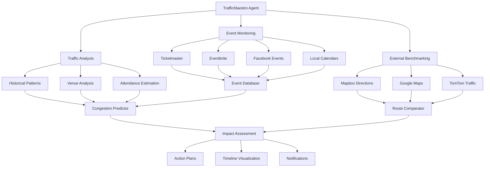

<!--
============================================================================
UIP - Urban Intelligence Platform
Copyright (c) 2025 UIP Team. All rights reserved.
https://github.com/UIP-Urban-Intelligence-Platform/UIP-Urban_Intelligence_Platform

SPDX-License-Identifier: MIT
============================================================================
File: backend/agents/TrafficMaestroAgent.md
Module: Backend Agents - TrafficMaestro Agent
Author: Nguyen Nhat Quang (Lead), Nguyen Viet Hoang, Nguyen Dinh Anh Tuan
Created: 2025-11-20
Version: 1.0.0
License: MIT

Description:
  TrafficMaestro Agent documentation for predictive event-based congestion
  forecasting and traffic orchestration.
============================================================================
-->

# TrafficMaestro Agent

Proactive traffic management system that predicts congestion by correlating internal traffic patterns with external real-world events.

## Overview

The TrafficMaestro acts as a "conductor" orchestrating traffic flow optimization before problems occur, by:

- Monitoring external events (concerts, sports, festivals)
- Predicting congestion based on event attendance
- Comparing with external traffic APIs (Mapbox, Google, TomTom)
- Generating preemptive action plans



## Core Capabilities

### 1. External Event Monitoring

- **Ticketmaster API**: Concerts, sports events, theater shows
- **Google Calendar API**: Public holidays, school events
- **Eventbrite API**: Conferences, festivals, community gatherings
- **Facebook Events Graph API**: Social gatherings
- **Custom HCMC sources**: Local event calendars

### 2. Predictive Congestion Analysis

- Event attendance estimation (venue capacity, ticket sales)
- Historical pattern matching (similar past events)
- Time-to-venue calculations with expected arrival curves
- Multi-route impact assessment
- Confidence scoring for predictions

### 3. External Traffic Benchmarking

- **Mapbox Directions API**: Real-time route alternatives
- **Google Maps Directions API**: Traffic layer comparison
- **TomTom Traffic API**: Incident detection
- Route duration forecasting

### 4. Preemptive Action Plans

- Green wave optimization (adaptive signal timing)
- Detour recommendations with capacity analysis
- Public transit scaling suggestions
- Parking guidance systems
- Citizen push notifications

### 5. Timeline Visualization

- Event timeline generation (before, during, after)
- Impact heatmaps with severity coloring
- Road segment congestion predictions
- Resource allocation recommendations

## API

### predictEventImpact

Predict traffic impact for an upcoming event.

```typescript
interface EventImpactRequest {
    eventId?: string;
    eventName: string;
    venueName: string;
    venueLocation: { lat: number; lon: number };
    eventDate: string;  // ISO 8601
    expectedAttendees: number;
    eventType: 'concert' | 'sports' | 'conference' | 'festival' | 'other';
    horizonHours: number;  // Hours before/after to analyze
}

interface EventImpactResponse {
    eventDetails: {
        name: string;
        venue: string;
        date: string;
        expectedAttendees: number;
    };
    impactPrediction: {
        severity: 'low' | 'moderate' | 'high' | 'severe';
        confidence: number;
        peakCongestionTime: string;
        affectedArea: { lat: number; lon: number; radius: number };
    };
    affectedRoads: {
        roadName: string;
        expectedDelay: number;  // minutes
        alternativeRoute: string;
        capacityUtilization: number;  // percentage
    }[];
    timeline: {
        phase: 'pre-event' | 'arrival' | 'during' | 'departure' | 'post-event';
        startTime: string;
        endTime: string;
        congestionLevel: number;  // 0-100
        recommendations: string[];
    }[];
    actionPlan: {
        action: string;
        priority: 'high' | 'medium' | 'low';
        targetTime: string;
        responsibleParty: string;
    }[];
    externalComparison: {
        mapbox: { duration: number; distance: number };
        google: { duration: number; distance: number };
        tomtom: { duration: number; distance: number };
    };
}

const prediction = await maestro.predictEventImpact(request);
```

### getUpcomingEvents

Fetch upcoming events that may impact traffic.

```typescript
interface EventQuery {
    location: { lat: number; lon: number };
    radiusKm: number;
    startDate: string;
    endDate: string;
    minAttendees?: number;
}

const events = await maestro.getUpcomingEvents(query);
```

### compareRoutes

Compare route options using multiple traffic providers.

```typescript
interface RouteComparisonRequest {
    origin: { lat: number; lon: number };
    destination: { lat: number; lon: number };
    departureTime: string;
}

const comparison = await maestro.compareRoutes(request);
```

## Event Impact Severity

| Severity | Attendees | Expected Delay | Affected Radius |
|----------|-----------|----------------|-----------------|
| Low | < 1,000 | < 5 min | 500m |
| Moderate | 1,000-5,000 | 5-15 min | 1km |
| High | 5,000-20,000 | 15-30 min | 2km |
| Severe | > 20,000 | > 30 min | 5km+ |

## Configuration

Located at `config/agents/traffic-maestro.yaml`:

```yaml
agent:
  name: TrafficMaestro
  version: 3.0.0
  description: Predictive Event Orchestrator

events:
  sources:
    - ticketmaster
    - eventbrite
    - facebook
    - local_calendar
  lookAheadDays: 7
  minAttendees: 500

traffic:
  providers:
    - mapbox
    - google_maps
    - tomtom
  comparisonEnabled: true

prediction:
  historicalDays: 90
  confidenceThreshold: 0.6
  updateInterval: 3600  # seconds
```

## Dependencies

- `axios@^1.6`: HTTP client for external APIs
- `js-yaml@^4.1`: Configuration file parsing
- StellioService: NGSI-LD entity access

## Usage Example

```typescript
import { TrafficMaestroAgent } from './agents/TrafficMaestroAgent';

const maestro = new TrafficMaestroAgent();

// Predict impact of upcoming concert
const prediction = await maestro.predictEventImpact({
    eventName: 'Taylor Swift Concert',
    venueName: 'Phu Tho Stadium',
    venueLocation: { lat: 10.7628, lon: 106.6615 },
    eventDate: '2025-12-05T20:00:00Z',
    expectedAttendees: 25000,
    eventType: 'concert',
    horizonHours: 6
});

console.log('Impact Severity:', prediction.impactPrediction.severity);
// "severe"

console.log('Peak Time:', prediction.impactPrediction.peakCongestionTime);
// "2025-12-05T18:30:00Z"

console.log('Affected Roads:', prediction.affectedRoads.map(r => r.roadName));
// ["Ly Thuong Kiet", "3/2 Street", "Nguyen Thi Minh Khai"]

console.log('Action Plan:', prediction.actionPlan);
// [{ action: "Activate green wave on Ly Thuong Kiet", priority: "high" },
//  { action: "Deploy traffic officers at key intersections", priority: "high" },
//  { action: "Push notification to commuters", priority: "medium" }]
```

## See Also

- [EcoTwin Agent](./EcoTwinAgent.md)
- [GraphInvestigator Agent](./GraphInvestigatorAgent.md)
- [Analytics Routes](../routes/analyticsRoutes.md)
- [Pattern Routes](../routes/patternRoutes.md)
