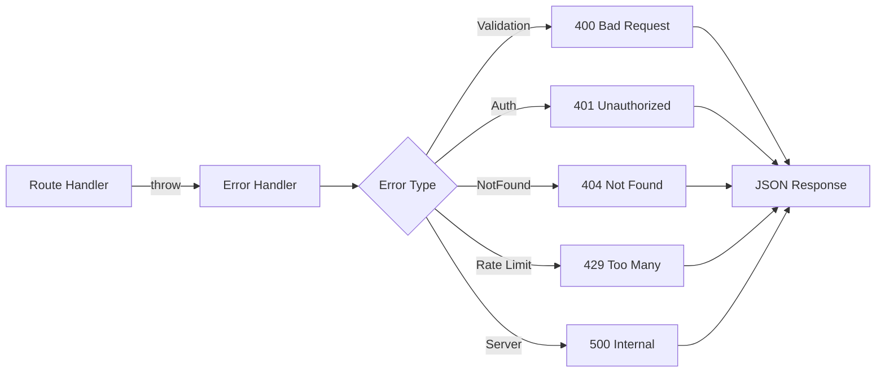

<!--
============================================================================
UIP - Urban Intelligence Platform
Copyright (c) 2025 UIP Team. All rights reserved.
https://github.com/UIP-Urban-Intelligence-Platform/UIP-Urban_Intelligence_Platform

SPDX-License-Identifier: MIT
============================================================================
File: backend/middlewares/errorHandler.md
Module: Backend Middlewares - Error Handler
Author: Nguyen Nhat Quang (Lead), Nguyen Viet Hoang, Nguyen Dinh Anh Tuan
Created: 2025-11-20
Version: 1.0.0
License: MIT

Description:
  Error Handler Middleware documentation for global Express error handling
  with structured error responses and logging.
============================================================================
-->

# Error Handler Middleware

Global Express **error handling middleware** with structured error responses, logging, and different error type handling.

## Overview



## Features

| Feature | Description |
|---------|-------------|
| **Structured Errors** | Consistent JSON error format |
| **Error Types** | Different handling per error type |
| **Stack Traces** | Only in development mode |
| **Logging** | Winston integration |
| **Request Context** | Include request details |

## Implementation

```typescript
// middlewares/errorHandler.ts
import { Request, Response, NextFunction } from 'express';
import { logger } from '../utils/logger';

export interface AppError extends Error {
  statusCode?: number;
  code?: string;
  details?: any;
  isOperational?: boolean;
}

export function errorHandler(
  err: AppError,
  req: Request,
  res: Response,
  next: NextFunction
): void {
  // Default values
  const statusCode = err.statusCode || 500;
  const message = err.message || 'Internal Server Error';
  const code = err.code || 'INTERNAL_ERROR';
  
  // Log error
  const logContext = {
    method: req.method,
    url: req.originalUrl,
    statusCode,
    code,
    stack: err.stack,
    body: req.body,
    query: req.query
  };
  
  if (statusCode >= 500) {
    logger.error(`Server Error: ${message}`, logContext);
  } else {
    logger.warn(`Client Error: ${message}`, logContext);
  }
  
  // Send response
  res.status(statusCode).json({
    error: {
      message,
      code,
      ...(err.details && { details: err.details }),
      ...(process.env.NODE_ENV === 'development' && { 
        stack: err.stack 
      })
    },
    timestamp: new Date().toISOString(),
    path: req.originalUrl
  });
}
```

## Custom Error Classes

```typescript
// errors/AppError.ts
export class AppError extends Error {
  constructor(
    message: string,
    public statusCode: number = 500,
    public code: string = 'INTERNAL_ERROR',
    public details?: any
  ) {
    super(message);
    this.name = 'AppError';
    Error.captureStackTrace(this, this.constructor);
  }
}

// Specialized errors
export class ValidationError extends AppError {
  constructor(message: string, details?: any) {
    super(message, 400, 'VALIDATION_ERROR', details);
  }
}

export class NotFoundError extends AppError {
  constructor(resource: string, id?: string) {
    super(
      id ? `${resource} not found: ${id}` : `${resource} not found`,
      404,
      'NOT_FOUND'
    );
  }
}

export class UnauthorizedError extends AppError {
  constructor(message = 'Unauthorized') {
    super(message, 401, 'UNAUTHORIZED');
  }
}

export class RateLimitError extends AppError {
  constructor(retryAfter?: number) {
    super('Rate limit exceeded', 429, 'RATE_LIMIT', { retryAfter });
  }
}

export class ServiceUnavailableError extends AppError {
  constructor(service: string) {
    super(`Service unavailable: ${service}`, 503, 'SERVICE_UNAVAILABLE');
  }
}
```

## Usage in Routes

```typescript
import { NotFoundError, ValidationError } from '../errors/AppError';

// Throwing errors
router.get('/cameras/:id', async (req, res, next) => {
  try {
    const camera = await stellioService.getEntity(req.params.id);
    
    if (!camera) {
      throw new NotFoundError('Camera', req.params.id);
    }
    
    res.json(camera);
  } catch (error) {
    next(error);  // Pass to error handler
  }
});

// Validation errors
router.post('/cameras', async (req, res, next) => {
  try {
    if (!req.body.name) {
      throw new ValidationError('Camera name is required');
    }
    
    // Create camera...
  } catch (error) {
    next(error);
  }
});
```

## Error Response Format

```json
{
  "error": {
    "message": "Camera not found: urn:ngsi-ld:Camera:001",
    "code": "NOT_FOUND",
    "details": null
  },
  "timestamp": "2025-11-29T10:30:00.000Z",
  "path": "/api/cameras/urn:ngsi-ld:Camera:001"
}
```

### Development Mode (with stack trace)

```json
{
  "error": {
    "message": "Database connection failed",
    "code": "SERVICE_UNAVAILABLE",
    "stack": "Error: Database connection failed\n    at Neo4jService.connect..."
  },
  "timestamp": "2025-11-29T10:30:00.000Z",
  "path": "/api/correlation/graph"
}
```

## Async Handler Wrapper

```typescript
// utils/asyncHandler.ts
import { Request, Response, NextFunction, RequestHandler } from 'express';

export function asyncHandler(fn: RequestHandler): RequestHandler {
  return (req: Request, res: Response, next: NextFunction) => {
    Promise.resolve(fn(req, res, next)).catch(next);
  };
}

// Usage
router.get('/cameras', asyncHandler(async (req, res) => {
  const cameras = await stellioService.getEntities('Camera');
  res.json(cameras);
  // Errors automatically passed to error handler
}));
```

## Registration

```typescript
// server.ts
import express from 'express';
import { errorHandler } from './middlewares/errorHandler';

const app = express();

// Routes
app.use('/api/cameras', cameraRoutes);
app.use('/api/weather', weatherRoutes);
// ... other routes

// 404 handler
app.use((req, res, next) => {
  next(new NotFoundError('Route'));
});

// Error handler (MUST be last)
app.use(errorHandler);
```

## HTTP Status Codes

| Code | Error Class | Description |
|------|-------------|-------------|
| 400 | `ValidationError` | Invalid request parameters |
| 401 | `UnauthorizedError` | Missing/invalid authentication |
| 403 | `ForbiddenError` | Access denied |
| 404 | `NotFoundError` | Resource not found |
| 429 | `RateLimitError` | Too many requests |
| 500 | `AppError` (default) | Internal server error |
| 503 | `ServiceUnavailableError` | External service down |

## Related Documentation

- [Backend Overview](../overview.md) - Server setup
- [Logger](../utils/logger.md) - Error logging
- [Routes Overview](../routes/overview.md) - API endpoints

## References

- [Express Error Handling](https://expressjs.com/en/guide/error-handling.html)
- [HTTP Status Codes](https://developer.mozilla.org/en-US/docs/Web/HTTP/Status)
