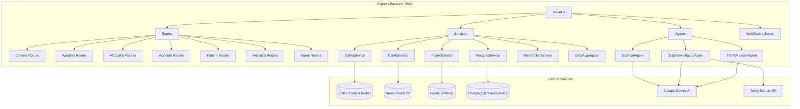

<!--
============================================================================
UIP - Urban Intelligence Platform
Copyright (c) 2025 UIP Team. All rights reserved.
https://github.com/UIP-Urban-Intelligence-Platform/UIP-Urban_Intelligence_Platform

SPDX-License-Identifier: MIT
============================================================================
File: backend/overview.md
Module: Backend - Overview
Author: Nguyen Nhat Quang (Lead), Nguyen Viet Hoang, Nguyen Dinh Anh Tuan
Created: 2025-11-20
Version: 1.0.0
License: MIT

Description:
  Backend overview documentation for Express API server with WebSocket
  support for real-time traffic monitoring.
============================================================================
-->

# Backend Overview

Express API server providing REST endpoints and WebSocket real-time updates for traffic monitoring, integrating with Stellio Context Broker, Neo4j, Fuseki, and PostgreSQL.

## Architecture



## Key Features

### RESTful API

- **12 endpoint groups** covering all traffic data types
- CORS-enabled for frontend integration
- Request validation with structured error handling
- YAML-driven configuration (`config/entities.yaml`)

### Real-Time Updates

- WebSocket server for bidirectional communication
- Topic-based pub/sub (cameras, weather, accidents, etc.)
- Heartbeat mechanism with 30s timeout
- Automatic reconnection handling

### AI Agents

- **EcoTwin**: Environmental health advisor with AQI dispersion modeling
- **GraphInvestigator**: Multimodal incident analysis with GraphRAG
- **TrafficMaestro**: Predictive event-based congestion forecasting

### Multi-Database Integration

- **Stellio**: NGSI-LD entities (primary data source)
- **Neo4j**: Graph relationships and correlations
- **Fuseki**: SPARQL queries and LOD enrichment
- **PostgreSQL**: Temporal data and analytics

## Source Structure

```
backend/src/
├── server.ts           # Main Express server entry point
├── agents/             # AI agents (3 files)
│   ├── EcoTwinAgent.ts
│   ├── GraphInvestigatorAgent.ts
│   └── TrafficMaestroAgent.ts
├── config/             # Configuration loader
│   └── configLoader.ts
├── middlewares/        # Express middlewares
│   └── errorHandler.ts
├── routes/             # API route handlers (12 files)
│   ├── cameraRoutes.ts
│   ├── weatherRoutes.ts
│   ├── airQualityRoutes.ts
│   └── ...
├── services/           # Data services (7 files)
│   ├── stellioService.ts
│   ├── neo4jService.ts
│   ├── fusekiService.ts
│   └── ...
├── types/              # TypeScript definitions
│   └── index.ts
└── utils/              # Utility functions (5 files)
    ├── logger.ts
    ├── healthCheck.ts
    └── ...
```

## Technology Stack

| Component | Technology | Version |
|-----------|------------|---------|
| Runtime | Node.js | 18+ |
| Framework | Express | 4.18+ |
| Language | TypeScript | 5.1+ |
| WebSocket | ws | 8.14+ |
| Database Clients | neo4j-driver, pg, sparql-http-client | - |
| AI SDK | @google/generative-ai | 0.21+ |
| Logging | Winston | 3.11+ |

## Environment Configuration

```bash
# Server
PORT=5000
NODE_ENV=development

# CORS
CORS_ORIGIN=http://localhost:5173,http://localhost:3000

# Stellio Context Broker
STELLIO_URL=http://localhost:8080
STELLIO_NGSI_LD_PATH=/ngsi-ld/v1

# Neo4j
NEO4J_URL=bolt://localhost:7687
NEO4J_USER=neo4j
NEO4J_PASSWORD=test12345

# Fuseki
FUSEKI_URL=http://localhost:3030
FUSEKI_DATASET=lod-dataset

# PostgreSQL
POSTGRES_HOST=localhost
POSTGRES_PORT=5432
POSTGRES_DB=stellio_search

# AI APIs
GEMINI_API_KEY=your_key_here
TAVILY_API_KEY=your_key_here
```

## Quick Start

```bash
# Install dependencies
cd apps/traffic-web-app/backend
npm install

# Development mode
npm run dev

# Production build
npm run build
npm start

# Run tests
npm test
```

## API Endpoints

| Group | Base Path | Description |
|-------|-----------|-------------|
| Cameras | `/api/cameras` | Traffic camera entities |
| Weather | `/api/weather` | Weather observations |
| Air Quality | `/api/air-quality` | AQI and pollutant data |
| Accidents | `/api/accidents` | Road accident events |
| Patterns | `/api/patterns` | Traffic congestion patterns |
| Analytics | `/api/analytics` | Aggregated metrics |
| Historical | `/api/historical` | Time-series data |
| Correlation | `/api/correlation` | Entity relationships |
| Routing | `/api/routing` | Route planning |
| Geocoding | `/api/geocoding` | Address conversion |
| Agents | `/api/agents` | AI agent queries |
| Multi-Agent | `/api/multi-agent` | Combined agent analysis |

## Health Check

```bash
curl http://localhost:5000/health
```

Returns connectivity status for all backend services.

## See Also

- [Agents Documentation](./agents/)
- [Services Documentation](./services/)
- [Routes Documentation](./routes/)
- [API Reference](/docs/api/complete-api-reference)
