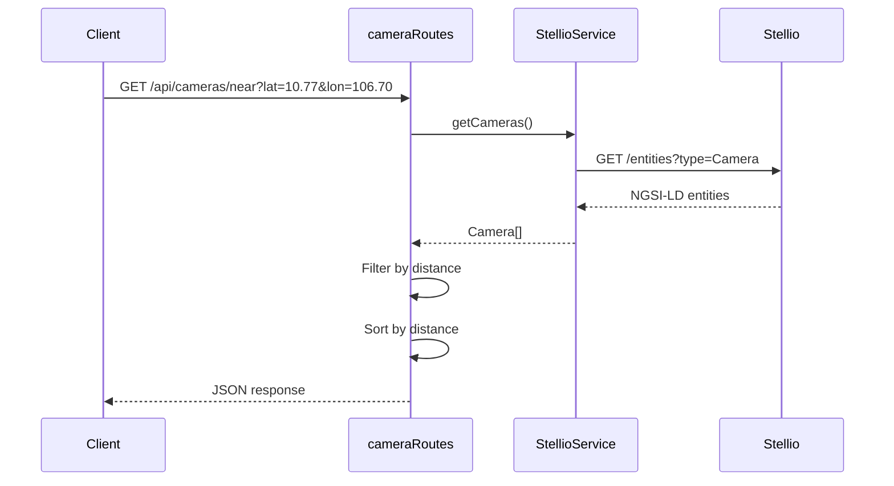

<!--
============================================================================
UIP - Urban Intelligence Platform
Copyright (c) 2025 UIP Team. All rights reserved.
https://github.com/UIP-Urban-Intelligence-Platform/UIP-Urban_Intelligence_Platform

SPDX-License-Identifier: MIT
============================================================================
File: backend/routes/camera.md
Module: Backend Routes - Camera Routes
Author: Nguyen Nhat Quang (Lead), Nguyen Viet Hoang, Nguyen Dinh Anh Tuan
Created: 2025-11-20
Version: 1.0.0
License: MIT

Description:
  Camera Routes documentation for RESTful API endpoints for querying
  traffic camera entities with geo-spatial filtering.
============================================================================
-->

# Camera Routes

RESTful API endpoints for querying **traffic camera entities** (TrafficFlowObserved) with geo-spatial filtering, image URL retrieval, and real-time traffic metrics.

## Base Path

```
/api/cameras
```

## Endpoints Summary

| Method | Endpoint | Description |
|--------|----------|-------------|
| GET | `/` | List all cameras |
| GET | `/:id` | Get camera by ID |
| GET | `/near` | Find cameras near location |
| GET | `/bbox` | Get cameras in bounding box |
| GET | `/:id/image` | Get camera image URL |
| GET | `/:id/metrics` | Get traffic metrics |

## Endpoints

### GET /api/cameras

List all cameras with optional filters.

**Query Parameters:**

| Parameter | Type | Default | Description |
|-----------|------|---------|-------------|
| `limit` | number | 100 | Maximum results |
| `offset` | number | 0 | Skip N results |
| `status` | string | - | Filter: `online`, `offline` |
| `type` | string | - | Filter: `PTZ`, `Static`, `Dome` |
| `includeMetrics` | boolean | false | Include traffic metrics |

**Response:**

```json
{
  "success": true,
  "data": [
    {
      "id": "urn:ngsi-ld:Camera:001",
      "name": "Camera Nguyen Hue",
      "location": {
        "latitude": 10.7731,
        "longitude": 106.7030
      },
      "imageUrl": "http://camera.hcmc.vn/001/live.jpg",
      "status": "online",
      "type": "PTZ",
      "dateModified": "2025-11-29T10:30:00.000Z"
    }
  ],
  "meta": {
    "total": 520,
    "limit": 100,
    "offset": 0
  }
}
```

**Example:**

```bash
curl "http://localhost:5000/api/cameras?limit=10&status=online"
```

---

### GET /api/cameras/:id

Get a specific camera by ID.

**Path Parameters:**

| Parameter | Type | Description |
|-----------|------|-------------|
| `id` | string | Camera URN (e.g., `urn:ngsi-ld:Camera:001`) |

**Response:**

```json
{
  "success": true,
  "data": {
    "id": "urn:ngsi-ld:Camera:001",
    "name": "Camera Nguyen Hue",
    "location": {
      "latitude": 10.7731,
      "longitude": 106.7030
    },
    "imageUrl": "http://camera.hcmc.vn/001/live.jpg",
    "status": "online",
    "roadSegment": "urn:ngsi-ld:RoadSegment:nguyen-hue",
    "dateModified": "2025-11-29T10:30:00.000Z"
  }
}
```

**Error Response (404):**

```json
{
  "success": false,
  "error": {
    "code": "NOT_FOUND",
    "message": "Camera not found"
  }
}
```

---

### GET /api/cameras/near

Find cameras near a geographic location using Haversine distance.

**Query Parameters:**

| Parameter | Type | Required | Description |
|-----------|------|----------|-------------|
| `lat` | number | Yes | Latitude (WGS84) |
| `lon` | number | Yes | Longitude (WGS84) |
| `maxDistance` | number | No | Search radius in meters (default: 5000) |
| `limit` | number | No | Maximum results (default: 50) |

**Response:**

```json
{
  "success": true,
  "data": [
    {
      "id": "urn:ngsi-ld:Camera:001",
      "name": "Camera Nguyen Hue",
      "location": {
        "latitude": 10.7731,
        "longitude": 106.7030
      },
      "distance": 250.5,
      "imageUrl": "http://camera.hcmc.vn/001/live.jpg"
    }
  ],
  "meta": {
    "center": { "lat": 10.77, "lon": 106.70 },
    "radius": 5000,
    "found": 15
  }
}
```

**Example:**

```bash
curl "http://localhost:5000/api/cameras/near?lat=10.77&lon=106.70&maxDistance=2000"
```

---

### GET /api/cameras/bbox

Get cameras within a bounding box.

**Query Parameters:**

| Parameter | Type | Required | Description |
|-----------|------|----------|-------------|
| `bbox` | string | Yes | `minLat,minLon,maxLat,maxLon` |

**Example:**

```bash
curl "http://localhost:5000/api/cameras/bbox?bbox=10.7,106.6,10.9,106.8"
```

---

### GET /api/cameras/:id/image

Get the latest image URL for a camera.

**Response:**

```json
{
  "success": true,
  "data": {
    "cameraId": "urn:ngsi-ld:Camera:001",
    "imageUrl": "http://camera.hcmc.vn/001/live.jpg?t=1705312200",
    "capturedAt": "2025-11-29T10:30:00.000Z",
    "resolution": "1920x1080"
  }
}
```

---

### GET /api/cameras/:id/metrics

Get traffic metrics observed by the camera.

**Response:**

```json
{
  "success": true,
  "data": {
    "cameraId": "urn:ngsi-ld:Camera:001",
    "observedAt": "2025-11-29T10:30:00.000Z",
    "intensity": 85,
    "occupancy": 0.65,
    "averageSpeed": 35.5,
    "vehicleCount": 42,
    "congestionLevel": "moderate"
  }
}
```

## Haversine Distance Calculation

The `/near` endpoint uses Haversine formula to calculate distances:

```typescript
function haversineDistance(lat1: number, lng1: number, lat2: number, lng2: number): number {
  const R = 6371000; // Earth radius in meters
  const φ1 = (lat1 * Math.PI) / 180;
  const φ2 = (lat2 * Math.PI) / 180;
  const Δφ = ((lat2 - lat1) * Math.PI) / 180;
  const Δλ = ((lng2 - lng1) * Math.PI) / 180;

  const a =
    Math.sin(Δφ / 2) * Math.sin(Δφ / 2) +
    Math.cos(φ1) * Math.cos(φ2) * Math.sin(Δλ / 2) * Math.sin(Δλ / 2);

  const c = 2 * Math.atan2(Math.sqrt(a), Math.sqrt(1 - a));

  return R * c;
}
```

## Data Flow



## Related Documentation

- [StellioService](../services/stellioService.md) - NGSI-LD entity queries
- [WebSocket](../services/websocketService.md) - Real-time camera updates
- [GenericNgsiService](../services/genericNgsiService.md) - Config-driven entities

## References

- [NGSI-LD TrafficFlowObserved](https://smart-data-models.github.io/dataModel.Transportation/TrafficFlowObserved/)
- [Haversine Formula](https://en.wikipedia.org/wiki/Haversine_formula)
