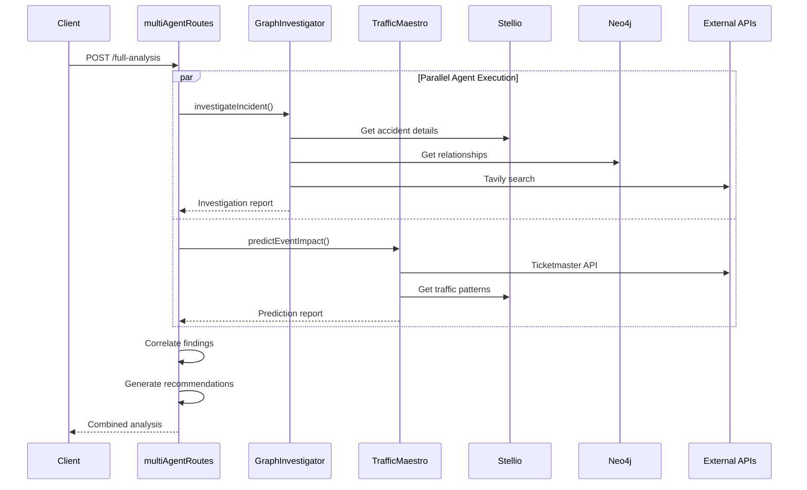

<!--
SPDX-License-Identifier: MIT
Copyright (c) 2025 UIP Team
-->

# Multi-Agent Routes

REST API endpoints for **coordinated multi-agent interactions** combining GraphInvestigator and TrafficMaestro for comprehensive incident analysis and predictive orchestration.

## Base Path

```
/api/multi-agent
```

## Endpoints Summary

| Method | Endpoint | Description | Agents |
|--------|----------|-------------|--------|
| POST | `/graph-investigator/investigate` | Multimodal incident analysis | GraphInvestigator |
| POST | `/traffic-maestro/predict` | Event-based congestion prediction | TrafficMaestro |
| POST | `/full-analysis` | Combined investigation + prediction | Both |
| POST | `/coordinated` | Synchronized agent responses | Both |

## GraphInvestigator Endpoints

### POST /api/multi-agent/graph-investigator/investigate

Investigate an incident using multimodal analysis: internal context (Stellio + Neo4j), visual analysis (Gemini Vision), and external intelligence (Tavily Search).

**Request Body:**

```json
{
  "accidentId": "urn:ngsi-ld:RoadAccident:001"
}
```

**Response:**

```json
{
  "success": true,
  "data": {
    "investigation": {
      "accidentId": "urn:ngsi-ld:RoadAccident:001",
      "severity": "high",
      "timestamp": "2025-01-15T10:30:00.000Z"
    },
    "internalContext": {
      "stellioData": {
        "type": "collision",
        "location": { "lat": 10.77, "lon": 106.70 },
        "casualties": 2
      },
      "neo4jRelationships": [
        {
          "type": "NEAR_TO",
          "entity": "Camera:nearby-001",
          "distance": 150
        }
      ]
    },
    "visualAnalysis": {
      "detected": ["vehicle_damage", "emergency_response", "road_blockage"],
      "confidence": 0.92,
      "description": "Multi-vehicle collision with emergency services on scene"
    },
    "externalIntelligence": {
      "newsArticles": [
        {
          "title": "Major accident on Nguyen Hue Boulevard",
          "source": "VnExpress",
          "summary": "Traffic severely affected..."
        }
      ],
      "socialMedia": {
        "mentions": 45,
        "sentiment": "concerned"
      }
    },
    "recommendation": {
      "priority": "critical",
      "actions": [
        "Dispatch additional emergency units",
        "Activate traffic diversion",
        "Alert public via message boards"
      ],
      "estimatedClearTime": "2 hours"
    }
  }
}
```

**Example:**

```bash
curl -X POST http://localhost:5000/api/multi-agent/graph-investigator/investigate \
  -H "Content-Type: application/json" \
  -d '{"accidentId": "urn:ngsi-ld:RoadAccident:001"}'
```

---

## TrafficMaestro Endpoints

### POST /api/multi-agent/traffic-maestro/predict

Predict traffic impact from upcoming events using external event APIs (Ticketmaster, Google Calendar).

**Request Body:**

```json
{
  "eventQuery": "concerts near Ho Chi Minh City",
  "location": {
    "lat": 10.7731,
    "lng": 106.7030
  },
  "timeRange": {
    "start": "2025-01-15T00:00:00.000Z",
    "end": "2025-01-16T00:00:00.000Z"
  }
}
```

**Response:**

```json
{
  "success": true,
  "data": {
    "events": [
      {
        "id": "event-001",
        "name": "K-Pop Concert",
        "venue": "Phu Tho Stadium",
        "startTime": "2025-01-15T19:00:00.000Z",
        "expectedAttendance": 25000
      }
    ],
    "predictions": [
      {
        "roadSegment": "urn:ngsi-ld:RoadSegment:phu-tho",
        "timeSlot": "17:00-19:00",
        "predictedCongestion": "severe",
        "confidence": 0.87,
        "speedReduction": 65,
        "alternativeRoutes": [
          "Via Ly Thuong Kiet",
          "Via 3/2 Boulevard"
        ]
      }
    ],
    "recommendations": [
      {
        "type": "pre-event",
        "time": "16:00",
        "action": "Activate traffic officers at key intersections"
      },
      {
        "type": "during-event",
        "time": "17:00-19:00",
        "action": "Redirect traffic from stadium area"
      },
      {
        "type": "post-event",
        "time": "21:00-23:00",
        "action": "Prepare for mass exodus, open additional lanes"
      }
    ]
  }
}
```

---

## Combined Analysis Endpoints

### POST /api/multi-agent/full-analysis

Perform comprehensive analysis combining both agents for complete situational awareness.

**Request Body:**

```json
{
  "accidentId": "urn:ngsi-ld:RoadAccident:001",
  "includeEventImpact": true,
  "location": {
    "lat": 10.7731,
    "lng": 106.7030
  }
}
```

**Response:**

```json
{
  "success": true,
  "data": {
    "investigation": {
      // GraphInvestigator results
    },
    "prediction": {
      // TrafficMaestro results
    },
    "correlation": {
      "foundCorrelation": true,
      "type": "event-accident",
      "description": "Accident likely caused by increased traffic from nearby concert"
    },
    "combinedRecommendations": [
      "Priority: Address accident immediately",
      "Secondary: Prepare for event traffic surge",
      "Alert event-goers of alternative routes"
    ],
    "overallSeverity": "critical",
    "estimatedResolutionTime": "3 hours"
  }
}
```

---

### POST /api/multi-agent/coordinated

Get synchronized responses from both agents with shared context.

**Request Body:**

```json
{
  "query": "What caused the traffic jam on Nguyen Hue?",
  "location": {
    "lat": 10.7731,
    "lng": 106.7030
  },
  "recentAccidents": ["urn:ngsi-ld:RoadAccident:001"],
  "includeEventContext": true
}
```

**Response:**

```json
{
  "success": true,
  "data": {
    "graphInvestigator": {
      "analysis": "Accident at intersection caused initial blockage...",
      "confidence": 0.89
    },
    "trafficMaestro": {
      "analysis": "Event traffic from stadium compounded the situation...",
      "confidence": 0.82
    },
    "synthesized": {
      "summary": "The traffic jam was caused by a combination of...",
      "rootCauses": [
        "Vehicle collision at 10:15 AM",
        "Concert traffic starting at 5:00 PM"
      ],
      "timeline": [
        { "time": "10:15", "event": "Initial accident" },
        { "time": "17:00", "event": "Event traffic surge" }
      ]
    }
  }
}
```

## Agent Coordination Architecture



## Agent Singleton Management

```typescript
// Singleton instances for resource efficiency
let graphInvestigator: GraphInvestigatorAgent | null = null;
let trafficMaestro: TrafficMaestroAgent | null = null;

const getGraphInvestigator = (): GraphInvestigatorAgent => {
  if (!graphInvestigator) {
    graphInvestigator = new GraphInvestigatorAgent();
    logger.info('✅ GraphInvestigatorAgent initialized');
  }
  return graphInvestigator;
};

const getTrafficMaestro = (): TrafficMaestroAgent => {
  if (!trafficMaestro) {
    trafficMaestro = new TrafficMaestroAgent();
    logger.info('✅ TrafficMaestroAgent initialized');
  }
  return trafficMaestro;
};
```

## Error Handling

```json
// 400 Bad Request
{
  "success": false,
  "error": "Invalid accidentId. Required: string (URN format)"
}

// 500 Agent Error
{
  "success": false,
  "error": "Investigation failed: Unable to retrieve accident data"
}

// 503 External Service Error
{
  "success": false,
  "error": "External API (Tavily/Ticketmaster) temporarily unavailable"
}
```

## Rate Limiting

| Endpoint | Limit | Window |
|----------|-------|--------|
| `/graph-investigator/*` | 5 req/min | 1 minute |
| `/traffic-maestro/*` | 5 req/min | 1 minute |
| `/full-analysis` | 3 req/min | 1 minute |
| `/coordinated` | 3 req/min | 1 minute |

## Related Documentation

- [GraphInvestigatorAgent](../agents/GraphInvestigatorAgent.md) - Multimodal analysis
- [TrafficMaestroAgent](../agents/TrafficMaestroAgent.md) - Predictive orchestration
- [Agent Routes](./agent.md) - EcoTwin endpoints
- [Accident Routes](./accident.md) - Accident data API

## References

- [Tavily Search API](https://tavily.com/)
- [Ticketmaster API](https://developer.ticketmaster.com/)
- [Google Gemini Vision](https://ai.google.dev/docs)
