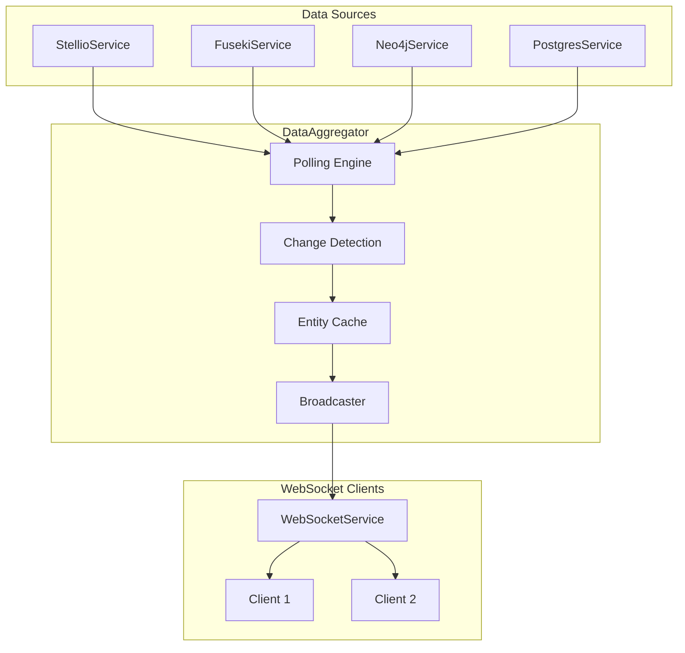
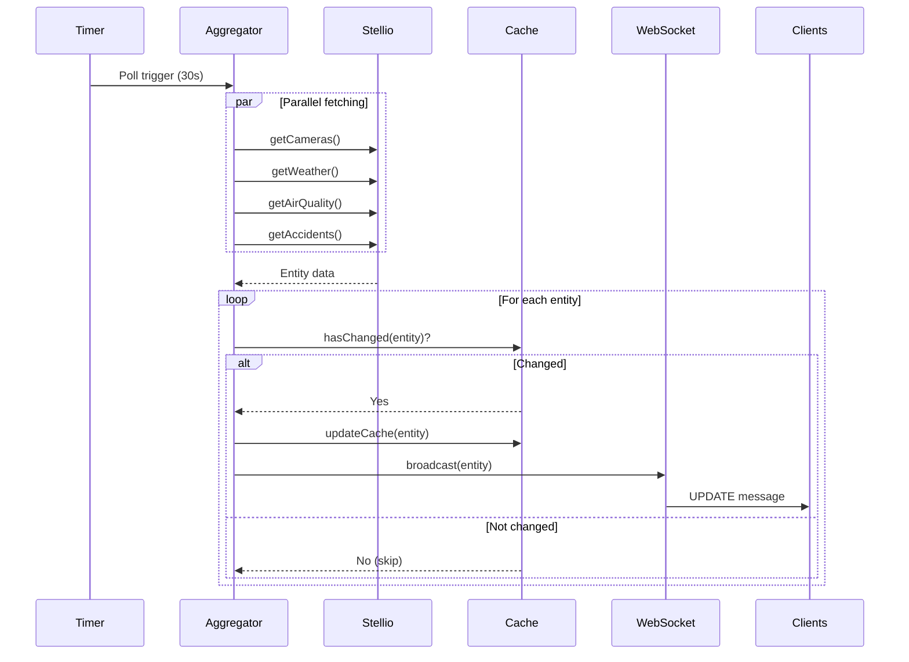
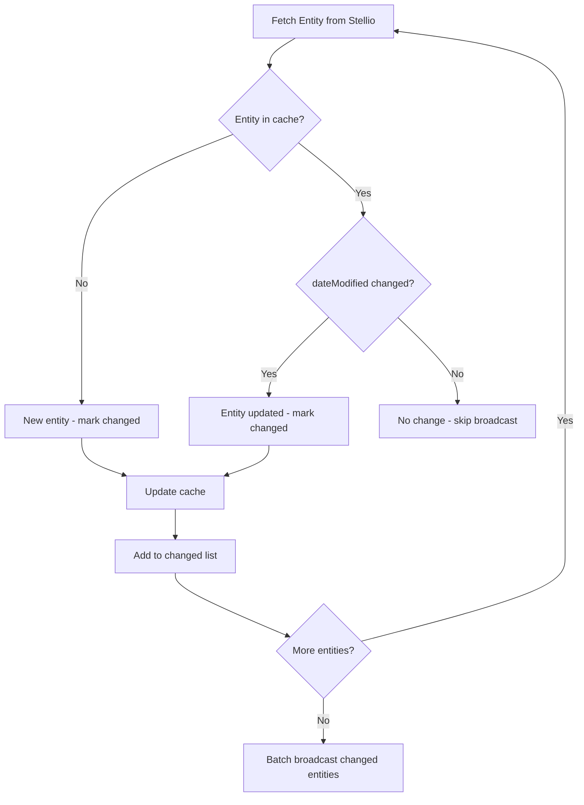
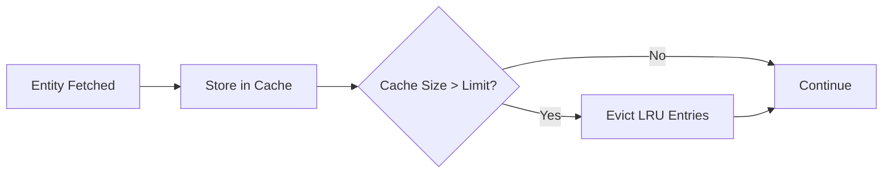

<!--
============================================================================
UIP - Urban Intelligence Platform
Copyright (c) 2025 UIP Team. All rights reserved.
https://github.com/UIP-Urban-Intelligence-Platform/UIP-Urban_Intelligence_Platform

SPDX-License-Identifier: MIT
============================================================================
File: backend/services/dataAggregator.md
Module: Backend Services - DataAggregator
Author: Nguyen Nhat Quang (Lead), Nguyen Viet Hoang, Nguyen Dinh Anh Tuan
Created: 2025-11-20
Version: 1.0.0
License: MIT

Description:
  DataAggregator service documentation for real-time polling and
  broadcasting of entity changes to WebSocket clients.
============================================================================
-->

# DataAggregator - Real-Time Polling & Broadcasting

Background service that polls multiple data sources (Stellio, Fuseki, Neo4j, PostgreSQL) for entity changes and broadcasts updates to connected WebSocket clients in real-time.

## Overview



## Features

| Feature | Description |
|---------|-------------|
| **Multi-Source Polling** | Stellio, Fuseki, Neo4j, PostgreSQL |
| **Change Detection** | Entity-level tracking via dateModified |
| **Differential Updates** | Only changed entities broadcasted |
| **Memory Caching** | In-memory cache with TTL |
| **Configurable Intervals** | 10s-60s per entity type |
| **Graceful Degradation** | Continues on service failures |

## Architecture



## Class Definition

```typescript
import { WebSocketService } from './websocketService';
import { StellioService } from './stellioService';
import { FusekiService } from './fusekiService';
import { Neo4jService } from './neo4jService';
import { PostgresService } from './postgresService';

interface EntityCache {
  data: any;
  dateModified: string;
}

export class DataAggregator {
  private wsService: WebSocketService;
  private stellioService: StellioService;
  private fusekiService: FusekiService;
  private neo4jService: Neo4jService;
  private postgresService: PostgresService;
  
  private intervalId: NodeJS.Timeout | null;
  private updateInterval: number;
  
  // Change detection caches
  private cameraCache: Map<string, EntityCache>;
  private weatherCache: Map<string, EntityCache>;
  private airQualityCache: Map<string, EntityCache>;
  private accidentCache: Map<string, EntityCache>;
  private patternCache: Map<string, EntityCache>;

  constructor(wsService: WebSocketService);
  
  // Lifecycle
  start(): void;
  stop(): void;
  
  // Snapshot
  getCurrentSnapshot(): Snapshot;
  
  // Polling
  private fetchAndBroadcastAll(isInitial: boolean): Promise<void>;
  private fetchAndBroadcastCameras(isInitial: boolean): Promise<void>;
  private fetchAndBroadcastWeather(isInitial: boolean): Promise<void>;
  private fetchAndBroadcastAirQuality(isInitial: boolean): Promise<void>;
  private fetchAndBroadcastAccidents(isInitial: boolean): Promise<void>;
  private fetchAndBroadcastPatterns(isInitial: boolean): Promise<void>;
  
  // Change Detection
  private hasChanged(entityId: string, dateModified: string, cache: Map<string, EntityCache>): boolean;
  private updateCache(entityId: string, data: any, dateModified: string, cache: Map<string, EntityCache>): void;
}

interface Snapshot {
  cameras: Camera[];
  weather: Weather[];
  airQuality: AirQuality[];
  accidents: Accident[];
  patterns: TrafficPattern[];
}
```

## Configuration

```typescript
// Environment Variables
const DATA_UPDATE_INTERVAL = process.env.DATA_UPDATE_INTERVAL || '30000';

// Default polling intervals
const POLLING_INTERVALS = {
  cameras: 30000,      // 30 seconds
  weather: 30000,      // 30 seconds
  airQuality: 30000,   // 30 seconds
  accidents: 10000,    // 10 seconds (high priority)
  patterns: 60000      // 60 seconds (lower priority)
};
```

## Usage Examples

### Initialize and Start

```typescript
import { WebSocketService } from './services/websocketService';
import { DataAggregator } from './services/dataAggregator';
import { WebSocketServer } from 'ws';

// Create WebSocket server
const wss = new WebSocketServer({ server });
const wsService = new WebSocketService(wss);

// Create and start aggregator
const aggregator = new DataAggregator(wsService);
aggregator.start();

// Aggregator automatically:
// 1. Registers snapshot provider with WebSocket service
// 2. Sends initial snapshot immediately
// 3. Starts polling every 30 seconds
```

### Get Current Snapshot

```typescript
// Get current state of all cached data
const snapshot = aggregator.getCurrentSnapshot();

console.log(`Cameras: ${snapshot.cameras.length}`);
console.log(`Weather: ${snapshot.weather.length}`);
console.log(`Air Quality: ${snapshot.airQuality.length}`);
console.log(`Accidents: ${snapshot.accidents.length}`);
console.log(`Patterns: ${snapshot.patterns.length}`);
```

### Stop Aggregator

```typescript
// Graceful shutdown
process.on('SIGTERM', () => {
  aggregator.stop();
  process.exit(0);
});
```

## Change Detection Algorithm



### Implementation

```typescript
private hasChanged(
  entityId: string, 
  dateModified: string, 
  cache: Map<string, EntityCache>
): boolean {
  const cached = cache.get(entityId);
  
  if (!cached) {
    return true;  // New entity
  }
  
  return cached.dateModified !== dateModified;  // Compare timestamps
}

private updateCache(
  entityId: string, 
  data: any, 
  dateModified: string, 
  cache: Map<string, EntityCache>
): void {
  cache.set(entityId, { data, dateModified });
}
```

## Polling Strategy

| Entity Type | Interval | Priority | Reason |
|-------------|----------|----------|--------|
| Cameras | 30s | Medium | Image refresh rate |
| Weather | 30s | Medium | Forecast updates |
| Air Quality | 30s | Medium | Sensor readings |
| Accidents | 10s | High | Safety critical |
| Patterns | 60s | Low | Analytical data |

## Batch Broadcasting

```typescript
private async fetchAndBroadcastCameras(isInitial: boolean): Promise<void> {
  try {
    const cameras = await this.stellioService.getCameras();
    const changedCameras: Camera[] = [];

    cameras.forEach(camera => {
      const entityId = camera.id;
      const dateModified = camera.dateModified || new Date().toISOString();

      if (isInitial || this.hasChanged(entityId, dateModified, this.cameraCache)) {
        changedCameras.push(camera);
        this.updateCache(entityId, camera, dateModified, this.cameraCache);
      }
    });

    // Broadcast ALL changed cameras in ONE message
    if (changedCameras.length > 0) {
      this.wsService.broadcast({
        type: 'cameras',
        data: changedCameras,
        timestamp: new Date().toISOString()
      });
      
      logger.debug(`Broadcasted ${changedCameras.length} camera updates`);
    }
  } catch (error) {
    logger.error('Error fetching cameras:', error);
  }
}
```

## Parallel Fetching

```typescript
private async fetchAndBroadcastAll(isInitial: boolean): Promise<void> {
  try {
    // Fetch all entity types in parallel
    await Promise.allSettled([
      this.fetchAndBroadcastCameras(isInitial),
      this.fetchAndBroadcastWeather(isInitial),
      this.fetchAndBroadcastAirQuality(isInitial),
      this.fetchAndBroadcastAccidents(isInitial),
      this.fetchAndBroadcastPatterns(isInitial)
    ]);
  } catch (error) {
    logger.error('Error in fetchAndBroadcastAll:', error);
  }
}
```

Using `Promise.allSettled` ensures:

- All fetches run in parallel
- One failure doesn't stop others
- Graceful degradation

## Snapshot Provider Integration

```typescript
constructor(wsService: WebSocketService) {
  this.wsService = wsService;
  
  // Initialize services
  this.stellioService = new StellioService();
  this.fusekiService = new FusekiService();
  this.neo4jService = new Neo4jService();
  this.postgresService = new PostgresService();
  
  // Register snapshot provider with WebSocket service
  this.wsService.setSnapshotProvider(() => this.getCurrentSnapshot());
}

getCurrentSnapshot(): Snapshot {
  return {
    cameras: Array.from(this.cameraCache.values()).map(entry => entry.data),
    weather: Array.from(this.weatherCache.values()).map(entry => entry.data),
    airQuality: Array.from(this.airQualityCache.values()).map(entry => entry.data),
    accidents: Array.from(this.accidentCache.values()).map(entry => entry.data),
    patterns: Array.from(this.patternCache.values()).map(entry => entry.data)
  };
}
```

## Error Handling

```typescript
private async fetchAndBroadcastWeather(isInitial: boolean): Promise<void> {
  try {
    const weather = await this.stellioService.getWeather();
    // Process and broadcast...
  } catch (error) {
    // Log error but don't throw - allow other fetches to continue
    logger.error('Error fetching weather:', error);
    // Graceful degradation - keep serving cached data
  }
}
```

## Memory Management



### Cache Cleanup (Optional Enhancement)

```typescript
// Optional: Implement LRU eviction
private cleanupCache(cache: Map<string, EntityCache>, maxSize: number): void {
  if (cache.size > maxSize) {
    const entries = Array.from(cache.entries());
    entries.sort((a, b) => 
      new Date(a[1].dateModified).getTime() - 
      new Date(b[1].dateModified).getTime()
    );
    
    // Remove oldest 10%
    const toRemove = Math.floor(cache.size * 0.1);
    entries.slice(0, toRemove).forEach(([key]) => cache.delete(key));
  }
}
```

## Metrics & Monitoring

```typescript
// Log polling statistics
start(): void {
  logger.info('Starting data aggregation service...');
  
  // Initial fetch
  this.fetchAndBroadcastAll(true);
  
  // Periodic polling with stats
  this.intervalId = setInterval(() => {
    const stats = {
      cameras: this.cameraCache.size,
      weather: this.weatherCache.size,
      airQuality: this.airQualityCache.size,
      accidents: this.accidentCache.size,
      patterns: this.patternCache.size
    };
    
    logger.debug('Cache stats:', stats);
    this.fetchAndBroadcastAll(false);
  }, this.updateInterval);
}
```

## Related Documentation

- [WebSocketService](./websocketService.md) - Broadcasting target
- [StellioService](./stellioService.md) - Primary data source
- [Neo4jService](./neo4jService.md) - Accident relationships
- [Backend Overview](../overview.md) - Server architecture

## References

- [Node.js Timers](https://nodejs.org/api/timers.html)
- [Change Data Capture Patterns](https://en.wikipedia.org/wiki/Change_data_capture)
