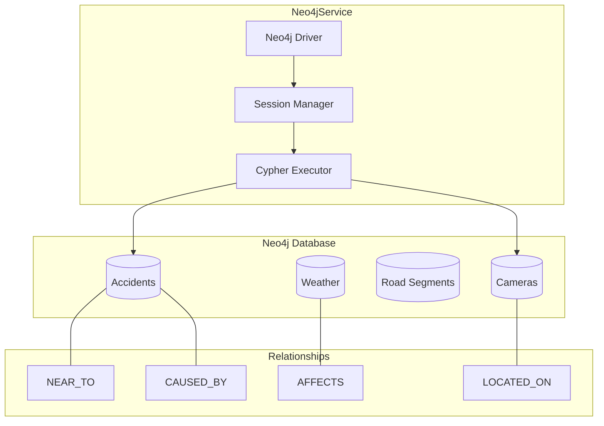
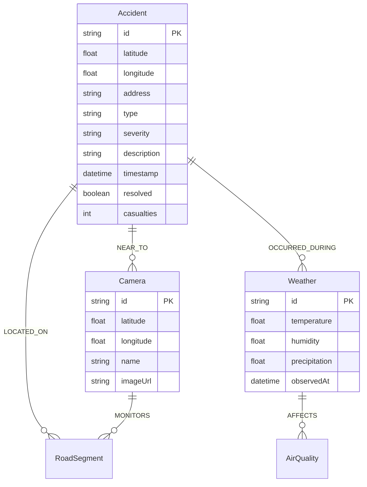
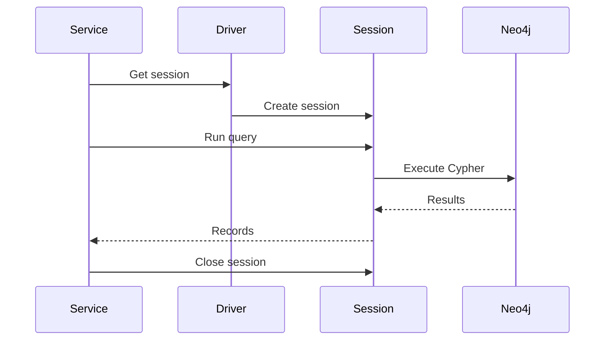

<!--
SPDX-License-Identifier: MIT
Copyright (c) 2025 UIP Team
-->

# Neo4jService - Graph Database Client

TypeScript client for **Neo4j** graph database providing entity relationship querying, graph traversal, and semantic network analysis for traffic and environmental data.

## Overview



## Features

| Feature | Description |
|---------|-------------|
| **Cypher Queries** | Parameterized query execution with binding |
| **Relationship Traversal** | Multi-hop queries for connected entities |
| **Accident Analysis** | Correlation and clustering of incidents |
| **Geo-Spatial Queries** | Distance-based relationship discovery |
| **Connection Pooling** | Timeout management and recovery |
| **Transaction Support** | Read/write transaction isolation |

## Class Definition

```typescript
import neo4j, { Driver, Session } from 'neo4j-driver';

export class Neo4jService {
  private driver: Driver;

  constructor();
  
  // Accident Queries
  getAccidents(): Promise<Accident[]>;
  getAccidentById(id: string): Promise<Accident | null>;
  getAccidentsByArea(lat: number, lon: number, radiusKm?: number): Promise<Accident[]>;
  getAccidentRelationships(accidentId: string): Promise<Relationship[]>;
  
  // Connection Management
  close(): Promise<void>;
}

interface Relationship {
  relationship: string;
  relatedType: string;
  related: Record<string, any>;
}
```

## Configuration

```typescript
// Environment Variables
const config = {
  NEO4J_URL: 'bolt://localhost:7687',
  NEO4J_USER: 'neo4j',
  NEO4J_PASSWORD: 'test12345'
};

// Driver Options
const driverConfig = {
  connectionTimeout: 10000,         // 10s connection timeout
  maxConnectionLifetime: 3600000    // 1 hour max connection lifetime
};
```

## Usage Examples

### Basic Accident Queries

```typescript
import { Neo4jService } from './services/neo4jService';

const neo4j = new Neo4jService();

// Get all accidents (latest 100)
const accidents = await neo4j.getAccidents();
console.log(`Found ${accidents.length} accidents`);

// Get single accident by ID
const accident = await neo4j.getAccidentById('urn:ngsi-ld:RoadAccident:001');
if (accident) {
  console.log(`Accident at ${accident.location.address}`);
  console.log(`Severity: ${accident.severity}`);
}
```

### Geo-Spatial Queries

```typescript
// Find accidents within 5km of a location
const nearbyAccidents = await neo4j.getAccidentsByArea(
  10.8231,  // latitude
  106.6297, // longitude
  5         // radius in km
);

console.log(`Found ${nearbyAccidents.length} accidents nearby`);
```

### Relationship Traversal

```typescript
// Get all relationships for an accident
const relationships = await neo4j.getAccidentRelationships('urn:ngsi-ld:RoadAccident:001');

relationships.forEach(rel => {
  console.log(`${rel.relationship} -> ${rel.relatedType}`);
  console.log(rel.related);
});
```

## Cypher Query Examples

### Get Accidents with Ordering

```cypher
MATCH (a:Accident)
RETURN a
ORDER BY a.timestamp DESC
LIMIT 100
```

### Geo-Spatial Distance Query

```cypher
MATCH (a:Accident)
WITH a, 
     point({latitude: toFloat(a.latitude), longitude: toFloat(a.longitude)}) AS accidentPoint,
     point({latitude: $latitude, longitude: $longitude}) AS centerPoint
WHERE distance(accidentPoint, centerPoint) <= $radiusMeters
RETURN a
ORDER BY a.timestamp DESC
```

### Relationship Discovery

```cypher
MATCH (a:Accident {id: $id})-[r]-(related)
RETURN type(r) AS relationship, labels(related) AS relatedType, related
```

### Find Related Cameras

```cypher
MATCH (a:Accident {id: $accidentId})-[:NEAR_TO]->(c:Camera)
RETURN c
ORDER BY c.distance ASC
LIMIT 5
```

### Weather-Accident Correlation

```cypher
MATCH (a:Accident)-[:OCCURRED_DURING]->(w:Weather)
WHERE w.precipitation > 0.5
RETURN a, w
ORDER BY a.timestamp DESC
```

## Data Model



## Error Handling

```typescript
async getAccidentById(id: string): Promise<Accident | null> {
  const session: Session = this.driver.session();
  try {
    const result = await session.run(
      'MATCH (a:Accident {id: $id}) RETURN a',
      { id }
    );

    if (result.records.length === 0) {
      return null;
    }

    return this.mapAccident(result.records[0].get('a').properties);
  } catch (error) {
    logger.error(`Error fetching accident ${id}:`, error);
    return null;
  } finally {
    await session.close();  // Always close session
  }
}
```

## Session Management



Important: Always close sessions after use to prevent connection leaks.

## Use Cases

### 1. Accident Correlation Analysis

Find accidents that occurred under similar conditions:

```typescript
// Find correlated accidents (same road, similar time)
const query = `
  MATCH (a1:Accident {id: $id})-[:LOCATED_ON]->(r:RoadSegment)<-[:LOCATED_ON]-(a2:Accident)
  WHERE a1 <> a2 
    AND abs(duration.between(a1.timestamp, a2.timestamp).hours) < 24
  RETURN a2
`;
```

### 2. Camera Coverage Analysis

Find cameras that could have recorded an accident:

```typescript
const query = `
  MATCH (a:Accident {id: $id})
  WITH a, point({latitude: a.latitude, longitude: a.longitude}) AS accidentPoint
  MATCH (c:Camera)
  WITH c, a, point({latitude: c.latitude, longitude: c.longitude}) AS cameraPoint
  WHERE distance(accidentPoint, cameraPoint) <= 500  // 500m radius
  RETURN c
  ORDER BY distance(accidentPoint, cameraPoint) ASC
`;
```

### 3. Weather Impact Analysis

Analyze how weather affects accident frequency:

```typescript
const query = `
  MATCH (a:Accident)-[:OCCURRED_DURING]->(w:Weather)
  WITH w.precipitation > 0.5 AS rainy, count(a) AS accidentCount
  RETURN rainy, accidentCount
`;
```

## Performance Considerations

| Aspect | Recommendation |
|--------|----------------|
| **Session Lifecycle** | Create per-query, close immediately |
| **Indexes** | Create on frequently queried properties (id, timestamp) |
| **Query Optimization** | Use LIMIT, avoid unbounded traversals |
| **Connection Pooling** | Reuse driver instance, not sessions |

### Recommended Indexes

```cypher
CREATE INDEX accident_id FOR (a:Accident) ON (a.id);
CREATE INDEX accident_timestamp FOR (a:Accident) ON (a.timestamp);
CREATE INDEX camera_id FOR (c:Camera) ON (c.id);
CREATE INDEX road_segment_id FOR (r:RoadSegment) ON (r.id);
```

## Related Documentation

- [GraphInvestigatorAgent](../agents/GraphInvestigatorAgent.md) - Uses Neo4j for GraphRAG
- [Accident Routes](../routes/accident.md) - Accident API endpoints
- [Correlation Routes](../routes/correlation.md) - Entity correlation endpoints

## References

- [Neo4j JavaScript Driver](https://neo4j.com/docs/javascript-manual/current/)
- [Cypher Query Language](https://neo4j.com/docs/cypher-manual/current/)
- [Neo4j Spatial](https://neo4j.com/docs/cypher-manual/current/functions/spatial/)
