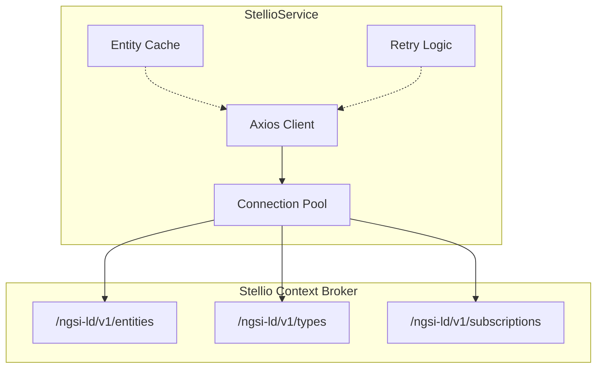
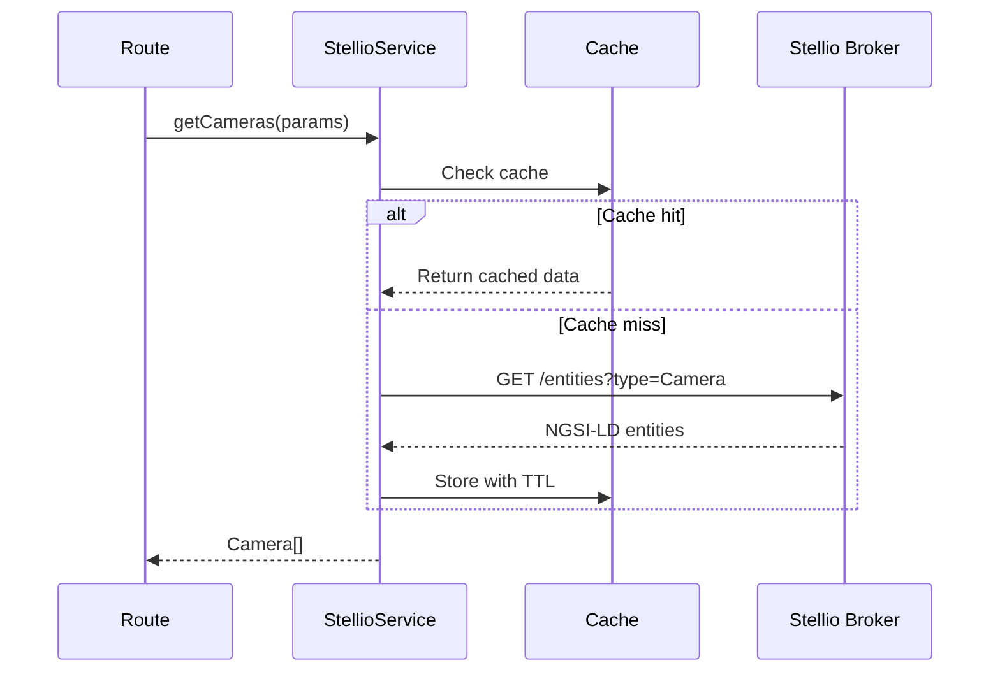
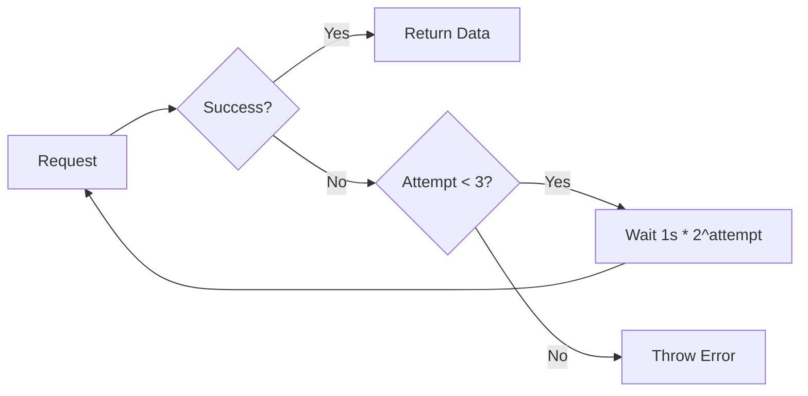

<!--
============================================================================
UIP - Urban Intelligence Platform
Copyright (c) 2025 UIP Team. All rights reserved.
https://github.com/UIP-Urban-Intelligence-Platform/UIP-Urban_Intelligence_Platform

SPDX-License-Identifier: MIT
============================================================================
File: backend/services/stellioService.md
Module: Backend Services - StellioService
Author: Nguyen Nhat Quang (Lead), Nguyen Viet Hoang, Nguyen Dinh Anh Tuan
Created: 2025-11-20
Version: 1.0.0
License: MIT

Description:
  StellioService documentation for high-performance Stellio Context Broker
  client with NGSI-LD entity querying and caching.
============================================================================
-->

# StellioService - NGSI-LD Client

High-performance TypeScript client for **Stellio Context Broker** providing optimized NGSI-LD entity querying with connection pooling, caching, and retry logic.

## Overview



## Features

| Feature | Description |
|---------|-------------|
| **Entity Querying** | Type-based filtering, geo-spatial queries, pagination |
| **Connection Pooling** | 50 max sockets, 10 free sockets, 30s keep-alive |
| **In-Memory Caching** | 60s TTL, request deduplication |
| **Retry Logic** | Exponential backoff (3 attempts, 1s initial delay) |
| **NGSI-LD Support** | JSON-LD @context, relationships, property extraction |

## Architecture



## Class Definition

```typescript
import axios, { AxiosInstance } from 'axios';
import http from 'http';
import https from 'https';

export class StellioService {
  private client: AxiosInstance;
  private baseUrl: string;
  private maxRetries: number = 3;
  private retryDelay: number = 1000;
  private cameraCache: Map<string, Camera | null> = new Map();
  private cacheTimeout: number = 60000;

  constructor();
  
  // Entity Queries
  getCameras(params?: CameraQueryParams): Promise<Camera[]>;
  getCameraById(id: string): Promise<Camera | null>;
  getWeather(params?: WeatherQueryParams): Promise<Weather[]>;
  getAirQuality(params?: AirQualityQueryParams): Promise<AirQuality[]>;
  getAccidents(): Promise<Accident[]>;
  getPatterns(): Promise<TrafficPattern[]>;
  
  // Generic Methods
  getEntities(type: string, params?: Record<string, any>): Promise<any[]>;
  getEntityById(id: string): Promise<any | null>;
  createEntity(entity: any): Promise<void>;
  updateEntity(id: string, attributes: any): Promise<void>;
  deleteEntity(id: string): Promise<void>;
  
  // Pagination
  private fetchAllPaginated(entityType: string, options?: string): Promise<any[]>;
  
  // Retry
  private retryRequest<T>(fn: () => Promise<T>, context: string): Promise<T>;
}
```

## Configuration

```typescript
// Environment Variables
const config = {
  STELLIO_URL: 'http://localhost:8080',
  STELLIO_NGSI_LD_PATH: '/ngsi-ld/v1'
};

// Connection Pool Settings
const httpAgent = new http.Agent({
  keepAlive: true,
  keepAliveMsecs: 30000,
  maxSockets: 50,       // Concurrent connections
  maxFreeSockets: 10,   // Idle connections
  timeout: 30000        // 30s timeout
});
```

## Usage Examples

### Basic Entity Queries

```typescript
import { StellioService } from './services/stellioService';

const stellio = new StellioService();

// Get all cameras
const cameras = await stellio.getCameras();
console.log(`Found ${cameras.length} cameras`);

// Get cameras near a location
const nearbyCameras = await stellio.getCameras({
  geometry: { type: 'Point', coordinates: [106.63, 10.82] },
  georel: 'near;maxDistance==5000',
  limit: 50
});

// Get single camera by ID
const camera = await stellio.getCameraById('urn:ngsi-ld:Camera:001');
```

### Weather and Air Quality

```typescript
// Get weather observations
const weather = await stellio.getWeather({
  limit: 10,
  orderBy: 'dateObserved!desc'
});

// Get air quality with AQI threshold
const airQuality = await stellio.getAirQuality({
  q: 'aqi>100'  // Only unhealthy AQI
});
```

### Geo-Spatial Queries

```typescript
// Find entities within a polygon
const entitiesInArea = await stellio.getEntities('Camera', {
  geometry: {
    type: 'Polygon',
    coordinates: [[[106.6, 10.7], [106.8, 10.7], [106.8, 10.9], [106.6, 10.9], [106.6, 10.7]]]
  },
  georel: 'within'
});

// Find entities near a point
const nearbyEntities = await stellio.getEntities('WeatherObserved', {
  geometry: { type: 'Point', coordinates: [106.7, 10.8] },
  georel: 'near;maxDistance==10000'  // 10km radius
});
```

### Entity CRUD Operations

```typescript
// Create new entity
await stellio.createEntity({
  id: 'urn:ngsi-ld:Camera:new-001',
  type: 'Camera',
  name: { type: 'Property', value: 'New Camera' },
  location: {
    type: 'GeoProperty',
    value: { type: 'Point', coordinates: [106.65, 10.85] }
  }
});

// Update entity attributes
await stellio.updateEntity('urn:ngsi-ld:Camera:001', {
  status: { type: 'Property', value: 'active' }
});

// Delete entity
await stellio.deleteEntity('urn:ngsi-ld:Camera:old-001');
```

## Supported Entity Types

| Entity Type | NGSI-LD Type | Description |
|-------------|--------------|-------------|
| Camera | Camera, TrafficFlowObserved | Traffic cameras with image URLs |
| Weather | WeatherObserved | Temperature, humidity, wind |
| AirQuality | AirQualityObserved | PM2.5, PM10, NO2, O3, CO, SO2, AQI |
| TrafficPattern | TrafficFlowObserved | Congestion patterns, hotspots |
| Accident | RoadAccident | Accident events with severity |
| CitizenReport | CitizenReport | User-submitted reports |

## Retry Logic



Exponential backoff formula:

```
delay = retryDelay * 2^(attempt - 1)
```

- Attempt 1: 1s delay
- Attempt 2: 2s delay
- Attempt 3: 4s delay

## Pagination

Stellio has a hard limit of 100 entities per request. The service automatically handles pagination:

```typescript
private async fetchAllPaginated(
  entityType: string,
  options: string = 'keyValues'
): Promise<any[]> {
  const allEntities: any[] = [];
  const batchSize = 100;
  let offset = 0;
  let hasMore = true;

  while (hasMore) {
    const batch = await this.client.get('/entities', {
      params: { type: entityType, limit: batchSize, offset, options }
    });
    
    allEntities.push(...batch.data);
    hasMore = batch.data.length === batchSize;
    offset += batchSize;
    
    // Safety limit: max 100,000 entities
    if (offset > 100000) break;
  }

  return allEntities;
}
```

## Error Handling

```typescript
try {
  const cameras = await stellio.getCameras();
} catch (error) {
  if (axios.isAxiosError(error)) {
    if (error.response?.status === 404) {
      console.log('No cameras found');
    } else if (error.response?.status === 503) {
      console.log('Stellio service unavailable');
    }
  }
}
```

## Performance Tuning

| Parameter | Default | Description |
|-----------|---------|-------------|
| `maxSockets` | 50 | Maximum concurrent connections |
| `maxFreeSockets` | 10 | Idle connections to keep |
| `timeout` | 30000 | Request timeout (ms) |
| `cacheTimeout` | 60000 | Cache TTL (ms) |
| `maxRetries` | 3 | Retry attempts |
| `retryDelay` | 1000 | Initial retry delay (ms) |

## Related Documentation

- [DataAggregator](./dataAggregator.md) - Uses StellioService for polling
- [Camera Routes](../routes/camera.md) - Camera API endpoints
- [Weather Routes](../routes/weather.md) - Weather API endpoints
- [NGSI-LD Overview](/docs/architecture/ngsi-ld) - NGSI-LD data model

## References

- [Stellio Context Broker](https://github.com/stellio-hub/stellio-context-broker)
- [NGSI-LD Specification](https://www.etsi.org/deliver/etsi_gs/CIM/001_099/009/01.06.01_60/gs_cim009v010601p.pdf)
- [Smart Data Models](https://smartdatamodels.org/)
