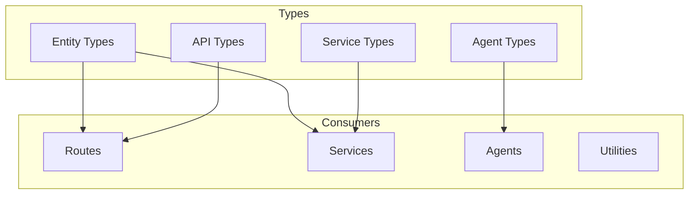

<!--
============================================================================
UIP - Urban Intelligence Platform
Copyright (c) 2025 UIP Team. All rights reserved.
https://github.com/UIP-Urban-Intelligence-Platform/UIP-Urban_Intelligence_Platform

SPDX-License-Identifier: MIT
============================================================================
File: backend/types/index.md
Module: Backend Types - Type Index
Author: Nguyen Nhat Quang (Lead), Nguyen Viet Hoang, Nguyen Dinh Anh Tuan
Created: 2025-11-20
Version: 1.0.0
License: MIT

Description:
  TypeScript type definitions documentation for entities, API responses,
  and service contracts in the UIP Backend.
============================================================================
-->

# TypeScript Type Definitions

TypeScript interfaces and type definitions for **entities**, **API responses**, and **service contracts** in the UIP Backend.

## Overview



## Entity Types

### Camera

```typescript
export interface Camera {
  id: string;
  name: string;
  location: GeoLocation;
  imageUrl?: string;
  streamUrl?: string;
  status: 'online' | 'offline' | 'maintenance';
  type?: string;
  district?: string;
  dateModified?: string;
}
```

### Weather

```typescript
export interface Weather {
  id: string;
  location: GeoLocation;
  temperature?: number;
  humidity?: number;
  precipitation?: number;
  windSpeed?: number;
  windDirection?: number;
  weatherType?: string;
  observedAt: string;
}
```

### Air Quality

```typescript
export interface AirQuality {
  id: string;
  location: GeoLocation;
  aqi: number;
  category: string;
  pm25?: number;
  pm10?: number;
  o3?: number;
  no2?: number;
  co?: number;
  so2?: number;
  observedAt: string;
}
```

### Accident

```typescript
export interface Accident {
  id: string;
  location: GeoLocation;
  severity: 'minor' | 'moderate' | 'severe';
  description?: string;
  vehiclesInvolved?: number;
  casualties?: number;
  status: 'active' | 'resolved' | 'pending';
  reportedAt: string;
  resolvedAt?: string;
}
```

### Traffic Pattern

```typescript
export interface TrafficPattern {
  id: string;
  patternType: string;
  timeOfDay?: string;
  dayOfWeek?: string;
  congestionLevel?: number;
  averageSpeed?: number;
  vehicleCount?: number;
  confidence?: number;
  detectedAt: string;
}
```

## Common Types

### GeoLocation

```typescript
export interface GeoLocation {
  latitude: number;
  longitude: number;
}
```

### BoundingBox

```typescript
export interface BoundingBox {
  minLat: number;
  minLon: number;
  maxLat: number;
  maxLon: number;
}
```

### GeoJSON Point

```typescript
export interface GeoJSONPoint {
  type: 'Point';
  coordinates: [number, number];  // [longitude, latitude]
}
```

### Pagination

```typescript
export interface PaginationParams {
  limit: number;
  offset: number;
}

export interface PaginatedResponse<T> {
  data: T[];
  total: number;
  limit: number;
  offset: number;
  hasMore: boolean;
}
```

## API Response Types

### Standard Response

```typescript
export interface ApiResponse<T> {
  success: boolean;
  data?: T;
  error?: ApiError;
  timestamp: string;
}

export interface ApiError {
  message: string;
  code: string;
  details?: any;
}
```

### Health Check Response

```typescript
export interface HealthCheckResponse {
  status: 'healthy' | 'degraded' | 'unhealthy';
  timestamp: string;
  uptime: number;
  services: Record<string, ServiceHealth>;
}

export interface ServiceHealth {
  status: 'connected' | 'error' | 'timeout';
  latency?: number;
  error?: string;
}
```

## Agent Types

### Agent Request

```typescript
export interface AgentRequest {
  message: string;
  location: GeoLocation;
  context?: AgentContext;
  userProfile?: UserProfile;
}

export interface AgentContext {
  conversationHistory?: Message[];
  sessionId?: string;
  preferences?: Record<string, any>;
}

export interface UserProfile {
  id: string;
  healthConditions?: string[];
  transportMode?: 'walking' | 'cycling' | 'driving' | 'transit';
  preferences?: string[];
}
```

### Agent Response

```typescript
export interface AgentResponse {
  message: string;
  type: 'text' | 'analysis' | 'recommendation' | 'alert';
  data?: any;
  sources?: Source[];
  confidence?: number;
}

export interface Source {
  type: 'camera' | 'sensor' | 'api' | 'database';
  id: string;
  name?: string;
  url?: string;
}
```

### Multi-Agent Response

```typescript
export interface MultiAgentResponse {
  synthesis: string;
  agents: {
    ecoTwin?: AgentResponse;
    graphInvestigator?: AgentResponse;
    trafficMaestro?: AgentResponse;
  };
  executionTime: number;
}
```

## Service Types

### NGSI-LD Entity

```typescript
export interface NgsiLdEntity {
  id: string;
  type: string;
  '@context'?: string | string[];
  [property: string]: NgsiLdProperty | NgsiLdRelationship | any;
}

export interface NgsiLdProperty {
  type: 'Property';
  value: any;
  observedAt?: string;
  unitCode?: string;
}

export interface NgsiLdRelationship {
  type: 'Relationship';
  object: string;
}

export interface NgsiLdGeoProperty {
  type: 'GeoProperty';
  value: GeoJSONPoint;
}
```

### Query Parameters

```typescript
export interface EntityQueryParams {
  type?: string;
  q?: string;
  georel?: string;
  geometry?: string;
  coordinates?: string;
  limit?: number;
  offset?: number;
  attrs?: string;
}
```

## WebSocket Types

```typescript
export interface WebSocketMessage {
  type: 'entity_update' | 'alert' | 'status' | 'error';
  payload: any;
  timestamp: string;
}

export interface Subscription {
  id: string;
  entityTypes: string[];
  watchedAttributes?: string[];
  geoQuery?: {
    georel: string;
    geometry: string;
    coordinates: string;
  };
}
```

## Usage

```typescript
// Import types
import { Camera, GeoLocation, ApiResponse } from '../types';

// Use in route handlers
router.get('/cameras', async (req, res) => {
  const cameras: Camera[] = await cameraService.getAll();
  const response: ApiResponse<Camera[]> = {
    success: true,
    data: cameras,
    timestamp: new Date().toISOString()
  };
  res.json(response);
});

// Use in services
async function getNearbyEntities<T>(
  type: string,
  location: GeoLocation,
  maxDistance: number
): Promise<T[]> {
  // ...
}
```

## Related Documentation

- [Backend Overview](../overview.md) - Architecture overview
- [Services](../services/stellioService.md) - Service layer
- [Routes](../routes/overview.md) - API endpoints

## References

- [TypeScript Handbook](https://www.typescriptlang.org/docs/handbook/)
- [NGSI-LD Specification](https://www.etsi.org/deliver/etsi_gs/CIM/001_099/009/01.06.01_60/gs_cim009v010601p.pdf)
